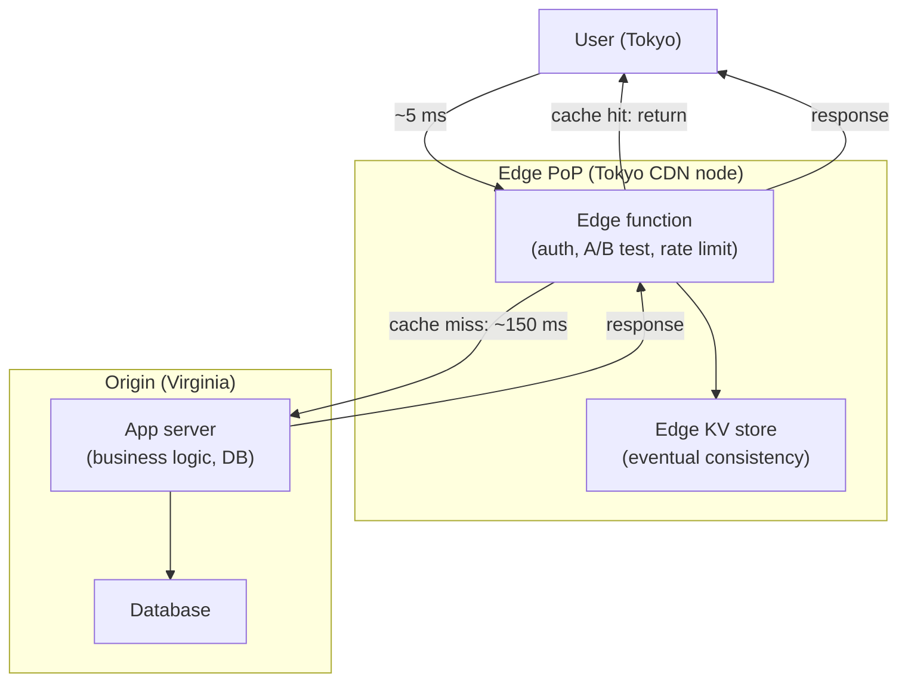

## In simple terms

Your cloud data centre might be in Virginia, but your user is in Tokyo. Every network round trip adds ~150 ms of latency — unavoidable because the speed of light limits how fast data can travel across oceans. Edge computing moves processing to the *edge* of the network — servers located close to users, often in the same city or ISP network. Computation that used to require a round trip to Virginia happens in a data centre 5 ms away in Tokyo.

The result: faster responses, less bandwidth, and the ability to keep sensitive data within its country of origin.

## The Visual Map



## More detail

**The problem with centralised cloud:** CDNs solved static-content latency by caching files at edge nodes. But dynamic computation — authentication, personalisation, A/B testing, API calls — still required a round trip to the origin. Edge computing extends the CDN model to *programmable compute*.

**Three levels of edge:**

| Level | Where | Latency | Examples |
|---|---|---|---|
| **Cloud edge (CDN compute)** | CDN Points of Presence (PoPs), 50–300 worldwide | < 10 ms | Cloudflare Workers, AWS Lambda@Edge, Fastly Compute |
| **Telecom edge (MEC)** | 5G base stations or carrier data centres | < 1 ms | Cloud gaming, AR/VR, autonomous vehicles |
| **On-device edge (IoT)** | The device itself — camera, sensor, ECU | 0 ms network | Tesla FSD computer, smart speakers, industrial sensors |

**What runs at the edge:**
- **Authentication / rate limiting** — verify JWT tokens or block abusive IPs at the edge before the request reaches the origin; saves origin compute, reduces DDoS impact.
- **A/B testing and personalisation** — modify responses based on geo, device, or cookie without a round trip to origin.
- **API aggregation and transformation** — combine multiple upstream API calls, transform protocols, rewrite headers.
- **ML inference** — run lightweight models (image classification, fraud scoring, spam detection) at edge nodes where latency matters; training stays at origin.
- **Data sovereignty** — process personal data at edge nodes in the user's country for GDPR / local data-residency compliance.

**Edge compute platforms:**

- **Cloudflare Workers** — V8 isolates (not containers) at 300+ PoPs; cold start ~0 ms; bindings to KV, R2 object storage, D1 (SQLite at edge), Queues.
- **AWS Lambda@Edge / CloudFront Functions** — Lambda@Edge at ~30 regional PoPs; CloudFront Functions for ultra-lightweight JS at 450+ PoPs.
- **Fastly Compute@Edge** — Wasm-native; ~1 ms cold start vs. Lambda@Edge's ~100 ms.
- **Deno Deploy** — TypeScript/JavaScript at edge PoPs worldwide using the Deno runtime.
- **Vercel Edge Runtime / Next.js Middleware** — edge functions for Next.js with React Server Components.

Edge computing is why Cloudflare Workers processes 45+ million requests per second globally and why Next.js middleware can achieve sub-50 ms response times for international users. For IoT and autonomous systems, edge compute enables real-time decisions without dependence on remote servers.

## Under the Hood

A Cloudflare Worker is a V8 isolate, not a container. The isolation model is fundamentally different from serverless Lambda:

```javascript
// Cloudflare Worker — runs in a V8 isolate at the CDN PoP nearest the user
export default {
  async fetch(request, env, ctx) {
    const url = new URL(request.url);

    // 1. Rate limiting at the edge — check before touching origin
    const ip = request.headers.get("CF-Connecting-IP");
    const key = `rate:${ip}`;
    const hits = parseInt(await env.KV.get(key) || "0");
    if (hits > 100) {
      return new Response("Rate limited", { status: 429 });
    }
    ctx.waitUntil(env.KV.put(key, String(hits + 1), { expirationTtl: 60 }));

    // 2. Geo-based personalisation — Cloudflare attaches geo metadata
    const country = request.cf?.country ?? "unknown";
    const lang    = country === "JP" ? "ja" : "en";

    // 3. Cache check — return immediately if cached
    const cache    = caches.default;
    const cacheKey = new Request(`${url.origin}${url.pathname}?lang=${lang}`);
    const cached   = await cache.match(cacheKey);
    if (cached) return cached;

    // 4. Cache miss — fetch from origin (150 ms round trip)
    const origin = await fetch(`https://api.origin.example${url.pathname}`);
    const response = new Response(await origin.text(), {
      headers: { "Content-Language": lang, "Cache-Control": "s-maxage=60" },
    });
    ctx.waitUntil(cache.put(cacheKey, response.clone()));
    return response;
  },
};
```

Key differences from traditional serverless:
- **V8 isolate vs. container** — isolates share a process but have separate heaps; startup is ~0 ms vs. a container's 100–500 ms cold start.
- **`ctx.waitUntil()`** — runs async work (cache writes, logging) after the response is sent, without blocking the user.
- **No filesystem, no arbitrary TCP** — edge functions are constrained to HTTP fetch and platform bindings (KV, queues, etc.).

## Engineering Trade-offs

**Latency vs. state**
Edge nodes excel at stateless computation — they have no persistent local state. Any shared state (session data, rate-limit counters) must live in an edge KV store with eventual consistency, or a database round trip to origin. Designing for eventual consistency at edge is non-trivial; data that must be strongly consistent should stay at origin.

**Cold start: V8 isolates vs. containers**
Cloudflare Workers use V8 isolates (shared process, separate heap) — cold starts are effectively zero. AWS Lambda@Edge uses containers (separate processes) — cold starts are 100–500 ms. For latency-sensitive edge use cases, the isolation model matters as much as the geographic placement.

**CPU time limits**
Edge functions run with tight CPU time budgets (typically 50–100 ms for Cloudflare, 5–30 s for Lambda@Edge). Compute-intensive work — ML inference beyond small models, video transcoding, cryptographic operations — cannot run at the edge and must stay at origin.

**Debugging and observability**
Distributed execution across 300 PoPs makes debugging significantly harder. Traditional request tracing requires shipping logs and traces back to a central collector, adding latency to the observability pipeline itself. Edge-native observability (Cloudflare's Logpush, Tail Workers) mitigates this but adds platform lock-in.

**Edge vs. cloud economics**
Edge functions are priced per-request and CPU-millisecond, not per-instance-hour. At high request volumes (millions/day), edge is often cheaper than running an always-on origin server — but the pricing model is different and can surprise teams accustomed to EC2/ECS billing.

## Real-world examples

- **Shopify** — uses Cloudflare Workers for storefront edge rendering, reducing time-to-first-byte from ~400 ms to ~40 ms for international customers.
- **Tesla FSD computer** — processes sensor fusion and runs inference on the car's on-device edge hardware in real time; the data volume (gigabytes per second from cameras and radar) makes cloud round trips impossible.
- **Cloudflare Bot Management** — classifies every HTTP request as bot or human using ML inference at the edge, before the request reaches the origin server; processes 45+ million requests per second globally.
- **5G MEC cloud gaming** — NVIDIA GeForce Now and similar services run game rendering at telecom edge nodes co-located with 5G base stations, targeting sub-20 ms input latency for mobile gaming.
- **GDPR data residency** — European financial services use edge functions to ensure that PII is processed only at EU PoPs, never leaving EU jurisdiction, satisfying Article 44 requirements without routing all traffic through a single EU data centre.

## Common misconceptions

- **"Edge computing replaces the cloud."** Edge handles latency-sensitive, frequently-accessed, stateless computation. The cloud handles training, batch processing, large storage, and strongly-consistent transactions. They are complementary layers, not alternatives.
- **"CDN and edge computing are the same."** CDNs cache static content (files, images, previously-computed responses). Edge computing adds programmable compute — you can run arbitrary logic, inspect request bodies, query KV stores, and modify responses, not just serve cached files.

## Try it yourself

Simulate the latency difference between an edge node and a round trip to a distant origin:

```bash
python3 - << 'EOF'
import time, random

def process_at_origin(request):
    """Simulates a request going all the way to a distant data centre."""
    time.sleep(0.15 + random.uniform(-0.02, 0.02))  # ~150 ms transatlantic RTT
    return f"origin: {request}"

def process_at_edge(request, cache):
    """Simulates edge processing: cache hit -> instant, miss -> origin."""
    if request in cache:
        time.sleep(0.005 + random.uniform(0, 0.002))  # ~5 ms local edge
        return f"edge-cache: {request}"
    result = process_at_origin(request)
    cache[request] = result
    return f"edge-miss: {request}"

cache = {}
requests = ["/home", "/home", "/about", "/home", "/pricing", "/about", "/home"]

print(f"{'Request':<12} {'Strategy':<12} {'Latency':>10}")
print("-" * 38)
for req in requests:
    t0 = time.perf_counter()
    result = process_at_edge(req, cache)
    ms = (time.perf_counter() - t0) * 1000
    print(f"{req:<12} {result.split(':')[0]:<12} {ms:>8.1f} ms")
EOF
```

## Learn next

- [CDN](/t/cdn) — the content-delivery infrastructure edge compute extends; understanding PoP topology and cache hierarchy is prerequisite to edge function placement strategy.
- [WebAssembly](/t/webassembly) — the portable binary format that makes edge runtimes like Fastly Compute and Cloudflare Workers language-agnostic; edge is one of Wasm's primary deployment targets.
- [Wasm Runtime](/t/wasm-runtime) — the engine that executes Wasm at the edge; understanding isolation guarantees explains why V8/Wasm isolates replaced containers for edge compute.
- [Serverless](/t/serverless) — the programming model edge functions build on; the same event-driven, stateless, pay-per-invocation model applied at the network edge.
