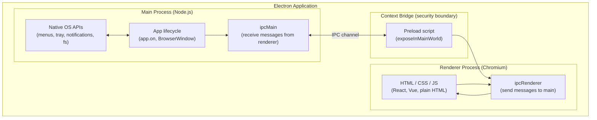

## In simple terms

Electron lets web developers build desktop apps using the same HTML, CSS, and JavaScript they already know. It bundles Chromium (the engine that powers Chrome) and Node.js into a single executable — your app gets a full browser for the UI and Node.js for file system, OS integrations, and native modules. Write once in JavaScript, ship on Windows, macOS, and Linux.

VS Code, Slack, Discord, WhatsApp Desktop, and GitHub Desktop are all Electron apps.

## The Visual Map



## More detail

Electron has two types of process — they cannot share memory and communicate only via IPC:

**Main process** — a single Node.js process that owns the application lifecycle: creating `BrowserWindow` instances, managing native menus, system tray, notifications, and file system access. Think of it as the "backend" of the app. It can use any Node.js module or native addon.

**Renderer process** — a Chromium instance per window (like a browser tab) that renders HTML/CSS/JavaScript. For security, renderers run with Node.js integration *disabled* by default — they cannot call `require('fs')` directly.

**Context Bridge** — the security boundary between main and renderer. A preload script (executed in an isolated context before the page loads) uses `contextBridge.exposeInMainWorld()` to expose a limited, type-safe API surface to the renderer. This prevents XSS attacks from gaining Node.js access.

**Why Electron works:**
- **Write once, run anywhere** — one codebase and one engineering team for Windows, macOS, and Linux. The alternative is separate Swift/Obj-C, C# WPF/WinForms, and GTK/Qt codebases.
- **npm ecosystem** — React, Vue, webpack, and every web tool runs in Electron unchanged.
- **Native access via Node.js** — file system, child processes, native modules, and OS APIs unavailable in a browser.

Electron resolved a decades-long problem of cross-platform desktop development. VS Code's success (50+ million users) proved that an Electron app can be a best-in-class developer tool. Understanding Electron clarifies the architecture of the majority of popular desktop apps you use and explains why RAM usage may be higher than expected.

## Under the Hood

The core IPC pattern — how a renderer safely calls a Node.js API via the context bridge:

```javascript
// main.js — Node.js main process
const { app, BrowserWindow, ipcMain } = require('electron');
const fs = require('fs');

app.whenReady().then(() => {
  const win = new BrowserWindow({
    webPreferences: {
      preload: path.join(__dirname, 'preload.js'),
      nodeIntegration: false,   // renderer cannot call require()
      contextIsolation: true,   // renderer has a separate JS context
    },
  });
  win.loadFile('index.html');
});

// Handle file-read requests from the renderer
ipcMain.handle('read-file', async (event, filePath) => {
  // Validate path before reading — never trust renderer input directly
  if (!filePath.startsWith(app.getPath('home'))) {
    throw new Error('Access denied');
  }
  return fs.promises.readFile(filePath, 'utf8');
});
```

```javascript
// preload.js — runs in isolated context before the page loads
const { contextBridge, ipcRenderer } = require('electron');

contextBridge.exposeInMainWorld('electronAPI', {
  // Expose only specific, validated operations — not the full ipcRenderer
  readFile: (path) => ipcRenderer.invoke('read-file', path),
});
```

```javascript
// renderer.js — web page JavaScript, no Node.js access
const content = await window.electronAPI.readFile('/home/user/notes.txt');
document.getElementById('editor').textContent = content;
```

The three-file pattern (main ↔ preload ↔ renderer) is Electron's core security architecture. Older Electron apps enabled `nodeIntegration: true` in renderers — a pattern now strongly discouraged because any XSS in the renderer gained full Node.js (and thus OS) access.

## Engineering Trade-offs

**Chromium bundle size vs. cross-platform reach**
Each Electron app ships a full Chromium (~120–150 MB) and Node.js runtime. A typical install is 100–300 MB. With Slack, Discord, VS Code, and WhatsApp Desktop open simultaneously, you have four Chromium instances in memory — potentially 1–2 GB of RAM for the browser engines alone. Tauri (Rust + system WebView) installs at 5–10 MB and uses the OS's existing web engine instead.

**JavaScript performance vs. native performance**
Chromium's V8 JIT and rendering pipeline consume more CPU and battery than equivalent native frameworks. Startup takes 1–3 seconds (loading Chromium from disk) vs. 100–500 ms for a native app. For most productivity tools this is acceptable; for a game or professional audio app, it would not be.

**System WebView (Tauri) vs. bundled Chromium (Electron)**
Tauri's approach uses the OS's native WebView (WebKit on macOS/Linux, WebView2/Edge on Windows), drastically reducing install size and RAM. The cost is rendering inconsistency across platforms — WebKit and WebView2 differ in CSS support and JS performance, and you can't guarantee the engine version your users have.

**IPC verbosity vs. security**
Node integration in the renderer (`nodeIntegration: true`) is ergonomic — you call `require('fs')` directly from the page. But any XSS vulnerability in the renderer becomes OS-level code execution. Context isolation + IPC is more code but provides a meaningful security boundary. All new Electron apps should use context isolation.

**Electron vs. Flutter Desktop vs. native**
Flutter Desktop uses its own rendering engine (Skia/Impeller), has native feel, and performs better than Electron, but requires Dart. Fully native frameworks (Swift/AppKit, C# WinUI, Qt) give best performance and OS integration at the cost of separate codebases per platform. The right choice depends on whether web-tech reuse or native fidelity is the priority.

## Real-world examples

- **VS Code** (Microsoft) — the most popular code editor globally, 50+ million users. Built in TypeScript on Electron; demonstrates that Electron can host a best-in-class developer tool.
- **Slack** — entire desktop client is Electron; the team has invested heavily in performance work (lazy loading, out-of-process tab rendering) to address the RAM reputation.
- **Discord** — Electron on Windows and Linux; native on macOS after 2023 rewrite.
- **GitHub Desktop** — Electron-based Git GUI; source is open source and a readable Electron reference implementation.
- **Figma** — originally Electron; migrated key rendering to a native macOS app in 2023 for performance, illustrating the ceiling Electron hits for graphics-intensive apps.

## Common misconceptions

- **"Electron apps are web apps pretending to be desktop apps."** Electron apps have full access to the file system, native menus, system tray, notifications, and arbitrary OS APIs via Node.js — capabilities unavailable in a browser. They are genuinely desktop applications with a web-based UI layer.
- **"Electron is always slow."** VS Code's startup, editing performance, and extension system are excellent despite being Electron. Performance depends on the app's implementation; the framework does not preclude performant apps. The criticism is valid for resource use, not for UI responsiveness when implemented well.

## Try it yourself

Simulate Electron's two-process IPC pattern — main process handling a privileged request from the renderer:

```bash
python3 - << 'EOF'
import queue, threading, time, os

# Simulate the main process (Node.js side)
ipc_channel = queue.Queue()
response_channel = queue.Queue()

def main_process():
    """Handles privileged requests from the renderer."""
    while True:
        msg = ipc_channel.get()
        if msg is None: break
        channel, payload = msg
        if channel == "read-file":
            path = payload
            # Validate before acting (never trust renderer input)
            if not path.startswith(os.path.expanduser("~")):
                response_channel.put({"error": "Access denied"})
            else:
                response_channel.put({"result": f"[contents of {path}]"})
        elif channel == "get-platform":
            response_channel.put({"result": os.name})

threading.Thread(target=main_process, daemon=True).start()

# Simulate the renderer process (web page side)
def renderer_invoke(channel, payload):
    ipc_channel.put((channel, payload))
    return response_channel.get(timeout=1)

print("Renderer -> Main IPC simulation:\n")
print("  ipcRenderer.invoke('get-platform')")
r = renderer_invoke("get-platform", None)
print(f"    <- {r}\n")

print("  ipcRenderer.invoke('read-file', '~/notes.txt')")
r = renderer_invoke("read-file", os.path.expanduser("~/notes.txt"))
print(f"    <- {r}\n")

print("  ipcRenderer.invoke('read-file', '/etc/passwd')  # blocked")
r = renderer_invoke("read-file", "/etc/passwd")
print(f"    <- {r}")

ipc_channel.put(None)
EOF
```

## Learn next

- [Progressive Web App](/t/progressive-web-app) — the browser-based alternative to Electron; installable web apps that avoid the Chromium bundle by running in the OS's existing browser.
- [WebAssembly](/t/webassembly) — can run inside Electron's Chromium for compute-intensive logic; used by Figma's renderer and VS Code's language servers.
- [Web Browser](/t/web-browser) — Electron is Chromium; understanding the browser's process model, site isolation, and V8 pipeline explains Electron's architecture and resource use.
