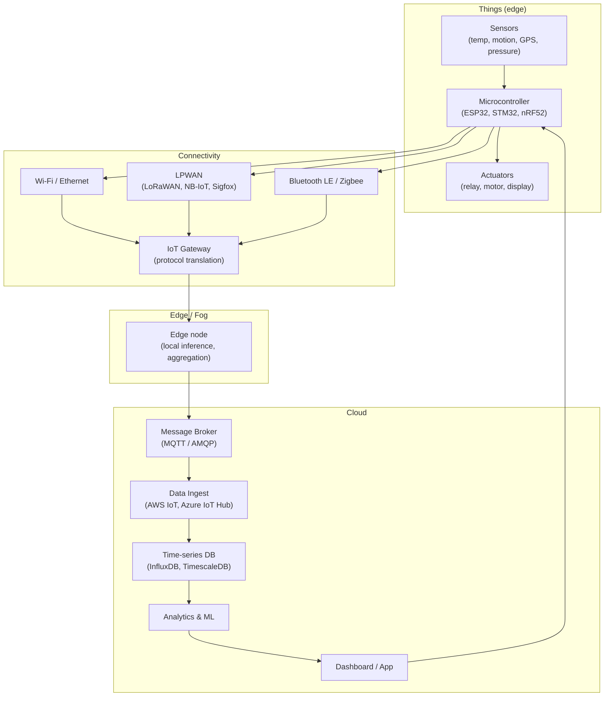

## In simple terms

The **Internet of Things (IoT)** is the idea of connecting everyday physical objects to the internet so they can sense, report, and be controlled remotely. A thermostat that learns your schedule and adjusts from your phone, a doorbell that streams video, a factory machine that reports its own wear, a fitness band tracking your steps — these are all IoT.

At its core, IoT is an [embedded system](/t/embedded-system) (a small computer inside a product) plus **network connectivity**, turning a once-dumb object into one that participates in the digital world.

## The Visual Map



## More detail

A typical IoT system has four layers:

**Devices ("things")** — embedded hardware with sensors (temperature, motion, GPS, vibration) and/or actuators (motors, relays, valves). Usually low-power, cheap, and resource-constrained: KBs of RAM, months-to-years on a single battery.

**Connectivity** — how devices reach the network:

| Protocol | Range | Power | Bandwidth | Use case |
|---|---|---|---|---|
| Wi-Fi | ~50 m | High | High | Smart home, webcams |
| Bluetooth LE | ~10 m | Very low | Low | Wearables, beacons |
| Zigbee / Z-Wave | ~100 m mesh | Very low | Low | Smart home mesh |
| LoRaWAN | ~10 km | Ultra low | Very low | Agriculture, city sensors |
| NB-IoT / LTE-M | Cellular range | Low | Low | Utility meters, asset tracking |

Data usually travels via **MQTT** (a lightweight pub/sub protocol over TCP, designed for unreliable connections) rather than HTTP — MQTT's 2-byte fixed header vs. HTTP's kilobyte overhead matters when a battery-powered device sends one reading per minute.

**Edge computing** — because sending every raw sensor reading to the cloud is slow, expensive, and wasteful, more processing happens on or near the device. An edge node might run anomaly detection locally and send only alerts, not the full time-series.

**Cloud backend** — aggregates data from millions of devices, stores it in time-series databases (InfluxDB, TimescaleDB), runs analytics and ML, and pushes commands back to devices. Managed IoT platforms (AWS IoT Core, Azure IoT Hub, Google Cloud IoT) handle device registration, certificate management, and message routing at scale.

The defining challenges are **scale, power, and security**:

- **Scale** — a million devices each sending one reading per minute is ~17,000 messages per second. Coordinating firmware updates, certificate rotation, and config pushes across a fleet that size requires automation.
- **Power** — many devices run on CR2032 coin cells for 5+ years. This forces duty-cycling (sleep 99.9% of the time, wake to measure and transmit, sleep again), careful radio usage, and protocol selection.
- **Security** — IoT is notorious for poor security. Cheap devices ship with default passwords and never receive updates. The **Mirai botnet** (2016) hijacked hundreds of thousands of insecure cameras and routers to launch record-breaking DDoS attacks — a permanent cautionary tale. Every device is an attack surface, and a compromised device is physically in someone's home or factory.

IoT extends computing off the screen and into the physical world. Tens of billions of connected devices are deployed in homes, factories, cities, farms, and hospitals, enabling remote monitoring, automation, and data-driven optimisation across nearly every industry.

## Under the Hood

A minimal MQTT publish loop in Python shows the pattern every IoT device runs — sense, format, transmit, sleep:

```python
#!/usr/bin/env python3
# requires: paho-mqtt  (pip install paho-mqtt)
# Demonstrates the IoT sense-transmit-sleep loop pattern.
import time, json, random

# Simulated sensor read (replace with real GPIO/I2C call on hardware)
def read_sensor():
    return {
        "device_id": "sensor-042",
        "temp_c":    round(20 + random.uniform(-2, 2), 2),
        "humidity":  round(55 + random.uniform(-5, 5), 1),
        "battery_v": round(3.3 - random.uniform(0, 0.1), 2),
        "ts":        int(time.time()),
    }

# Simulate the publish without a broker (print the MQTT payload)
TOPIC = "factory/floor1/sensor-042/telemetry"
INTERVAL_S = 5          # in production: 60–3600 s; device sleeps between sends
QOS = 1                 # at-least-once delivery

print(f"Publishing to topic: {TOPIC}  (QoS={QOS})\n")
for _ in range(4):
    payload = json.dumps(read_sensor())
    # In real code: client.publish(TOPIC, payload, qos=QOS)
    print(f"  → {payload}")
    # Device would now enter deep sleep; we just wait:
    time.sleep(INTERVAL_S)

print("\nDone. In production the loop runs for years on battery.")
```

Key patterns:
- **JSON payload over MQTT** — lightweight, human-readable, broker-routable. On truly constrained devices, CBOR or protobuf reduce bytes further.
- **QoS 1 (at-least-once)** — the broker acknowledges receipt; the device retries on no-ack. QoS 0 (fire-and-forget) saves battery when data loss is acceptable.
- **`battery_v` in every payload** — standard practice; the cloud tracks fleet battery health and can trigger maintenance alerts before devices go dark.

## Engineering Trade-offs

**MQTT vs. HTTP for telemetry**
HTTP is ubiquitous and stateless — easy to debug and route. MQTT's persistent TCP connection and 2-byte header make it 10–100× more efficient for high-frequency, low-payload telemetry on constrained links. The tradeoff: MQTT requires a broker (another infrastructure component), and debugging pub/sub message flows is harder than HTTP request/response.

**Edge processing vs. cloud processing**
Sending raw data to the cloud is simple but expensive in bandwidth, latency, and cost. Edge inference (running a small ML model on the gateway) can detect anomalies in milliseconds rather than seconds, and reduces cloud egress costs. The tradeoff: edge nodes add hardware cost and require their own update and maintenance lifecycle.

**Power vs. latency**
Duty-cycling (sleep/wake) minimises power but means the device is unreachable most of the time — fine for temperature sensors, wrong for a burglar alarm. Always-on devices (Wi-Fi connected thermostats) respond instantly but need mains power or frequent charging.

**Firmware OTA vs. update risk**
A fleet of a million devices with a firmware bug and no OTA capability is a recall or a permanent vulnerability. OTA adds complexity (dual-bank flash, secure bootloader, rollback), but the risk of *not* having it is higher. Secure OTA (signed images, TLS transport, version pinning) is non-negotiable for security-sensitive devices.

**Vertical integration vs. open standards**
Vendor IoT platforms (AWS IoT, Azure IoT Hub) are fast to integrate but create lock-in. Open protocols (MQTT + InfluxDB + Grafana) give flexibility at the cost of operational overhead. Matter (the cross-vendor smart home standard, 2022) is an attempt to resolve this for consumer devices.

## Real-world examples

- **Smart thermostats** (Nest, Ecobee) — Wi-Fi connected, cloud-backed, learn usage patterns with on-device ML. Show the consumer IoT archetype.
- **Industrial predictive maintenance** — vibration sensors on CNC machines send readings to a time-series DB; an ML model detects bearing wear 2–3 weeks before failure, replacing reactive repair with scheduled maintenance.
- **Mirai botnet (2016)** — malware scanned the internet for IoT devices with default credentials (admin/admin), infected ~600,000 cameras and DVRs, and used them to DDoS Dyn DNS, taking down Twitter, Netflix, and Reddit. The defining security lesson of the field.
- **Smart agriculture** — soil moisture, weather, and crop health sensors across thousands of hectares send LoRaWAN data to gateways; irrigation is automated and water use drops 20–30%.
- **Connected medical devices** — insulin pumps and continuous glucose monitors (CGMs) transmit readings to phones and cloud platforms, enabling remote clinician monitoring and closed-loop insulin delivery.

## Common misconceptions

- **"IoT just means smart home gadgets."** The larger economic impact is industrial, agricultural, medical, and civic — sensors optimising factories, farms, hospitals, and cities. Consumer devices are the visible tip; industrial IoT (IIoT) is the iceberg.
- **"Connecting a device to the internet is harmless."** Each connected device is an attack surface. Poorly-secured IoT devices have fuelled some of the largest DDoS attacks ever recorded and have been used as pivot points to attack internal networks. Security is not optional for anything that joins a network.

## Try it yourself

Simulate the IoT telemetry pipeline — a device publishing readings, queued for cloud ingest:

```bash
python3 - << 'EOF'
import time, json, random, collections

# Simulate a message broker queue
broker_queue = collections.deque()
ingested = []

def device_publish(device_id, qos=1):
    payload = {
        "device_id": device_id,
        "temp_c":    round(20 + random.uniform(-3, 3), 2),
        "battery_v": round(3.3 - random.uniform(0, 0.15), 2),
        "ts":        int(time.time()),
    }
    broker_queue.append((qos, json.dumps(payload)))

def cloud_ingest():
    while broker_queue:
        qos, msg = broker_queue.popleft()
        ingested.append(msg)
        ack = "ACK" if qos >= 1 else "---"
        print(f"  [{ack}] ingested: {msg}")

devices = ["sensor-001", "sensor-002", "sensor-003"]
print("IoT telemetry simulation (5 cycles, 3 devices):\n")
for cycle in range(5):
    print(f"Cycle {cycle+1}: devices publish")
    for dev in devices:
        device_publish(dev)
    print(f"  broker queue depth: {len(broker_queue)}")
    cloud_ingest()
    time.sleep(0.3)

print(f"\nTotal messages ingested: {len(ingested)}")
EOF
```

## Learn next

- [Embedded System](/t/embedded-system) — the hardware foundation every IoT device builds on; understanding MCU constraints explains why IoT protocols are so stripped-down.
- [Edge Computing](/t/edge-computing) — the architectural pattern that moves processing from the cloud back toward the device; increasingly important for IoT latency and cost.
- [Cloud Provider](/t/cloud-provider) — the backend that aggregates data from millions of IoT devices; AWS IoT Core, Azure IoT Hub, and Google Cloud IoT are the managed platforms for this.
- [TLS](/t/tls) — the transport security layer every production IoT deployment must use; mutual TLS (mTLS) with per-device certificates is how you authenticate individual devices at scale.
