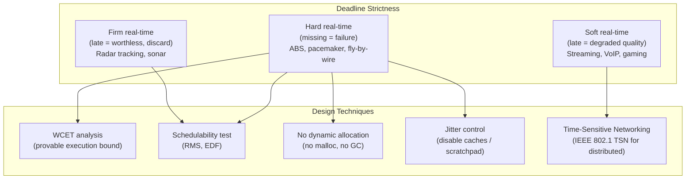

## In simple terms

In a database, a slow query is annoying but not catastrophic. In a real-time system, a computation that arrives too late is as bad as a wrong answer — sometimes worse. A flight control system that decides "turn left" 100 ms too late has crashed the plane; a pacemaker that misses a beat detection has killed the patient.

Real-time systems are found everywhere: not just embedded devices, but also financial trading, robotics, live video, autonomous vehicles, and gaming. What distinguishes them is not speed but *bounded, predictable* timing.

## The Visual Map



## More detail

**Three classes of deadline strictness:**

| Class | Deadline miss consequence | Examples |
|---|---|---|
| **Hard** | System failure — the result is invalid | Fly-by-wire aircraft, ABS, airbag ECU, pacemaker, spacecraft |
| **Firm** | Late result is worthless and discarded; system continues | Radar target tracking, sonar, sensor fusion |
| **Soft** | Degraded quality, not failure | Video streaming, VoIP, online gaming, UI responsiveness |

**Worst-case execution time (WCET):** for hard real-time, every task must have a provable upper bound on its execution time. This rules out: dynamic memory allocation (`malloc` has unbounded latency in the heap allocator), garbage collection, system calls with unbounded blocking, and — on many platforms — data caches (a cache miss has variable latency). WCET analysis tools (OTAWA, aiT) statically analyse the binary using abstract interpretation to produce a safe upper bound.

**Schedulability analysis:** a task set is schedulable if every task can be proven to meet its deadline under a chosen scheduler. The two classic results:
- **Rate-Monotonic Scheduling (RMS)** — assign priority by period (shorter period = higher priority). Provably optimal for fixed-priority scheduling of periodic tasks on a single CPU. A task set is schedulable if total CPU utilisation ≤ n(2^(1/n) − 1) (≈ 69% at the limit for many tasks).
- **Earliest Deadline First (EDF)** — always run the task with the nearest deadline. Optimal for preemptive scheduling; can use up to 100% CPU utilisation, but is less predictable under overload.

**Jitter:** variation in response time. Low jitter is critical for control systems. An audio DSP with 1 ms average latency but occasional 20 ms spikes sounds terrible and may cause feedback instability.

**Cyber-Physical Systems (CPS):** when real-time software interacts with physical processes — autonomous vehicles, industrial robots, medical devices, smart grid — the physical world does not wait for a slow response. CPS design must model the plant (physical process), the controller (software), and the communication channel together.

**Real-time in distributed systems:** coordinating deadlines across networked nodes is hard — network latency adds jitter. IEEE 802.1 TSN (Time-Sensitive Networking) provides hardware-level time synchronisation and traffic shaping for industrial Ethernet. AUTOSAR standardises real-time communication in automotive systems; IEC 61850 does the same for power grid protection.

Real-time constraints appear in more software than engineers often realise — game engines targeting 60 fps have a 16.7 ms budget per frame; mobile apps must respond to touch within 100 ms for the UI to feel instant; payment systems must settle trades within exchange-mandated windows. Understanding real-time constraints explains why RTOS is used in embedded systems, why GC languages are avoided in game engines, and why latency SLOs matter.

## Under the Hood

A minimal Rate-Monotonic scheduler simulation — the classic algorithm for hard real-time periodic tasks:

```python
#!/usr/bin/env python3
"""Simulates Rate-Monotonic Scheduling for three periodic real-time tasks."""

tasks = [
    {"name": "T1", "period": 4,  "wcet": 1},   # highest priority (shortest period)
    {"name": "T2", "period": 6,  "wcet": 2},
    {"name": "T3", "period": 12, "wcet": 3},
]

# RMS schedulability bound: U <= n * (2^(1/n) - 1)
import math
n = len(tasks)
U = sum(t["wcet"] / t["period"] for t in tasks)
bound = n * (2 ** (1/n) - 1)
print(f"CPU utilisation: {U:.3f}  |  RMS bound: {bound:.3f}  |  "
      f"{'SCHEDULABLE' if U <= bound else 'MAY MISS DEADLINES'}\n")

# Simulate one hyperperiod (LCM of all periods)
from math import lcm
from functools import reduce
hyperperiod = reduce(lcm, [t["period"] for t in tasks])

schedule = []
for tick in range(hyperperiod):
    # Find ready tasks (released at multiples of their period, not yet done)
    ready = [t for t in tasks if tick % t["period"] == 0]
    # RMS: pick highest priority (shortest period) task that has remaining work
    if ready:
        chosen = min(ready, key=lambda t: t["period"])
        schedule.append(chosen["name"])
    else:
        schedule.append("idle")

print(f"Schedule over hyperperiod ({hyperperiod} ticks):")
print(f"  {schedule}")

# Check deadlines: each task must complete its WCET within its period
print("\nDeadline analysis:")
for t in tasks:
    slots = [i for i, s in enumerate(schedule) if s == t["name"]]
    missed = False
    for start in range(0, hyperperiod, t["period"]):
        window = [s for s in slots if start <= s < start + t["period"]]
        if len(window) < t["wcet"]:
            print(f"  {t['name']}: MISS at window [{start}, {start+t['period']})")
            missed = True
    if not missed:
        print(f"  {t['name']}: all deadlines met")
```

## Engineering Trade-offs

**Hard real-time vs. general-purpose OS**
Linux, even with the PREEMPT_RT patch, has scheduling jitter in the hundreds of microseconds range — unacceptable for hard real-time. A dedicated RTOS (FreeRTOS, VxWorks, QNX) provides sub-10 µs worst-case scheduling latency because it has no complex kernel subsystems (no memory management, no dynamic module loading, no device driver plug-in). The cost: losing the Unix ecosystem, POSIX tooling, and the vast library base.

**WCET safety margin vs. CPU utilisation**
WCET analysis is necessarily pessimistic — the upper bound includes worst-case cache behaviour, branch prediction failures, and bus arbitration delays that rarely all happen simultaneously. A system designed around WCET bounds may use only 40–60% of actual average CPU capacity. For cost-sensitive hardware, this feels wasteful; for safety-critical systems, the margin is the point.

**Static allocation vs. dynamic allocation**
Hard real-time systems ban dynamic memory allocation (`malloc`, `new`) because the heap allocator has unbounded latency (worst-case: O(n) search, fragmentation-induced failures). Instead, all buffers are statically sized at compile time. This requires knowing all memory requirements upfront — difficult for complex systems, but provably safe.

**EDF throughput vs. RMS predictability under overload**
EDF uses up to 100% CPU utilisation and is theoretically optimal. But under overload (too many tasks, not enough CPU), EDF degrades catastrophically — all tasks start missing deadlines simultaneously. RMS degrades gracefully: when overloaded, only the lowest-priority (longest-period) tasks miss deadlines, leaving the most critical tasks still meeting their deadlines.

**Soft real-time with buffering vs. hard real-time**
Live video streaming tolerates jitter by buffering 1–5 seconds of content ahead of the playback cursor. This converts a real-time problem into a buffered-delivery problem at the cost of latency. "Low-latency" live streaming (LL-HLS, WebRTC) reduces buffer depth to 0.5–3 s at the expense of greater sensitivity to network jitter.

## Real-world examples

- **Boeing 737 MAX MCAS** — a hard real-time flight control system; a software fault (relying on a single AOA sensor without redundancy) contributed to two fatal crashes in 2018–19. The incident is a case study in safety-critical real-time system design failures.
- **Tesla Autopilot** — runs on a dual-domain architecture: a hard real-time subsystem (CAN bus + microcontrollers) handles braking, steering, and safety interlocks; a separate non-real-time SoC runs the vision/AI stack. The two are decoupled so an AI fault cannot cause a hard real-time failure.
- **Twitch / YouTube Live** — soft real-time; targets sub-3 s glass-to-glass latency using LL-HLS or WebRTC. Buffers absorb jitter; the system degrades gracefully to frozen frames rather than catastrophic failure.
- **NYSE / NASDAQ matching engines** — firm real-time; trade execution must happen within microseconds of the market-open event. FPGA-based matching engines bypass the OS entirely (kernel-bypass networking via DPDK or custom ASICs) to achieve sub-microsecond response times.
- **Airbus A380 fly-by-wire** — triple-redundant hard real-time computers running INTEGRITY-178B (a safety-certified RTOS). DO-178C Level A certification required formal verification of all timing properties.

## Common misconceptions

- **"Fast means real-time."** Real-time means *bounded* and *predictable*, not just fast. A system that usually responds in 1 µs but occasionally takes 500 ms is not real-time — that occasional 500 ms miss is the failure. A system that always responds in 10 ms is real-time.
- **"Real-time is only for embedded systems."** Financial trading (microsecond matching), cloud gaming (sub-20 ms render-to-display), VoIP (sub-150 ms end-to-end for natural conversation), and surgical robotics all have strict real-time requirements that run on general-purpose hardware or cloud infrastructure.

## Try it yourself

Simulate a periodic real-time task set and check schedulability using the RMS utilisation bound:

```bash
python3 - << 'EOF'
import math
from functools import reduce
from math import lcm

tasks = [
    {"name": "T1-brake",  "period": 4,  "wcet": 1},
    {"name": "T2-steer",  "period": 6,  "wcet": 2},
    {"name": "T3-sensor", "period": 12, "wcet": 3},
]

n = len(tasks)
U = sum(t["wcet"] / t["period"] for t in tasks)
bound = n * (2 ** (1/n) - 1)
print(f"Task set utilisation: {U:.4f}")
print(f"RMS schedulability bound (n={n}): {bound:.4f}")
print(f"Result: {'SCHEDULABLE (guaranteed)' if U <= bound else 'UNCERTAIN — may miss deadlines'}\n")

hp = reduce(lcm, [t["period"] for t in tasks])
sched = []
for tick in range(hp):
    ready = [t for t in tasks if tick % t["period"] == 0]
    sched.append(min(ready, key=lambda t: t["period"])["name"] if ready else "idle")

print(f"RMS schedule over hyperperiod={hp}:")
for i, s in enumerate(sched):
    print(f"  t={i}: {s}")
EOF
```

## Learn next

- [Real-Time OS](/t/real-time-os) — the operating system layer that provides the scheduling primitives (priority preemption, RMS, EDF) real-time tasks run on; RTOS design directly implements the theory described here.
- [Edge Computing](/t/edge-computing) — reduces network latency for distributed real-time systems; 5G MEC co-locates compute at the base station to meet sub-millisecond round-trip requirements.
- [Scheduler](/t/scheduler) — the OS component that makes real-time scheduling decisions; understanding the generic scheduler explains what an RTOS replaces and why.
