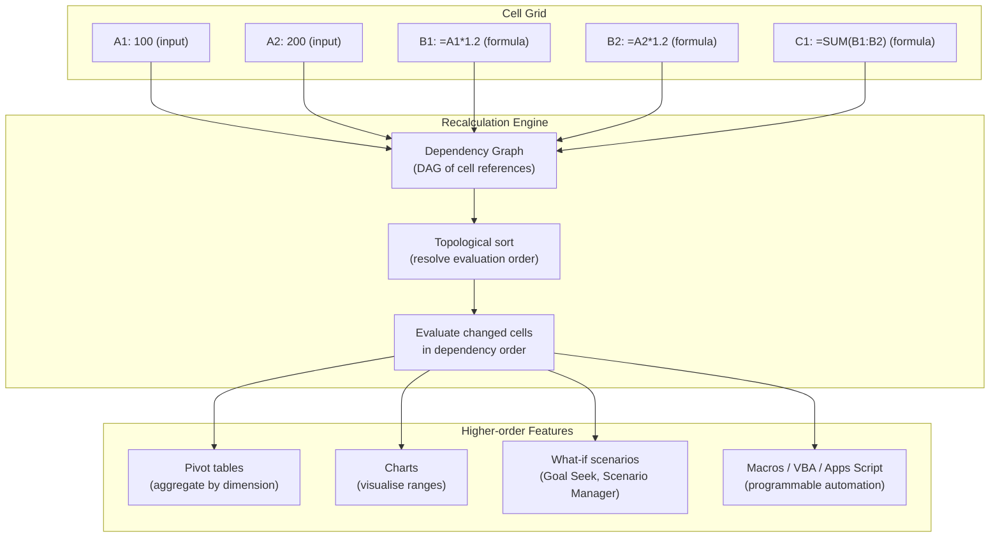

## In simple terms

A **spreadsheet** is a grid of cells you fill with numbers, text, and — crucially — **formulas** that compute results from other cells. Change one number and everything that depends on it updates automatically. That simple idea, pioneered by VisiCalc in 1979 and now embodied in Excel and Google Sheets, became one of the most important applications in computing history.

Hundreds of millions of people use spreadsheets daily to budget, plan, analyse, and model — making the spreadsheet arguably the most widely used *programming* environment in the world, even though hardly anyone calls it that.

## The Visual Map



## More detail

What makes a spreadsheet powerful is **automatic recalculation through a dependency graph**. Each formula cell references others; when a value changes, the spreadsheet recomputes everything downstream in the right order (a topological sort of the directed acyclic graph of dependencies). That's the same reactive, dataflow idea underlying many modern programming tools — just wrapped in an interface anyone can use.

**Core capabilities:**

- **Formulas and functions** — arithmetic, text manipulation, lookups (`VLOOKUP`, `XLOOKUP`, `INDEX/MATCH`), date math, statistics, financial functions, and hundreds more. Excel 365 adds array functions (`FILTER`, `SORT`, `UNIQUE`) that return ranges, not single cells.
- **What-if modelling** — change inputs and instantly see outcomes ripple through, ideal for budgets, forecasts, and scenario planning. Goal Seek and Solver invert the model: "what input produces this output?"
- **Pivot tables** — summarise and group tabular data without writing code; essentially a SQL `GROUP BY` in drag-and-drop form.
- **Charts** — visualise ranges in bar, line, scatter, and many other chart types, live-updating as data changes.
- **A "good enough" database** — small datasets in rows and columns work fine, though the resemblance to the [relational model](/t/relational-model) is also where trouble starts (no referential integrity, no transactions, no concurrent writes).
- **Macros and scripting** — Excel has VBA; Google Sheets has Apps Script (JavaScript); both let you automate repetitive tasks and call external APIs.

The deepest insight is that spreadsheets are **end-user programming**: ordinary people build genuine computational models — sometimes enormously complex ones — without ever learning a traditional programming language. This is a triumph of accessible design and a profound lesson in interface design: the right abstraction (the recalculating grid) can make programming accessible to hundreds of millions.

Spreadsheets quietly run a staggering share of the world's business logic — finance, operations, science, small business, research. They put computational power into the hands of non-programmers at a scale nothing else has matched.

## Under the Hood

A spreadsheet's recalculation engine is a dependency graph evaluated in topological order. Here's the same mechanism in Python:

```python
#!/usr/bin/env python3
"""Minimal spreadsheet recalculation engine: dependency graph + topological sort."""

class Spreadsheet:
    def __init__(self):
        self.values = {}      # cell → computed value
        self.formulas = {}    # cell → callable that takes the sheet
        self.deps = {}        # cell → set of cells it depends on

    def set_value(self, cell, value):
        self.values[cell] = value
        self.formulas.pop(cell, None)
        self._recalculate()

    def set_formula(self, cell, depends_on, fn):
        self.formulas[cell] = fn
        self.deps[cell] = set(depends_on)
        self._recalculate()

    def _topo_sort(self):
        order, visited = [], set()
        def visit(c):
            if c in visited: return
            visited.add(c)
            for dep in self.deps.get(c, []):
                visit(dep)
            order.append(c)
        for cell in self.formulas:
            visit(cell)
        return order

    def _recalculate(self):
        for cell in self._topo_sort():
            if cell in self.formulas:
                self.values[cell] = self.formulas[cell](self.values)

    def get(self, cell):
        return self.values.get(cell, 0)

# --- Demo ---
sheet = Spreadsheet()
sheet.set_value("A1", 100)
sheet.set_value("A2", 200)
sheet.set_formula("B1", ["A1"], lambda v: v["A1"] * 1.2)
sheet.set_formula("B2", ["A2"], lambda v: v["A2"] * 1.2)
sheet.set_formula("C1", ["B1", "B2"], lambda v: v["B1"] + v["B2"])

print(f"A1={sheet.get('A1')}  A2={sheet.get('A2')}")
print(f"B1=A1*1.2 → {sheet.get('B1')}")
print(f"B2=A2*1.2 → {sheet.get('B2')}")
print(f"C1=SUM(B1:B2) → {sheet.get('C1')}")

# Change A1 — C1 updates automatically through the dependency chain
print("\nChanging A1 to 500...")
sheet.set_value("A1", 500)
print(f"B1 → {sheet.get('B1')}  C1 → {sheet.get('C1')}")
```

## Engineering Trade-offs

**Accessibility vs. correctness**
Spreadsheets have essentially no type system, no version control, no test suite, and no code review. A formula can silently reference the wrong range; a copy-paste can break relative references. The same accessibility that makes spreadsheets powerful for non-programmers makes them treacherous for complex business-critical models.

**Reactive recalculation vs. performance**
Automatic recalculation is magical for small models. For large ones (500,000 cells with complex formulas), full recalculation on every keystroke is slow. Excel uses incremental recalculation (smart dirty-marking), multi-threaded calculation, and deferred volatile functions (`NOW()`, `RAND()`). Even so, spreadsheets hit a practical ceiling at a few hundred thousand formula cells.

**Row-oriented layout vs. relational integrity**
A spreadsheet looks like a database table — rows and columns, maybe with a header. But it has no foreign keys, no constraint enforcement, no transactions, and allows any value in any cell. "Spreadsheet as database" works for hundreds of rows; it becomes unmaintainable at tens of thousands and actively dangerous for data that must stay consistent.

**Formulas vs. code**
For a one-off analysis, a formula in `C2` is faster to write than a Python function. For a repeating pipeline — daily report, monthly reconciliation — code is easier to test, debug, version, and automate. The transition point ("when do I move from spreadsheet to code?") is one of the most common engineering judgment calls.

**Collaborative editing vs. consistency**
Google Sheets pioneered real-time multi-user editing of a shared document. Excel's shared workbook feature has historically been limited. Real-time collaboration is invaluable for teams but makes audit trails and formula governance harder — who changed what formula, and when?

## Real-world examples

- **Reinhart-Rogoff (2010)** — an influential economics paper claiming debt-to-GDP > 90% suppresses growth was found to have a row-exclusion error in its Excel model. The error materially affected the paper's conclusions and was cited in policy debates — the most famous spreadsheet bug in public life.
- **JPMorgan "London Whale" (2012)** — a VaR model copied-and-pasted in Excel divided by a sum instead of an average, underestimating risk. Loss: ~$6 billion. Later attributed in part to manual spreadsheet errors.
- **Early-stage startups** — entire companies run on Google Sheets: investor pipeline, cap table, hiring plan, financial model. Fast and collaborative, until it isn't.
- **Science** — genomics researchers discovered that gene names like `MARCH1` and `SEPT2` were being auto-converted to dates (`1-Mar`) by Excel, corrupting published datasets. Major journals now require non-Excel formats for supplementary data.
- **Excel as a programming environment** — competitive "Excel eSports" (FMWC) involves solving complex modelling problems in Excel at speed; financial modellers treat advanced array formulas as a genuine programming skill.

## Common misconceptions

- **"Spreadsheets aren't programming."** Building formulas with logic, lookups, and dependencies *is* programming — spreadsheets are the most popular programming environment on Earth, just not labelled as one. The dependency graph, conditional logic, and iteration are all computational concepts.
- **"A spreadsheet is a fine database."** For small data it works, but spreadsheets lack the integrity, concurrency, and validation of a real database. The Reinhart-Rogoff and London Whale incidents are the canonical cautionary tales.

## Try it yourself

Run the minimal spreadsheet engine and see reactive recalculation in action:

```bash
python3 - << 'EOF'
class Sheet:
    def __init__(self):
        self.v, self.f, self.d = {}, {}, {}
    def val(self, c, v):
        self.v[c] = v; self.f.pop(c, None); self._calc()
    def formula(self, c, deps, fn):
        self.f[c] = fn; self.d[c] = deps; self._calc()
    def _topo(self):
        order, seen = [], set()
        def visit(c):
            if c in seen: return
            seen.add(c)
            for d in self.d.get(c, []): visit(d)
            order.append(c)
        for c in self.f: visit(c)
        return order
    def _calc(self):
        for c in self._topo():
            if c in self.f: self.v[c] = self.f[c](self.v)
    def get(self, c): return self.v.get(c, 0)

s = Sheet()
s.val("price", 100); s.val("qty", 5); s.val("tax", 0.08)
s.formula("subtotal", ["price","qty"],      lambda v: v["price"] * v["qty"])
s.formula("tax_amt",  ["subtotal","tax"],   lambda v: v["subtotal"] * v["tax"])
s.formula("total",    ["subtotal","tax_amt"],lambda v: v["subtotal"] + v["tax_amt"])

print(f"price={s.get('price')}  qty={s.get('qty')}  tax={s.get('tax')}")
print(f"  subtotal = {s.get('subtotal')}")
print(f"  tax_amt  = {s.get('tax_amt')}")
print(f"  total    = {s.get('total'):.2f}")

print("\nPrice changes to 150 -> total recalculates automatically:")
s.val("price", 150)
print(f"  subtotal = {s.get('subtotal')}  total = {s.get('total'):.2f}")
EOF
```

## Learn next

- [Relational Model](/t/relational-model) — the database alternative when a spreadsheet outgrows itself; understanding relations, foreign keys, and constraints explains why spreadsheets fail at data integrity.
- [Scientific Computing](/t/scientific-computing) — the next step up for numerical modelling; Python with NumPy replaces spreadsheet formulas when data grows large or computation needs to be reproducible and automated.
- [Python](/t/python) — the most common language people migrate to from spreadsheets; pandas DataFrames are the programmatic equivalent of a spreadsheet's row/column model.
