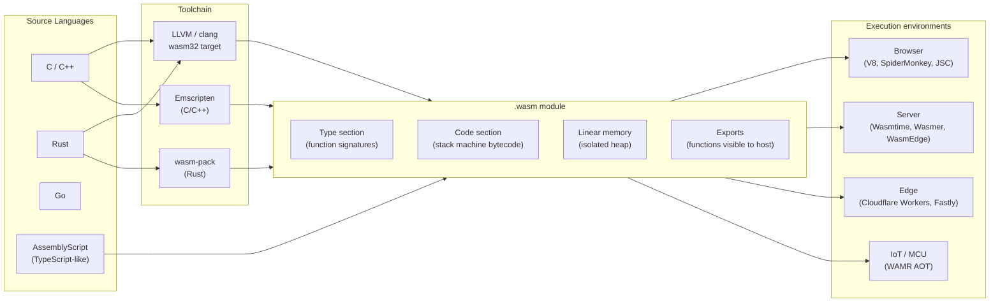

## In simple terms

Before WebAssembly, JavaScript was the only language that could run natively in a browser. WebAssembly (Wasm) changes this: it is a compact binary format that any language can compile to, and browsers execute it at near-native speed. Figma's vector graphics engine is C++ compiled to Wasm. Google Earth runs in the browser via Wasm. Photoshop's C++ codebase runs in the browser via Wasm.

Beyond the browser, Wasm is emerging as a universal sandboxed runtime for serverless, plugins, and IoT — "write once, run anywhere" that actually works, because the sandbox is enforced by the runtime, not the OS.

## The Visual Map



## More detail

**What Wasm is:** a stack-based binary instruction format (a portable assembly language) with a well-defined type system and execution semantics. A `.wasm` binary is:

- **Compact** — typically 50–80% smaller than equivalent minified JavaScript.
- **Fast to decode** — the binary format is designed to be parsed in a single linear pass; streaming compilation starts before the full binary arrives.
- **Safe** — the runtime enforces that Wasm code can only access memory it has been granted (its own linear heap); it cannot reach the host's memory or OS unless the host explicitly provides an import.
- **Deterministic** — same inputs, same outputs, regardless of host platform (with minor floating-point caveats around NaN bit patterns).

**Execution model:** Wasm is a stack machine. Instructions push and pop typed values (`i32`, `i64`, `f32`, `f64`, `v128`). The runtime JIT-compiles the bytecode to native code (or AOT-compiles ahead of time). V8, SpiderMonkey, JavaScriptCore, and Wasmtime all have Wasm JITs achieving 90–95% of native C speed on compute-intensive workloads.

**Language support:** any language with an LLVM backend can target Wasm — C, C++, Rust, Go, Swift, Kotlin, AssemblyScript, Zig, and more. Toolchains: `clang --target=wasm32`, `wasm-pack` (Rust), Emscripten (C/C++ with browser glue), `GOOS=wasip1 GOARCH=wasm go build` (Go 1.21+).

**JavaScript interoperability:** Wasm modules declare imports (functions they need from JS) and exports (functions JS can call). Wasm has no DOM access; it calls JavaScript-provided functions for that. The boundary has copying overhead for non-trivial data types. `wasm-bindgen` (Rust) auto-generates the JS glue code.

**Beyond the browser:**
- **WASI** — a capability-based OS interface: files, network, clocks, random — all explicitly granted. A Wasm+WASI binary runs on any WASI host without recompilation. Solomon Hykes (Docker co-founder): "If WASM+WASI existed in 2008, we would not have needed Docker."
- **Component Model** — typed interfaces (WIT — Wasm Interface Types) for composing Wasm modules across languages with no FFI overhead.
- **Threads + SIMD** — the threads proposal adds shared memory and atomics; SIMD (v128) adds 128-bit vectorised operations for numerical workloads.

WebAssembly is the most significant browser platform addition since JavaScript. It enables: porting native applications to the web without rewriting; near-native performance for compute-intensive browser apps (video editing, CAD, 3D); a universal sandboxed compute target for serverless, edge, and plugins.

## Under the Hood

WebAssembly's stack machine in text format (WAT — WebAssembly Text) — the human-readable equivalent of the binary:

```wat
;; Fibonacci in WebAssembly Text format
;; Compiles to ~80 bytes of .wasm binary
(module
  (func $fib (export "fib") (param $n i32) (result i32)
    ;; Base case: n <= 1 → return n
    local.get $n
    i32.const 1
    i32.le_s
    if (result i32)
      local.get $n
    else
      ;; fib(n-1)
      local.get $n
      i32.const 1
      i32.sub
      call $fib
      ;; fib(n-2)
      local.get $n
      i32.const 2
      i32.sub
      call $fib
      ;; sum
      i32.add
    end
  )
)
```

The same function compiled from C, showing what the toolchain produces:

```c
// fib.c — compiled with: clang --target=wasm32 -nostdlib -Wl,--export=fib -o fib.wasm fib.c
__attribute__((export_name("fib")))
int fib(int n) {
    if (n <= 1) return n;
    return fib(n - 1) + fib(n - 2);
}
```

The binary is ~200 bytes. Running it in the browser:

```javascript
// Load and call the Wasm module from JavaScript
const { instance } = await WebAssembly.instantiateStreaming(fetch('/fib.wasm'));
console.log(instance.exports.fib(10));   // 55
console.log(instance.exports.fib(30));   // 832040 — fast: JIT-compiled
```

The isolation boundary: Wasm's linear memory is a flat array `Uint8Array`. Wasm code can only read/write inside it. Any attempt to access memory outside the module's allocation is a trap (runtime error), not undefined behaviour.

## Engineering Trade-offs

**Wasm vs. JavaScript for browser compute**
JavaScript is dynamically typed and JIT-compiled with type speculation — fast for most code, but JIT deoptimisation on type changes can cause unpredictable performance spikes. Wasm is statically typed with a predictable JIT that does not deoptimise: performance is more consistent. For CPU-bound work (video decoding, physics simulation, cryptography), Wasm wins by 2–10×. For DOM manipulation and API calls, JS wins (no Wasm ↔ JS boundary crossing needed).

**Linear memory model vs. GC**
Wasm (pre-GC proposal) manages its own linear memory — C/Rust's malloc/free runs *inside* the Wasm sandbox. This means no GC pauses in the hot path, but also no automatic memory management. The Wasm GC proposal (shipped in V8 2023) adds managed types, enabling Kotlin, Dart, and Java to target Wasm without a bundled GC runtime.

**Binary size vs. startup time**
Wasm binaries include the compiled code for all used library functions (unlike JS which can lazy-load). A non-trivial C++ app compiled to Wasm may be 1–10 MB. Emscripten applies dead-code elimination; `wasm-opt` runs additional Wasm-level optimisations. Streaming compilation (starting JIT before the full binary arrives) mitigates the startup cost.

**WASI portability vs. feature completeness**
WASI Preview 1 has no networking, threads, or process spawning — portable but limited. Preview 2 adds sockets, threads, and the Component Model. Wasmer's WASIX adds full POSIX. Each extension improves capability at the cost of portability: a binary targeting WASIX doesn't run on all WASI hosts.

**Wasm sandbox vs. container isolation**
Wasm's sandbox is enforced at the language runtime level — stricter and more granular than Linux namespaces (containers share the host kernel, which is attack surface). A Wasm module cannot make arbitrary syscalls; all capabilities must be granted as WASI imports. The cost: WASI's syscall surface is much smaller than POSIX, so porting existing software requires wrapping or emulating.

## Real-world examples

- **Figma** — vector graphics rendering engine is C++ compiled to Wasm; runs at 60 fps in the browser; the reason Figma could port a desktop-class design tool to the web without a rewrite.
- **Photoshop for the Web** (Adobe) — ported C++ codebase to Wasm; shipped in beta 2022; uses shared memory (SharedArrayBuffer) for multi-threaded image processing.
- **Google Earth** — C++ geospatial engine compiled to Wasm + WebGL; runs in the browser without a plugin.
- **Cloudflare Workers** — each worker is a Wasm binary executed in a V8 isolate; 45+ million requests per second globally.
- **VS Code for the Web** — language servers (TypeScript, Python, Rust) compiled to Wasm and run in the browser; full IntelliSense with zero server round trips.

## Common misconceptions

- **"Wasm replaces JavaScript."** Wasm supplements JavaScript and the two interoperate. Wasm has no DOM access — it must call JavaScript-provided functions for any browser API. The web platform has both; JS handles the glue; Wasm handles the compute.
- **"Wasm is only for the browser."** WASI and server-side Wasm runtimes (Wasmtime, Wasmer, WasmEdge) make Wasm a general-purpose compute target for serverless, edge, IoT, and plugin systems. The browser is the origin; the universal portable sandbox is the destination.

## Try it yourself

Simulate WebAssembly's stack machine execution model — push, pop, and typed operations:

```bash
python3 - << 'EOF'
"""Simulate a minimal Wasm stack machine executing bytecode instructions."""

def run_wasm(bytecode, params):
    """Execute a list of (instruction, operand) tuples with typed i32 stack."""
    stack = list(params)
    local = list(params)   # locals mirror params for simplicity

    for instr, *args in bytecode:
        if instr == "local.get":
            stack.append(local[args[0]])
        elif instr == "local.set":
            local[args[0]] = stack.pop()
        elif instr == "i32.const":
            stack.append(args[0])
        elif instr == "i32.add":
            b, a = stack.pop(), stack.pop()
            stack.append(a + b)
        elif instr == "i32.mul":
            b, a = stack.pop(), stack.pop()
            stack.append(a * b)
        elif instr == "i32.sub":
            b, a = stack.pop(), stack.pop()
            stack.append(a - b)
        elif instr == "return":
            return stack[-1]

    return stack[-1] if stack else None

# (a + b) * 2  — equivalent WAT:
#   local.get 0   ;; push a
#   local.get 1   ;; push b
#   i32.add       ;; pop a, b -> push a+b
#   i32.const 2   ;; push 2
#   i32.mul       ;; pop sum, 2 -> push sum*2
bytecode = [
    ("local.get", 0),
    ("local.get", 1),
    ("i32.add",),
    ("i32.const", 2),
    ("i32.mul",),
    ("return",),
]

for a, b in [(3, 5), (10, 20), (7, 0)]:
    result = run_wasm(bytecode, [a, b])
    print(f"  (a={a}, b={b})  =>  (a+b)*2 = {result}")
EOF
```

## Learn next

- [Wasm Runtime](/t/wasm-runtime) — the server-side runtime ecosystem (Wasmtime, Wasmer, WasmEdge) that takes Wasm beyond the browser; covers WASI, Component Model, and deployment platforms in depth.
- [Edge Computing](/t/edge-computing) — Cloudflare Workers and Fastly Compute are the primary production environments for server-side Wasm; the edge use case is where Wasm's startup and isolation properties matter most.
- [Sandbox](/t/sandbox) — the security model Wasm enforces; linear memory isolation, capability-gated imports, and trap-on-violation are the sandbox mechanisms described abstractly there.
- [Forth](/t/forth) — the historical stack machine language whose execution model Wasm's stack architecture parallels; Forth pioneered the idea of a portable virtual stack machine as a compilation target.
