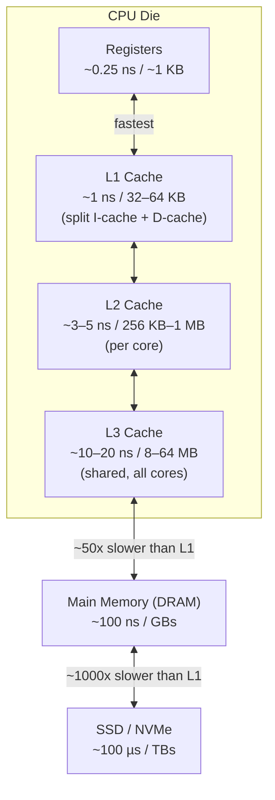

## In simple terms

Main memory is fast, but the CPU is far faster. A **cache** is a small bank of even-faster memory sitting between the CPU and RAM. It holds copies of the most recently accessed bytes so the CPU rarely has to wait the full ~100 nanoseconds for RAM — instead getting the data in 1–20 nanoseconds from a chip that lives on the CPU die itself.

Without cache, your CPU would spend most of its time waiting for memory, and the GHz printed on the box would be mostly wasted.

## The Visual Map



## More detail

**Cache levels** trade capacity for latency:

| Level | Typical size | Latency | Shared by |
|---|---|---|---|
| L1 | 32–64 KB | ~1 ns / ~3 cycles | One core (split: I-cache + D-cache) |
| L2 | 256 KB – 1 MB | ~3–5 ns / ~10 cycles | One core |
| L3 | 8–64 MB | ~10–20 ns / ~40 cycles | All cores |
| DRAM | GBs | ~100 ns / ~300 cycles | All cores |

Caches work on **cache lines** — fixed-size blocks (usually 64 bytes) — not individual bytes. Reading one byte fetches the entire 64-byte neighbourhood.

**Why caches work** — two properties of real programs:

- **Temporal locality** — data used once is likely to be used again soon (variables in a loop, frequently-called functions).
- **Spatial locality** — data near recently-used data is also likely to be used soon (sequential array traversal, fields of a struct used together).

**Cache organisation:**

- **Direct-mapped** — each memory address maps to exactly one cache slot (by address mod cache_size). Simple hardware, cheap; but two addresses mapping to the same slot cause *thrashing* — they keep evicting each other.
- **N-way set-associative** — each address can occupy any of N slots within a *set*. Most L1/L2 caches are 4- or 8-way set-associative. Better hit rate; slightly more complex replacement logic (LRU, pseudo-LRU).
- **Fully associative** — any address in any slot; perfect hit rate in theory, but the comparator hardware scales with cache size. Used only in TLBs and small special-purpose caches.

**Cache miss types:**

- **Compulsory (cold) miss** — first ever access to a line. Unavoidable.
- **Capacity miss** — the working set is larger than the cache; lines keep getting evicted before reuse.
- **Conflict miss** — two frequently-used addresses map to the same set/slot in a set-associative or direct-mapped cache, evicting each other.

**Eviction policies:** LRU (least recently used) is the ideal but expensive to implement exactly; most caches use pseudo-LRU or random replacement.

**Multi-core coherence:** when multiple CPU cores each have their own L1/L2 cache holding a copy of the same memory address, they must stay consistent. Coherence protocols (MESI, MOESI) broadcast state changes across cores via a ring bus or mesh interconnect — the cost that makes cache-line sharing between cores (false sharing) expensive.

Most "performance" tuning at the language level is really cache tuning: lay data out contiguously, avoid pointer chasing, keep hot data small. A cache-friendly program that fits in L1 can be 100× faster than a cache-unfriendly one that constantly misses to RAM.

## Under the Hood

Demonstrating cache effects in C — the classic row-major vs. column-major traversal:

```c
#include <stdio.h>
#include <time.h>
#include <stdlib.h>

#define N 4096
static float A[N][N];

static double now_s(void) {
    struct timespec ts;
    clock_gettime(CLOCK_MONOTONIC, &ts);
    return ts.tv_sec + ts.tv_nsec * 1e-9;
}

int main(void) {
    /* Row-major: A[row][col] — sequential access, every element in
       a cache line is used before the line is evicted.              */
    double t0 = now_s();
    float sum1 = 0;
    for (int row = 0; row < N; row++)
        for (int col = 0; col < N; col++)
            sum1 += A[row][col];
    double row_time = now_s() - t0;

    /* Column-major: A[col][row] — stride-N access pattern,
       jumps 4096 floats (16 KB) per step; every access is a
       cache miss because the line fetched is not reused.            */
    t0 = now_s();
    float sum2 = 0;
    for (int col = 0; col < N; col++)
        for (int row = 0; row < N; row++)
            sum2 += A[row][col];
    double col_time = now_s() - t0;

    printf("row-major: %.3f s\n", row_time);
    printf("col-major: %.3f s  (~%.0fx slower)\n",
           col_time, col_time / row_time);
    return 0;
}
```

The column-major loop is typically **10–30× slower** on a modern CPU — identical arithmetic, identical data, different access pattern. Every column-major access misses L1, L2, and often L3, stalling the CPU for ~300 cycles per miss.

## Engineering Trade-offs

**Cache size vs. cache speed**
Larger caches hold more data (fewer capacity misses) but are physically larger and farther from the execution units on the die — increasing latency. L1 is tiny (~32 KB) because it must respond in 1 cycle; L3 is large (8–64 MB) because it can afford 40 cycles. The hierarchy is a deliberate Pareto frontier.

**Cache-friendly data layout vs. OOP convenience**
Object-oriented designs often create many small heap-allocated objects connected by pointers. Traversing a linked list, a tree, or a graph of objects causes a pointer-chase miss at every node — the "pointer soup" anti-pattern. Data-oriented design (struct-of-arrays, arena allocation, ECS) keeps hot fields contiguous, enabling hardware prefetchers to stay ahead of execution.

**Write-through vs. write-back**
Write-through caches forward every write to the next level immediately — simple, always consistent, but uses more memory bandwidth. Write-back caches accumulate writes and flush a dirty line only when evicted — lower bandwidth use but more complex; the dirty line must be flushed before another core can have the correct value (creating coherence traffic).

**False sharing in multi-core programs**
Two threads that write to different variables that happen to share a cache line cause the line to bounce between cores continuously (each write invalidates the other core's copy). The fix — padding data to align each variable to a cache line boundary — costs memory but can improve multi-threaded throughput by 10× on hot contended counters.

**Hardware prefetching vs. software prefetching**
Modern CPUs detect sequential and stride access patterns and prefetch cache lines before they are requested. Irregular access patterns (pointer chasing, hash lookups) defeat the hardware prefetcher. Software prefetch hints (`__builtin_prefetch`) can help for predictable-but-irregular patterns, but overly aggressive prefetching pollutes the cache with data that won't be used.

## Real-world examples

- **NumPy array operations** — NumPy stores arrays in row-major (C-contiguous) layout; operations that stride across columns (column-wise sums, matrix transposes) are significantly slower than row-wise operations, exactly due to cache effects.
- **Game engine Entity-Component-System (ECS)** — stores component data (positions, velocities) in packed arrays rather than per-entity structs; this is fundamentally a cache-line-packing optimisation — all positions fit on consecutive cache lines and the update loop has zero pointer chasing.
- **Linux kernel slab allocator** — groups allocations of the same size class to avoid fragmentation and keep same-type objects on the same cache lines; explicitly designed around L1 cache line size.
- **Redis** — achieves millions of ops/second partly because its primary data structures (dictionaries, skiplists) are designed to fit hot metadata in cache lines and avoid pointer chasing on the common code paths.
- **CPU branch target buffer (BTB)** — itself a small cache (typically 4096 entries) mapping instruction addresses to their last-seen branch targets; a BTB miss causes a pipeline flush identical in cost to a deep cache miss.

## Common misconceptions

- **"Cache is RAM."** Cache is on the CPU die, made of SRAM (static RAM — 6 transistors per bit, no refresh required, fast but dense). Main memory is DRAM (dynamic RAM — 1 transistor + 1 capacitor per bit, must be refreshed, slow but cheap). They are different memory technologies, orders of magnitude apart in speed and cost per bit.
- **"Bigger cache is always better."** L1 is 32 KB because that is the largest capacity that still responds in ~1 cycle. An L1 of 1 MB would have ~5 cycle latency. Cache designers pick each level's size to sit on the latency/capacity Pareto frontier; "bigger" shifts the design point, it doesn't dominate it.

## Try it yourself

Measure cache effects in Python by comparing sequential access against a stride pattern:

```bash
python3 - << 'EOF'
import time, array

N = 4_000_000
data = array.array('f', [1.0] * N)

def timed_sum(step):
    t0 = time.perf_counter()
    s = 0.0
    for i in range(0, N, step):
        s += data[i]
    return time.perf_counter() - t0, s

print(f"{'Stride':>8}  {'Time (ms)':>12}  {'Elements read':>15}  {'Note'}")
print("-" * 65)
for stride in [1, 4, 16, 64, 256]:
    ms, _ = timed_sum(stride)
    elements = N // stride
    note = "sequential (cache-friendly)" if stride == 1 else f"stride {stride} (cache-hostile at large stride)"
    print(f"{stride:>8}  {ms*1000:>12.1f}  {elements:>15,}  {note}")

print("\nLarger strides access fewer elements but pay more cache misses per element.")
EOF
```

## Learn next

- [CPU Pipeline](/t/cpu-pipeline) — how the processor executes instructions in stages and how cache misses stall the pipeline; cache latency maps directly to pipeline stall cycles.
- [Register](/t/register) — the fastest storage of all, directly inside the CPU execution units; understanding registers clarifies why cache is needed at all.
- [Virtual Memory](/t/virtual-memory) — the address translation layer above the cache; the TLB is itself a cache for page-table entries, and TLB misses cause their own pipeline stalls.
- [Cache Coherence](/t/cache-coherence) — the multi-core extension: how L1/L2 caches on different cores stay consistent, and why false sharing is expensive.
