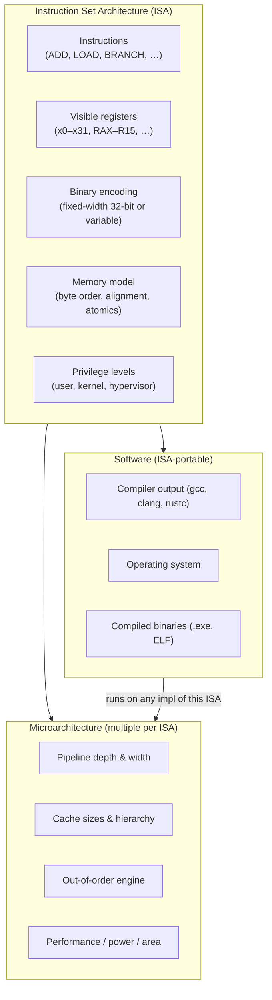

## In simple terms

An **instruction set** is the list of operations a particular CPU understands: "add these two numbers", "load a byte from this address", "jump if the result was zero". Each is one instruction. Two CPUs that implement the same instruction set can run the same compiled programs — the ISA is the contract between hardware and software.

## The Visual Map



## More detail

A CPU's Instruction Set Architecture (ISA) defines the **complete interface** between software and hardware:

- **Instructions** — the operation set: arithmetic (`ADD`, `MUL`, `SUB`), logic (`AND`, `OR`, `XOR`, `NOT`), memory (`LOAD`, `STORE`), control flow (`JMP`, `CALL`, `RET`, `BEQ`), SIMD (`VADD`, `VMUL`), and privileged system instructions (`SYSCALL`, `HALT`).
- **Registers** — the named fast storage visible to programs: x86-64 has 16 general-purpose registers (RAX–R15) plus special-purpose ones; AArch64 has 31 general-purpose registers (x0–x30); RISC-V has 32 (x0–x31 with x0 wired to zero).
- **Encoding** — how instructions are represented as bytes in memory. RISC-V uses fixed-width 32-bit encoding (simple hardware decode). x86 uses variable-length encoding (1–15 bytes) — powerful but complex to decode in hardware. Thumb/Thumb-2 (ARM) uses 16- or 32-bit encoding to improve code density.
- **Memory model** — byte order (little-endian: x86, ARM; big-endian: historically SPARC, MIPS), alignment requirements, and the rules governing multi-core memory visibility (sequential consistency, TSO, or a weaker model).
- **Privilege levels** — rings or exception levels separating user code from OS kernels from hypervisors. x86 has rings 0–3 (ring 0 = kernel); ARMv8 has EL0–EL3.

**Major ISAs in 2026:**

| ISA | Origin | Encoding | Primary use |
|---|---|---|---|
| x86-64 | Intel/AMD (1978 x86 → 64-bit 2003) | Variable (1–15 bytes) | Laptops, desktops, most servers |
| AArch64 / ARM64 | ARM Ltd | Fixed 32-bit | Phones, Apple Silicon, AWS Graviton |
| RISC-V | UC Berkeley (open standard) | Fixed 32-bit (+ compressed 16-bit) | Embedded, academia, growing cloud |
| MIPS | Stanford (1981) | Fixed 32-bit | Legacy networking, some embedded |
| POWER | IBM | Fixed 32-bit | IBM servers, game consoles (PS3/Xbox 360) |

Programs compiled for one ISA do not run on another without emulation or a portable intermediate (JVM bytecode, WebAssembly, LLVM IR).

The ISA is the most consequential architectural decision a chip designer makes: it locks in decades of software compatibility and constrains every compiler that targets the chip. x86's backward compatibility with 16-bit 8086 instructions from 1978 is still visible in the reset vector of every modern x86 CPU.

## Under the Hood

The same computation in three ISAs — loading two values from memory, adding them, storing the result — shows how encoding and register conventions differ:

```asm
; --- x86-64 (Intel syntax) ---
; Variable-length encoding; complex addressing modes built into the ISA
mov rax, [rbx]          ; LOAD: 3 bytes (REX + opcode + ModRM)
add rax, [rbx + 8]      ; ADD from memory: x86 can ADD directly from memory
mov [rbx + 16], rax     ; STORE result

; --- AArch64 (ARM64) ---
; Fixed 32-bit encoding; memory ops are strictly load/store (no mem-to-mem)
ldr x0, [x1]            ; LOAD  (32 bits)
ldr x2, [x1, #8]        ; LOAD  (32 bits)
add x0, x0, x2          ; ADD   (32 bits)
str x0, [x1, #16]       ; STORE (32 bits)

; --- RISC-V (RV64I) ---
; Fixed 32-bit encoding; same load/store discipline as AArch64
ld  a0, 0(a1)           ; LOAD  (32 bits)
ld  a2, 8(a1)           ; LOAD  (32 bits)
add a0, a0, a2          ; ADD   (32 bits)
sd  a0, 16(a1)          ; STORE (32 bits)
```

x86 can add directly from memory (one instruction) because CISC allows complex addressing. RISC ISAs (ARM, RISC-V) require a separate load — more instructions, but each is simpler and fixed-width, making the decoder smaller and faster.

## Engineering Trade-offs

**RISC vs. CISC encoding**
Variable-length CISC encoding (x86) gives better code density (fewer bytes to represent a program) and powerful addressing modes. Fixed-width RISC encoding (ARM, RISC-V) makes instruction decoding trivial hardware — every instruction starts at a 4-byte boundary; the decoder can process instructions in parallel without length disambiguation. x86 CPUs internally convert variable-length instructions into fixed-width micro-ops, adding a translation layer.

**Backward compatibility vs. clean design**
x86-64 is backward-compatible with 32-bit x86, which is backward-compatible with 16-bit x86 from 1978. This compatibility guarantees that software investments are preserved but burdens every decoder chip with legacy encoding quirks. RISC-V was designed from scratch with no backward-compatibility constraints — cleaner but without the existing software ecosystem.

**Register count vs. code density**
More registers reduce spilling (moving variables to memory when registers run out), improving performance. But more registers require more bits in the instruction encoding to identify them. x86 has 16 general-purpose registers (historically 8, limiting performance for decades); RISC-V has 32. The compressed (16-bit) RISC-V encoding reduces this to 8 accessible registers to save space in the encoding.

**ISA stability vs. ISA evolution**
Stable ISAs accumulate extension baggage. x86 has SSE, SSE2, SSE4.2, AVX, AVX2, AVX-512 — each added over decades, all present in modern chips, with software managing which subset is available. RISC-V's modular extension model (I, M, A, F, D, C, V) lets implementors choose a clean subset, but fragments the ecosystem by ISA variant.

**ISA portability vs. hardware optimisation**
A portable intermediate (JVM, Wasm, LLVM IR) compiles once and runs on any hardware. But native ISA compilation captures hardware-specific features — AVX-512 FMA operations on x86, NEON on ARM, vector on RISC-V — that a portable target cannot express. Peak performance requires native compilation; portability requires a common denominator.

## Real-world examples

- **Apple Silicon (M1/M2/M3, 2020–)** — Apple switched from x86-64 (Intel) to AArch64; every existing app had to be recompiled (native) or emulated. Rosetta 2 AOT-translates x86-64 binaries to AArch64 on first launch, demonstrating ISA portability via binary translation.
- **WebAssembly** — a portable virtual ISA designed to be a compilation target for any language and run on any hardware. The browser JITs Wasm to the native ISA at runtime.
- **AWS Graviton** — Amazon's AArch64 server chips; offer 40% better price/performance than equivalent x86 instances for many workloads, showing that ISA choice has direct cloud cost implications.
- **RISC-V in LLVM/GCC** — RISC-V's open ISA means any chip designer can implement it without royalties; Chinese semiconductor companies, Western academic chips, and SiFive's commercial cores all implement the same ISA, creating an ecosystem without a single gatekeeper.
- **PlayStation 3 (Cell/PowerPC) → PS4 (x86-64)** — Sony switched ISAs between console generations, breaking backward compatibility. Emulating Cell on x86 remains one of the hardest emulation challenges, illustrating how ISA complexity affects portability.

## Common misconceptions

- **"ISA = microarchitecture."** The ISA is the software-visible contract — the menu of operations. The microarchitecture is one physical implementation of it (the pipeline depth, cache design, execution units). Two CPUs can implement the same ISA with completely different microarchitectures (e.g., Apple M3 and AWS Graviton 4 both implement AArch64 but have different pipeline depths, cache sizes, and performance profiles).
- **"RISC is always faster than CISC."** This was true when simple decoders mattered most. Modern x86 CPUs translate CISC instructions to RISC-like micro-ops internally; the external encoding complexity is hidden by the frontend. The performance difference between x86 and ARM today is primarily microarchitecture and process node, not the ISA itself.

## Try it yourself

Disassemble a compiled binary to see the real instruction encoding your compiler produces:

```bash
# Compile a tiny C function and disassemble it (requires gcc)
# On WSL/Ubuntu: sudo apt install gcc binutils
cat > /tmp/add.c << 'CSRC'
int add(int a, int b) { return a + b; }
CSRC

# Compile to object file (x86-64)
gcc -O2 -c /tmp/add.c -o /tmp/add.o

# Disassemble — see the actual ISA instructions and their hex encoding
objdump -d -M intel /tmp/add.o
```

Without a compiler, inspect Wasm — a portable ISA you can read in text form:

```bash
python3 - << 'EOF'
# Show what a Wasm "add" function looks like in binary (WAT text -> bytes)
# The Wasm binary format is a portable ISA encoding
wasm_add_binary = bytes([
    0x00, 0x61, 0x73, 0x6D,  # magic: \0asm
    0x01, 0x00, 0x00, 0x00,  # version: 1
    # type section: one function type (i32, i32) -> i32
    0x01, 0x07, 0x01, 0x60, 0x02, 0x7F, 0x7F, 0x01, 0x7F,
    # function section: function 0 uses type 0
    0x03, 0x02, 0x01, 0x00,
    # export section: export "add" = function 0
    0x07, 0x07, 0x01, 0x03, 0x61, 0x64, 0x64, 0x00, 0x00,
    # code section: body of function 0
    0x0A, 0x09, 0x01, 0x07, 0x00,
    0x20, 0x00,  # local.get 0  (push a)
    0x20, 0x01,  # local.get 1  (push b)
    0x6A,        # i32.add      (pop a, b; push a+b)
    0x0B,        # end
])

print(f"Wasm 'add(a, b)' binary: {len(wasm_add_binary)} bytes")
print(f"Hex: {wasm_add_binary.hex(' ')}")
print("\nKey instructions (last 5 bytes of code body):")
opcodes = {0x20: "local.get", 0x6A: "i32.add", 0x0B: "end"}
for byte in wasm_add_binary[-5:]:
    name = opcodes.get(byte, f"operand 0x{byte:02x}")
    print(f"  0x{byte:02x}  {name}")
EOF
```

## Learn next

- [CPU Pipeline](/t/cpu-pipeline) — how the CPU executes ISA instructions in overlapping stages; the ISA defines *what* to execute, the pipeline defines *how fast*.
- [RISC vs. CISC](/t/risc-vs-cisc) — the deep dive into the two dominant ISA design philosophies and how their differences affect compilers, decoders, and performance.
- [Register](/t/register) — the fast storage that ISA instructions operate on; register count and naming are defined by the ISA.
- [Operating System](/t/operating-system) — uses the ISA's privilege levels and system calls to multiplex many programs onto one CPU.
