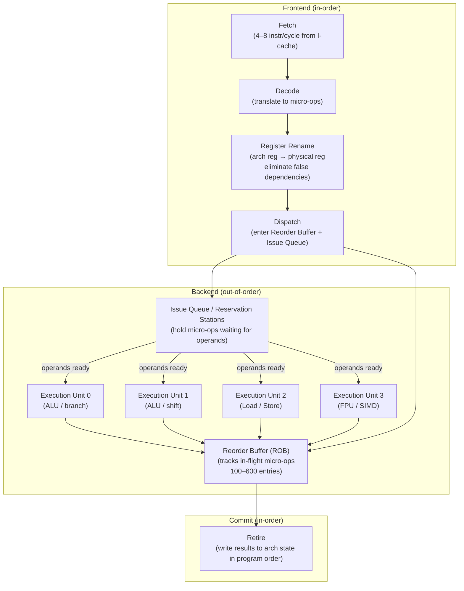

## In simple terms

Code is written as an ordered list of instructions, but they don't all take the same time — a memory load might take 300 cycles while an add takes 1. If the CPU ran instructions strictly in order, one slow load would block everything behind it, even instructions that don't depend on it. **Out-of-order execution** lets the CPU run instructions *as soon as their inputs are available*, in whatever order that happens to be, then quietly puts the results back into the original program order. The program behaves exactly as written — it just runs much faster.

## The Visual Map



## More detail

The CPU maintains a pool of pending instructions and tracks the **data dependencies** between them. An instruction becomes eligible to execute the moment its operands are ready, regardless of where it sits in the program. The classic mechanism (Tomasulo's algorithm, 1967) uses:

- **Register renaming** — maps the handful of architectural registers (16 for x86-64) onto a much larger pool of physical registers (280–600 entries in modern CPUs). This eliminates *false dependencies* — WAW (write-after-write) and WAR (write-after-read) — where two unrelated instructions reuse the same register name but don't logically depend on each other.
- **Reservation stations / Issue Queue** — hold decoded micro-ops waiting for their source operands. As each operand is computed, the result is broadcast to all reservation stations watching for it; a micro-op becomes "ready" when all its operands have arrived.
- **Reorder Buffer (ROB)** — every dispatched micro-op gets a slot in the ROB in program order. Instructions execute out of order but **retire** (commit their results to architectural state) strictly in ROB order, preserving the illusion of sequential execution and allowing precise exceptions.

This is what makes a modern core superscalar in practice: it can have 400–600 instructions in flight simultaneously and dispatch 4–8 micro-ops per cycle to multiple execution units. It pairs tightly with branch prediction — the CPU speculates past branches and fills the ROB with instructions from the predicted path, rolling back if the prediction was wrong.

The big payoff is hiding **memory latency**: while one instruction waits on a 300-cycle DRAM miss, dozens of independent instructions behind it can execute. The memory stall is absorbed rather than serialised.

**Limits to OoO:**

- **True data dependencies (RAW)** — instruction B genuinely needs instruction A's result. No renaming can help; B must wait.
- **ROB capacity** — when all ROB slots are full (typically because the oldest instruction is waiting on a cache miss), the frontend stalls. This is the "ROB full" stall.
- **Memory-order constraints** — loads and stores to potentially overlapping addresses must be ordered correctly; the memory ordering buffer (MOB) tracks this conservatively.

## Under the Hood

A Python simulation showing how OoO re-orders a small instruction window:

```python
#!/usr/bin/env python3
"""Simulate out-of-order execution with register renaming and a ROB."""

import collections

class OoOSim:
    def __init__(self, latencies):
        """latencies: dict of op -> cycles (e.g. 'LOAD'->4, 'ADD'->1)"""
        self.lat = latencies
        self.phys = {}   # physical register file: phys_id -> value
        self.rat  = {}   # register alias table: arch_reg -> phys_id
        self.next_phys = 0
        self.rob  = collections.deque()
        self.ready_at = {}  # phys_id -> cycle it becomes ready
        self.cycle = 0

    def _alloc_phys(self):
        p = self.next_phys
        self.next_phys += 1
        return p

    def issue(self, op, dest, src_regs):
        p_dest = self._alloc_phys()
        # Rename sources
        src_ready = [self.ready_at.get(self.rat.get(r, -1), 0) for r in src_regs]
        execute_at = max(self.cycle, max(src_ready, default=0))
        finish_at  = execute_at + self.lat.get(op, 1)
        self.rat[dest] = p_dest
        self.ready_at[p_dest] = finish_at
        self.rob.append((op, dest, p_dest, execute_at, finish_at))
        print(f"  cycle {self.cycle:2d}  ISSUE  {op:5s} {dest} ← {src_regs or []}  "
              f"executes @{execute_at}  ready @{finish_at}  phys=r{p_dest}")
        self.cycle += 1

    def retire_all(self):
        print("\n  Retirement order (program order):")
        while self.rob:
            op, dest, pdest, exe, fin = self.rob.popleft()
            print(f"    {op:5s} {dest} → phys r{pdest}  executes @{exe}  done @{fin}")

sim = OoOSim(latencies={"LOAD": 4, "ADD": 1, "MUL": 3, "STORE": 1})

# Program (in order):
#   r0 = LOAD [mem_a]       (4-cycle latency)
#   r1 = LOAD [mem_b]       (4-cycle latency, independent of r0)
#   r2 = r0 + r1            (depends on both LOADs)
#   r3 = r2 * r2            (depends on ADD)
#   STORE r3 -> [mem_c]     (depends on MUL)

print("Issuing instructions (in program order):\n")
sim.issue("LOAD",  "r0", [])
sim.issue("LOAD",  "r1", [])          # independent — executes in parallel
sim.issue("ADD",   "r2", ["r0","r1"]) # waits for both LOADs (4 cycles)
sim.issue("MUL",   "r3", ["r2"])      # waits for ADD (4+1 = cycle 5 → +3)
sim.issue("STORE", "--", ["r3"])      # waits for MUL
sim.retire_all()
print(f"\n  Total critical-path latency: {sim.ready_at[sim.next_phys-2]} cycles")
print(f"  In-order would take: 4+4+1+3+1 = 13 cycles")
print(f"  OoO collapses the two parallel LOADs to 4 cycles total")
```

## Engineering Trade-offs

**ROB size vs. die area and power**
Larger ROBs allow more in-flight instructions, hiding more memory latency (longer-latency misses can be tolerated before the ROB fills). Apple M1/M2 has a ~630-entry ROB — one of the largest in the industry — which allows extremely deep speculation. Intel Golden Cove: ~512 entries. AMD Zen 4: ~320 entries. The ROB is an associative structure that must be read and written every cycle; each entry adds area and power. Diminishing returns set in around 400–600 entries because real instruction-level parallelism (ILP) in most code is limited.

**Speculation depth vs. misprediction cost**
The CPU speculates past branches, filling the ROB with instructions from the predicted path. If prediction was wrong, the entire speculative segment of the ROB must be flushed and re-executed — 15–20 cycles on a deep pipeline. Deeper OoO (larger ROB) means more instructions to flush on a mispredict. This is why branch prediction accuracy is as important as predictor latency.

**Register renaming complexity vs. false dependency elimination**
Register renaming eliminates WAW and WAR hazards. But the rename stage must allocate a physical register for every dispatched instruction and free it on retirement — a complex allocation problem under the timing constraint of the pipeline clock. Modern implementations use a free list and a freeing mechanism tied to ROB retirement.

**OoO vs. in-order cores (efficiency vs. power)**
In-order cores (ARM Cortex-A55, RISC-V Rocket) are 10–20× simpler to implement, consume 5–10× less power per instruction, and have fully predictable timing (critical for real-time systems). OoO cores achieve 2–4× higher IPC but consume 3–10× more power. The big.LITTLE / DynamIQ design places both on the same chip — run the OoO core for bursts, the in-order core for sustained background work.

**Security: speculative execution side channels**
OoO CPUs execute instructions speculatively and then squash them if the speculation was wrong — but squashed instructions still leave microarchitectural side effects (cache lines loaded, TLB entries filled). Spectre exploits this: train the branch predictor to mispredict into attacker-controlled code that reads a secret, then infer the secret from cache timing. Every mitigation (IBRS, STIBP, retpolines, SSBD) disables or throttles some aspect of OoO/speculation. The performance cost is 5–30% for syscall-heavy workloads.

## Real-world examples

- **Apple M1 / M2 / M3** — the M2 has a 192-entry issue queue per cluster and a ~630-entry ROB; this extreme depth allows it to hide L3 latency that would stall smaller OoO cores, contributing to industry-leading single-thread IPC at 3.5 GHz.
- **Intel Pentium Pro (1995)** — the first mainstream x86 OoO processor. Its out-of-order engine (P6 architecture) remains the foundation of all Intel desktop CPUs through today.
- **Spectre (2018)** — variant 1 exploits branch prediction + OoO: the CPU executes a bounds-check bypass speculatively, loading a secret into a cache line. The attacker reads the cache state via a timing side channel. Every mainstream CPU needed microcode and OS patches.
- **ARM Cortex-A55 vs. A78** — A55 is an in-order dual-issue core; A78 is an OoO 4-wide core. The A78 achieves ~3× higher IPC in compute-bound benchmarks but uses ~3× more power — the classic big.LITTLE trade-off.
- **ROB full stall in database workloads** — a pointer-chasing hash table lookup creates a chain of dependent cache misses; the ROB fills while waiting for the load chain to resolve. On this workload, OoO provides minimal benefit because there are no independent instructions to execute behind the stall.

## Common misconceptions

- **"Out-of-order means my program runs in a different order."** The *observable* result is identical to in-order execution. Instructions retire (commit to architectural state, write to registers/memory, raise exceptions) strictly in program order. Only the internal execution overlaps — the program behaves as written.
- **"It's the compiler reordering instructions."** Compilers do statically reorder instructions (for in-order CPUs or to expose ILP to OoO). This is the *hardware* dynamically scheduling at runtime based on which operands are actually ready — two separate mechanisms that both improve throughput.
- **"OoO hides all memory latency."** OoO hides latency only when there are independent instructions to execute while waiting. A sequential pointer-chase (each load depends on the previous result) cannot be reordered — each load waits on the previous, and OoO provides no benefit.

## Try it yourself

Observe the difference between a dependency chain (OoO can't help) vs. independent work (OoO extracts parallelism):

```bash
python3 - << 'EOF'
import time

N = 10_000_000

# Chain: each iteration depends on the previous result
# (simulates a data dependency — OoO cannot parallelise)
def chain(n):
    x = 1
    for _ in range(n):
        x = x * 1 + 1   # x depends on previous x
    return x

# Independent: each iteration is self-contained
# (simulates independent work — OoO can overlap iterations)
def independent(n):
    a = b = c = d = 0
    for i in range(n):
        a += i; b += i; c += i; d += i
    return a + b + c + d

t0 = time.perf_counter(); chain(N);       chain_ms = (time.perf_counter()-t0)*1000
t0 = time.perf_counter(); independent(N); indep_ms = (time.perf_counter()-t0)*1000

print(f"Dependency chain:   {chain_ms:.0f} ms  (serial — OoO blocked by RAW hazard)")
print(f"Independent work:  {indep_ms:.0f} ms  (parallel — OoO executes simultaneously)")
print()
print("In C/assembly on a real OoO CPU, the independent version runs")
print("up to 4x faster because the OoO engine dispatches all 4 adds per cycle.")
print("Python's GIL and interpreter overhead compress the effect.")
EOF
```

## Learn next

- [CPU Pipeline](/t/cpu-pipeline) — OoO is a layer on top of the basic pipeline; understanding fetch/decode/execute/retire stages is the prerequisite for understanding where OoO slots in.
- [Speculative Execution](/t/speculative-execution) — OoO speculation past branches is the technique Spectre exploits; the security implications of speculative state are covered there in depth.
- [Superscalar](/t/superscalar) — issuing multiple instructions per cycle (4–8 wide dispatch) is the width dimension that OoO fills; the two techniques are inseparable in modern high-performance cores.
- [SIMD](/t/simd) — another form of instruction-level parallelism complementary to OoO: instead of running multiple different instructions simultaneously, SIMD runs one instruction on multiple data values.
