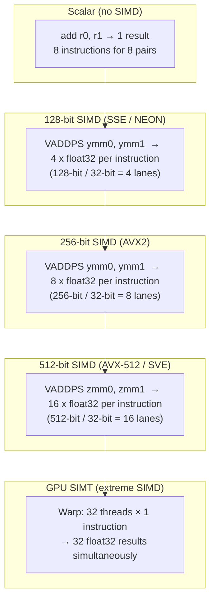

## In simple terms

Normally a CPU instruction does one thing to one piece of data: add these two numbers. **SIMD** — Single Instruction, Multiple Data — lets a single instruction do the *same* operation to a whole batch of numbers simultaneously: add these *eight* pairs of numbers in one shot. When you have to do the same arithmetic to thousands of elements — pixels in an image, samples in audio, weights in a neural network — SIMD does it in a fraction of the instructions, and a fraction of the time.

## The Visual Map



## More detail

SIMD works on **vector registers** — wide registers (128, 256, or 512 bits) that hold several values packed together. A 256-bit AVX register can hold eight 32-bit floats; one `VADDPS` instruction adds two such registers element-wise, producing eight results at once. This is **data parallelism**: one instruction stream, many data lanes.

**CPU SIMD extensions:**

| ISA | Extension | Width | Float lanes | Integer lanes |
|---|---|---|---|---|
| x86 | SSE2 (1999) | 128-bit | 4 × f32 | 16 × i8 |
| x86 | AVX (2011) | 256-bit | 8 × f32 | — (int added in AVX2) |
| x86 | AVX2 (2013) | 256-bit | 8 × f32 | 32 × i8 |
| x86 | AVX-512 (2016) | 512-bit | 16 × f32 | 64 × i8 |
| ARM | NEON (2004) | 128-bit | 4 × f32 | 16 × i8 |
| ARM | SVE (2016) | variable 128–2048-bit | scalable | scalable |
| RISC-V | RVV (2021) | variable | scalable | scalable |

**Three ways to use SIMD:**

1. **Auto-vectorisation** — the compiler detects a loop doing uniform work and emits vector instructions automatically. Works well for simple loops with no data dependencies, no branches, aligned memory. Produces warnings (`-fopt-info-vec`) when it fails.
2. **Intrinsics** — C/C++ functions that map 1:1 to SIMD instructions (`_mm256_add_ps`, `vaddq_f32`). Full control, very verbose. Standard approach in performance-critical libraries.
3. **Libraries** — BLAS (matrix multiply), libjpeg-turbo, x264/x265, OpenCV, NumPy's linalg — already SIMD-optimised with runtime CPU feature detection.

**Requirements for effective SIMD:**

- **Uniform operations** — all lanes must do the same op (no data-dependent branching across lanes).
- **Alignment** — 256-bit loads are fastest when the base address is 32-byte aligned; misaligned loads may be split into two operations.
- **Contiguous memory** — scatter/gather loads (non-contiguous elements) exist (`_mm256_i32gather_ps`) but are much slower than contiguous vector loads.
- **No cross-lane dependencies** — a horizontal sum `(a[0]+a[1]+a[2]+...)` requires multiple permutation instructions because lanes can't talk to each other cheaply.

SIMD is distinct from multithreading (many cores doing different work) — it is parallelism *within* a single instruction stream. It is also the conceptual ancestor of how a GPU works, taken to an extreme (thousands of parallel lanes per warp).

## Under the Hood

NumPy uses SIMD automatically; here's what it looks like underneath — scalar Python vs. NumPy vector operations:

```python
#!/usr/bin/env python3
"""Compare scalar loop vs NumPy (SIMD-backed) vector ops."""
import time
import array as arr

try:
    import numpy as np
    HAS_NUMPY = True
except ImportError:
    HAS_NUMPY = False
    print("Install numpy for the full demo: pip install numpy")

N = 10_000_000

# --- Scalar Python loop ---
a_list = [float(i) for i in range(N)]
b_list = [float(i) * 0.5 for i in range(N)]

t0 = time.perf_counter()
c_scalar = [a_list[i] + b_list[i] for i in range(N)]
scalar_ms = (time.perf_counter() - t0) * 1000
print(f"Scalar Python loop: {scalar_ms:.0f} ms")

if HAS_NUMPY:
    # --- NumPy (AVX2/AVX-512 under the hood) ---
    a_np = np.arange(N, dtype=np.float32)
    b_np = np.arange(N, dtype=np.float32) * 0.5

    # Warmup
    _ = a_np + b_np

    t0 = time.perf_counter()
    c_np = a_np + b_np
    numpy_ms = (time.perf_counter() - t0) * 1000
    print(f"NumPy (SIMD-backed): {numpy_ms:.1f} ms")
    print(f"Speedup: {scalar_ms / numpy_ms:.0f}x")
    print()
    print(f"NumPy processed {N * 4 / 1e9:.1f} GB of float32 data")
    bw = N * 4 * 2 / numpy_ms / 1e6  # read a+b, write c
    print(f"Effective memory bandwidth: {bw:.0f} GB/s (limited by RAM/cache speed)")
```

## Engineering Trade-offs

**SIMD register width vs. frequency throttling**
AVX-512 uses 512-bit zmm registers. On some Intel chips (Skylake-X, Ice Lake), activating AVX-512 triggers a CPU frequency downshift ("heavy AVX penalty") because the execution units draw more power at full 512-bit width. A program running AVX-512 might clock 300–400 MHz lower than a program using SSE. For short bursts, the vectorisation gain outweighs the frequency loss; for sustained workloads, the crossover depends on the workload's compute-to-memory ratio.

**Auto-vectorisation vs. manual intrinsics**
Auto-vectorisation with `-O3 -march=native` handles simple loops well. But it fails silently on: loops with unknown trip counts at compile time, loops with pointer aliasing the compiler can't disprove, loops with branches, or loops reading non-contiguous memory. Manual intrinsics give full control but are ISA-specific (AVX2 intrinsics don't compile for ARM). Libraries like Highway (Google) and xsimd abstract over x86 + ARM SIMD with portable wrappers.

**Struct-of-Arrays (SoA) vs. Array-of-Structs (AoS)**
`struct Point { float x, y, z; }` stored as `Point points[N]` is AoS: x values are 12 bytes apart (x, y, z interleaved). To SIMD-add all x values, every third float must be gathered — expensive. SoA (`float xs[N]; float ys[N]; float zs[N]`) stores x values contiguously — a single aligned load fills a SIMD register with 8 x-values. Hot-path numerical code almost always prefers SoA.

**Lane count vs. tail handling**
A loop of N elements with 8-wide AVX2: process `N / 8 * 8` elements with SIMD, then the remaining `N % 8` elements scalar. If N is frequently not a multiple of 8 (small matrices, dynamic sizes), the tail scalar loop can dominate. Techniques: masked loads (AVX-512 has native mask registers), loop peeling, or padding arrays to a multiple of the vector width.

**SIMD on CPUs vs. SIMD on GPUs**
CPU AVX-512: 16 lanes of float32 per core. A 32-core server does 512 simultaneous float32 adds per cycle. A single NVIDIA A100 GPU: 6912 CUDA cores × 2 FMA ops/cycle = ~13.8 TFLOP/s at 1.4 GHz. GPU "SIMT" is SIMD taken to 32-wide warps across thousands of cores — the same principle, 1000× the parallelism. For data-parallel numerical work, GPU SIMD wins at batch scale; CPU SIMD wins for latency-sensitive single-record work.

## Real-world examples

- **simdjson** — a JSON parser that uses AVX2 to validate and tokenise JSON at ~3 GB/s, compared to ~0.5 GB/s for scalar parsers. The key insight: UTF-8 validation and structural character scanning can be done 32 bytes at a time with bitmasking intrinsics.
- **NumPy / PyTorch / TensorFlow** — all call BLAS (OpenBLAS, MKL, cuBLAS) under the hood. BLAS `DGEMM` (double-precision matrix multiply) uses AVX-512 FMA units to achieve 75%+ of peak theoretical FLOP/s on CPUs.
- **x264 / x265 video encoders** — the DCT (discrete cosine transform) and motion search inner loops are hand-coded in assembly with SSE4/AVX2. SIMD makes real-time 4K encoding possible on a single CPU core.
- **Linux `memcpy`** — glibc's `memcpy` on x86 uses `REP MOVSB` (which the CPU internally executes as wide SIMD copies) or explicit AVX2 instructions depending on size and alignment; a simple `memcpy(dst, src, 1<<20)` runs at 50+ GB/s.
- **ARM SVE on AWS Graviton 3** — SVE is a scalable SIMD: vector length is not fixed at compile time. The same binary runs on 128-bit and 512-bit SVE hardware without recompilation, making it more portable than AVX-512.

## Common misconceptions

- **"SIMD is the same as multi-core parallelism."** Multi-core runs independent instruction streams on different cores. SIMD applies one instruction to many data elements within one core. They are orthogonal — you can use both.
- **"The compiler always vectorises my loops."** Auto-vectorisation is fragile. Data dependencies, pointer aliasing, branch divergence, and non-contiguous memory access all prevent it. Performance-critical numerical code is often manually vectorised or written in a library that already is.
- **"Wider is always faster."** AVX-512 (16 float lanes) is not always 2× faster than AVX2 (8 float lanes). Frequency throttling, memory bandwidth limits, and the overhead of handling unaligned tail elements can make AVX2 faster in practice for many workloads.

## Try it yourself

Measure scalar vs. NumPy SIMD performance on an element-wise operation:

```bash
python3 - << 'EOF'
import time

N = 5_000_000

try:
    import numpy as np

    a = np.random.rand(N).astype('float32')
    b = np.random.rand(N).astype('float32')
    _ = a + b  # warmup JIT

    t0 = time.perf_counter()
    for _ in range(10):
        c = a * b + a
    numpy_ms = (time.perf_counter() - t0) / 10 * 1000

    # Scalar loop (Python list)
    a_list = a.tolist()
    b_list = b.tolist()
    t0 = time.perf_counter()
    c_scalar = [a_list[i] * b_list[i] + a_list[i] for i in range(N)]
    scalar_ms = (time.perf_counter() - t0) * 1000

    print(f"Scalar Python:  {scalar_ms:.0f} ms")
    print(f"NumPy (SIMD):   {numpy_ms:.1f} ms")
    print(f"Speedup:        {scalar_ms/numpy_ms:.0f}x")
    print()
    print(f"NumPy data size: {N*4*2/1e6:.0f} MB read + {N*4/1e6:.0f} MB write")

except ImportError:
    print("numpy not available — install with: pip install numpy")
    print("Demonstrating the SIMD concept with array module instead:")
    import array
    a = array.array('f', [float(i) for i in range(N)])
    t0 = time.perf_counter()
    c = array.array('f', (a[i] * a[i] for i in range(N)))
    print(f"array module scalar: {(time.perf_counter()-t0)*1000:.0f} ms for {N} multiplies")
EOF
```

## Learn next

- [Instruction Set](/t/instruction-set) — SIMD is an extension of the CPU's ISA; understanding instruction encoding and register organisation is the prerequisite for understanding how vector registers fit in.
- [GPU](/t/gpu) — takes the same data-parallel idea to an extreme: thousands of "SIMT" lanes rather than 8–16; the GPU's warp model is SIMD taken to datacenter scale.
- [Cache](/t/cache) — SIMD performance is often memory-bound; the 8× arithmetic speedup from AVX2 is only realised if data arrives from L1 cache fast enough to feed the execution units.
- [Out-of-Order Execution](/t/out-of-order-execution) — complements SIMD; OoO runs multiple SIMD instructions simultaneously when their inputs are independent, multiplying the effective throughput.
