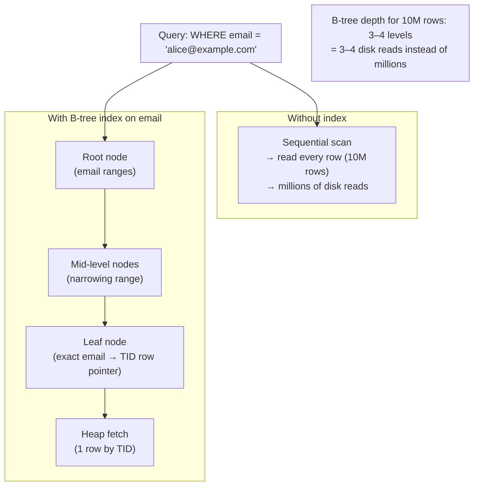

## In simple terms

An **index** is a separate, sorted copy of one or more columns that a database keeps so it can find rows quickly. Without it, "find the user with email X" means reading every row. With it, the lookup is logarithmic — typically a handful of disk reads instead of millions.

## The Visual Map



## More detail

The dominant on-disk index is a **B-tree** (or B+ tree): a wide, shallow, balanced tree that stays efficient even when individual disk reads are slow. Each interior node has hundreds of keys and pointers to child nodes for ranges of key values; a tree over 100 million rows is typically only 3–4 levels deep.

**Index types:**

| Type | Structure | Best for | Used in |
|---|---|---|---|
| **B-tree / B+ tree** | Sorted balanced tree | Equality + range queries, ORDER BY | PostgreSQL, MySQL, SQLite, Oracle |
| **Hash** | Hash table | Equality lookups only | PostgreSQL (explicit), MySQL MEMORY |
| **Bitmap** | One bit-array per distinct value | Low-cardinality analytical queries | Oracle, columnar stores |
| **GIN / Inverted** | Token → document set | Full-text search, JSONB, arrays | PostgreSQL GIN |
| **GiST / R-tree** | Bounding-box tree | Spatial/geometric queries | PostGIS, MySQL spatial |
| **Vector (HNSW/IVF)** | Approximate graph / cluster | Nearest-neighbour embeddings | pgvector, Pinecone, Qdrant |

**Key concepts:**

- **Clustered (primary) index** — the table's data rows are physically stored in index order. In MySQL/InnoDB, the primary key is always clustered. A clustered index makes range scans on the primary key very fast.
- **Non-clustered (secondary) index** — stores index key + pointer (row ID / primary key value). Requires a second lookup to fetch the full row ("heap fetch" in PostgreSQL, "bookmark lookup" in SQL Server). Index-only scans avoid this if the index covers all requested columns.
- **Covering index** — an index that includes all columns a query needs; the heap fetch can be skipped. `CREATE INDEX idx ON orders(customer_id, created_at) INCLUDE (total)` covers `SELECT created_at, total FROM orders WHERE customer_id = ?`.
- **Partial index** — indexes only a subset of rows matching a condition. `CREATE INDEX idx ON users(email) WHERE active = TRUE` — smaller, faster, doesn't index inactive users.
- **Composite index** — multiple columns. Column order matters: `(country, created_at)` answers `WHERE country = ? AND created_at > ?` but not `WHERE created_at > ?` alone (the leftmost column must be constrained first).

**Index costs:**
- **Write amplification** — every INSERT/UPDATE/DELETE must update each relevant index. A table with 10 indexes has 10× the write cost of an unindexed one.
- **Storage** — a B-tree index on a TEXT column can equal or exceed the table's own size.
- **Maintenance** — B-tree pages fragment over time from updates; `REINDEX` or `VACUUM FULL` reclaims space. LSM-based storage (RocksDB) uses compaction instead.

The art is picking exactly the indexes your queries need and no more. A single composite index on `(customer_id, created_at)` can answer many queries; ten single-column indexes often serve none of them well.

## Under the Hood

How a B-tree index works at the page level — each node is a disk page (~8 KB), holding many keys:

```python
#!/usr/bin/env python3
"""Simplified B-tree index lookup simulation."""

import math

class BTreeNode:
    def __init__(self, keys, children=None, is_leaf=False):
        self.keys     = keys
        self.children = children or []
        self.is_leaf  = is_leaf

    def search(self, target):
        """Find the child subtree or leaf entry for target."""
        for i, k in enumerate(self.keys):
            if target <= k:
                return i, k
        return len(self.keys), None

def btree_lookup(root, target, depth=0):
    """Walk from root to leaf, counting node accesses (disk reads)."""
    node = root
    reads = 0

    while True:
        reads += 1  # one disk read per node
        i, key = node.search(target)

        if node.is_leaf:
            found = key == target
            print(f"  {'  ' * depth}Leaf: keys={node.keys[:5]}...  "
                  f"target={target} → {'FOUND' if found else 'NOT FOUND'}")
            return found, reads

        print(f"  {'  ' * depth}Node level {depth}: keys={node.keys}  → descend to child[{i}]")
        node = node.children[i]
        depth += 1

# Build a tiny 3-level B-tree (order 4: up to 4 keys per node)
leaves = [
    BTreeNode([100, 200, 300, 400], is_leaf=True),
    BTreeNode([500, 600, 700, 800], is_leaf=True),
    BTreeNode([900, 1000, 1100, 1200], is_leaf=True),
    BTreeNode([1300, 1400, 1500, 1600], is_leaf=True),
]
mid = [
    BTreeNode([400, 800], children=[leaves[0], leaves[1]]),
    BTreeNode([1200, 1600], children=[leaves[2], leaves[3]]),
]
root = BTreeNode([800], children=[mid[0], mid[1]])

for target in [300, 750, 1100]:
    print(f"\nSearching for key={target}:")
    found, reads = btree_lookup(root, target)
    print(f"  → Result: {found} ({reads} disk reads)")

# Scale: real tables
for n_rows in [1_000, 1_000_000, 100_000_000]:
    depth = math.ceil(math.log(n_rows, 400))  # ~400 keys per 8KB B-tree page
    print(f"  {n_rows:>12,} rows → B-tree depth ≈ {depth} (= {depth} disk reads)")
```

## Engineering Trade-offs

**Index selectivity vs. usefulness**
A query optimizer uses an index when it's selective — the fraction of rows matching the index condition is small (< 5–15%). An index on a column with 2 distinct values (boolean `is_active`) returns 50% of the table — the planner often prefers a sequential scan. High-cardinality columns (email, UUID, user ID) are ideal index candidates.

**Composite index column order vs. query coverage**
The leftmost column in a composite index must appear in the WHERE clause for the index to be used at all. `(country, city)` can satisfy `WHERE country = ?` and `WHERE country = ? AND city = ?`, but not `WHERE city = ?`. Designing for the most common queries means ordering columns by decreasing selectivity and decreasing query frequency. This is the "composite index left-prefix rule" — understanding it eliminates most "why isn't my index being used?" questions.

**Write throughput vs. index count**
Each additional index adds ~10–30% write latency on an OLTP table with millions of rows. For a high-write workload (100K inserts/sec), a table with 8 indexes may be limited to 50K inserts/sec by index maintenance overhead. Index removal (or deferring index updates with deferred B-tree builds in OLAP loads) restores throughput. The trade-off: maintain fewer, targeted indexes on write-heavy tables; add covering indexes for read-heavy analytics replicas.

**Index-only scan vs. heap fetch**
After finding matching row IDs in an index, a secondary (non-clustered) index must fetch the full row from the heap. In PostgreSQL, this is a "heap fetch" — a random I/O for each matching row. If many rows match, random I/O to the heap can be slower than a sequential scan. The `INCLUDE` clause (PostgreSQL 11+) allows adding non-indexed columns to the leaf pages, making index-only scans possible without touching the heap.

**Online vs. offline index builds**
Creating an index on a large table with `CREATE INDEX` locks the table (in many databases). `CREATE INDEX CONCURRENTLY` (PostgreSQL) builds the index without a write lock, allowing concurrent DML — but takes 2–3× longer and uses more resources. For tables receiving constant writes, concurrent builds are essential. The temporary duplicate storage during the build requires 2× the index's final size on disk during construction.

## Real-world examples

- **GitHub pull requests** — GitHub's pull request queries are dominated by `WHERE repo_id = ? AND state = 'open' ORDER BY created_at DESC`. The composite index `(repo_id, state, created_at)` covers all three conditions, making pagination queries submillisecond even on tables with 100M+ rows.
- **PostgreSQL `EXPLAIN ANALYZE`** — the single most important tool for index debugging. Adding `EXPLAIN (ANALYZE, BUFFERS)` to any slow query shows whether an index is used, its actual vs. estimated row count, and how many buffer cache hits vs. disk reads occurred.
- **MongoDB partial index** — `db.users.createIndex({email: 1}, {partialFilterExpression: {active: {$eq: true}}})` creates an index only for active users. If 90% of users are inactive, this is 10× smaller and 10× faster to maintain than a full email index.
- **Elasticsearch inverted index** — stores a token → document_id mapping for every unique word. "Posts containing both 'rust' and 'memory'" is an intersection of two posting lists — O(number of results), not O(number of documents).
- **Cassandra's lack of secondary indexes** — Cassandra optimises for write throughput by avoiding secondary indexes. Queries must be designed around the primary partition key; "query-first" schema design means denormalising data into multiple tables for different access patterns.

## Common misconceptions

- **"More indexes = faster database."** Reads get faster; writes get slower; storage grows; query planning becomes more complex (the planner must consider more plans). Add an index only if a query you care about is slower than acceptable and `EXPLAIN` shows a sequential scan on a large table.
- **"Indexes always help."** The query planner may skip an index if: the table is small (< ~1000 rows), the condition matches > ~10% of rows, or the index is too fragmented. Always verify with `EXPLAIN ANALYZE` before and after.
- **"The index is used because it exists."** SQL query planners use statistics (row count estimates, histogram buckets) to decide whether to use an index. Stale statistics (after a bulk load without ANALYZE) can cause the planner to make wrong decisions. Run `ANALYZE` after bulk changes.

## Try it yourself

Build a B-tree-backed index with SQLite and observe the execution plan before and after:

```bash
python3 - << 'EOF'
import sqlite3, time, random, string

conn = sqlite3.connect(':memory:')
c = conn.cursor()
c.execute('''CREATE TABLE logs (
    id       INTEGER PRIMARY KEY,
    user_id  INTEGER,
    action   TEXT,
    ts       INTEGER  -- unix timestamp
)''')

# Insert 500K rows
N = 500_000
rows = [(i, random.randint(1, 10000), random.choice(['login','logout','buy','view']),
         random.randint(1700000000, 1750000000)) for i in range(N)]
c.executemany('INSERT INTO logs VALUES (?,?,?,?)', rows)
conn.commit()

user = 42
start_ts = 1730000000

# Without index
t0 = time.perf_counter()
c.execute("SELECT action, ts FROM logs WHERE user_id=? AND ts>? ORDER BY ts",
          (user, start_ts))
r1 = c.fetchall()
no_idx = (time.perf_counter()-t0)*1000

print("EXPLAIN without index:")
for row in c.execute("EXPLAIN QUERY PLAN SELECT action, ts FROM logs WHERE user_id=? AND ts>?",
                     (user, start_ts)):
    print(" ", row)

# Create composite index
c.execute("CREATE INDEX idx_user_ts ON logs(user_id, ts)")
conn.commit()

t0 = time.perf_counter()
c.execute("SELECT action, ts FROM logs WHERE user_id=? AND ts>? ORDER BY ts",
          (user, start_ts))
r2 = c.fetchall()
idx_ms = (time.perf_counter()-t0)*1000

print("\nEXPLAIN with composite index (user_id, ts):")
for row in c.execute("EXPLAIN QUERY PLAN SELECT action, ts FROM logs WHERE user_id=? AND ts>?",
                     (user, start_ts)):
    print(" ", row)

print(f"\n{N:,} rows, user_id={user}, ts>{start_ts}:")
print(f"  Without index: {no_idx:.1f} ms  rows={len(r1)}")
print(f"  With index:    {idx_ms:.2f} ms  rows={len(r2)}")
print(f"  Speedup: {no_idx/max(idx_ms,0.01):.0f}x")
conn.close()
EOF
```

## Learn next

- [Query Plan](/t/query-plan) — how the database decides whether to use an index, which one, and in what order to join tables; `EXPLAIN ANALYZE` is the window into this decision.
- [Relational Model](/t/relational-model) — the mathematical foundation that makes B-tree indexes on primary and foreign keys naturally efficient; understanding keys and tuples informs index design.
- [Normalization](/t/normalization) — how schema design affects which indexes are needed; a well-normalised schema often has smaller, more selective index columns.
