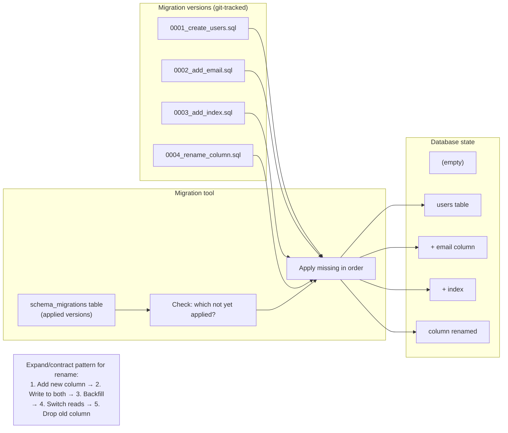

## In simple terms

A **schema migration** is a controlled change to the *structure* of a database — adding a table, adding or renaming a column, creating an index — applied in a repeatable, versioned way. As an application evolves, its database has to evolve with it, but the database is already full of real data you can't lose. Migrations are how teams change a live schema safely: each change is a small, ordered, reviewable script that can be applied to every environment (a developer's laptop, staging, production) and reproduced exactly.

## The Visual Map



## More detail

The core idea is to treat the schema like code: every change is a numbered, version-controlled **migration** that moves the database from one known state to the next. A migration tool keeps a record (a table like `schema_migrations` or `flyway_schema_history`) of which migrations have already run, so it knows exactly which to apply next.

**Key migration practices:**

- **Forward-only, ordered scripts** — migrations run in sequence; the tool tracks the current version. Each migration runs exactly once. Rolling back is usually rolling *forward* with a corrective migration, not `down`.
- **Additive, backward-compatible changes** — to deploy without downtime, make changes the *old* code can still tolerate:
  - ✅ Add a nullable column (old code ignores it)
  - ✅ Add a new table (old code doesn't use it)
  - ✅ Add an index (`CONCURRENTLY` in PostgreSQL avoids locking)
  - ⚠️ Add a NOT NULL column without a default (blocks inserts from old code)
  - ⚠️ Rename a column (old code uses the old name — it will break)
  - ❌ Drop a column while old code still references it
- **Backfills** — populating a new column for existing rows, typically as a separate batched job that updates rows in small chunks to avoid long table locks.
- **Expand/contract pattern for zero-downtime renames:** add the new column (expand) → write to both old and new → backfill → switch reads to new → drop old (contract). Each step is a separate deploy.

**Common migration tools:**

| Tool | Ecosystem | Style |
|---|---|---|
| Django migrations | Python/Django | Auto-generated from model diff |
| Alembic | Python/SQLAlchemy | Auto + manual SQL |
| Rails Active Record | Ruby/Rails | Auto-generated |
| Flyway | Java / any | SQL files numbered by version |
| Liquibase | Java / any | XML/YAML/SQL changeset format |
| Prisma Migrate | TypeScript | Schema DSL → generated SQL |
| golang-migrate | Go | SQL files |
| Sqitch | Any | SQL + deploy/revert/verify scripts |

**Dangerous `ALTER TABLE` operations:**
In PostgreSQL, `ALTER TABLE ADD COLUMN` with a DEFAULT requires rewriting every row (pre-PG 11); PG 11+ stores the default in metadata and avoids the rewrite. `ALTER TABLE ADD COLUMN NOT NULL` without a default is still dangerous — it requires scanning the table to verify no nulls. `RENAME COLUMN` is metadata-only but breaks running application code that uses the old name.

## Under the Hood

A minimal Python migration runner with schema_migrations table tracking:

```python
#!/usr/bin/env python3
"""Mini migration runner: versioned SQL files applied once, in order."""
import sqlite3

conn = sqlite3.connect(':memory:')
conn.execute('''CREATE TABLE IF NOT EXISTS schema_migrations (
    version TEXT PRIMARY KEY,
    applied_at TEXT DEFAULT (datetime('now'))
)''')
conn.commit()

# Simulated migration history (SQL statements per version)
MIGRATIONS = [
    ("0001_create_users", '''
        CREATE TABLE users (
            id INTEGER PRIMARY KEY,
            name TEXT NOT NULL,
            created_at TEXT DEFAULT (datetime('now'))
        )
    '''),
    ("0002_add_email", '''
        ALTER TABLE users ADD COLUMN email TEXT
    '''),
    ("0003_add_index", '''
        CREATE INDEX IF NOT EXISTS idx_email ON users(email)
    '''),
    ("0004_add_active_flag", '''
        ALTER TABLE users ADD COLUMN active INTEGER DEFAULT 1
    '''),
]

def get_applied():
    return {row[0] for row in conn.execute("SELECT version FROM schema_migrations")}

def migrate():
    applied = get_applied()
    pending = [(v, sql) for v, sql in MIGRATIONS if v not in applied]
    if not pending:
        print("All migrations already applied.")
        return
    for version, sql in pending:
        try:
            conn.execute(sql)
            conn.execute("INSERT INTO schema_migrations (version) VALUES (?)", (version,))
            conn.commit()
            print(f"  Applied: {version}")
        except Exception as e:
            conn.rollback()
            print(f"  FAILED:  {version} — {e}")
            break

print("First run (from scratch):")
migrate()
print("\nSecond run (idempotent — nothing to do):")
migrate()

# Show current schema state
print("\nCurrent tables:")
for row in conn.execute("SELECT name FROM sqlite_master WHERE type='table' ORDER BY name"):
    print(f"  {row[0]}")
print("\nApplied migrations:")
for row in conn.execute("SELECT version, applied_at FROM schema_migrations ORDER BY version"):
    print(f"  {row[0]}  ({row[1]})")

# Show the resulting schema
print("\nusers table columns:")
for row in conn.execute("PRAGMA table_info(users)"):
    print(f"  col={row[1]}  type={row[2]}  notnull={row[3]}  default={row[4]}")
conn.close()
```

## Engineering Trade-offs

**Migration atomicity vs. long-running statements**
Each migration should be a transaction so a failure is safe to retry. However, some DDL operations can't run in a transaction (MySQL DDL is auto-committed; some PostgreSQL operations like `CREATE INDEX CONCURRENTLY` can't run in a transaction). For these, the migration must be idempotent — designed to be run safely more than once (`CREATE TABLE IF NOT EXISTS`, `CREATE INDEX IF NOT EXISTS`).

**Zero-downtime vs. migration complexity**
A single-step column rename is simple but requires downtime (old code breaks immediately). A zero-downtime rename takes 4–5 steps spread across multiple deploys. The question is always: is the downtime window acceptable, or does the business require continuous availability? For most SaaS products, the zero-downtime path is required — which multiplies migration complexity.

**`ALTER TABLE` locking**
`ALTER TABLE ADD COLUMN` in PostgreSQL 11+ (without a NOT NULL constraint and without a volatile default) is fast (metadata-only). But `ALTER TABLE ADD COLUMN NOT NULL DEFAULT now()` (volatile default) rewrites every row, taking an ACCESS EXCLUSIVE lock for the duration — blocking all reads and writes. The safe pattern: add the column as nullable (fast), backfill in batches, then add the NOT NULL constraint with `NOT VALID` and validate separately. `ADD CONSTRAINT ... NOT VALID` + `VALIDATE CONSTRAINT` splits the lock.

**Backfill safety vs. throughput**
Backfilling a new column across 100M rows: doing it in one UPDATE locks the table. Batched backfills (1000 rows per transaction with a brief sleep between batches) are safe but slow — may take hours. For very large tables, backfills run in a background job during off-peak hours with monitoring; the migration that creates the column lands first, the backfill runs separately, and the NOT NULL constraint is added after all rows have values.

**Rollback vs. roll-forward**
Most migration tools support a `down` rollback. In practice, rolling back a production database is risky: the `down` migration may not be tested, may destroy data, and may not be possible for irreversible changes (dropping a column, truncating). The safer approach is roll-forward: write a new migration that corrects the bad one. This is also why additive changes (never drop until the next deploy) are preferred in production migrations.

## Real-world examples

- **Stripe's continuous migration process** — Stripe publishes articles on their database migration discipline: each migration lands in a separate deploy from the code that uses the new schema, using expand/contract for all breaking changes. They use custom tooling that enforces backward-compatibility analysis before a migration is approved.
- **GitHub's `gh-ost` for MySQL** — `gh-ost` (GitHub Online Schema Toolkit) performs online schema changes on large MySQL tables without locking: it creates a shadow table, applies changes to the shadow, uses binlog replication to keep it in sync, then atomically swaps the tables. Used by GitHub on tables with 1B+ rows.
- **Django's `./manage.py migrate`** — Django auto-generates migrations from model diffs with `makemigrations`. The generated migration is a Python file with `operations = [AddField(...), CreateIndex(...)]`. Django's migration framework handles dependency ordering (if Migration B adds a ForeignKey to a table created by Migration A, B depends on A).
- **Flyway at financial institutions** — many financial institutions use Flyway because it is explicit SQL (no magic ORM-generated DDL) and audit-friendly: every migration is a numbered SQL file that a DBA can review. The `flyway_schema_history` table records the checksum of each applied migration — if a migration file is modified after running, Flyway detects the mismatch and refuses to proceed.
- **Zero-downtime at Shopify** — Shopify runs the Rails `strong_migrations` gem, which raises a development error for any migration that would lock a table in production — e.g., adding a column with a non-null default in MySQL < 8. The gem forces developers to write the safe multi-step version.

## Common misconceptions

- **"A migration is just running an `ALTER TABLE`."** The SQL is the easy part; the discipline — ordering, versioning, zero-downtime sequencing, backfills, and atomicity — is what makes it a migration rather than a risky one-off edit.
- **"Migrations are reversible."** Some are (adding a column is reversible by dropping it), but many are not (dropping a column destroys data; renaming requires multi-step expand/contract). Production practice leans on rolling *forward* with a corrective migration rather than assuming you can undo.
- **"You can `ALTER TABLE` a large production table directly."** On a 1-billion-row table, `ALTER TABLE ADD COLUMN NOT NULL DEFAULT x` may lock the table for 10+ minutes. Tools like `gh-ost` (MySQL), `pg_repack` (PostgreSQL), or the `CONCURRENTLY` keyword for index creation exist specifically to handle large-table DDL without locking.

## Try it yourself

Run a sequence of versioned migrations with a tracking table:

```bash
python3 - << 'EOF'
import sqlite3

conn = sqlite3.connect(':memory:')
conn.execute("CREATE TABLE migrations_log (version TEXT PRIMARY KEY, applied_at TEXT DEFAULT (datetime('now')))")
conn.commit()

migrations = [
    ("v001", "CREATE TABLE products (id INTEGER PRIMARY KEY, name TEXT, price REAL)"),
    ("v002", "ALTER TABLE products ADD COLUMN category TEXT"),
    ("v003", "CREATE INDEX IF NOT EXISTS idx_cat ON products(category)"),
    ("v004", "ALTER TABLE products ADD COLUMN active INTEGER DEFAULT 1"),
]

applied = {r[0] for r in conn.execute("SELECT version FROM migrations_log")}

for version, sql in migrations:
    if version in applied:
        print(f"skip  {version} (already applied)")
        continue
    try:
        conn.execute(sql)
        conn.execute("INSERT INTO migrations_log(version) VALUES (?)", (version,))
        conn.commit()
        print(f"apply {version}")
    except Exception as e:
        conn.rollback()
        print(f"ERROR {version}: {e}")
        break

# Insert test data to verify schema is correct
conn.execute("INSERT INTO products VALUES (1,'Widget',9.99,'tools',1)")
conn.execute("INSERT INTO products VALUES (2,'Gadget',19.99,'electronics',1)")
conn.commit()

print("\nproducts after all migrations:")
for r in conn.execute("SELECT * FROM products"):
    print(f"  {dict(zip(['id','name','price','category','active'], r))}")

print("\nMigration log:")
for r in conn.execute("SELECT version, applied_at FROM migrations_log"):
    print(f"  {r[0]}  {r[1]}")
conn.close()
EOF
```

## Learn next

- [Normalization](/t/normalization) — schema design principles that migrations implement over time; understanding 3NF explains why migrations tend to add tables (introducing new entities) rather than adding columns to existing ones.
- [Transaction ACID](/t/transaction-acid) — each migration ideally runs inside a transaction; atomicity guarantees that a failed migration leaves the schema in the previous valid state rather than a half-applied intermediate.
- [ORM](/t/orm) — ORM migration generators (Django `makemigrations`, Alembic `autogenerate`) automate migration creation from model changes; the ORM migration and the schema migration are tightly coupled.
