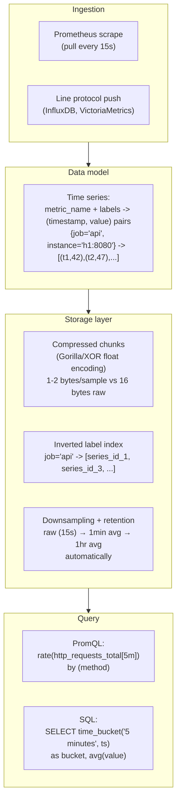

## In simple terms

Server metrics, stock prices, IoT sensor readings, and application telemetry are all time-series: measurements stamped with a timestamp and a set of labels. General-purpose databases can store this, but they aren't optimised for it. Time-series databases assume data arrives in timestamp order, compress repetitive numeric sequences aggressively, and answer "what was the average CPU usage per 5-minute interval over the last 30 days?" in milliseconds rather than minutes.

## The Visual Map



## More detail

**Data model:** a **time series** is identified by a **metric name** and a set of **labels** (key-value tags), and stores `(timestamp, value)` pairs. Example:
```
{__name__="http_requests_total", method="GET", status="200"}
  → [(1717000000, 42), (1717000060, 47), (1717000120, 51), ...]
```

**Storage optimisations:**

- **Timestamp delta encoding** — timestamps arrive in monotonically increasing order with regular intervals. Storing only the delta from the previous timestamp, then Fibonacci/variable-length encoding, reduces 8-byte timestamps to 1–2 bytes per sample.
- **Float XOR compression (Gorilla)** — consecutive float values often share exponent and upper mantissa bits. XOR of successive floats exploits this: a slowly-changing metric like CPU percentage compresses to &lt;1 byte per sample on average.
- **Inverted index on labels** — queries like `{job="api-server", instance=~".*:8080"}` require fast label matching across millions of series. TSDBs maintain inverted indexes from label values to series ID lists.
- **Downsampling and retention** — raw 1-second data for 30 days is kept full-resolution; older data is rolled up to 1-minute averages, then 1-hour. Reduces storage 60–3600× while preserving long-term trends.
- **Chunk-based storage** — each series is split into fixed-time chunks (Prometheus: 2-hour chunks). Chunks are written sequentially, immutable once closed, and stored on disk or object storage. This is append-optimised: no random writes, no fragmentation.

**Query languages:**
- **PromQL** (Prometheus) — functional query language: `rate(http_requests_total[5m])` computes per-second rate over 5 minutes; `avg by (job) (rate(...))` groups by label.
- **Flux** (InfluxDB 2.x) — pipeline syntax for time-series transformation.
- **SQL with time extensions** (TimescaleDB) — standard SQL + time-bucket functions: `time_bucket('5 minutes', time)`.

**Major systems:**

| System | Protocol | Notes |
|---|---|---|
| **Prometheus** | Pull (scrape) | Kubernetes-native, PromQL, push via Pushgateway |
| **InfluxDB 3.x** | Push (line protocol) | SQL query interface, parquet storage |
| **TimescaleDB** | Push | PostgreSQL extension; SQL compatibility |
| **VictoriaMetrics** | Push + Prometheus compat | 5–10× better compression than Prometheus |
| **ClickHouse** | Push | Columnar; increasingly used for long-term metrics |
| **M3DB (Uber)** | Push | Distributed, HA Prometheus storage backend |

## Under the Hood

A minimal time-series store in Python — delta compression, inverted label index, and downsampling:

```python
#!/usr/bin/env python3
"""Mini TSDB: ingestion, delta compression, label index, range query."""
import math, random, time as time_mod
from collections import defaultdict

class TimeSeries:
    def __init__(self, labels):
        self.labels = labels
        self.timestamps = []
        self.values = []

    def append(self, ts, value):
        self.timestamps.append(ts)
        self.values.append(value)

    def range_query(self, start, end):
        """Return (timestamp, value) pairs in [start, end]."""
        return [(t, v) for t, v in zip(self.timestamps, self.values)
                if start <= t <= end]

class MiniTSDB:
    def __init__(self):
        self.series = {}       # labels_key -> TimeSeries
        self.label_index = defaultdict(set)  # "label=value" -> set of series keys

    def _key(self, labels):
        return tuple(sorted(labels.items()))

    def write(self, metric, labels, ts, value):
        all_labels = {"__name__": metric, **labels}
        key = self._key(all_labels)
        if key not in self.series:
            self.series[key] = TimeSeries(all_labels)
            for k, v in all_labels.items():
                self.label_index[f"{k}={v}"].add(key)
        self.series[key].append(ts, value)

    def query(self, label_filter, start, end, step=60):
        """Find series matching labels, return rate-like aggregation."""
        matching_keys = None
        for lf in label_filter:
            matches = self.label_index.get(lf, set())
            matching_keys = matches if matching_keys is None else matching_keys & matches

        results = []
        for key in (matching_keys or []):
            s = self.series[key]
            pairs = s.range_query(start, end)
            if len(pairs) >= 2:
                # Compute rate (per-second increase) over the window
                duration = pairs[-1][0] - pairs[0][0]
                delta = pairs[-1][1] - pairs[0][1]
                if duration > 0:
                    results.append((dict(s.labels), delta / duration))
        return results

    def compress_delta(self, series_key):
        """Show compression ratio via delta encoding."""
        s = self.series[series_key]
        ts = s.timestamps
        deltas = [ts[0]] + [ts[i] - ts[i-1] for i in range(1, len(ts))]
        raw_bytes = len(ts) * 8
        compressed_bytes = sum(1 if d < 128 else 2 for d in deltas)
        return raw_bytes, compressed_bytes

# Simulate ingesting 10 minutes of metrics (every 15s)
db = MiniTSDB()
base_ts = 1717000000
for i in range(40):  # 40 samples = 10 minutes at 15s interval
    ts = base_ts + i * 15
    db.write("http_requests_total", {"job": "api", "method": "GET"},  ts, 100 + i * 3)
    db.write("http_requests_total", {"job": "api", "method": "POST"}, ts, 20 + i)
    db.write("cpu_usage",           {"host": "web01"},                 ts, 40 + 10 * math.sin(i/5))

# Range query
start, end = base_ts, base_ts + 600
results = db.query(["__name__=http_requests_total", "job=api"], start, end)
print("Rate of http_requests_total{job='api'}:")
for labels, rate in results:
    print(f"  method={labels.get('method','?'):<6} rate={rate:.3f} req/s")

# Compression demo
key = db._key({"__name__": "http_requests_total", "job": "api", "method": "GET"})
raw, comp = db.compress_delta(key)
print(f"\nDelta compression for GET series ({len(db.series[key].timestamps)} samples):")
print(f"  Raw: {raw} bytes  Compressed: {comp} bytes  Ratio: {raw/comp:.1f}x")
print(f"  (Real Gorilla XOR adds float compression on top → further 5-10x)")
```

## Engineering Trade-offs

**Write throughput vs. random access**
TSDBs are append-optimised: new data arrives in roughly timestamp order, written sequentially to the current chunk. Random writes (updating historical data) are not supported — TSDBs treat data as immutable once committed. This dramatically simplifies storage management (no fragmentation) and enables aggressive compression (each chunk is compressed as a unit). Applications that need to correct historical data must write a new series or use a different tool.

**Compression ratio vs. decompression cost**
Gorilla XOR compression reduces raw metric data by 5–10× compared to uncompressed float64 storage. But every query must decompress the relevant chunks. For a query spanning 7 days of 15-second data (40,320 samples per series), decompression is fast in practice (microseconds per chunk). The trade-off appears at very high cardinality: if there are 1 million distinct label combinations (one time series per user), chunk management overhead dominates.

**High cardinality vs. label index performance**
Each unique combination of label values creates a new time series. A metric with `user_id` as a label over 10 million users creates 10 million series — "high cardinality." The inverted label index grows proportionally, consuming gigabytes of memory. Prometheus and VictoriaMetrics have out-of-memory failures from high-cardinality label sets. Best practice: don't use high-cardinality values (user IDs, request UUIDs) as Prometheus labels; aggregate them at the application before recording.

**Pull vs. push ingestion**
Prometheus scrapes targets (pull): the Prometheus server requests metrics from each endpoint every 15 seconds. This simplifies discovery (Kubernetes service discovery, static targets) but requires that the target be reachable and healthy at scrape time. Short-lived jobs (batch jobs, serverless functions) can't be scraped; they use the Pushgateway to push metrics before exiting. Push-based systems (InfluxDB, VictoriaMetrics) receive metrics directly but require producers to know the TSDB endpoint.

**Local storage vs. remote storage federation**
Prometheus stores data locally on disk (designed for single-node). Local storage limits capacity and makes HA (high availability) harder. Remote storage backends (M3DB, Thanos, Cortex, VictoriaMetrics cluster) receive Prometheus remote write and provide long-term retention, multi-tenant access, and multi-replica HA. The trade-off: complexity of distributed systems (eventual consistency, deduplication of overlapping writes) vs. the simplicity of Prometheus's local TSDB.

## Real-world examples

- **Prometheus at Kubernetes** — the de facto monitoring stack for Kubernetes uses Prometheus to scrape pod metrics via the `/metrics` endpoint. AlertManager evaluates PromQL rules and fires alerts (PagerDuty, Slack). Grafana dashboards query Prometheus over the HTTP API. The entire stack is declaratively configured with Kubernetes custom resources.
- **VictoriaMetrics at scale** — Cloudflare, Wix, and dozens of large companies use VictoriaMetrics as a Prometheus-compatible backend. VM's improved columnar storage gives 5–10× better compression than Prometheus's Gorilla-based TSDB, reducing long-term metric storage costs at petabyte scale.
- **TimescaleDB for IoT** — industrial IoT platforms ingest sensor readings (temperature, pressure, vibration) into TimescaleDB (PostgreSQL + time extension). SQL compatibility means existing BI tools work without ETL; continuous aggregates pre-compute 1-minute and 1-hour rollups automatically.
- **Financial tick data** — stock exchanges store every trade and quote as a time series. kdb+ (Kx Systems) is the dominant TSDB in financial services: it stores and queries billions of ticks per day with a specialized array-based column store and the q functional query language. Backtesting platforms replay historical tick data at speeds up to 100,000× real-time.
- **Datadog's metric pipeline** — Datadog processes trillions of metric samples per day across millions of monitored hosts. Their proprietary time-series engine uses a combination of columnar storage, aggressive quantile sketching, and pre-aggregation to serve dashboard queries in &lt;100 ms regardless of query time range.

## Common misconceptions

- **"PostgreSQL with a timestamp index is good enough."** For small scale (&lt;10K writes/sec, &lt;100GB data), yes. At millions of writes per second and petabyte scale, the storage compression (10–100×), write throughput, downsampling, and specialized range-aggregate queries of a dedicated TSDB matter enormously. TimescaleDB extends PostgreSQL for this use case without giving up SQL.
- **"Time-series databases are only for monitoring."** Financial tick data, genomic sequencing data, climate observations, industrial IoT, and traffic telemetry are all time-series and use TSDBs for the same reasons. Any domain with "many measurements per entity, ordered by time" benefits from TSDB storage patterns.
- **"High cardinality is a general TSDB problem."** Prometheus has a strict memory model where every series must fit in RAM — high cardinality is a Prometheus-specific problem. ClickHouse, InfluxDB 3.x (Parquet-based), and TimescaleDB handle high-cardinality metrics better because they don't require all series metadata in memory.

## Try it yourself

Simulate time-series ingestion and range-aggregate queries in Python:

```bash
python3 - << 'EOF'
import math, time

# Mini in-memory TSDB: store (ts, value) per series
series = {}

def write(name, labels, ts, value):
    key = (name, tuple(sorted(labels.items())))
    series.setdefault(key, []).append((ts, value))

def range_avg(name, labels, start, end, bucket_secs=60):
    key = (name, tuple(sorted(labels.items())))
    samples = [(t, v) for t, v in series.get(key, []) if start <= t < end]
    if not samples: return []
    # Bucket into intervals
    buckets = {}
    for t, v in samples:
        b = (t - start) // bucket_secs * bucket_secs + start
        buckets.setdefault(b, []).append(v)
    return [(b, sum(vs)/len(vs)) for b, vs in sorted(buckets.items())]

# Ingest 5 minutes of data (every 10 seconds)
BASE = 1700000000
for i in range(30):
    ts = BASE + i * 10
    cpu = 40 + 20 * math.sin(i / 5)        # sinusoidal CPU
    mem = 60 + 0.5 * i                       # slowly growing memory
    write("cpu_pct",  {"host": "web01"}, ts, cpu)
    write("mem_pct",  {"host": "web01"}, ts, mem)

# 1-minute average of CPU over 5 minutes
print("CPU 1-minute averages:")
for bucket, avg in range_avg("cpu_pct", {"host": "web01"}, BASE, BASE+300, 60):
    offset = bucket - BASE
    bar = '#' * int(avg / 5)
    print(f"  t+{offset:3d}s: {avg:5.1f}%  {bar}")

# Compression: store deltas vs raw
raw_bytes = 30 * 16  # 30 samples x (8 bytes ts + 8 bytes float)
ts_list = [BASE + i*10 for i in range(30)]
deltas = [ts_list[0]] + [ts_list[i]-ts_list[i-1] for i in range(1,30)]
comp_bytes = sum(1 if d < 128 else 2 for d in deltas) + 30 * 4
print(f"\nCompression: raw={raw_bytes}B delta-encoded ts+f32={comp_bytes}B ratio={raw_bytes/comp_bytes:.1f}x")
EOF
```

## Learn next

- [NoSQL](/t/nosql) — time-series databases are a specialized NoSQL family; understanding the broader NoSQL landscape contextualizes their trade-offs vs. key-value, document, and columnar stores.
- [ETL](/t/etl) — raw time-series data often flows through ETL pipelines before entering the TSDB; long-term metrics are frequently exported to columnar data warehouses for historical analysis beyond TSDB retention windows.
- [Columnar Store](/t/columnar-store) — columnar storage is increasingly used for long-term time-series retention (ClickHouse, InfluxDB 3.x with Parquet); understanding columnar compression explains why it works well for the aggregation patterns TSDBs serve.
