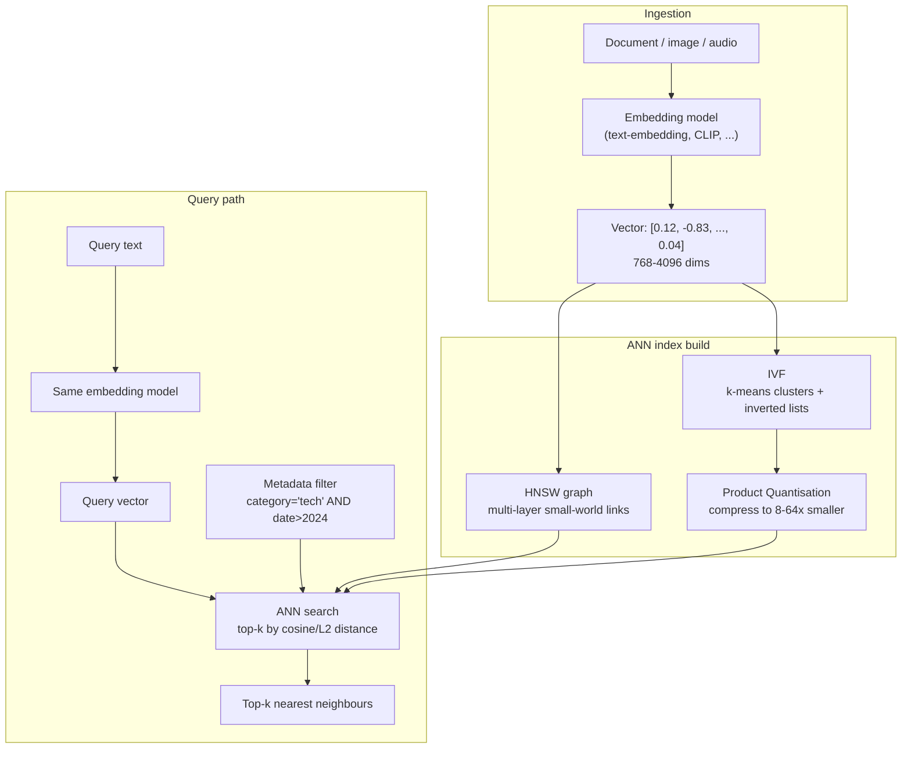

## In simple terms

Traditional databases answer "give me all rows where `name = 'Alice'`" — exact match. A vector database answers "give me the 10 documents most *similar* to this query" — approximate nearest-neighbour search. Similarity is measured as distance in a high-dimensional space (cosine similarity or Euclidean distance between [embedding](/t/embedding) vectors). This is fundamentally different from B-tree or hash-index lookups, requiring specialised indexing structures.

## The Visual Map



## More detail

**The problem:** embeddings are 768–4096-dimensional float vectors. Brute-force similarity search is `O(N × D)` — fine for thousands of vectors, unworkable for hundreds of millions. Vector databases build approximate nearest-neighbour (ANN) indexes that trade a small accuracy loss (measured as **recall** — the fraction of true nearest neighbours returned) for dramatic speed improvements.

**Distance metrics:** similarity is a *distance* in vector space. **Cosine similarity** measures the angle between vectors (magnitude-invariant — the default for normalised text embeddings); **Euclidean (L2)** measures straight-line distance; **dot product** is used when vectors aren't normalised. The choice must match how the embedding model was trained.

**Core ANN algorithms:**

- **HNSW (Hierarchical Navigable Small World)** — a multi-layer graph where each node links to nearby nodes at multiple scales. Navigation hops across long-range links (upper layers) then short-range links (lower layers) to find neighbours in O(log N) hops. High recall, low latency, high memory usage.
- **IVF (Inverted File Index)** — cluster vectors with k-means; store each vector in its cluster's inverted list. Query: find the closest clusters, then search within them. Lower memory than HNSW; configurable accuracy/speed tradeoff via `nprobe` (how many clusters to scan).
- **PQ (Product Quantisation)** — compress vectors by splitting them into sub-vectors and quantising each independently against a learned codebook. Reduces memory 8–64×; enables billion-scale search on moderate hardware. Often combined with IVF (IVF-PQ).
- **DiskANN / ScaNN** — disk-based indexes that store most vectors on SSD and a small navigation graph in memory, enabling billion-scale search with limited RAM.

**Filtering:** real queries combine vector similarity with metadata filters ("most similar to X, where `category = 'tech'` and `date > 2024`"). Efficient filtered ANN is an open problem; strategies include pre-filtering (restrict the index to the matching subset, then search) and post-filtering (run ANN, then drop non-matching results — which risks returning fewer than *k* hits when the filter is selective).

**Products:** Pinecone, Weaviate, Qdrant, Chroma, pgvector (PostgreSQL extension), Milvus, Redis Stack (vector extension), OpenSearch/Elasticsearch k-NN.

## Under the Hood

A tiny vector store in pure Python: exact brute-force search versus an IVF-style approximate index that clusters vectors and only scans the nearest clusters. Watch recall trade against the number of comparisons:

```python
#!/usr/bin/env python3
"""Mini vector DB: brute-force vs IVF approximate nearest-neighbour search."""
import math, random

random.seed(42)

def dot(a, b):       return sum(x * y for x, y in zip(a, b))
def norm(a):         return math.sqrt(dot(a, a))
def cosine(a, b):    return dot(a, b) / (norm(a) * norm(b) + 1e-9)

def make_vec(d):     return [random.gauss(0, 1) for _ in range(d)]

DIM, N = 16, 2000
vectors = [make_vec(DIM) for _ in range(N)]

def brute_force(query, k=5):
    """Exact: compare against every vector. O(N*D)."""
    scored = [(cosine(query, v), i) for i, v in enumerate(vectors)]
    scored.sort(reverse=True)
    return [i for _, i in scored[:k]], N  # N comparisons

# --- Build an IVF index: k-means into C clusters (a few Lloyd iterations) ---
C = 40
centroids = random.sample(vectors, C)
for _ in range(8):
    buckets = [[] for _ in range(C)]
    for i, v in enumerate(vectors):
        c = max(range(C), key=lambda j: cosine(v, centroids[j]))
        buckets[c].append(i)
    for j in range(C):
        if buckets[j]:
            centroids[j] = [sum(vectors[i][d] for i in buckets[j]) / len(buckets[j])
                            for d in range(DIM)]

def ivf_search(query, k=5, nprobe=3):
    """Approximate: scan only the nprobe nearest clusters."""
    near = sorted(range(C), key=lambda j: cosine(query, centroids[j]), reverse=True)[:nprobe]
    candidates = [i for j in near for i in buckets[j]]
    scored = sorted(((cosine(query, vectors[i]), i) for i in candidates), reverse=True)
    return [i for _, i in scored[:k]], len(candidates)

# Evaluate recall@5 over random queries
total_recall, total_cmp_bf, total_cmp_ivf = 0.0, 0, 0
QUERIES = 200
for _ in range(QUERIES):
    q = make_vec(DIM)
    truth, cmp_bf = brute_force(q, 5)
    approx, cmp_ivf = ivf_search(q, 5, nprobe=3)
    total_recall += len(set(truth) & set(approx)) / 5
    total_cmp_bf += cmp_bf
    total_cmp_ivf += cmp_ivf

print(f"Brute force: {total_cmp_bf//QUERIES} comparisons/query (exact)")
print(f"IVF nprobe=3: {total_cmp_ivf//QUERIES} comparisons/query")
print(f"Recall@5: {total_recall/QUERIES:.1%}  "
      f"({total_cmp_bf/total_cmp_ivf:.1f}x fewer comparisons)")
```

Raising `nprobe` scans more clusters → higher recall but more comparisons; this is the core ANN speed-vs-accuracy dial.

## Engineering Trade-offs

**Recall vs. latency (the central ANN dial)**
Every ANN index exposes a knob — HNSW's `efSearch`, IVF's `nprobe` — that scans more candidates for higher recall at higher latency. There is no universally correct setting: a RAG pipeline may accept 95% recall for single-digit-millisecond queries, while a deduplication job needs 99.9%. You tune it per workload against a labelled ground-truth set; it is not something the database picks for you.

**Memory vs. scale (HNSW vs. IVF-PQ)**
HNSW keeps the full graph and all float vectors in RAM — fastest queries, but ~1.5–2× the raw vector size in memory, which caps practical capacity per node. IVF-PQ compresses vectors 8–64× so billions fit on one machine, but quantisation is lossy: it lowers recall and adds a re-ranking step (fetch full vectors for the top candidates and re-score) to recover precision.

**Build time vs. query time**
HNSW graph construction is expensive (`O(N log N)` with large constants) and largely sequential per insert. Indexes optimised for fast queries are slow to build and slow to update; bulk-loading a fresh index is often faster than incrementally inserting millions of vectors. Workloads with high write churn pay for this repeatedly.

**Filtered search correctness vs. speed**
Pre-filtering guarantees the filter is honoured but can't reuse a global ANN graph efficiently when the matching subset is small and scattered. Post-filtering reuses the fast global index but may return fewer than *k* results (or none) when the filter is selective. Neither is free; databases differ sharply in how well they handle this, and it's the most common production gotcha.

**Dedicated vector DB vs. an extension**
A separate service (Pinecone, Milvus, Qdrant) adds operational surface — another datastore to deploy, secure, back up, and keep consistent with your source of truth. `pgvector` keeps vectors next to relational data in one transactional system, trading peak ANN throughput for simplicity. The right call is a function of scale and latency budget, not fashion.

## Real-world examples

- Vector databases are the storage layer of [retrieval-augmented generation (RAG)](/t/retrieval-augmented-generation) — virtually every chatbot that answers from a private knowledge base stores document embeddings in one and queries it to retrieve relevant context before generating a response.
- Spotify's music recommendation system embeds songs into a shared vector space and finds similar tracks with ANN search; its open-source Annoy library popularised tree-based ANN.
- Google Photos' "search for photos of beaches" uses visual embeddings (a CLIP-style image model) and approximate nearest-neighbour search over your library.
- Stack Overflow and many documentation sites use embedding similarity for semantic search, surfacing related questions and pages beyond keyword matches.
- pgvector lets teams add similarity search to an existing PostgreSQL deployment, so a SaaS app can ship semantic search without standing up a second datastore.

## Common misconceptions

- **"A vector database is just a regular database with a new column type."** The indexing requirements (HNSW, IVF-PQ) are fundamentally different from B-trees or hash indexes; a naive relational approach that scans every row is orders of magnitude slower at scale.
- **"ANN search returns the exact nearest neighbours."** The "A" is for *approximate* — results are tuned to a recall target (e.g. 95%), not guaranteed exact. For workloads that truly need exact results, you fall back to brute force or accept the recall/latency trade-off explicitly.
- **"You always need a dedicated vector database."** For moderate scales (&lt; 1M vectors), `pgvector` in PostgreSQL is often sufficient and avoids an extra service. Dedicated vector databases earn their keep at large scale or very low-latency requirements.

## Try it yourself

Build a 50-document semantic search index from scratch with bag-of-words vectors and cosine similarity — no libraries, just the core idea behind every vector DB:

```bash
python3 - << 'EOF'
import math, re
from collections import Counter

docs = [
    "the cat sat on the warm mat by the window",
    "kittens and cats love to nap in sunny spots",
    "the stock market fell sharply after the report",
    "investors sold shares as the market dropped",
    "a recipe for fresh tomato pasta with basil",
    "boil the pasta then add the tomato sauce and basil",
    "neural networks learn patterns from training data",
    "deep learning models train on large datasets",
]

# Build vocabulary and TF vectors (a crude 'embedding')
def tokens(s): return re.findall(r"[a-z]+", s.lower())
vocab = sorted({w for d in docs for w in tokens(d)})
idx = {w: i for i, w in enumerate(vocab)}

def embed(s):
    v = [0.0] * len(vocab)
    for w, c in Counter(tokens(s)).items():
        if w in idx: v[idx[w]] = c
    return v

def cosine(a, b):
    dot = sum(x*y for x, y in zip(a, b))
    na = math.sqrt(sum(x*x for x in a)); nb = math.sqrt(sum(y*y for y in b))
    return dot / (na*nb + 1e-9)

vectors = [embed(d) for d in docs]

def search(query, k=3):
    q = embed(query)
    scored = sorted(((cosine(q, v), i) for i, v in enumerate(vectors)), reverse=True)
    print(f"\nQuery: {query!r}")
    for score, i in scored[:k]:
        print(f"  {score:.3f}  {docs[i]}")

search("feline sleeping in the sun")   # crude bag-of-words: the cat doc wins, but stopword overlap muddies it
search("shares falling on the market") # 'shares' + 'market' rank the finance docs highest
search("training a deep model")        # top hits are the deep-learning docs despite different words
EOF
```

The third query matches the deep-learning docs even though wording differs — that is similarity search, not keyword match. Real embedding models replace this word-count vector with a learned dense one that captures meaning.

## Learn next

- [Embedding](/t/embedding) — the dense vectors a vector database stores and searches; understanding how models map text/images into vector space explains *why* similarity search works.
- [Retrieval-augmented generation](/t/retrieval-augmented-generation) — the flagship application: a vector DB retrieves context that an LLM conditions on, grounding answers in private data.
- [Indexing](/t/indexing) — contrast B-tree/hash indexing (exact lookups, ordered ranges) with ANN indexing (approximate similarity) to see when each is the right tool.
- [B-tree](/t/b-tree) — the classic relational index; comparing its `O(log N)` exact-match guarantees to HNSW's approximate graph traversal sharpens the distinction.
