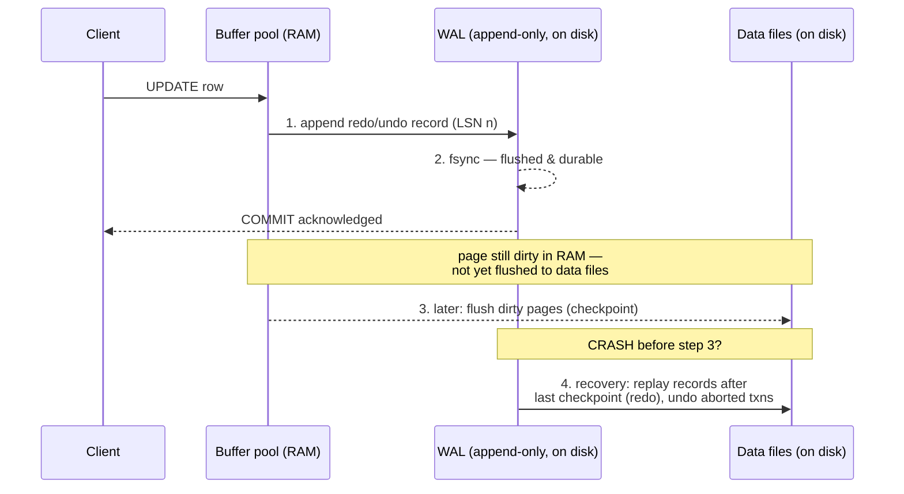

## In simple terms

Databases keep data in files on disk, but writing to those files is complex and partial writes happen during a crash. The write-ahead log (WAL) is a simple append-only file: before changing any data file, write what you're about to do to the log. If the system crashes, replay the log from the last checkpoint — you'll arrive at a consistent, complete state. The log is the "D" in ACID durability.

## The Visual Map



## More detail

The rule is strict: a change is not considered committed until its log record has been flushed to disk (called **log flush** or `fsync`). Only then may the data pages in the buffer pool be modified and the commit acknowledged. This **write-ahead** ordering — log first, data later — gives two guarantees:

- **Crash recovery (redo):** on restart, apply all log records after the last checkpoint. Even if the corresponding data page wasn't flushed, the log provides the information to reconstruct it.
- **Rollback (undo):** if a transaction aborts, apply undo records from the log in reverse order to revert changes that were already written to pages.

**Log structure:** each record contains the transaction ID, log sequence number (LSN, monotonically increasing), the type of operation (INSERT/UPDATE/DELETE/COMMIT/ABORT), and the before-image and/or after-image of the changed data. The canonical scheme is **ARIES** (Algorithm for Recovery and Isolation Exploiting Semantics): redo *everything* to repeat history, then undo losers, using the LSN to track which changes already reached each page.

**Checkpoints:** periodically, the database flushes all dirty pages to disk and writes a checkpoint record. On recovery, replay only starts from the last checkpoint — bounding recovery time. Without checkpoints, recovery would require replaying the entire log history.

**WAL and replication:** WAL records are the primary mechanism for physical replication. PostgreSQL **streaming replication** ships WAL records to standbys in real time. MySQL's binlog and MongoDB's oplog are logical WAL variants. Replication lag *is* WAL-delivery lag.

**Write amplification:** every write generates a WAL record *and* eventually modifies the data page — the same data is written at least twice. SSDs amplify this further (erase-before-write). LSM-tree engines (RocksDB, Cassandra) pair a WAL with an in-memory memtable and sorted on-disk tables to turn random writes into sequential ones.

**`fsync` skipping (dangerous):** running with `fsync=off` removes the WAL flush guarantee. Writes appear faster but data loss — or corruption — is possible on crash, because data pages can hit disk *before* the log that describes them, violating write-ahead ordering. Only appropriate for throwaway test environments.

## Under the Hood

A durable key-value store built on a WAL, in pure Python. It writes each change to an append-only log (with `fsync`) *before* touching the data, then recovers by replaying the log after a simulated crash:

```python
#!/usr/bin/env python3
"""KV store with a write-ahead log: durability through crash + replay."""
import os, json

class WalKV:
    def __init__(self, wal_path, data_path):
        self.wal_path = wal_path
        self.data_path = data_path
        self.data = {}                 # in-memory "buffer pool"
        self._recover()                # replay WAL on startup

    def _recover(self):
        """Rebuild state from the last checkpoint + WAL replay."""
        if os.path.exists(self.data_path):
            with open(self.data_path) as f:
                self.data = json.load(f)      # last checkpointed snapshot
        if os.path.exists(self.wal_path):
            with open(self.wal_path) as f:
                for line in f:                # redo every committed record
                    rec = json.loads(line)
                    if rec["op"] == "set":
                        self.data[rec["key"]] = rec["val"]
                    elif rec["op"] == "del":
                        self.data.pop(rec["key"], None)

    def _append_wal(self, record):
        """WRITE-AHEAD: log record is fsync'd before we ack the write."""
        with open(self.wal_path, "a") as f:
            f.write(json.dumps(record) + "\n")
            f.flush()
            os.fsync(f.fileno())              # durable on disk now
        # only now is it safe to mutate the in-memory data
        if record["op"] == "set":
            self.data[record["key"]] = record["val"]
        elif record["op"] == "del":
            self.data.pop(record["key"], None)

    def set(self, key, val): self._append_wal({"op": "set", "key": key, "val": val})
    def delete(self, key):   self._append_wal({"op": "del", "key": key})
    def get(self, key):      return self.data.get(key)

    def checkpoint(self):
        """Flush data snapshot, then truncate the WAL — recovery starts here."""
        with open(self.data_path, "w") as f:
            json.dump(self.data, f); f.flush(); os.fsync(f.fileno())
        open(self.wal_path, "w").close()      # WAL replay now starts empty

# --- Session 1: writes, then a "crash" (no checkpoint, process just dies) ---
for p in ("demo.wal", "demo.data"):
    if os.path.exists(p): os.remove(p)

db = WalKV("demo.wal", "demo.data")
db.set("balance:alice", 100)
db.set("balance:bob", 50)
db.set("balance:alice", 75)               # alice pays bob 25
db.set("balance:bob", 75)
del db                                      # simulate crash: RAM lost, WAL survives

# --- Session 2: fresh process recovers purely from the WAL ---
db2 = WalKV("demo.wal", "demo.data")
print("After crash recovery (replayed from WAL):")
print(f"  alice = {db2.get('balance:alice')}, bob = {db2.get('balance:bob')}")
db2.checkpoint()
print(f"  WAL size after checkpoint: {os.path.getsize('demo.wal')} bytes")

for p in ("demo.wal", "demo.data"):
    if os.path.exists(p): os.remove(p)
```

## Engineering Trade-offs

**Durability vs. commit latency**
Every `COMMIT` must wait for an `fsync` of the log — a physical disk round-trip (a seek + flush on spinning disks, or a flush-to-NAND on SSDs). This is why commits are slow on high-latency storage. **Group commit** amortises it: the database batches many concurrent commits into a single `fsync`, trading a tiny per-transaction latency increase for far higher throughput. `synchronous_commit=off` in PostgreSQL goes further — it acks before the flush, risking the last few milliseconds of commits on a crash but keeping the database consistent.

**Sequential WAL writes vs. random data writes**
The WAL is purely sequential and append-only — the fastest possible I/O pattern, even on HDDs. Data-file updates are random. By forcing the slow, durability-critical path onto sequential WAL writes and *deferring* the random data writes to batched checkpoints, the WAL converts a random-write workload into mostly sequential I/O. The cost is write amplification: the data is written twice.

**Checkpoint frequency: recovery time vs. steady-state load**
Frequent checkpoints keep the WAL short, so crash recovery is fast — but each checkpoint floods the disk with dirty-page flushes, hurting steady-state throughput and causing latency spikes. Infrequent checkpoints smooth steady-state I/O but lengthen recovery (more log to replay) and let the WAL grow large. Databases expose this directly (`max_wal_size`, `checkpoint_timeout`).

**Physical vs. logical logging**
Physical WAL (PostgreSQL) logs byte-level page changes: compact and fast to replay, but tightly coupled to storage format, so replicas must run an identical version. Logical WAL (MySQL row-based binlog) logs the logical change ("row X column Y → Z"): portable across versions and engines and filterable per-table, but larger and costlier to apply. The choice trades replication flexibility against log size and replay speed.

## Real-world examples

- **PostgreSQL** WAL is stored in 16 MB segment files; `pg_basebackup` plus `pg_receivewal` stream them to standby servers, and the same segments enable point-in-time recovery (restore a base backup, replay WAL to any timestamp).
- **MySQL** uses two logs: InnoDB's redo log (physical, for crash recovery) and the **binlog** (logical, for replication); replicas replay the binlog to stay in sync.
- **Kafka** is architecturally a distributed WAL — an immutable, append-only commit log that any number of consumers replay from a chosen offset. The log *is* the database.
- **SQLite** offers a WAL journal mode (`PRAGMA journal_mode=WAL`) that lets readers proceed concurrently with a writer, instead of the older rollback-journal mode that locked the whole file.
- **RocksDB / LevelDB** (the storage engine under many databases and queues) combine a WAL with a memtable and sorted SST files — the LSM-tree pattern.

## Common misconceptions

- **"WAL only matters for crash recovery."** WAL is also the primary replication mechanism in most databases and the basis for point-in-time recovery (restore a backup, then replay WAL to a chosen instant).
- **"Write-ahead means writes are slow."** The WAL write is sequential — the *fastest* I/O pattern. Group commit batches flushes, and `synchronous_commit`/`wal_level` knobs let you trade durability for latency. The slow part is the unavoidable `fsync` on commit, not the logging itself.
- **"Once the data file is updated, the WAL record is useless."** It's still needed for replication, for replicas that haven't caught up, and for point-in-time recovery — which is why a record is only reclaimable after a checkpoint *and* every consumer of it has advanced past its LSN.

## Try it yourself

See write-ahead ordering save your data across a crash. This appends to a log, kills the process mid-session, then recovers state purely by replaying the log:

```bash
python3 - << 'EOF'
import os, json

WAL = "wal_demo.log"
if os.path.exists(WAL): os.remove(WAL)

def log_and_apply(state, op, key, val=None):
    rec = {"op": op, "key": key, "val": val}
    with open(WAL, "a") as f:                 # WRITE-AHEAD: log first...
        f.write(json.dumps(rec) + "\n"); f.flush(); os.fsync(f.fileno())
    if op == "set": state[key] = val          # ...then mutate state
    elif op == "del": state.pop(key, None)

# "Session 1" — make changes, then crash WITHOUT saving state anywhere
s = {}
log_and_apply(s, "set", "x", 1)
log_and_apply(s, "set", "y", 2)
log_and_apply(s, "set", "x", 99)
print("Before crash:", s)
del s                                          # poof — RAM is gone

# "Session 2" — new process, empty memory, replay the WAL to recover
recovered = {}
with open(WAL) as f:
    for line in f:
        r = json.loads(line)
        if r["op"] == "set": recovered[r["key"]] = r["val"]
        elif r["op"] == "del": recovered.pop(r["key"], None)
print("After recovery:", recovered)            # identical — durability!

print("\nThe WAL itself (what got fsync'd before each ack):")
print(open(WAL).read().rstrip())
os.remove(WAL)
EOF
```

## Learn next

- [Transaction (ACID)](/t/transaction-acid) — the WAL is the mechanism that delivers the **D** (durability) and supports atomic rollback; understanding ACID explains *what* guarantee the WAL is enforcing.
- [Replication](/t/replication) — most databases replicate by shipping WAL records to standbys, so replication lag is literally WAL-delivery lag.
- [MVCC](/t/mvcc) — multi-version concurrency control durably logs the new row versions it creates through the WAL, and old versions persist partly because undo may still need them.
- [B-tree](/t/b-tree) — the on-disk structure WAL protects in classic relational engines; contrast with the LSM-tree pattern that pairs a WAL with memtables to cut write amplification.
