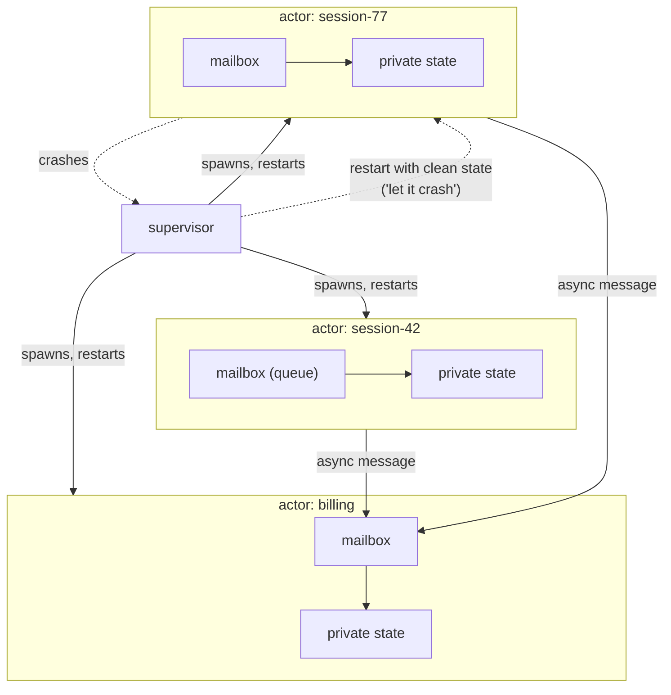

## In simple terms

The actor model says: instead of threads sharing memory (and fighting over locks), make each concurrent unit an **actor** — an isolated entity with its own state that communicates only by sending messages. When an actor receives a message, it can send messages to other actors, create new actors, or update its own state. It cannot touch another actor's state directly. This eliminates the entire category of race conditions caused by shared memory.

## The Visual Map



## More detail

An actor has three things: a **mailbox** (queue of incoming messages), **behaviour** (what to do for each message type), and **address** (where others send messages to reach it). Actors are:

- **Asynchronous** — sending a message does not block the sender. Fire and forget.
- **Location-transparent** — an actor's address works the same whether the actor is local or on a different machine. Distribution is not a special case.
- **Isolated** — actors share no heap. Two actors running on the same CPU still have completely separate state.

In response to a message, an actor may:
1. Send messages (to any actor whose address it knows).
2. Create child actors.
3. Change its own behaviour for the next message (become a different "state").

**Supervision trees** (Erlang OTP, Akka): actors are organised in a hierarchy. When an actor crashes (throws an exception), its **supervisor** decides: restart it, restart its siblings, or escalate to its own supervisor. This "let it crash" philosophy decouples error handling from business logic — actors are cheap, restarting is the primary error recovery mechanism.

**Erlang/Elixir** built the entire runtime around actors (called "processes"). An Erlang node can run millions of lightweight processes; this is how WhatsApp handled 2 million concurrent connections per server. **Akka** (Scala/Java), **Pony**, **Orleans** (.NET), and the Actix framework (Rust) implement actor models in other languages.

The actor model's distribution story: when actors are location-transparent, a cluster of machines becomes one logical pool of actors. Network partitions are handled by the supervision tree — a remote actor that becomes unreachable is treated as a crashed actor. The model avoids the two hardest problems in concurrent programming — shared-memory races and deadlock — and Erlang's legendary uptime records come largely from supervision trees and hot-patching of running systems.

## Under the Hood

An actor is a mailbox plus a loop — small enough to build from scratch:

```python
import threading, queue

class Actor:
    def __init__(self, behaviour):
        self.mailbox = queue.Queue()
        self.state = {}
        self.behaviour = behaviour
        threading.Thread(target=self._run, daemon=True).start()

    def send(self, msg):                 # async: never blocks the sender
        self.mailbox.put(msg)

    def _run(self):                      # the actor loop: one message at a time
        while True:
            msg = self.mailbox.get()
            self.behaviour(self, msg)    # only THIS thread touches self.state

def counter(actor, msg):
    if msg["op"] == "add":
        actor.state["n"] = actor.state.get("n", 0) + msg["value"]
    elif msg["op"] == "get":
        msg["reply_to"].put(actor.state.get("n", 0))

c = Actor(counter)
for i in range(1000):
    c.send({"op": "add", "value": 1})    # many senders would be fine too
reply = queue.Queue()
c.send({"op": "get", "reply_to": reply})
print(reply.get())                       # 1000 — no locks anywhere
```

The state is mutated by exactly one thread, sequentially, message by message — that's the entire concurrency-safety argument. Erlang's runtime makes these loops light enough to run millions of them.

## Engineering Trade-offs

- **No shared memory: races eliminated, copies multiplied.** Isolation means every message between actors is (logically) copied. For chat sessions that's nothing; for a 100 MB matrix it's a design problem — data-parallel workloads often fit shared-memory or ownership models better.
- **"Let it crash" vs defensive code.** Supervision moves error handling out of business logic: actors die honestly and restart clean, instead of limping on in corrupt states. The price is designing restart semantics — what state is safely lost, what must be persisted, and how restart storms are damped.
- **Asynchrony cures deadlock, invites new bugs.** With no locks there's nothing to deadlock on — but unbounded mailboxes can grow until memory dies (backpressure is your job), and nothing guarantees ordering between different senders.
- **Location transparency has a tail.** The same `send` works across machines, which makes scaling out natural — and hides a network that can lose messages and partition. Remote actors fail differently than local ones, however uniform the API looks.

## Real-world examples

- WhatsApp's entire backend (handling billions of messages daily) is Erlang OTP — actor supervision trees on every server.
- Riak (Erlang) uses actors for storage vnodes, allowing rolling upgrades and fault isolation.
- Akka powers Lightbend products and is used at PayPal, LinkedIn, and financial trading systems.
- Microsoft Orleans (C#) implements "virtual actors" (Grains) for stateful serverless computation.

## Common misconceptions

- **"Actors are just threads."** Actors are much lighter than OS threads (millions can run on one machine) and are strictly isolated — no shared memory. Threads require synchronisation; actors use message passing.
- **"The actor model prevents all bugs."** It prevents data races. Logic bugs, message ordering assumptions, and mailbox overflows are still possible.

## Try it yourself

Race two approaches at incrementing a counter from two threads — shared memory vs an actor mailbox:

```bash
python3 -c "
import threading, queue, time

# shared memory, no lock: the classic race
n = 0
def bump():
    global n
    for _ in range(2000):
        t = n
        time.sleep(0)       # yield mid read-modify-write -> interleavings lose updates
        n = t + 1
ts = [threading.Thread(target=bump) for _ in range(2)]
[t.start() for t in ts]; [t.join() for t in ts]
print(f'shared memory: {n:,} of expected 4,000 — updates lost to the race')

# actor style: all updates serialised through one mailbox
box = queue.Queue()
def send():
    for _ in range(2000):
        box.put(1)
ts = [threading.Thread(target=send) for _ in range(2)]
[t.start() for t in ts]; [t.join() for t in ts]
total = 0
while not box.empty():
    total += box.get()      # one consumer, sequential — nothing to race
print(f'actor mailbox: {total:,} — exact')
"
```

The mailbox serialises what the shared variable couldn't — same hardware, same threads, no lock, correct answer.

## Learn next

- [Message queue](/t/message-queue) — the same idea at inter-service scale.
- [Gossip protocol](/t/gossip-protocol) — peer-to-peer message passing for cluster state.
- [Consensus](/t/consensus) — what actors still need when they must agree.
