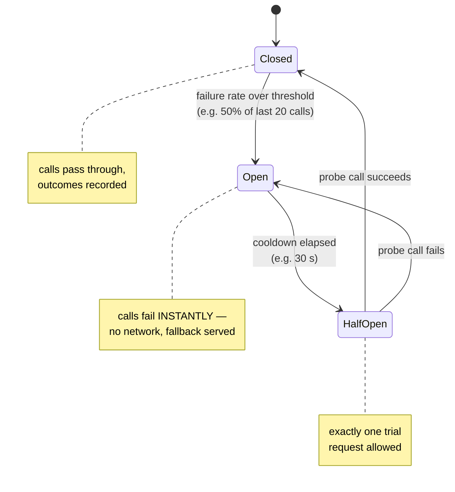

## In simple terms

If a service you call is failing, calling it again is usually pointless — you'll just accumulate slow timeouts while your own service degrades. A circuit breaker watches the call success rate; when it drops below a threshold, the breaker **opens**: subsequent calls immediately return an error without touching the network, sparing your threads and your dependency's overloaded servers. After a cooldown, it tries one call (half-open); if that succeeds, the breaker closes and normal operation resumes.

## The Visual Map



## More detail

A circuit breaker has three states:

- **Closed (normal):** calls pass through. The breaker monitors the last N calls (or a time window); if the failure rate exceeds the threshold (e.g. 50% in the last 20 calls), it opens.
- **Open (failing):** all calls fail immediately with a known error (fallback value, cached result, or exception). No network contact. After a configurable sleep window (e.g. 30 seconds), it moves to half-open.
- **Half-open (testing):** allows one request through. If it succeeds, close the breaker; if it fails, open again.

**Failure criteria:** typically network errors and timeouts. Optionally: slow calls (response time > threshold), HTTP 5xx, or custom predicates.

**Fallback strategy:** an open circuit should return something useful if possible — a cached value, a default response, a degraded feature ("sorry, recommendations unavailable"). Failing loudly vs. failing gracefully is a product decision.

**Implementations:** Netflix Hystrix (deprecated, now in maintenance); Resilience4j (Java); Polly (.NET); `pybreaker` (Python); Envoy service mesh supports circuit breaking at the proxy layer, requiring no application code changes.

**Interaction with retries:** a circuit breaker wraps the call; a retry policy wraps the circuit breaker. When the circuit is open, the retry policy should not retry (it would just fail fast repeatedly). Most retry libraries integrate with circuit breakers to distinguish "open circuit" errors from transient errors.

Without circuit breakers, a failing downstream service causes request threads to pile up waiting for timeouts, exhausting the connection pool and crashing the caller — a **cascading failure**. Circuit breakers contain the blast radius: the caller degrades gracefully, and the downstream gets breathing room to recover.

## Under the Hood

The full state machine fits in a small class:

```python
import time

class CircuitBreaker:
    def __init__(self, threshold=0.5, window=10, cooldown=30):
        self.results = []                     # last `window` outcomes
        self.threshold, self.window, self.cooldown = threshold, window, cooldown
        self.state, self.opened_at = "closed", None

    def call(self, fn, fallback):
        if self.state == "open":
            if time.monotonic() - self.opened_at < self.cooldown:
                return fallback()             # instant — no network touched
            self.state = "half-open"          # cooldown over: allow one probe
        try:
            result = fn()
            self._record(True)
            return result
        except Exception:
            self._record(False)
            return fallback()

    def _record(self, ok):
        if self.state == "half-open":         # the probe decides everything
            self.state = "closed" if ok else "open"
            self.opened_at = None if ok else time.monotonic()
            self.results.clear()
            return
        self.results = (self.results + [ok])[-self.window:]
        if len(self.results) == self.window and \
           self.results.count(False) / self.window >= self.threshold:
            self.state, self.opened_at = "open", time.monotonic()
```

Note what the open state buys: `call` returns the fallback without invoking `fn` at all — no socket, no timeout wait, no thread parked. The caller's latency under dependency failure drops from "timeout × pile-up" to microseconds.

## Engineering Trade-offs

- **Fast failure vs lost recoveries.** An open breaker rejects calls that *might* have succeeded — that's the deal. Tuning the threshold trades false trips (flaky-but-working dependency cut off) against slow trips (pool exhausted before the breaker reacts).
- **Per-instance vs shared state.** A breaker in each process reacts instantly but each instance must rediscover the failure; a shared breaker (mesh proxy, Redis-backed) gives a consistent view at the cost of coordination latency and a new dependency that can itself fail.
- **Fallbacks define your degraded product.** Cached recommendations, empty lists, "feature unavailable" — each open circuit needs an answer, and that answer is a product decision made in advance, not an infrastructure default.
- **Half-open thundering herd.** Naively letting *all* callers probe at cooldown's end re-crushes the recovering service. Single-probe gating and jittered cooldowns matter precisely when things are at their most fragile.

## Real-world examples

- Netflix Hystrix wraps every downstream call in a circuit breaker; when a recommendation service fails, the homepage shows a generic list instead of a 503.
- AWS SDK and most cloud client libraries include circuit-breaker logic built into their retry policies.
- Envoy proxy applies circuit breaking at the sidecar level for all inter-service calls in a service mesh.
- Stripe's internal services use circuit breakers so a failing fraud detection service doesn't block all payment processing.

## Common misconceptions

- **"Circuit breakers replace retries."** No — they complement each other. Retries handle transient glitches; circuit breakers handle sustained failures. Use both, with the circuit breaker on the outside.
- **"Opening the circuit harms the dependency."** It helps it: stopping call load during recovery is exactly what a struggling service needs to avoid being overwhelmed while it heals.

## Try it yourself

Watch the full lifecycle — trip, fast-fail, probe, recover — against a dependency that dies and comes back:

```bash
python3 -c "
calls = {'n': 0}
def dependency():
    calls['n'] += 1
    if 5 <= calls['n'] <= 12:          # the outage window
        raise RuntimeError('503')
    return 'ok'

results, state, fails = [], 'closed', 0
for i in range(1, 19):
    if state == 'open':
        if i % 4 == 0:                 # 'cooldown elapsed' -> probe
            state = 'half-open'
        else:
            results.append('FAST-FAIL (no call made)'); continue
    try:
        r = dependency()
        state, fails = 'closed', 0
        results.append(r)
    except RuntimeError:
        fails += 1
        state = 'open' if (fails >= 3 or state == 'half-open') else state
        results.append('error')
for i, r in enumerate(results, 1):
    print(f'call {i:2}: {r}')
print('dependency actually invoked:', calls['n'], 'times (of 18 attempts)')
"
```

The fast-fail lines are the pattern's value: attempts that cost the caller nothing and gave the sick dependency nothing to choke on.

## Learn next

- [Rate limiting](/t/rate-limiting) — preventing the overload before it becomes failure.
- [Idempotency](/t/idempotency) — making the retries safe once the circuit closes.
- [Load balancer](/t/load-balancer) — ejecting bad backends, the fleet-level sibling of this pattern.
