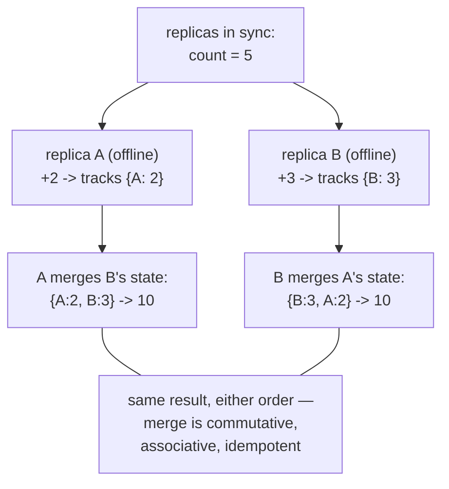

## In simple terms

When two servers concurrently update the same data and then sync, there's a conflict: whose value wins? CRDTs sidestep the conflict entirely by designing the data type so that **any two updates can always be merged**, commutatively and associatively, with the same result. No coordination needed; just apply all updates in any order and the replicas converge. A simple example: a grow-only counter where every increment is just added — you can merge two lists of increments in any order and always get the same total.

## The Visual Map



## More detail

A CRDT is formally a join-semilattice: there is a partial order on states, a merge operation (join, `⊔`) that is commutative, associative, and idempotent (`x ⊔ x = x`), and every sequence of merges monotonically advances up the lattice toward a unique maximum. Two categories:

**State-based CRDTs (CvRDTs):** replicas exchange full or partial state; merge is defined as the join. The receiving replica applies `state = state ⊔ received_state`.

**Operation-based CRDTs (CmRDTs):** replicas broadcast operations (rather than state); the operation must be designed to be commutative. Requires the communication layer to guarantee each operation is delivered at least once.

Common CRDTs and what they enable:

| CRDT | Operations | Use case |
|------|-----------|----------|
| G-Counter | increment | distributed counters (view counts) |
| PN-Counter | increment, decrement | shopping-cart item quantities |
| G-Set | add | tag sets |
| 2P-Set | add, remove (no re-add) | simple tombstone sets |
| LWW-Element-Set | add, remove with timestamps | last-write-wins element sets |
| OR-Set (Observed-Remove) | add, remove freely | collaborative editing, shopping carts |
| RGA / LSEQ | insert, delete (at position) | collaborative text editing |

**Collaborative text editors** (Google Docs, Notion) use sequence CRDTs (RGA, LSEQ, Logoot) to let two users simultaneously insert text at different positions and converge to the same document without a server round-trip.

CRDTs make eventual consistency safe — not just "eventually the same" but mathematically guaranteed to be the same. They enable offline-first applications (sync when reconnected), collaborative editing without a central server, and leaderless replication without merge conflicts.

## Under the Hood

The G-Counter — the "hello world" of CRDTs — and the trick that makes it work:

```python
class GCounter:
    def __init__(self, node_id):
        self.id, self.counts = node_id, {}     # per-NODE counts, not one total

    def increment(self, n=1):
        self.counts[self.id] = self.counts.get(self.id, 0) + n

    def value(self):
        return sum(self.counts.values())

    def merge(self, other):                    # join: element-wise MAX
        for node, n in other.counts.items():
            self.counts[node] = max(self.counts.get(node, 0), n)

a, b = GCounter("A"), GCounter("B")
a.increment(2)
b.increment(3)

a.merge(b); b.merge(a)
print(a.counts, "=", a.value())     # {'A': 2, 'B': 3} = 5
b.merge(a); b.merge(a)              # merging again changes nothing (idempotent)
print(b.value())                    # still 5
```

The insight: don't store the total — store *who counted what*. Each node only writes its own slot, so `max` per slot is always a safe merge: commutative, associative, idempotent. Every CRDT is a variation of this move — restructure the data so concurrent updates can't collide.

## Engineering Trade-offs

- **No coordination vs no veto.** CRDT updates commit locally and merge later — perfect availability, offline-first for free. But nothing can be *forbidden* globally: "don't sell the last ticket twice" needs coordination by definition, and no CRDT can express it.
- **Metadata grows with history.** OR-Sets keep tombstones for removed elements; sequence CRDTs tag every character with identity and causality. Long-lived documents accrete metadata far larger than their content — garbage collection of it is an active engineering area (and a Yjs/Automerge differentiator).
- **A fixed menu of operations.** You get counters, sets, maps, registers, sequences — types whose operations were *proven* to commute. Arbitrary business logic can't be CRDT-ified; the design work is mapping your domain onto the menu.
- **Convergence ≠ intent preservation.** Two users concurrently editing converge to *a* state, but maybe not the one either meant (interleaved words in text editing are the classic artifact). Stronger intent guarantees push toward operational transforms or coordination.

## Real-world examples

- **Riak** database offers CRDT counters, sets, maps, and registers as first-class types.
- **Redis** cluster counters and HyperLogLogs use CRDT-like merge semantics.
- **Yjs** and **Automerge** are JavaScript CRDT libraries powering collaborative editing in web apps.
- Apple's **CloudKit** uses CRDTs for conflict-free sync of Notes and Reminders across devices.

## Common misconceptions

- **"CRDTs solve all distributed consistency problems."** They solve merge conflicts for supported operations. Business logic that requires coordination (e.g. "don't allow negative inventory") cannot be CRDT-ified without additional mechanisms.
- **"CRDTs are a new idea."** The formal theory was published in 2011 by Shapiro et al., but the ideas were implicit in Dynamo's vector clock designs and DNS's conflict resolution much earlier.

## Try it yourself

Verify the algebra mechanically — merge three replicas in every possible order and demand identical results:

```bash
python3 -c "
from itertools import permutations

def merge(a, b):                      # G-Counter join: element-wise max
    return {k: max(a.get(k, 0), b.get(k, 0)) for k in a.keys() | b.keys()}

# three replicas that diverged offline
A, B, C = {'A': 4}, {'B': 7}, {'A': 1, 'C': 2}   # C saw an old update from A

outcomes = set()
for order in permutations([A, B, C]):
    state = {}
    for replica in order:
        state = merge(state, replica)
        state = merge(state, replica)        # duplicate delivery: harmless
    outcomes.add(tuple(sorted(state.items())))

print('distinct outcomes across all merge orders:', len(outcomes))
print('converged state:', dict(outcomes.pop()), '-> total', 4 + 7 + 2)
"
```

Six orderings, duplicated deliveries, stale data — one outcome. That `len(outcomes) == 1` is the entire CRDT guarantee, checked by brute force.

## Learn next

- [Eventual consistency](/t/eventual-consistency) — the model CRDTs make lossless.
- [Gossip protocol](/t/gossip-protocol) — how CRDT states spread between replicas.
- [CAP theorem](/t/cap-theorem) — the framing for choosing CRDTs over consensus.
