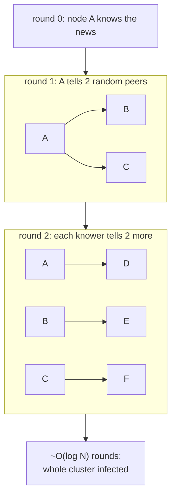

## In simple terms

Gossip protocols spread information the way rumours spread in a social network: tell a few friends, they tell a few of their friends, and within a logarithmic number of rounds every node has heard. No central coordinator is needed — each node just picks a few random peers every second and exchanges state. The result is highly resilient: nodes can crash, messages can be lost, and information still propagates reliably.

## The Visual Map



## More detail

In a gossip protocol running on a cluster of N nodes, each round a node selects k random peers (typically k = 3–5) and exchanges information with them. After O(log N) rounds, information has reached every node with high probability. The bandwidth cost is O(N log N) messages per round rather than O(N²) for a naive broadcast.

**Anti-entropy gossip** exchanges entire local state summaries (digests) and syncs any differences. Used by Cassandra's read-repair and DynamoDB for data consistency.

**Rumour-mongering** spreads a specific piece of information — a new cluster member, a dead node, a configuration update — until every node has heard it, at which point nodes lose interest and stop propagating. Used for event dissemination.

**Failure detection:** nodes piggyback heartbeat sequence numbers in gossip messages. If a node's counter hasn't incremented across multiple gossip rounds, it is suspected dead. SWIM (Scalable Weakly-consistent Infection-style Membership) protocol combines gossip failure detection with a direct-probe mechanism to reduce false positives.

**CRDT gossip:** eventually-consistent data types ([CRDTs](/t/crdt)) are ideal for gossip propagation — their merge is commutative and idempotent, so any two nodes can exchange partial state and converge to the same result regardless of order.

Properties: gossip protocols are **scalable** (cost grows logarithmically), **decentralised** (no coordinator), **fault-tolerant** (any subset can fail), and **eventually consistent** (no strong ordering guarantees). They are not suitable for strict consensus or linearisable operations. Gossip powers the membership and failure-detection layers of nearly every large distributed system: Cassandra, Riak, DynamoDB, and Consul use SWIM-based gossip; Bitcoin's peer-to-peer network gossips transactions.

## Under the Hood

The core loop — push state to a few random peers each round — is tiny; what's remarkable is how fast it converges:

```python
import random

def gossip_round(knows, peers_per_round=2):
    """Each informed node pushes to k random peers."""
    newly = set()
    informed = [n for n in knows if knows[n]]
    for node in informed:
        for _ in range(peers_per_round):
            peer = random.randrange(len(knows))
            newly.add(peer)
    for n in newly:
        knows[n] = True
    return sum(knows.values())

for N in (100, 1000, 10000):
    random.seed(0)
    knows = {i: False for i in range(N)}
    knows[0] = True                       # patient zero
    rounds = 0
    while sum(knows.values()) < N:
        gossip_round(knows)
        rounds += 1
    import math
    print(f"N={N:>5}: full coverage in {rounds} rounds  (log2 N = {math.log2(N):.1f})")
```

A 100× larger cluster needs only a handful more rounds — convergence tracks log N, not N. That logarithmic scaling is exactly why gossip survives at clusters of thousands where any O(N) broadcast would collapse.

## Engineering Trade-offs

- **Robustness vs latency.** No coordinator means no single point of failure and graceful tolerance of lost messages — paid for in probabilistic, multi-round delivery. Gossip is wrong for "commit this now," right for "everyone should know within a few seconds."
- **Redundancy vs bandwidth.** A higher fan-out (k) converges faster and tolerates more loss, but nodes receive the same news many times over (the epidemic's wasted re-tellings). Tuning k trades speed against the duplicate traffic that O(N log N) implies.
- **Anti-entropy vs rumour-mongering.** Exchanging full state digests guarantees convergence but moves more data each round; rumour-mongering is lean but nodes stop spreading once "bored," risking a straggler that missed the window. Real systems (Cassandra) run both.
- **Eventually consistent by construction.** Gossip gives probabilistic, unordered delivery — excellent for membership and failure detection, useless for anything needing linearizability. That's why clusters gossip *membership* but run [Raft](/t/raft) for the *data* that must be consistent.

## Real-world examples

- **Cassandra** uses gossip for cluster membership — each node knows every other node's status within a few gossip rounds.
- **Consul** uses SWIM gossip for agent health monitoring in its service discovery layer.
- **Amazon S3** propagates metadata changes via gossip across storage nodes.
- Bitcoin and Ethereum peer-to-peer networks gossip unconfirmed transactions to all reachable nodes.

## Common misconceptions

- **"Gossip means eventual consistency everywhere."** Gossip is a dissemination mechanism; the level of consistency depends on what is being gossiped. Gossip can propagate Raft log entries or CRDT state.
- **"Gossip is unreliable."** Any specific message may be lost, but gossip provides probabilistic guarantees that converge to near-certainty in O(log N) rounds — which is robust enough for membership and failure detection in practice.

## Try it yourself

Compare gossip's convergence against the O(log N) prediction, and watch it shrug off lost messages:

```bash
python3 -c "
import random, math
def converge(N, k, loss=0.0):
    random.seed(1)
    knows = [False]*N; knows[0] = True
    rounds = 0
    while not all(knows):
        rounds += 1
        for n in [i for i, v in enumerate(knows) if v]:
            for _ in range(k):
                if random.random() < loss:   # message dropped
                    continue
                knows[random.randrange(N)] = True
    return rounds

for N in (1000, 10000):
    print(f'N={N}: {converge(N, k=3)} rounds (perfect net), '
          f'{converge(N, k=3, loss=0.3)} rounds with 30% packet loss  '
          f'[log2 N = {math.log2(N):.0f}]')
"
```

Thirty percent of messages vanish and convergence barely slows — redundancy across random peers is what makes gossip robust where a single broadcast tree would shatter.

## Learn next

- [CRDT](/t/crdt) — the merge semantics for gossiped state.
- [Eventual consistency](/t/eventual-consistency) — the model gossip delivers.
- [Consensus](/t/consensus) — the strong-ordering alternative gossip deliberately isn't.
