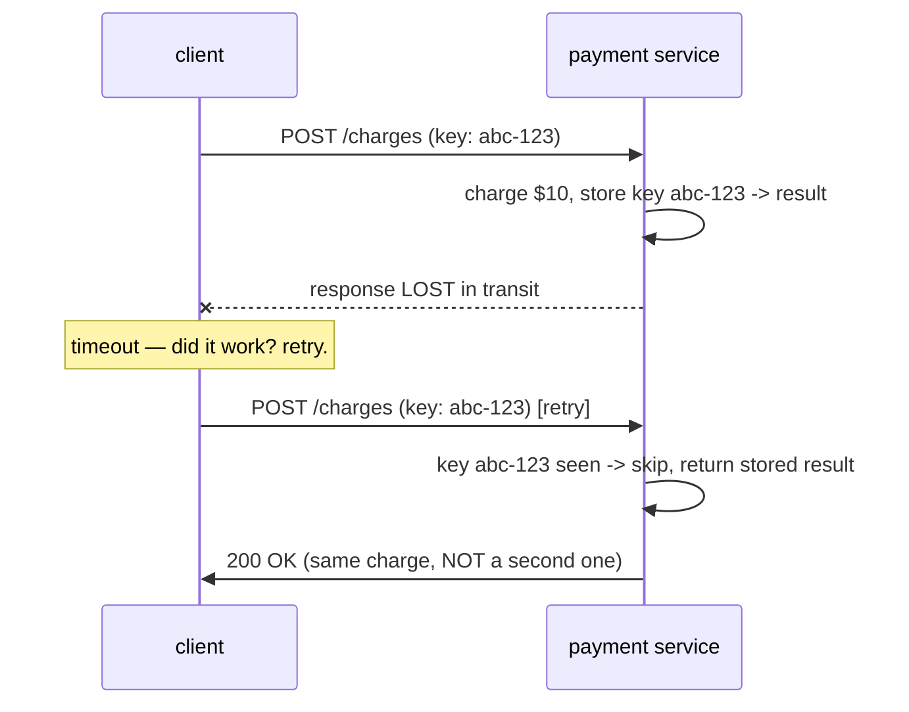

## In simple terms

In a distributed system, "did that request succeed?" is genuinely hard to answer — the network can fail after you sent the request but before you received the reply. If your operation is **idempotent**, you can safely retry: doing it again produces the same result as doing it once. "Set value to X" is idempotent (repeating is harmless). "Add $10 to balance" is not (repeating charges twice).

## The Visual Map



## More detail

**Mathematical definition:** an operation `f` is idempotent if `f(f(x)) = f(x)` — applying it twice gives the same result as applying it once.

**HTTP methods:** `GET`, `PUT`, `DELETE`, and `HEAD` are defined as idempotent by the HTTP spec. `POST` and `PATCH` are not (by default). `PUT` replaces a resource entirely; applying it twice puts the same state twice — idempotent. `DELETE` removes a resource; a second call returns 404 but doesn't cause additional harm — idempotent. `POST` creates a new resource each time — not idempotent.

**Idempotency keys:** for non-idempotent operations (payments, email sends), add a unique client-generated `Idempotency-Key` header. The server stores the key and its response. On a duplicate request with the same key, return the stored response without re-executing. Stripe, PayPal, and all major payment APIs support this:

```http
POST /charges
Idempotency-Key: client-uuid-12345
{ "amount": 1000, "currency": "usd" }
```

**Database-level idempotency:** `INSERT ... ON CONFLICT DO NOTHING`, `UPSERT`, conditional writes (`UPDATE WHERE version = expected`) — all are idempotent forms of write. Logical replication uses sequence numbers so replaying a log entry twice leaves the database in the same state as replaying it once.

**At-least-once delivery:** message queues (Kafka, SQS) guarantee messages are delivered at least once — meaning duplicates are possible. Consumers must handle duplicate messages. The two strategies are: make the consumer operation intrinsically idempotent, or track processed message IDs and skip duplicates.

Retries are the primary recovery mechanism for transient failures in distributed systems — networks drop packets, servers timeout, connections reset. If operations are not idempotent, retries cause double-charging, duplicate emails, or duplicated records. Designing idempotent APIs and data pipelines converts uncertain single-attempt semantics into safe at-least-once semantics, which is far easier to reason about.

## Under the Hood

The idempotency-key pattern is a store-and-replay around the side effect:

```python
class PaymentService:
    def __init__(self):
        self.seen = {}                       # key -> stored response

    def charge(self, key, amount):
        if key in self.seen:                 # 1. seen before? replay, don't re-run
            return {**self.seen[key], "replayed": True}

        receipt = self._do_charge(amount)    # 2. the irreversible side effect
        self.seen[key] = receipt             # 3. record BEFORE returning
        return {**receipt, "replayed": False}

    def _do_charge(self, amount):
        return {"status": "charged", "amount": amount, "txn": id(object())}

svc = PaymentService()
key = "client-uuid-12345"
print(svc.charge(key, 1000))     # really charges
print(svc.charge(key, 1000))     # retry: replayed, no second charge
```

Two subtleties decide correctness in production: the key must be stored *atomically with* the side effect (else a crash between steps 2 and 3 double-charges on retry — payment systems put both in one DB transaction), and stored keys need a TTL so the table doesn't grow forever.

## Engineering Trade-offs

- **Designed-in vs bolted-on.** Some operations are naturally idempotent (`PUT`, `UPSERT`, set-to-X); the rest need explicit keys and a dedup store. The cheap path is structuring writes to be naturally idempotent; the key store is the fallback when the side effect is inherently "once" (charge, email, ship).
- **Dedup window vs storage.** Keys must be remembered long enough to cover every realistic retry (Stripe: 24h) but expired eventually. Too short and a late retry double-acts; too long and the store balloons. The TTL is a bet on your maximum retry horizon.
- **Atomicity is the hard part.** Recording the key and performing the effect must succeed or fail together. Split them and a crash in between gives you either a double-action (effect, no key) or a lost action (key, no effect) — which is why the dedup record usually shares the effect's transaction.
- **Scope of the key.** Per-user keys prevent cross-customer collisions but need user context; global UUIDs are simpler and rely on randomness. The choice shapes how the dedup store is partitioned at scale.

## Real-world examples

- Stripe charges fail silently in transit; idempotency keys ensure retrying a charge never double-charges a customer.
- Kafka consumers checkpoint their offset only after successfully processing a message; a crash replays from the last checkpoint — idempotent consumers handle the replay.
- ETL pipelines use idempotent upserts so re-running a daily job doesn't duplicate rows.
- AWS Lambda functions are recommended to be idempotent because SQS can deliver an event more than once.

## Common misconceptions

- **"Retry logic is enough."** Retrying a non-idempotent operation amplifies the problem. Idempotency must be designed in, not bolted on.
- **"HTTP GET is always safe AND idempotent."** GET is idempotent by spec but not all implementations honour this — a GET that increments a view counter changes server state and is not truly idempotent.

## Try it yourself

Pit a non-idempotent operation against an idempotent one under a retrying, lossy client:

```bash
python3 -c "
import random
random.seed(8)

balance = {'naive': 0, 'keyed': 0}
applied_keys = set()

def send_with_retries(apply_fn):
    delivered = False
    while not delivered:
        apply_fn()                          # server applies the effect...
        delivered = random.random() > 0.5   # ...but the ACK may be lost -> retry

# non-idempotent: every (re)delivery adds again
def naive():
    balance['naive'] += 10
send_with_retries(naive)

# idempotent: a key guards the effect
def keyed(key='txn-1'):
    if key in applied_keys: return
    applied_keys.add(key); balance['keyed'] += 10
send_with_retries(keyed)

print(f'non-idempotent balance: {balance[\"naive\"]}  (retries each added \$10)')
print(f'idempotent balance    : {balance[\"keyed\"]}  (retries were no-ops)')
"
```

Same lossy network, same retries — the keyed version lands on $10 no matter how many times the request was redelivered.

## Learn next

- [Circuit breaker](/t/circuit-breaker) — decides *when* to retry; idempotency decides whether it's *safe*.
- [Rate limiting](/t/rate-limiting) — the third pillar of the resilience toolkit.
- [Saga pattern](/t/saga-pattern) — whose compensations rely on idempotent steps.
