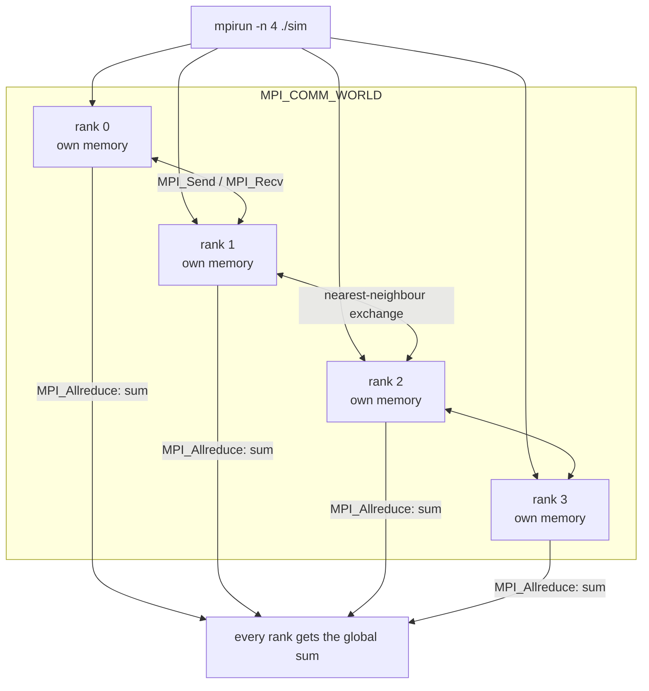

## In simple terms

When a simulation needs 10,000 CPU cores working together, something must coordinate them. MPI (Message Passing Interface) is the standard that all of high-performance computing agreed on: each process has its own memory (no shared state), and processes communicate by explicitly calling `MPI_Send` and `MPI_Recv`. Write one program, launch it on N nodes, and each instance receives a unique rank and knows how to talk to the others.

## The Visual Map



## More detail

MPI is a library specification (not an implementation) — implementations include OpenMPI, MPICH, and vendor-optimised variants for supercomputer interconnects (Cray, IBM Spectrum MPI, Intel MPI). The programming model:

**Point-to-point communication:**
- `MPI_Send(buf, count, type, dest, tag, comm)` — send to rank `dest`.
- `MPI_Recv(buf, count, type, src, tag, comm, status)` — receive.
- Non-blocking variants (`MPI_Isend`, `MPI_Irecv`) allow overlap of computation and communication.

**Collective operations** (all processes participate simultaneously):
- `MPI_Bcast` — root process broadcasts to all.
- `MPI_Reduce / MPI_Allreduce` — combine values from all processes (sum, max, etc.) and deliver to root or all.
- `MPI_Scatter / MPI_Gather` — distribute a dataset across processes or collect it back.
- `MPI_Barrier` — synchronise all processes at a point.

**Communicators and topologies:** `MPI_COMM_WORLD` contains all processes. Sub-communicators group related processes. Cartesian or graph topologies label processes with coordinates, enabling structured communication patterns (e.g. nearest-neighbour exchange in a 3D grid simulation).

**One-sided communication (RMA):** `MPI_Put`, `MPI_Get`, `MPI_Accumulate` — write directly to a remote memory window without the remote process calling a receive. Used for fine-grained irregular communication.

MPI is typically combined with [OpenMP](/t/openmp) in a **hybrid MPI+OpenMP** model: one MPI process per node, multiple OpenMP threads per process — MPI handles inter-node communication; OpenMP handles intra-node parallelism on shared-memory cores. It is the de facto standard for HPC: weather forecasting, molecular dynamics, quantum chemistry, and climate modelling all run on MPI, and large-scale ML training uses collectives conceptually identical to `MPI_Allreduce`.

## Under the Hood

The canonical first MPI program — SPMD (single program, multiple data): every rank runs identical code but branches on its rank:

```c
#include <mpi.h>
#include <stdio.h>

int main(int argc, char** argv) {
    MPI_Init(&argc, &argv);

    int rank, size;
    MPI_Comm_rank(MPI_COMM_WORLD, &rank);   // who am I? (0..size-1)
    MPI_Comm_size(MPI_COMM_WORLD, &size);   // how many of us?

    int my_value = (rank + 1) * 10;         // each rank holds different data
    int total = 0;

    // every rank contributes my_value; every rank receives the sum
    MPI_Allreduce(&my_value, &total, 1, MPI_INT, MPI_SUM, MPI_COMM_WORLD);

    printf("rank %d of %d: my=%d, global sum=%d\n", rank, size, my_value, total);

    MPI_Finalize();
    return 0;
}
// mpicc sum.c -o sum && mpirun -n 4 ./sum
//   rank 0 of 4: my=10, global sum=100   (10+20+30+40)
//   rank 1 of 4: my=20, global sum=100   ...
```

One source file, launched as N processes; `rank` is the only thing that differs between them, and `MPI_Allreduce` is a single call that internally runs a whole communication algorithm (often the ring below) to combine and redistribute.

## Engineering Trade-offs

- **Explicit messages vs shared-memory ease.** Forcing every exchange to be a `Send`/`Recv` makes data movement visible and tunable — the basis of HPC's extreme scaling — at the cost of far more code and care than shared memory, where communication is implicit.
- **Communication is the scaling wall.** Computation parallelises easily; the limit is interconnect latency and bandwidth. Past some node count, `Allreduce` cost dominates, which is why algorithm choice (ring vs tree vs hierarchical) and computation/communication overlap (`Isend` + compute) decide real-world efficiency.
- **Collectives vs hand-rolled point-to-point.** Library collectives are tuned to the machine's topology and almost always beat naive loops of sends — but they're synchronisation points: one slow rank stalls everyone (the straggler problem that haunts large jobs).
- **Static SPMD vs elasticity.** Classic MPI fixes the process count at launch and assumes no node fails — brutally efficient on dedicated supercomputers, a poor fit for the cloud's elastic, failure-prone fleets, which is why cloud-native workloads favour different models.

## Real-world examples

- **GROMACS** and **NAMD** simulate molecular dynamics on thousands of CPUs using MPI for domain decomposition.
- **PyTorch distributed training** uses `dist.all_reduce` (backed by NCCL on GPUs or Gloo on CPUs) — the same collective concept as `MPI_Allreduce`.
- The **TOP500** list of fastest supercomputers benchmarks systems with the HPL Linpack benchmark, which is a pure MPI workload.
- **WRF** (Weather Research and Forecasting model) uses MPI to decompose the atmosphere across thousands of cores.

## Common misconceptions

- **"MPI is only for Fortran and C."** MPI has bindings for Python (mpi4py), Java, and R. Many scientific Python packages (petsc4py, h5py with parallel HDF5) use MPI under the hood.
- **"Shared memory within a node makes MPI unnecessary."** For intra-node communication, shared memory is faster; that's why hybrid MPI+OpenMP is preferred. MPI is for inter-node — shared memory doesn't cross network cards.

## Try it yourself

`MPI_Allreduce` isn't magic — it's the **ring-allreduce** algorithm (the same one NCCL uses for GPU training). Simulate it with plain processes and watch each rank end with the global sum:

```bash
python3 -c "
# ring-allreduce: P ranks, each starts with one value, all end with the sum.
# each rank only ever talks to its ring neighbour, for P-1 steps.
P = 4
start = [10, 20, 30, 40]
acc    = start[:]          # what each rank has accumulated so far
parcel = start[:]          # the value currently arriving at each rank

for step in range(P - 1):
    parcel = [parcel[(r - 1) % P] for r in range(P)]   # pass right around the ring
    acc    = [acc[r] + parcel[r] for r in range(P)]    # add what just arrived
    print(f'after step {step+1}: {acc}')

print('every rank holds the sum:', acc, '(=', sum(start), ')')
print('each rank sent', P - 1, 'messages, not', P * (P - 1), 'for all-to-all')
"
```

The point is the communication pattern: a ring means every rank moves the same amount of data regardless of P, which is exactly why ring-allreduce scales to thousands of GPUs where a naive all-to-all would choke.

## Learn next

- [OpenMP](/t/openmp) — the intra-node, shared-memory half of hybrid HPC.
- [Actor model](/t/actor-model) — message passing for latency-tolerant distributed apps.
- [Distributed system](/t/distributed-system) — the broader field MPI specialises for tightly-coupled compute.
