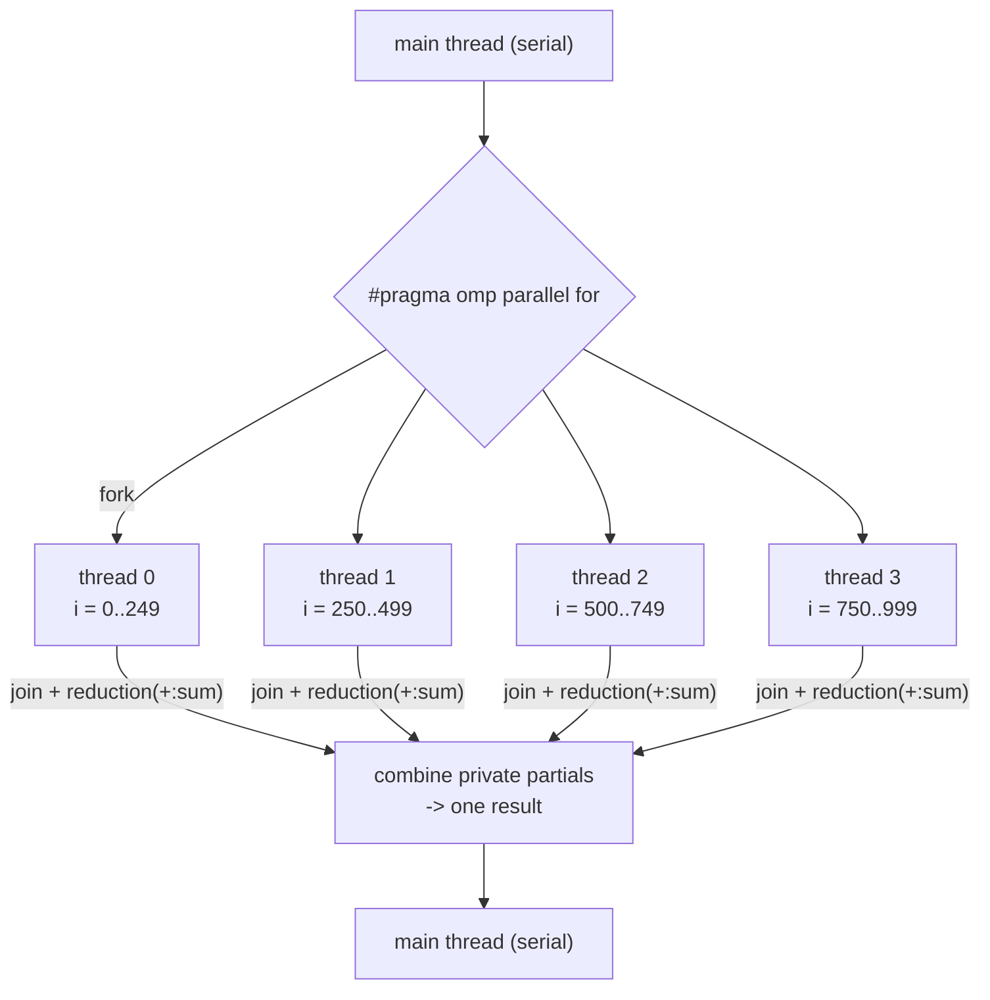

## In simple terms

OpenMP makes it almost trivial to parallelise a loop in C or Fortran: add `#pragma omp parallel for` above a for loop, compile with `-fopenmp`, and the compiler automatically spawns one thread per core and divides the loop iterations among them. No mutexes, no thread creation code, no work queue — just the pragma. For compute-bound loops over independent iterations, this can achieve near-linear speedup with two lines of change.

## The Visual Map



## More detail

OpenMP is a directive-based extension: the compiler sees the pragmas and generates the threading code; a non-OpenMP compiler sees them as comments and compiles serial code. This portability is intentional.

**Core constructs:**

```c
#pragma omp parallel for reduction(+:sum)
for (int i = 0; i < N; i++) {
    sum += a[i] * b[i];   // dot product, parallelised
}
```

- `parallel` — fork a team of threads; join at the end of the block.
- `for` — distribute loop iterations across the team (requires no loop-carried dependencies).
- `reduction(+:sum)` — each thread accumulates into a private copy of `sum`; copies are combined at the end.
- `private(x)` — each thread gets its own copy of `x`.
- `shared(y)` — all threads share `y` (the default); reads are fine, concurrent writes need synchronisation.
- `critical` — a mutex-protected section; all threads may execute it, one at a time.
- `atomic` — cheaper than `critical` for simple operations (`x++`, `x += v`).

**Scheduling:** `schedule(static)` divides iterations evenly upfront; `schedule(dynamic)` steals chunks as threads finish — better for irregular-cost iterations.

**Task parallelism:** `#pragma omp task` creates an explicit task (useful for recursive or graph-structured work like tree traversal that doesn't fit a parallel for loop).

**SIMD integration:** `#pragma omp simd` hints that a loop should be vectorised with SIMD in addition to thread-level parallelism.

OpenMP is typically combined with [MPI](/t/mpi-basics) in hybrid programs: OpenMP parallelises across cores on one node; MPI parallelises across nodes. It reduces the barrier to shared-memory parallelism from "implement a thread pool" to "add a pragma", and is the shared-memory parallel model most scientists learn first.

## Under the Hood

The `reduction` clause is where OpenMP earns its keep — it silently solves the race that a naive `sum +=` from many threads would create:

```c
#include <stdio.h>
#include <omp.h>

int main(void) {
    long n = 100000000, sum = 0;

    // WITHOUT reduction this would be a data race: every thread
    // read-modify-writes the same `sum`. The clause gives each thread
    // a PRIVATE partial sum, then adds them once at the join.
    #pragma omp parallel for reduction(+:sum)
    for (long i = 1; i <= n; i++)
        sum += i;

    printf("sum 1..%ld = %ld  (threads used: %d)\n",
           n, sum, omp_get_max_threads());
    return 0;
}
// gcc -fopenmp sum.c -o sum && ./sum
// the compiler turned one pragma into: fork team, split the range,
// per-thread accumulation, barrier, combine. No lock in sight.
```

What looks like one annotated loop expands, at compile time, into thread creation, range partitioning, private accumulators, a join barrier, and the final combine — the threading boilerplate you'd otherwise hand-write, generated and tuned by the compiler.

## Engineering Trade-offs

- **Incremental parallelism vs hidden ceilings.** One pragma can near-linearly speed up a clean loop — but only if iterations are truly independent and the work is compute-bound. A loop-carried dependency makes the pragma silently wrong; a memory-bandwidth-bound loop makes it silently useless past a couple of cores.
- **`reduction`/`private` vs `critical`.** Reductions and private variables give each thread its own state and combine cheaply at the end; falling back to `critical`/`atomic` serialises threads at that point and can erase the speedup. Choosing the right data-sharing clause *is* the performance work.
- **Static vs dynamic scheduling.** Static splitting has zero overhead and perfect cache locality for uniform iterations; dynamic work-stealing handles irregular per-iteration cost but adds synchronisation. The wrong choice shows up as idle cores waiting on one slow chunk.
- **Shared-memory only — by design.** All threads share one address space, which is what makes it so simple and confines it to a single node. Scaling past one machine requires [MPI](/t/mpi-basics); the hybrid model exists precisely because neither alone covers both axes.

## Real-world examples

- **GROMACS** molecular dynamics simulator uses OpenMP for within-node parallelism alongside MPI for between-node.
- GCC and Clang both support OpenMP; `-fopenmp` is a one-flag change.
- **FFTW** (the fast Fourier transform library used everywhere) supports OpenMP for threaded transforms.
- NumPy's BLAS backend (OpenBLAS, MKL) uses OpenMP threads internally for matrix operations.

## Common misconceptions

- **"OpenMP scales to multiple machines."** OpenMP is **shared-memory only** — all threads share one address space. For multi-node scaling, use [MPI](/t/mpi-basics).
- **"Just add the pragma and it gets faster."** Only if iterations are independent (no loop-carried dependencies) and work is compute-bound rather than memory-bound. Parallelising a memory-bandwidth-limited loop across 16 cores does nothing if RAM is the bottleneck.

## Try it yourself

Compile a real OpenMP program and measure the speedup as you add threads (gcc ships with OpenMP on stock Ubuntu/WSL):

```bash
# requires: gcc
cat > /tmp/omp.c <<'EOF'
#include <stdio.h>
#include <omp.h>
int main(void) {
    long n = 500000000, sum = 0;
    double t = omp_get_wtime();
    #pragma omp parallel for reduction(+:sum)
    for (long i = 1; i <= n; i++) sum += i % 7;
    printf("threads=%d  sum=%ld  time=%.3fs\n",
           omp_get_max_threads(), sum, omp_get_wtime() - t);
    return 0;
}
EOF
gcc -fopenmp -O2 /tmp/omp.c -o /tmp/omp
for t in 1 2 4 8; do OMP_NUM_THREADS=$t /tmp/omp; done
```

Watch the time roughly halve from 1 to 2 to 4 threads, then flatten as you run out of physical cores or hit memory bandwidth — the practical ceiling every parallel speedup eventually meets.

## Learn next

- [MPI basics](/t/mpi-basics) — the across-nodes counterpart in hybrid HPC.
- [Thread](/t/thread) — the OS primitive OpenMP manages for you.
- [SIMD](/t/simd) — data-level parallelism that stacks on top of OpenMP's thread-level.
