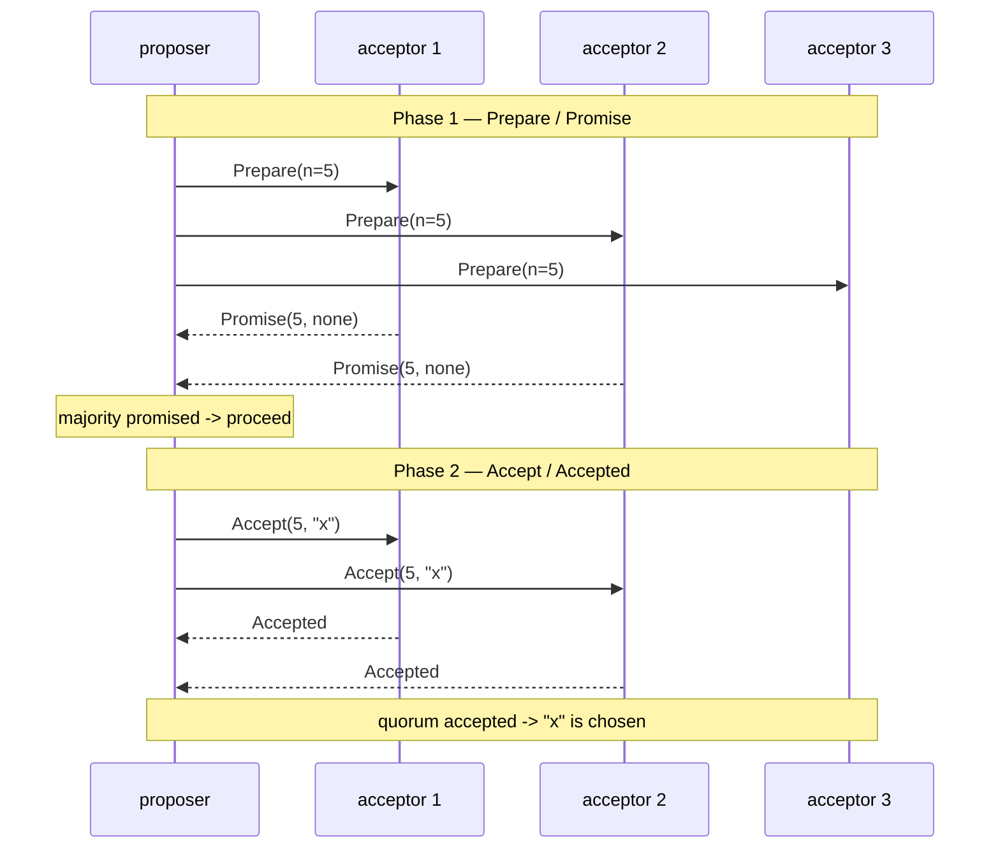

## In simple terms

Paxos solves one precise problem: get a group of servers to agree on a single value, even if messages are delayed, duplicated, or lost, and even if some servers crash (but not all). Lamport published it in 1989 (circulated as a technical report, published 1998); it became the foundation of almost all distributed consensus theory. The algorithm is famously counterintuitive — Lamport himself wrote a paper titled "Paxos Made Simple" because the original was so hard to follow.

## The Visual Map



## More detail

**Single-decree Paxos** (the basic form) achieves agreement on one value in two phases:

**Phase 1 — Prepare/Promise.** A **proposer** picks a unique proposal number `n` and broadcasts `Prepare(n)` to a quorum (majority) of **acceptors**. Each acceptor that hasn't already promised a higher number responds with `Promise(n, last_accepted)` — committing to reject any future proposals with number < n, and reporting any value it has already accepted.

**Phase 2 — Accept/Accepted.** If the proposer receives promises from a quorum, it sends `Accept(n, v)` where `v` is either the value from the highest-numbered previous acceptance (if any acceptor reported one) or the proposer's own value. Acceptors accept the proposal if they haven't promised a higher `n`, and notify **learners**. Once a quorum accepts, consensus is reached.

**Why it works:** any two quorums overlap by at least one server. That server "connects" any two phases, ensuring previously chosen values cannot be overridden.

**Multi-Paxos** extends this to a log of values by electing a stable leader (the proposer) who skips Phase 1 for subsequent slots — reducing message complexity and the source of most practical implementations.

**Limitations of the spec:** the original paper specifies only single-decree agreement. Leader election, log management, cluster reconfiguration, and snapshotting — all necessary for a real system — are left as exercises. This gap is why [Raft](/t/raft) was designed: to specify all those pieces explicitly.

Notable variants: **Multi-Paxos** (stable leader, log-level agreement), **Fast Paxos** (lower latency by skipping the leader), **EPaxos** (leaderless, reorders commuting operations), **Flexible Paxos** (smaller quorums for read-heavy workloads).

## Under the Hood

The subtle, load-bearing rule is in Phase 2: a proposer does not always propose its *own* value. The acceptor and proposer logic that guarantees safety:

```python
class Acceptor:
    def __init__(self):
        self.promised = -1            # highest n promised
        self.accepted = None          # (n, value) actually accepted

    def prepare(self, n):
        if n > self.promised:
            self.promised = n
            return ("promise", self.accepted)   # report any prior acceptance
        return ("reject", None)

    def accept(self, n, v):
        if n >= self.promised:
            self.promised = n
            self.accepted = (n, v)
            return "accepted"
        return "reject"

def propose(proposer_value, n, acceptors):
    promises = [a.prepare(n) for a in acceptors]
    oks = [p for tag, p in promises if tag == "promise"]
    if len(oks) <= len(acceptors) // 2:
        return None                              # no quorum
    # THE crucial step: if any acceptor already accepted a value,
    # we MUST re-propose the highest-numbered one, not our own.
    prior = [acc for acc in oks if acc is not None]
    value = max(prior, key=lambda a: a[0])[1] if prior else proposer_value
    if sum(a.accept(n, value) == "accepted" for a in acceptors) > len(acceptors)//2:
        return value
    return None

acceptors = [Acceptor() for _ in range(3)]
print(propose("x", n=1, acceptors))   # 'x' chosen
print(propose("y", n=2, acceptors))   # 'x' again! a later proposer ADOPTS the
                                      # already-chosen value — this is safety
```

That second call returning `'x'` instead of `'y'` is the heart of Paxos: once a value can have been chosen, every higher-numbered proposal is forced to propose the same value. The quorum overlap guarantees the new proposer *sees* it.

## Engineering Trade-offs

- **Proven safety vs specified completeness.** Paxos gives an airtight correctness proof for single-decree agreement — and leaves leader election, log compaction, and reconfiguration entirely to the implementer. That gap produced a generation of subtly-broken implementations and, eventually, [Raft](/t/raft).
- **Two phases vs one round-trip.** Basic Paxos costs two round-trips per decision; Multi-Paxos amortises Phase 1 away by keeping a stable leader, trading the pure-protocol symmetry for the practical need of a leader (and leader-election machinery the spec doesn't describe).
- **Crash-stop only.** Paxos assumes nodes fail by halting, not by lying — which keeps it at 2f+1 nodes and cheap. Adversarial or buggy nodes that send conflicting messages break it; Byzantine agreement (3f+1, more rounds) is the costly alternative.
- **Liveness is not guaranteed.** Per FLP, no asynchronous consensus can guarantee progress; dueling proposers can livelock forever bumping proposal numbers. Real systems add leader election and randomised backoff to make progress *practically* certain — never theoretically.

## Real-world examples

- **Google Chubby** (the lock service underlying Bigtable and Spanner) uses Multi-Paxos.
- **Google Spanner** uses Paxos for cross-region replication of each shard.
- **Apache Zookeeper** uses Zab, a Paxos derivative, for its atomic broadcast.
- **Amazon DynamoDB** uses a Paxos variant for metadata coordination.

## Common misconceptions

- **"Paxos is provably optimal."** It is proven correct for crash-stop failures in a partially synchronous model. It makes no progress under Byzantine (arbitrary) failures — that requires BFT protocols.
- **"Raft replaced Paxos."** Raft replaced Paxos as the preferred *implementation* choice for new systems; Paxos remains the theoretical reference point.

## Try it yourself

Demonstrate the safety property directly — once a value is chosen, a competing later proposal is forced to adopt it:

```bash
python3 -c "
class Acceptor:
    def __init__(self): self.promised, self.accepted = -1, None
    def prepare(self, n):
        if n > self.promised: self.promised = n; return self.accepted
        return 'reject'
    def accept(self, n, v):
        if n >= self.promised: self.promised, self.accepted = n, (n, v); return True
        return False

def propose(value, n, acc):
    oks = [a.prepare(n) for a in acc]
    if oks.count('reject') > len(acc)//2: return None
    prior = [o for o in oks if o not in (None, 'reject')]
    v = max(prior, key=lambda a: a[0])[1] if prior else value   # adopt if chosen
    if sum(a.accept(n, v) for a in acc) > len(acc)//2: return v
    return None

acc = [Acceptor() for _ in range(3)]
print('proposer 1 proposes x ->', propose('x', 1, acc))
print('proposer 2 proposes y ->', propose('y', 2, acc), '(forced to adopt x)')
print('proposer 3 proposes z ->', propose('z', 9, acc), '(still x — value is locked)')
"
```

Three different proposers, three different intended values, one outcome: the first chosen value wins forever. That immutability is what "consensus" actually buys you.

## Learn next

- [Raft](/t/raft) — the implementation-friendly reformulation of these ideas.
- [Consensus](/t/consensus) — the general problem Paxos was the first to solve.
- [Gossip protocol](/t/gossip-protocol) — the contrasting coordination-free approach.
