## In simple terms

Raft is a recipe for getting a cluster of servers to agree on a sequence of values, even when some servers crash or messages are lost. It decomposes the problem into three separable sub-problems — **leader election**, **log replication**, and **safety** — and handles each in a way that is meant to be traceable by a human reader. If you've used etcd, CockroachDB, or TiKV, you've relied on Raft.

## The Visual Map

```mermaid
stateDiagram-v2
  [*] --> Follower
  Follower --> Candidate: election timeout<br/>(no heartbeat from leader)
  Candidate --> Leader: wins majority of votes
  Candidate --> Follower: another leader appears<br/>(higher term)
  Candidate --> Candidate: split vote -> new term, retry
  Leader --> Follower: discovers higher term
  note right of Leader: sends heartbeats +<br/>AppendEntries; commits<br/>once a majority replicates
  note right of Follower: votes for first valid<br/>candidate per term
```



## More detail

Raft organises time into **terms** (monotonically increasing integers). Each term starts with an election; if no candidate wins, a new term begins. Exactly one **leader** exists per term (or none during elections).

**Leader election:** servers start as followers. If a follower receives no heartbeat from a leader within an election timeout (150–300 ms, randomised), it becomes a candidate, increments its term, and requests votes. A server votes for the first candidate it hears from in a term (provided the candidate's log is at least as up-to-date). The candidate that collects a majority wins and begins sending heartbeats.

**Log replication:** clients send commands only to the leader. The leader appends the command to its log, then sends `AppendEntries` RPCs to all followers. When a majority confirms the entry, the leader **commits** it — applies it to the state machine and replies to the client. The leader then notifies followers in subsequent `AppendEntries` messages; they commit too.

**Safety invariants:**
- A server only votes for a candidate whose log is at least as complete as its own (prevents electing a server that's missing committed entries).
- A leader never overwrites committed entries.
- Two servers can never have different committed entries at the same log index in the same term.

**Log compaction:** to prevent the log growing forever, Raft supports **snapshotting** — periodically write the entire state machine to disk, discard the log prefix before that point.

Raft was explicitly designed for understandability where Paxos is proven but underspecified: implementing a real system requires solving leader election, log management, and reconfiguration not described in the original Paxos paper, and Raft specifies all of these. It tolerates f failures with 2f+1 nodes, and split-brain is impossible because no two majorities can form simultaneously.

## Under the Hood

The randomised election timeout — Raft's neatest trick — is what makes leader election terminate instead of livelocking:

```python
import random

def run_election(n_nodes, max_rounds=10):
    """Each node waits a random timeout; the first to fire becomes candidate.
       Randomisation makes simultaneous candidacies (split votes) rare."""
    for round_num in range(1, max_rounds + 1):
        # each follower picks a timeout in [150, 300] ms
        timeouts = [random.randint(150, 300) for _ in range(n_nodes)]
        first = min(timeouts)
        contenders = [i for i, t in enumerate(timeouts) if t == first]
        if len(contenders) == 1:
            return round_num, contenders[0]      # clean win
        # tie: split vote, no majority -> new term, everyone retries
    return max_rounds, None

random.seed(2)
wins = [run_election(5) for _ in range(1000)]
clean = sum(1 for rounds, leader in wins if rounds == 1)
print(f'{clean}/1000 elections decided in the FIRST term')
print(f'avg terms to elect a leader: {sum(r for r, _ in wins)/len(wins):.2f}')
```

Because timeouts are randomised over a 150 ms spread, one node almost always fires first and wins before others wake — split votes are rare and self-correct on the next term. Paxos's dueling-proposers livelock becomes, in Raft, a quick re-roll of the dice.

## Engineering Trade-offs

- **Understandability vs theoretical minimalism.** Raft fixes a strong leader and a single log to stay teachable — accepting that all writes funnel through one node, where leaderless variants (EPaxos) extract more parallelism at a large cost in complexity most teams can't afford to verify.
- **Strong leader: simple, but a throughput ceiling.** One leader ordering every command gives clean linearizability and easy reasoning — and caps write throughput at one node's capacity. Multi-Raft (one group per shard) is the standard escape, distributing load across many leaders.
- **Randomised timeouts: liveness vs failover speed.** Short election timeouts detect a dead leader fast but risk spurious elections under load or network jitter; long ones are stable but slow to recover. The 150–300 ms range is a tuned compromise, not a law.
- **Commit needs a quorum round-trip.** Every committed entry waits for majority replication — durable and split-brain-proof, but cross-region clusters pay inter-region latency per write. Followers can serve only stale reads unless you route reads through the leader or use lease-based reads.

## Real-world examples

- **etcd** (Kubernetes' key-value store) uses Raft; every cluster operation (pod scheduling, secret storage) goes through etcd's Raft log.
- **CockroachDB** and **TiKV** use Raft per shard to replicate data across regions.
- **Consul** uses Raft for its service registry.
- **InfluxDB**, **RethinkDB**, and **Neo4j** (enterprise) use Raft variants.

## Common misconceptions

- **"Raft is slower than Paxos."** They have the same message complexity; Raft is sometimes faster in practice because leadership is stable and commit messages are one round-trip.
- **"The leader is a bottleneck."** The leader serialises commands, which is required for linearisability. Multi-Raft (many Raft groups, each for a partition) distributes the load across leaders.

## Try it yourself

Show why split votes are rare — and why removing the randomisation breaks it:

```bash
python3 -c "
import random

def elect(n, spread):
    # spread=0 means all nodes time out simultaneously (no randomisation)
    timeouts = [150 + random.randint(0, spread) for _ in range(n)]
    first = min(timeouts)
    return timeouts.count(first) == 1     # True = clean single winner

for spread in (0, 5, 150):
    random.seed(1)
    clean = sum(elect(5, spread) for _ in range(10000))
    label = 'NO randomisation' if spread == 0 else f'spread {spread}ms'
    print(f'{label:18}: {clean/100:.1f}% of elections had a clean winner')
"
```

With no randomisation every node fires at once and ties constantly; widen the spread and clean single-winner elections become overwhelmingly likely. That one design choice is what turns consensus from a livelock risk into a sub-second operation.

## Learn next

- [Paxos](/t/paxos) — the theory Raft repackaged for humans.
- [Consensus](/t/consensus) — the abstract guarantee both provide.
- [Distributed system](/t/distributed-system) — where "committed" semantics matter in practice.
