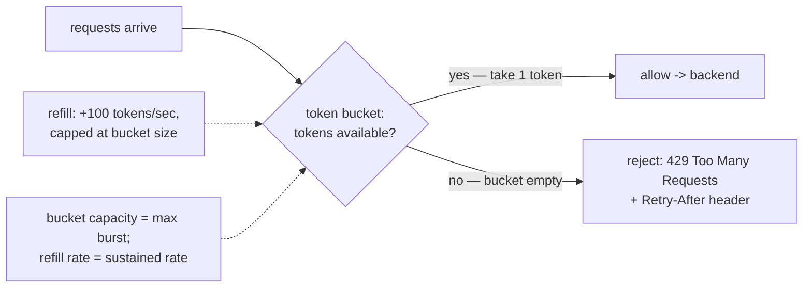

## In simple terms

Rate limiting puts a cap on how often a caller can invoke an API or resource in a given time window. Exceed the cap and you get a `429 Too Many Requests` response. It protects the service from being overwhelmed — by a misbehaving client, a scraper, or a traffic spike — and ensures that no single tenant starves others.

## The Visual Map



## More detail

**Algorithms for counting and enforcing:**

- **Fixed window counter** — increment a counter per client per time window (e.g. 1-minute buckets). Simple, but prone to burst at window boundaries: a client can fire limit requests at the end of one window and limit more at the start of the next, doubling the effective rate.
- **Sliding window log** — store timestamps of all requests in a rolling window. Precise but memory-heavy for high-traffic clients.
- **Sliding window counter** — a weighted hybrid of two fixed windows that approximates the sliding window with O(1) memory. Stripe and Cloudflare use this.
- **Token bucket** — each client has a bucket that refills at a fixed rate (e.g. 100 tokens/second). Each request costs 1 token; if the bucket is empty, reject. Allows short bursts up to bucket capacity.
- **Leaky bucket** — requests enter a queue and are processed at a fixed rate. Smooths traffic to a constant rate; excess is queued or dropped. Useful for output shaping (sending to downstream).

**Where to enforce:**

- **Client-side** — SDK retries with backoff; reduces wasted requests to the server.
- **API gateway / reverse proxy** — Nginx, Kong, AWS API Gateway, Cloudflare all implement rate limiting in the request path.
- **Application level** — in-process counters (per-process, not cluster-wide) or distributed counters in Redis/Memcached (cluster-wide, adds latency).

**Distributed rate limiting** requires a shared counter store. Redis `INCR` with expiry is the most common implementation. Approximate algorithms (token bucket in Redis Lua scripts, or a service like Envoy's rate-limit service) avoid hot-key contention.

**Quota types:** per-IP, per-user, per-API key, per-tenant, per-endpoint, per-cost (different operations cost different tokens).

Without rate limiting, a single misbehaving client — intentional or not — can exhaust your server's capacity and degrade service for all other users. Rate limiting is a fundamental reliability mechanism alongside [circuit breakers](/t/circuit-breaker) and [load balancing](/t/load-balancer), and it also enables monetisation: tiered API plans charge for higher rate limits.

## Under the Hood

The token bucket — the most-used algorithm — is a few lines, and its elegance is that it stores no history, just two numbers and a timestamp:

```python
import time

class TokenBucket:
    def __init__(self, rate, capacity):
        self.rate = rate            # tokens added per second (sustained rate)
        self.capacity = capacity    # max tokens (burst allowance)
        self.tokens = capacity
        self.last = time.monotonic()

    def allow(self, cost=1):
        now = time.monotonic()
        # refill lazily: no background timer, just compute elapsed * rate
        self.tokens = min(self.capacity, self.tokens + (now - self.last) * self.rate)
        self.last = now
        if self.tokens >= cost:
            self.tokens -= cost
            return True
        return False

bucket = TokenBucket(rate=5, capacity=10)        # 5/s sustained, burst of 10
allowed = sum(bucket.allow() for _ in range(15)) # hammer 15 at once
print(f'instant burst: {allowed} allowed, {15 - allowed} threw 429')
time.sleep(1)
print('after 1s refill:', sum(bucket.allow() for _ in range(8)), 'of 8 allowed')
```

Lazy refill is the trick: instead of a timer adding tokens, `allow` computes how many *would* have accrued since the last call. That makes it O(1) memory and trivially portable to a Redis Lua script for cluster-wide limits — the same five lines, shared state.

## Engineering Trade-offs

- **Burst tolerance vs smoothness.** Token bucket allows bursts up to capacity (good for bursty-but-legitimate clients); leaky bucket forces a constant output rate (good for protecting a fragile downstream). The choice is whether you're guarding *yourself* or someone you call.
- **Accuracy vs memory.** Sliding-window logs are exact but store every timestamp; fixed windows are O(1) but allow 2× bursts at boundaries; sliding-window counters split the difference — the pragmatic default Stripe and Cloudflare ship.
- **Local speed vs global correctness.** Per-process counters add zero latency but let N replicas each grant the full limit (effective N× the intended cap); a shared Redis counter is globally correct but adds a network hop and a hot-key bottleneck per limited entity.
- **Throttling vs rejecting.** A 429 with `Retry-After` is honest and cheap; queuing excess requests (leaky bucket) hides the limit but risks unbounded latency and memory. Rejecting early is usually kinder than accepting work you'll drop later.

## Real-world examples

- GitHub API limits unauthenticated clients to 60 req/hour and authenticated clients to 5,000 req/hour.
- Stripe's API uses a token bucket per key; bursts are allowed up to a capacity, then throttled.
- Cloudflare uses sliding-window rate limiting at the edge to absorb DDoS traffic before it reaches origin servers.
- AWS API Gateway applies per-stage and per-method rate limits to protect Lambda backends.

## Common misconceptions

- **"Rate limiting stops DDoS attacks."** It throttles them — a sufficiently distributed DDoS can still saturate bandwidth before rate limits apply. Rate limiting is one layer of defence, not the only one.
- **"Fixed window counting is good enough."** For most use cases it is; but APIs used by sophisticated clients (bots, automated pipelines) can exploit window boundaries for burst traffic.

## Try it yourself

Expose the fixed-window boundary exploit — the bug that motivates sliding windows — with a burst straddling the reset:

```bash
python3 -c "
LIMIT = 5     # 5 requests per 10-second window

# a client fires 5 at the END of window 1, then 5 at the START of window 2
events = [(9.8, 1), (9.8, 1), (9.8, 1), (9.8, 1), (9.8, 1),
          (10.1, 2), (10.1, 2), (10.1, 2), (10.1, 2), (10.1, 2)]

counts = {}
allowed = 0
for t, window in events:
    counts[window] = counts.get(window, 0) + 1
    if counts[window] <= LIMIT:
        allowed += 1

print(f'fixed-window allowed {allowed} requests in a ~0.3s span')
print(f'intended max for any 10s window: {LIMIT} -> client got {allowed/LIMIT:.0f}x the cap')
"
```

Ten requests in a third of a second, every one allowed, because they split across two windows the counter treats independently. Sliding-window counters weight the previous window to close exactly this gap.

## Learn next

- [Circuit breaker](/t/circuit-breaker) — fail fast when a dependency is already sick.
- [Idempotency](/t/idempotency) — what makes the client's retry-after-429 safe.
- [Load balancer](/t/load-balancer) — where edge rate limits are often enforced.
