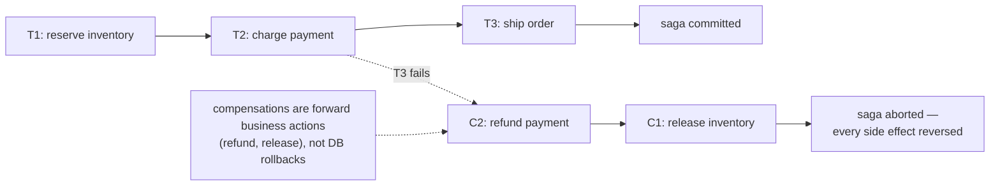

## In simple terms

In a single database you can wrap multiple operations in a transaction and roll everything back if anything fails. Across multiple microservices, there is no global transaction — each service owns its own database. The saga pattern solves this: break the distributed operation into a sequence of local transactions, and for each step define a **compensating transaction** that undoes it. If step 4 fails, run the compensating transactions for steps 3, 2, and 1 in reverse to undo the side effects.

## The Visual Map



## More detail

A saga is a sequence of `(T₁, C₁), (T₂, C₂), …, (Tₙ, Cₙ)` pairs, where `Tᵢ` is a local transaction and `Cᵢ` is its compensation. If `Tᵢ` fails, the saga runs `Cᵢ₋₁, Cᵢ₋₂, …, C₁` to roll back as far as necessary. Compensating transactions are business actions (cancel a reservation, issue a refund) not database rollbacks — they are new committed transactions, not undo logs.

**Two coordination styles:**

- **Choreography:** each service publishes an event after its transaction, and the next service listens and reacts. No central coordinator. Works well for short sagas; harder to visualise and debug as complexity grows.
- **Orchestration:** a central **saga orchestrator** (a state machine, often a separate service) sends commands to each participant and tracks progress. Easier to observe and retry; the orchestrator is a single point of coordination (not failure, if implemented with a durable state store).

**Challenges:**
- **Idempotency** — at-least-once delivery means steps can be called multiple times; each must be idempotent (produce the same result regardless of how many times it runs).
- **Isolation** — sagas do not provide the I in ACID; intermediate states are visible to concurrent transactions, which may cause dirty reads. Business logic must handle this (lock resources, use semantic locking, or tolerate transient inconsistency).
- **Pivot transaction** — the last step that can still be rolled back. Everything after it cannot be compensated (e.g., sending an email is irreversible).

Long-running distributed workflows — order fulfilment, travel booking, cross-system bank transfers — cannot use two-phase commit across microservices in production (it couples availability). Sagas trade strong isolation for availability, using [eventual consistency](/t/eventual-consistency) and compensating actions. Understanding sagas makes it possible to design microservices that handle failure without orphaned state.

## Under the Hood

An orchestrator saga is a forward loop with an unwind path — readable end to end:

```python
def run_saga(steps):
    # steps: list of (name, do, undo)
    done = []
    try:
        for name, do, undo in steps:
            do()                          # local transaction in some service
            done.append((name, undo))
            print(f'  {name}: ok')
        return 'committed'
    except Exception as e:
        print(f'  FAILED: {e} -> compensating in reverse')
        for name, undo in reversed(done): # unwind only what completed
            undo()
            print(f'  {name}: compensated')
        return 'aborted'

def fail(): raise RuntimeError('card declined')

print(run_saga([
    ('reserve-inventory', lambda: None, lambda: print('    release inventory')),
    ('charge-payment',    fail,        lambda: print('    refund payment')),
    ('ship-order',        lambda: None, lambda: print('    cancel shipment')),
]))
```

Two properties make it correct in production: only *completed* steps are compensated (the failing step rolled back its own local transaction), and every `do`/`undo` must be [idempotent](/t/idempotency), because the orchestrator retries on crash and may invoke a step twice.

## Engineering Trade-offs

- **Availability vs isolation.** Sagas avoid distributed locks (which would couple every service's uptime), but surrender the I in ACID: a half-finished saga's intermediate state is visible to others. You either tolerate it, or add semantic locks that claw back some of the coupling you avoided.
- **Choreography vs orchestration.** Event-driven choreography has no central component and is loosely coupled — and becomes impossible to follow past a few steps ("what happens after OrderPlaced?" has no single answer). Orchestration centralises the workflow into readable, observable state at the cost of a service everyone depends on.
- **Compensations are imperfect undo.** A refund is not a rollback: the customer saw the charge, an email already shipped, inventory briefly showed unavailable. Compensation reverses the *business* effect, never the fact that the intermediate state existed — some steps (the pivot onward) can't be reversed at all.
- **Operational weight.** Every step needs a designed compensation, idempotency, and retry handling; the saga itself needs durable state to survive a coordinator crash mid-flight. It's far more machinery than a single `BEGIN…COMMIT` — justified only because no cross-service transaction exists.

## Real-world examples

- E-commerce order flow: place order → reserve inventory (saga step 1) → charge credit card (step 2) → notify warehouse (step 3). If payment fails, release inventory (compensate step 1).
- Airline booking systems coordinate across hotel, flight, and car rental services using saga-style compensations.
- Uber's order platform uses an orchestration saga to manage the lifecycle of a trip across driver matching, payment, and receipt services.

## Common misconceptions

- **"Sagas are distributed transactions."** Sagas are a pattern for *coordinating* local transactions — they do not provide atomicity or isolation at the distributed level. They are semantically weaker than two-phase commit.
- **"Compensations are database rollbacks."** Compensations are forward actions that reverse the business effect; they commit new state, they don't undo committed state.

## Try it yourself

Run a saga that fails at the pivot and watch it unwind exactly the completed steps — no more, no less:

```bash
python3 -c "
import random
random.seed(6)

def run(steps):
    done = []
    for name, undo in steps:
        if random.random() < 0.35:                 # this step fails
            print(f'{name}: FAILED')
            for n, u in reversed(done):
                print(f'  compensate {n}: {u}')
            return 'aborted'
        print(f'{name}: ok')
        done.append((name, undo))
    return 'committed'

result = run([
    ('reserve-inventory', 'release inventory'),
    ('charge-payment',    'refund payment'),
    ('book-courier',      'cancel courier'),
    ('send-receipt',      '(irreversible — pivot passed)'),
])
print('saga result:', result)
"
```

Re-run it a few times: whatever step trips, only the steps *before* it get compensated, in reverse order. That selective unwind is the whole pattern.

## Learn next

- [Microservices](/t/microservices) — the per-service databases that make sagas necessary.
- [Message queue](/t/message-queue) — the event backbone choreographed sagas ride on.
- [Eventual consistency](/t/eventual-consistency) — the consistency model sagas accept.
