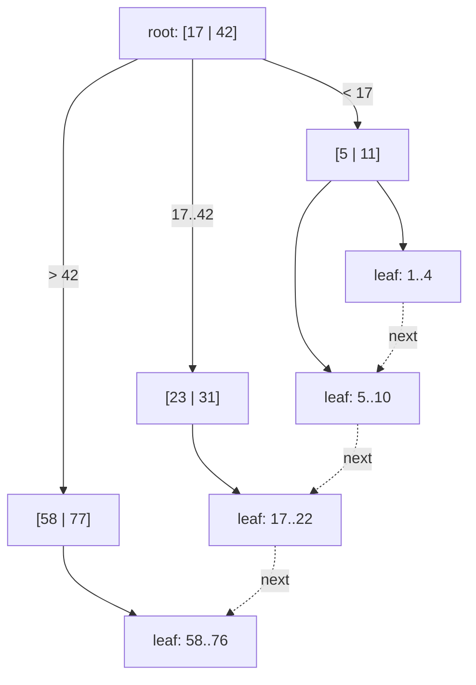

## In simple terms

A regular binary search tree has two children per node. A B-tree has hundreds — each node is sized to fill exactly one disk page (typically 4–16 KB) and can hold hundreds of keys and pointers. Because the tree is so wide, it stays very shallow: a B-tree of a billion rows is typically only 3–4 levels deep, so any lookup touches at most 3–4 pages. That's the design insight: match the tree's node size to the storage system's access unit to minimise the number of expensive I/O operations.

## The Visual Map

A B+ tree: internal nodes route, leaves hold the data and link sideways for range scans:



Each box is one disk page. A point lookup walks root → internal → leaf; a range scan finds the start, then follows the dotted leaf chain.

## More detail

A **B-tree of order m** has these invariants:

- Every node holds between ⌈m/2⌉ and m keys (except the root, which needs only 1).
- An internal node with k keys has k+1 children.
- All leaf nodes are at the same depth (the tree is perfectly balanced by height).
- Keys within a node are kept sorted; each pointer between two keys leads to a subtree whose keys fall between them.

On a **search**, start at the root, binary-search within the node (O(log m)), follow the right child pointer, repeat — O(log_m n) nodes visited. With m ≈ 500 and n = 1 billion, that's ≤ 4 node accesses.

On **insert**, find the leaf, insert the key in sorted order. If the leaf overflows (> m keys), **split** it into two half-full nodes and push the middle key up to the parent — recursively if needed, all the way to the root. The root split is how the tree grows in height. Insert is O(log n) amortised.

**B+ trees** (the variant used by most database systems) differ slightly: internal nodes hold only keys (no data), while leaf nodes hold all data and are linked in a sorted linked list. This supports range scans by traversing leaf pointers linearly — you find the start with a tree search, then follow pointers for the range.

The contrast with [hash tables](/t/hash-table): hash tables give O(1) point lookups but provide no ordering and cannot answer range queries efficiently. B-trees give O(log n) point lookups *and* O(log n + k) range queries over k results.

Understanding B-trees explains why [indexing](/t/indexing) helps for equality and range queries, why `LIKE '%suffix'` can't use an index (you can't binary-search an interior part of a string), why index key order matters, and why covering indexes (leaf nodes already contain the queried columns) eliminate a second lookup.

## Under the Hood

The search algorithm — binary search *within* a node, descend *between* nodes:

```python
from bisect import bisect_left

# each node: {"keys": [...], "children": [...]} — children absent in leaves
def search(node, key, depth=0):
    print(f"{'  ' * depth}visit page with keys {node['keys']}")
    i = bisect_left(node["keys"], key)
    if i < len(node["keys"]) and node["keys"][i] == key:
        return True                              # found in this page
    if "children" not in node:
        return False                             # leaf: not present
    return search(node["children"][i], key, depth + 1)

tree = {"keys": [17, 42], "children": [
    {"keys": [5, 11]},
    {"keys": [23, 31]},
    {"keys": [58, 77]},
]}
print(search(tree, 31))   # visits 2 pages out of 4
```

Every `visit page` line is one disk read in a real database — the whole design exists to keep that count tiny.

## Engineering Trade-offs

- **B-tree vs hash index.** The hash wins point lookups (O(1) vs O(log n)) but cannot answer `BETWEEN`, `ORDER BY`, or prefix queries. Since real query workloads mix point and range access, B-trees are the default index almost everywhere; hash indexes are the special case.
- **B-tree vs LSM tree.** B-trees update pages in place: fast reads, but every write may dirty a page (write amplification on random inserts). LSM trees (RocksDB, Cassandra) batch writes into sorted runs: far higher write throughput, slower and more complex reads (checking multiple runs), plus background compaction. Read-heavy → B-tree; write-heavy → LSM.
- **Node size = page size.** Bigger nodes mean fewer levels but more bytes per read and more work per node; smaller nodes invert it. Databases pin node size to the storage page (4–16 KB) so one node access is exactly one I/O — tuning beyond that rarely pays.
- **Split/merge cost vs balance.** The half-full invariant guarantees O(log n) worst case, paid for with occasional splits and merges and ~30% average wasted space inside pages. Sequential inserts (auto-increment keys) split predictably and pack tighter — one reason monotonic primary keys are popular.

## Real-world examples

- PostgreSQL's default index type is a B+ tree; `CREATE INDEX` without further options produces one.
- SQLite stores its entire database in a B-tree file, with one B-tree per table and one per index.
- ext4 uses a B-tree to index the blocks of large files (the HTree extension also uses it for directory lookups).
- LSM trees (used in LevelDB, RocksDB, Cassandra) sacrifice balanced B-tree updates for better write throughput — the trade-off is understood in terms of B-tree limitations.

## Common misconceptions

- **"B-tree and binary search tree are the same."** A BST has 2 children per node; a B-tree has hundreds. The "B" stands for balanced (and Bayer, the co-inventor), not binary.
- **"B-trees are only for databases."** They are the structure of choice for any ordered key-value store backed by block storage — filesystems, key-value engines, and even in-memory structures for large sorted datasets.

## Try it yourself

Watch a real database choose a B-tree — SQLite ships inside Python:

```bash
python3 -c "
import sqlite3
db = sqlite3.connect(':memory:')
db.execute('CREATE TABLE users (id INTEGER, name TEXT)')
db.executemany('INSERT INTO users VALUES (?, ?)',
               [(i, f'user{i}') for i in range(10_000)])

print('-- without an index:')
print(db.execute('EXPLAIN QUERY PLAN SELECT * FROM users WHERE id = 4242').fetchall())

db.execute('CREATE INDEX idx_id ON users(id)')
print('-- with a B-tree index:')
print(db.execute('EXPLAIN QUERY PLAN SELECT * FROM users WHERE id = 4242').fetchall())
"
```

The plan flips from `SCAN users` (read all 10,000 rows) to `SEARCH users USING INDEX idx_id` (walk a 2-level B-tree). That one line of output is the entire value proposition.

## Learn next

- [Indexing](/t/indexing) — what databases build out of B-trees and when it helps a query.
- [Tree](/t/tree) — the general structure the B-tree specialises for disks.
- [Write-ahead log](/t/write-ahead-log) — how databases keep B-tree updates crash-safe.
