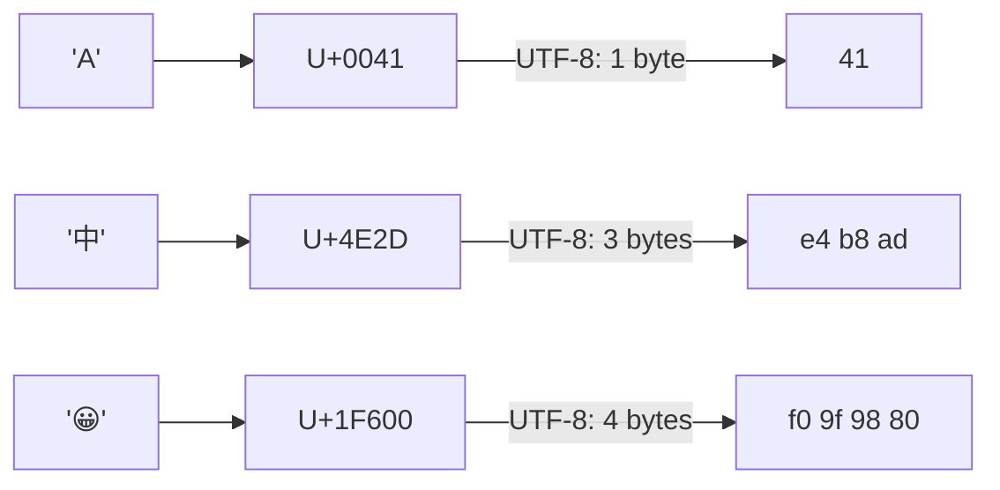

## In simple terms

Computers store text as numbers. A **character encoding** is the table that says which number represents which character: 65 = 'A', 66 = 'B', and so on. The challenge is agreeing on *one* table that covers every writing system on Earth — Chinese, Arabic, emoji, and all. Unicode is that agreement; UTF-8 is the way to turn Unicode's code points into actual bytes.

## The Visual Map

Character → code point → bytes, for three very different characters:



## More detail

**ASCII** (1963) mapped 128 characters (the Latin alphabet, digits, punctuation, and control codes) to 7 bits. Enough for English; nowhere near enough for the world. The next decades saw hundreds of incompatible extensions — Latin-1, Windows-1252, Shift-JIS, Big5, ISO-8859 — each covering a region but producing mojibake (garbled text) when files moved between systems.

**Unicode** solved the coordination problem by defining one universal **code point** for every character: `U+0041` for 'A', `U+4E2D` for '中', `U+1F600` for '😀'. Unicode now covers over 150,000 characters across 168 scripts. A code point is an integer, not bytes — the encoding determines how that integer is stored:

- **UTF-32** — every code point as a fixed 4-byte integer. Simple but wastes space for ASCII-heavy text.
- **UTF-16** — 2 bytes for most characters, 4 bytes (a surrogate pair) for rarer ones. Used by Java, JavaScript internals, and Windows APIs.
- **UTF-8** — variable width: 1 byte for ASCII (U+0000–U+007F), 2–4 bytes for everything else. The leading bits of the first byte signal the length. UTF-8 is backward-compatible with ASCII and is the dominant encoding on the web (~98% of web pages).

Important properties of UTF-8:
- **Self-synchronising** — you can find the start of any character by scanning for a byte whose high bits are `0xxxxxxx` or `11xxxxxx`; continuation bytes always start `10xxxxxx`.
- **ASCII-safe** — any byte with value < 128 is a single-byte ASCII character; no two-byte or four-byte sequence ever produces a byte in that range.
- **Not fixed-width** — `string.length` in bytes ≠ number of characters. Python `len("中")` is 1 (code points), but `len("中".encode("utf-8"))` is 3 (bytes).

Every program that handles text — every web server, database, editor, terminal, and network protocol — must know what encoding text is in. Encoding bugs break everything: incorrect byte-lengths crash string operations, misidentified encodings corrupt data, and injected malformed bytes can bypass security checks. "Always use UTF-8" is the modern consensus because it is universal, compact, and ASCII-compatible — but you still have to know it's variable-width, what a BOM is (a UTF-8 BOM is three bytes the Windows ecosystem adds and everything else ignores), and why `\n` vs `\r\n` is also an encoding concern.

## Under the Hood

UTF-8's bit-level scheme — the first byte's leading bits announce the sequence length:

```python
for ch in "A中😀":
    cp = ord(ch)
    encoded = ch.encode("utf-8")
    pattern = " ".join(f"{b:08b}" for b in encoded)
    print(f"{ch!r}  U+{cp:04X}  {len(encoded)} byte(s):  {pattern}")

# 'A'  U+0041  1 byte(s):  01000001
# '中' U+4E2D  3 byte(s):  11100100 10111000 10101101
# '😀' U+1F600 4 byte(s):  11110000 10011111 10011000 10000000
```

Read the first byte: `0xxxxxxx` = standalone ASCII, `1110xxxx` = "I start a 3-byte character", and every continuation byte begins `10`. The code point's bits are simply distributed across the `x` positions — that's the whole encoding.

## Engineering Trade-offs

- **UTF-8 vs UTF-16 vs UTF-32.** UTF-8 is compact for ASCII-heavy text and ASCII-compatible, but East Asian text costs 3 bytes per character (vs 2 in UTF-16). UTF-32 buys O(1) code-point indexing nobody much needs at double-to-quadruple the memory. The web picked UTF-8; Java, C#, and Windows are wedded to UTF-16 by history — and pay for it in surrogate-pair bugs.
- **Which "length" do you mean?** Bytes (storage, `Content-Length`), code points (Unicode logic), UTF-16 code units (JavaScript's `.length`), or grapheme clusters (what users see — '👩‍👩‍👧' is one grapheme, many code points). Picking the wrong unit truncates emoji mid-character or rejects valid names. Databases and UIs routinely disagree here.
- **Validate or trust.** Treating bytes as UTF-8 without validation is fast; malformed sequences (overlong encodings, lone surrogates) have been used to smuggle `../` past security filters. Strict validation at the boundary costs a scan and saves a CVE.
- **Normalisation.** 'é' can be one code point (U+00E9) or two (e + combining accent). Comparing or deduplicating user text without NFC/NFD normalisation silently treats equal-looking strings as different — but normalising everywhere costs CPU and can alter byte-faithful data.

## Real-world examples

- A web server that doesn't declare `Content-Type: text/html; charset=utf-8` risks browsers guessing Latin-1 or Shift-JIS and rendering garbled text.
- `strlen` in C counts bytes, not characters — a UTF-8 string of 10 emoji can be 40 bytes.
- MySQL's historical `utf8` charset is actually a broken 3-byte-max encoding that cannot store emoji; `utf8mb4` is the correct UTF-8.
- Emoji rendering requires combining a code point with a skin-tone modifier and a zero-width joiner — a single rendered "character" can be 10+ code points.

## Common misconceptions

- **"Unicode and UTF-8 are the same thing."** Unicode is the code-point standard; UTF-8 is one *encoding* of it. There are others (UTF-16, UTF-32).
- **"String length = character count."** Only in fixed-width encodings. In UTF-8, length in bytes, length in code points, and length in grapheme clusters (user-visible characters) can all differ.

## Try it yourself

Watch one character become three bytes on disk:

```bash
printf '中' | od -A x -t x1
# 000000 e4 b8 ad

python3 -c "
s = 'héllo 中 😀'
print('code points:', len(s))
print('utf-8 bytes:', len(s.encode('utf-8')))
print('utf-16 bytes:', len(s.encode('utf-16-le')))
"
```

Same string, three different "lengths" — every encoding bug you'll ever debug starts with confusing two of them.

## Learn next

- [Bits](/t/bits) — the raw material every encoding compiles down to.
- [Hexadecimal](/t/hexadecimal) — the notation you'll read encoded bytes in.
- [HTTP](/t/http) — where `charset=utf-8` headers decide how the web reads your bytes.
