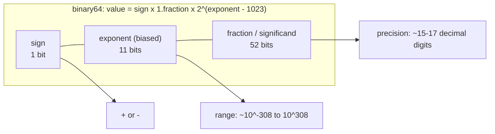

## In simple terms

Integers are exact; real numbers are not. Most decimal fractions — even `0.1` — cannot be written in binary without an infinite number of digits, so the computer stores the closest approximation it can. **Floating-point** is the standard format for that approximation: a number stored as `sign × significand × 2^exponent`, where all three parts are fixed-width bit fields. The result is a system that covers an enormous range of magnitudes and is wrong by a tiny, bounded amount — usually good enough, occasionally catastrophic.

## The Visual Map

The 64 bits of a double (IEEE 754 binary64), and what each field buys you:



## More detail

IEEE 754 (1985, revised 2008) is the standard followed by virtually every CPU and programming language. It defines:

- **Binary32 (single)** — 1 sign bit + 8 exponent bits + 23 significand bits = 32 bits. ~7 decimal digits of precision.
- **Binary64 (double)** — 1 sign bit + 11 exponent bits + 52 significand bits = 64 bits. ~15–17 decimal digits.

The significand is always normalised to `1.xxx…` in binary (the leading `1` is implicit and free), so all bits of the fraction field are significant. The exponent is stored with a **bias** (127 for single, 1023 for double) so it can represent both large and small magnitudes with an unsigned integer.

Special values encode edge cases:
- **Infinity** (+∞, −∞) — result of dividing by zero or overflow.
- **NaN** (Not a Number) — result of `0/0`, `√(−1)`, or arithmetic on existing NaN. NaN is "contagious": any operation on NaN produces NaN.
- **Denormals / subnormals** — very small values below the normal minimum, encoded with an implicit leading `0` instead of `1`; often much slower to process.

The key rounding behaviours: every operation is rounded to the nearest representable value (with ties going to even). Consecutive floating-point operations accumulate rounding error. **Catastrophic cancellation** — subtracting two nearly-equal numbers — can lose almost all significant bits in one step.

Every mainstream language (C, Python, Java, JavaScript, Rust) uses IEEE 754 doubles by default, and every GPU does floating-point arithmetic at its core. The bugs it produces — `0.1 + 0.2 ≠ 0.3`, comparisons against computed values failing, NaN propagation hiding errors — are among the most common surprising bugs a programmer encounters, and the fixes (epsilon comparisons, decimal arithmetic for money, checking for NaN) follow directly from understanding the representation.

## Under the Hood

Look at the actual bits, and see why `0.1` was never really `0.1`:

```python
import struct

def bits(x):
    [i] = struct.unpack(">Q", struct.pack(">d", x))
    s = f"{i:064b}"
    return f"{s[0]} | {s[1:12]} | {s[12:]}"   # sign | exponent | fraction

print(bits(0.1))
# 0 | 01111111011 | 1001100110011001100110011001100110011001100110011010
#                   ^ binary 0.1 repeats 1001 forever — truncated and rounded

print(f"{0.1:.20f}")        # 0.10000000000000000555  — the stored value
print(0.1 + 0.2 == 0.3)     # False: the two roundings differ

from decimal import Decimal
print(Decimal("0.1") + Decimal("0.2") == Decimal("0.3"))   # True — exact base-10
```

The repeating `1001` pattern in the fraction field is binary's version of 1/3 = 0.333… — the rounding at bit 52 is where the famous error is born.

## Engineering Trade-offs

- **Width vs precision vs speed.** Doubles give ~16 digits; singles halve memory and double SIMD throughput at ~7 digits; ML pushed further to fp16, bfloat16 (full exponent range, tiny precision), and fp8 — accepting noise in exchange for fitting bigger models in memory and multiplying throughput.
- **Binary speed vs decimal exactness.** Hardware floats are single-cycle; `Decimal`/`BigDecimal` libraries are exact in base 10 but orders of magnitude slower and software-implemented. Money goes in decimals or integer cents; physics goes in doubles.
- **Comparing computed values.** `a == b` is the wrong question after arithmetic; the trade is choosing a tolerance — absolute epsilon (breaks for huge values), relative epsilon (breaks near zero), or ULP-based (correct, more code).
- **Reproducibility vs optimisation.** Compilers' `-ffast-math` and GPU fused-multiply-adds reorder operations for speed, which changes rounding — so the "same" computation can differ across machines or runs. Bit-exact reproducibility costs performance; most numerical code trades it away, consensus-critical code (games' lockstep, finance) cannot.

## Real-world examples

- `0.1 + 0.2 == 0.3` is `false` in virtually every language — both sides round to the nearest binary fraction and the rounding differs.
- The Ariane 5 rocket's 1996 failure was caused by a floating-point overflow converting a 64-bit double to a 16-bit integer.
- Machine learning hardware (TPUs, modern GPUs) uses bfloat16 — a truncated double that preserves the exponent range while halving storage — for training speed.
- Financial systems never use floating-point for currency; they use fixed-point or decimal arithmetic libraries to avoid accumulated rounding.

## Common misconceptions

- **"Just use `double` and the errors are negligible."** They usually are, but compounding operations, cancellation, and comparison failures can amplify them to real bugs.
- **"NaN is like zero."** NaN propagates silently: `NaN + 1 = NaN`, `NaN > 0 = false`, `NaN == NaN = false`. A computation feeding NaN-infected values downstream can produce wrong answers for many steps before anyone notices.

## Try it yourself

The classic, plus the accumulation effect:

```bash
python3 -c "
print(0.1 + 0.2)                    # 0.30000000000000004
print(f'{0.1:.20f}')                # what 0.1 actually stores

total = 0.0
for _ in range(10):
    total += 0.1
print(total, total == 1.0)          # 0.9999999999999999 False

nan = float('nan')
print(nan == nan)                   # False — NaN is not even equal to itself
"
```

Ten additions of `0.1` already drift visibly from `1.0` — now imagine a million timesteps in a simulation. (Fun fact: Python's built-in `sum()` quietly switched to error-compensated [Neumaier] summation in 3.12, so `sum([0.1] * 10) == 1.0` is `True` there — the naive loop above shows what the hardware actually does.)

## Learn next

- [Binary numbers](/t/binary-numbers) — the integer representation floating-point extends to fractions.
- [Numerical methods](/t/numerical-methods) — the discipline of computing accurately *despite* rounding.
- [Training and inference](/t/training-and-inference) — where fp16/bfloat16 precision trades shape modern AI hardware.
