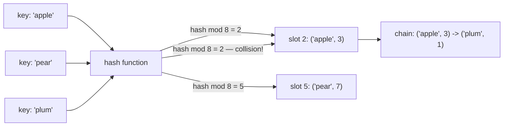

## In simple terms

A **hash table** is a data structure for fast "is this key in here, and if so what's the value?" lookups. It works by feeding the key through a **hash function** to produce a number, using that number to pick a slot in an array, and storing the value there. Done right, lookup, insert, and delete all happen in roughly constant time regardless of how big the table gets.

## The Visual Map



## More detail

The basic recipe:

1. **Hash** the key to an integer.
2. Take `index = hash mod table_size` to pick a slot.
3. Store / look up the value at that slot.

Two collisions can land at the same slot. The two main strategies for handling them:

- **Chaining** — each slot holds a linked list (or small dynamic array) of entries with that hash; on lookup you walk the list.
- **Open addressing** — on collision, probe other slots (linear probing, quadratic probing, double hashing). Cache-friendlier, but requires careful deletion.

Modern high-performance implementations almost all use open addressing with techniques like Robin Hood hashing or Swiss tables (Google's open-source `flat_hash_map`, used by Go's `map`, Abseil, etc.).

Key performance considerations:

- **Hash function quality** — bad hashes cluster, turning O(1) into O(n).
- **Load factor** — entries per slot. Most implementations resize when > ~0.75.
- **Resize cost** — doubling the table and re-hashing everything is O(n); amortised O(1) per insert.

Hash table variants:

- **Hash set** — same structure, no values, just "is this present?".
- **Concurrent hash map** — supports many threads (Java's `ConcurrentHashMap`, Rust's `dashmap`).
- **Persistent hash map** — immutable, structurally shared between updates (Clojure, Scala, Immer).

A famous limitation: hash tables don't preserve insertion order — except many modern languages have specifically chosen to (Python 3.7+, JavaScript objects). They do this via a parallel array of insertion indices.

Hash tables are the workhorse data structure of modern programming — `dict` in Python, `Object` and `Map` in JavaScript, `HashMap` in Java/Rust/Go, every database index that isn't a B-tree. They are also the foundation under sets, caches, deduplication, joins in databases, and most "is this in a list of N things" code.

## Under the Hood

A complete chaining hash table in twenty lines:

```python
class HashTable:
    def __init__(self, size=8):
        self.buckets = [[] for _ in range(size)]

    def _bucket(self, key):
        return self.buckets[hash(key) % len(self.buckets)]

    def put(self, key, value):
        bucket = self._bucket(key)
        for i, (k, _) in enumerate(bucket):
            if k == key:
                bucket[i] = (key, value)   # overwrite existing
                return
        bucket.append((key, value))

    def get(self, key):
        for k, v in self._bucket(key):
            if k == key:
                return v
        raise KeyError(key)
```

Everything else — resizing, open addressing, SipHash — is optimisation of this core: *hash, pick a bucket, resolve collisions*.

## Engineering Trade-offs

- **Chaining vs open addressing.** Chaining is simple and tolerates high load factors; open addressing keeps everything in one array, winning on cache locality — which is why every modern high-performance table (Swiss tables, Robin Hood) chose it, accepting trickier deletion logic.
- **Load factor: space vs speed.** A half-empty table wastes memory; a nearly-full one collides constantly. The ~0.75 resize threshold most libraries use is a tuned compromise, and the resize itself is an O(n) latency spike hiding inside "amortised O(1)".
- **Hash table vs tree.** O(1) average beats O(log n) — but you lose ordering, range queries, and predictable worst cases. Databases index with [B-trees](/t/b-tree) because `BETWEEN` and `ORDER BY` matter; in-memory lookups use hashes because they usually don't.
- **Speed vs attack resistance.** Fast hash functions are predictable; predictable hashes let attackers manufacture collisions and degrade your server to O(n) per request (hash-flooding DoS). Languages responded with seeded/keyed hashes (SipHash) — slightly slower, attack-resistant.

## Real-world examples

- A Redis cache is, at heart, a giant hash table mapping string keys to values.
- A spell-checker uses a hash set of known words for O(1) "is this a word?" lookups.
- A SQL `JOIN` is often implemented as a "hash join": build a hash table from the smaller table, probe it with the larger one.
- The 2003 SQL Slammer worm exploited a hash function so weak that it caused enough collisions to make a SQL Server fall over.

## Common misconceptions

- **"Hash tables are always O(1)."** Average-case O(1). Worst case is O(n) with adversarial inputs (which is why high-stakes systems use SipHash or random seeds).
- **"`HashMap` keeps things in order."** Most do not; Python's `dict` does as a deliberate design choice but most languages' standard hash maps don't.

## Try it yourself

See keys map to buckets — and see hash randomisation (the anti-DoS defence) in action:

```bash
python3 -c "
for key in ['apple', 'pear', 'plum', 'kiwi']:
    print(f'{key:6} -> hash {hash(key):>20} -> bucket {hash(key) % 8}')
"
```

Run it twice: the hashes (and bucket assignments) change between runs, because Python seeds its string hash per process. Set `PYTHONHASHSEED=0` before the command and they become stable — and attackable.

## Learn next

- [Big O](/t/big-o) — what that "average O(1)" claim really promises.
- [Tree](/t/tree) — the ordered alternative when range queries matter.
- [B-tree](/t/b-tree) — why databases picked the tree side of the trade.
