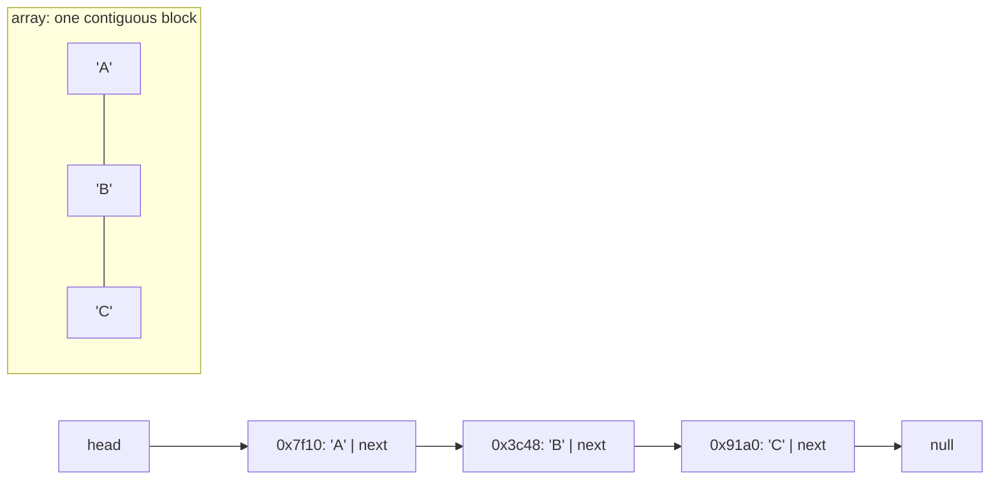

## In simple terms

A **linked list** is a chain: each element holds its data plus a pointer to the next element. Unlike an array, the elements don't need to be contiguous in memory — they can be scattered, glued together only by the pointers. That makes inserting and removing at any point in the chain cheap, but makes "find the 100th element" expensive.

## The Visual Map

Nodes scattered across the heap, stitched together by pointers — contrast with the array below:



## More detail

Variants:

- **Singly linked** — each node points to the next.
- **Doubly linked** — each node points to both next and previous; allows backward traversal and O(1) removal given just a node reference.
- **Circular** — the last node points back to the first.

The classical operation table vs. a dynamic array:

| Operation                | Linked list | Dynamic array (vector) |
|---|---|---|
| Index access             | O(n)        | O(1) |
| Insert at front          | O(1)        | O(n) |
| Insert at back           | O(1)*       | O(1) amortised |
| Insert in middle (known node) | O(1)   | O(n) |
| Memory overhead per item | High (pointer + allocator overhead) | Low (just the data) |
| Cache friendliness       | Poor         | Excellent |

(*) only with a tail pointer.

Modern reality: **arrays usually win**, often by a lot, because cache effects swamp the asymptotic advantages of linked lists. A 2010s rule of thumb that has only gotten more true: prefer `Vec<T>` / `ArrayList` / `[]T` to any kind of linked list unless you have a specific reason. Linus Torvalds's famous "good taste" Linux talk uses doubly-linked list deletion as the example — but even the kernel uses linked lists much less than newcomers expect.

Where linked lists do shine:

- **Splicing** two large lists into one is O(1).
- **Intrusive linked lists** (the "next" pointer is a field of the data itself, no extra node allocation) are common in OS kernels, schedulers, allocators.
- **Persistent data structures** (functional languages) often use linked lists as the simplest immutable sequence.
- **Lock-free queues** are usually linked lists because individual nodes can be CAS'd in / out.

Linked lists remain the textbook example for explaining pointers, dynamic memory, and asymptotic analysis — and a great cautionary tale: textbook complexity isn't the same as real-world performance. Knowing both the theory and when arrays beat lists in practice is part of being a working engineer.

## Under the Hood

The whole structure is one struct and one pointer rewire:

```c
#include <stdlib.h>

struct node {
    int value;
    struct node *next;
};

/* O(1) insert at the head — no shifting, no reallocation */
struct node *push(struct node *head, int value) {
    struct node *n = malloc(sizeof *n);
    n->value = value;
    n->next  = head;       /* new node points at the old head ... */
    return n;              /* ... and becomes the new head        */
}

/* O(n) search — pointer-chasing, one cache miss per node */
struct node *find(struct node *head, int value) {
    for (struct node *p = head; p; p = p->next)
        if (p->value == value) return p;
    return NULL;
}
```

`push` touches two pointers no matter how long the list is; `find` hops to a fresh heap address every iteration — that hop is the cache miss that makes lists slow in practice.

## Engineering Trade-offs

- **Splice speed vs cache locality.** The list's O(1) insert/remove-at-a-node is real — but every traversal step is a potential cache miss, while an array scan streams through prefetched memory. Benchmarks routinely show arrays winning even at workloads the list is "theoretically" better at.
- **Memory per element.** Each node pays a pointer (8 bytes, two if doubly-linked) plus allocator metadata — often more overhead than payload for small items. Arrays pay nearly zero per element.
- **Intrusive vs external nodes.** Kernels embed the `next`/`prev` pointers inside the object itself (`struct list_head`), eliminating the per-node allocation and letting one object sit on several lists at once — at the cost of coupling the object's layout to its containers.
- **Stable nodes vs compaction.** A list node never moves, so pointers/iterators into it stay valid across inserts — something a resizing vector can't promise. That stability is exactly what lock-free algorithms and LRU caches buy with the list's other costs.

## Real-world examples

- The Linux kernel's `struct list_head` is an intrusive doubly-linked list used in hundreds of places.
- LRU caches are often implemented as a hash table + doubly-linked list — the hash table for O(1) lookup, the list for O(1) reorder on access.
- Java's `LinkedList` exists but the general advice in 2026 is "don't use it; use `ArrayList`".
- Persistent / immutable lists in Clojure, Haskell, Erlang are linked lists by default (with structural sharing).

## Common misconceptions

- **"Linked lists are faster than arrays for insertion."** Only if you've already found the spot to insert at. Finding the spot is O(n) — versus O(log n) for a sorted array with binary search.
- **"Linked lists save memory."** They often *use more* memory due to pointer overhead per node and allocator metadata.

## Try it yourself

Measure the front-insert trade directly — a Python `list` (dynamic array) vs `deque` (linked blocks):

```bash
python3 -c "
import timeit
array = timeit.timeit('a.insert(0, 1)', setup='a = []', number=100_000)
deque = timeit.timeit('d.appendleft(1)', setup='from collections import deque; d = deque()', number=100_000)
print(f'list.insert(0, x)   (O(n) shift): {array:.3f}s')
print(f'deque.appendleft(x) (O(1)):       {deque:.3f}s  -> {array/deque:,.0f}x faster')
"
```

Every front-insert into the array shifts the whole contents one slot right; the deque just rewires a pointer. Then flip the experiment — index `a[5000]` vs `d[5000]` — and watch the array win.

## Learn next

- [Stack and queue](/t/stack-and-queue) — the structures linked lists classically implement.
- [Data structures](/t/data-structure) — the full menu and how to choose.
- [Memory management](/t/memory-management) — the allocator costs hiding behind every `malloc`'d node.
