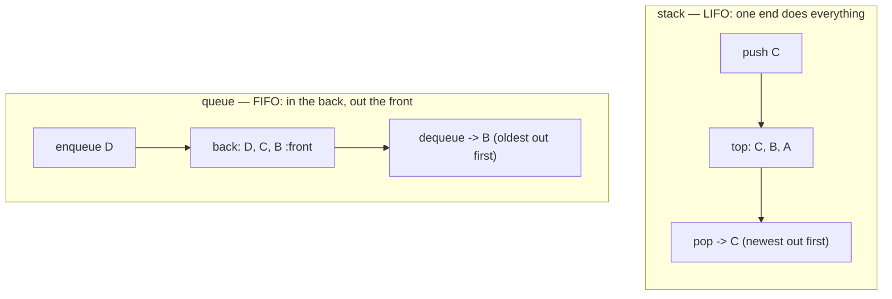

## In simple terms

A **stack** is a pile of plates: you push a plate on top, and the one you take off is the most recent you put there. Last-in, first-out (LIFO).

A **queue** is a line at the supermarket: people join the back, the cashier takes from the front. First-in, first-out (FIFO).

That's it. Two of the simplest data structures in computing, and yet they're underneath an enormous amount of working software.

## The Visual Map



## More detail

**Stack** core operations:

- `push(x)` — add `x` to the top.
- `pop()` — remove and return the top element.
- `peek()` / `top()` — look at the top without removing.

All O(1). Implementations: a dynamic array (most common — just `append` / pop from the back), or a singly-linked list with the head as top.

**Queue** core operations:

- `enqueue(x)` — add `x` to the back.
- `dequeue()` — remove and return the front.

All O(1). Implementations: a doubly-linked list, or a ring buffer in an array (faster, cache-friendly).

Variants:

- **Deque** ("double-ended queue") — push and pop at both ends. Python's `collections.deque`, Rust's `VecDeque`, Java's `ArrayDeque`.
- **Priority queue** — dequeue always returns the highest-priority element; usually a binary heap (O(log n) operations).
- **Circular buffer / ring buffer** — fixed-size FIFO; loses oldest items when full. Used in audio buffers, kernel ring buffers, lock-free messaging.
- **Concurrent queue** — designed for many producers / consumers (Java's `LinkedBlockingQueue`, Rust's `crossbeam::queue`).

Both stacks and queues are *abstract data types* — they're defined by their operations, not by any one implementation.

They are also the building blocks of an enormous amount of system behaviour. The CPU's call stack is a stack. The scheduler's runnable threads sit in a queue. Background job systems (Sidekiq, Celery, Bull, BullMQ, SQS, Kafka, RabbitMQ, …) are queues with extra features. Browser history is a stack (Back) plus a stack (Forward).

## Under the Hood

A stack doing real work — evaluating Reverse Polish Notation, the way bytecode VMs and old HP calculators compute:

```python
def rpn(expression):
    stack = []
    for token in expression.split():
        if token in "+-*/":
            b, a = stack.pop(), stack.pop()   # newest two operands
            stack.append({"+": a + b, "-": a - b,
                          "*": a * b, "/": a / b}[token])
        else:
            stack.append(float(token))
    return stack.pop()

# (3 + 4) * 2  in postfix:
print(rpn("3 4 + 2 *"))   # 14.0
```

No parentheses, no precedence rules — the stack's LIFO order encodes the structure. The JVM and the CPython interpreter execute your code on exactly this principle.

## Engineering Trade-offs

- **Array-backed vs linked.** An array-backed stack/deque is contiguous and cache-friendly with amortised O(1) operations (occasional resize spikes); a linked version has perfectly steady O(1) but pays a pointer-chase and an allocation per element. Default to array-backed; go linked when nodes must never move (lock-free structures).
- **The list-as-queue trap.** Popping from the *front* of a dynamic array shifts every remaining element — O(n) per dequeue. It works, silently, until the queue grows; then it's a quadratic accident. Use a real deque or ring buffer.
- **Bounded vs unbounded.** A ring buffer's fixed capacity forces a policy when full — drop oldest (logs), drop newest, or block (backpressure). An unbounded queue never drops, but a slow consumer turns it into a memory leak. Production queues are bounded on purpose.
- **FIFO vs priority.** A priority queue (binary heap) upgrades "first come" to "most important first" at O(log n) per operation — the right trade for schedulers and timers, overkill for plain pipelines.

## Real-world examples

- **The call stack** — every function call pushes a frame; every return pops one. The "stack trace" you see in an error is a snapshot.
- **Undo / Redo** — undo is a stack of past actions; redo is the second stack you push to as you pop undo.
- **Tree / graph traversal** — depth-first uses a stack (often the call stack via recursion), breadth-first uses a queue.
- **Job queues** — Sidekiq (Ruby), Celery (Python), Kafka (Java/Scala), SQS (AWS), BullMQ (Node) all let producers enqueue work for workers to dequeue.
- **Expression evaluation** — Reverse Polish Notation calculators are stack-based; Java/.NET bytecode VMs are stack machines.
- **Backtracking algorithms** — solving Sudoku, n-queens, search — naturally fit a stack (often the recursion stack).

## Common misconceptions

- **"A queue is just a list."** Operationally yes, but treating it as a list (with O(n) front access) gives terrible performance. Use a proper queue type.
- **"Stack overflow is a Stack Overflow website joke."** It's a real error: a program made so many nested function calls that the call stack ran out of room (usually because of unbounded recursion).

## Try it yourself

Measure the list-as-queue trap against a real deque:

```bash
python3 -c "
import timeit
naive = timeit.timeit('q.pop(0)', setup='q = list(range(100_000))', number=50_000)
deque = timeit.timeit('q.popleft()', setup='from collections import deque; q = deque(range(100_000))', number=50_000)
print(f'list.pop(0)    (O(n) shift each time): {naive:.3f}s')
print(f'deque.popleft() (O(1)):                {deque:.4f}s  -> {naive/deque:,.0f}x faster')
"
```

Same FIFO behaviour, same results — one of them shifts 100,000 elements on every dequeue. Then paste the RPN calculator from Under the Hood and evaluate your own expressions.

## Learn next

- [Linked list](/t/linked-list) — what stacks and queues are classically built from.
- [Recursion](/t/recursion) — the control-flow pattern that uses a stack implicitly.
- [Message queue](/t/message-queue) — the queue grown up into distributed infrastructure.
