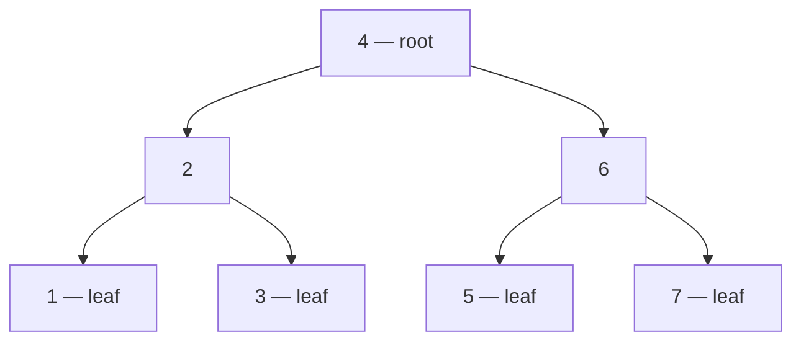

## In simple terms

A **tree** is a data structure that looks like an upside-down tree: one **root** at the top, with **children** hanging off it, each of which can have its own children. Every node has exactly one parent (except the root, which has none). Trees are everywhere in computing because so much of the world is hierarchical.

## The Visual Map

A binary search tree holding 1–7 — smaller keys go left, larger go right:



Finding any key takes at most 3 comparisons — the height of the tree, not the size of the data.

## More detail

Terminology:

- **Root** — the top node.
- **Leaf** — a node with no children.
- **Internal node** — a node with at least one child.
- **Depth / level** — distance from root.
- **Height** — longest root-to-leaf distance.
- **Subtree** — any node plus all its descendants.

Common variants:

- **Binary tree** — each node has at most two children (left, right).
- **Binary search tree (BST)** — a binary tree where left subtree is always smaller, right subtree larger. Lookup is O(log n) if balanced.
- **Balanced trees** (AVL, red-black) — self-rebalancing BSTs; guarantee O(log n) operations.
- **B-tree / B+ tree** — wide-fanout trees designed for disk and SSD storage. The backbone of every relational database index and most file systems.
- **Heap** — a tree (usually binary) with the heap property; powers priority queues.
- **Trie / radix tree** — keyed by string prefixes; used for autocomplete, IP routing, dictionaries.
- **Quadtree / octree** — spatial trees for 2D/3D data; collision detection, image compression.

Traversal patterns:

- **Pre-order** — visit, then descend.
- **In-order** — descend left, visit, descend right (for BST: yields sorted order).
- **Post-order** — descend, then visit (for evaluating expressions, deleting subtrees).
- **Breadth-first / level-order** — visit all nodes at depth k before depth k+1.

Trees model hierarchy, and hierarchy is everywhere: file systems, JSON / XML / YAML documents, the DOM in a browser, scene graphs in 3D rendering, abstract syntax trees in compilers, B-tree indexes in databases, decision trees in ML, the chain-of-trust in TLS certificates, your company org chart.

## Under the Hood

A binary search tree in its natural, recursive form — insert and sorted traversal:

```python
class Node:
    def __init__(self, key):
        self.key, self.left, self.right = key, None, None

def insert(node, key):
    if node is None:
        return Node(key)
    if key < node.key:
        node.left = insert(node.left, key)
    else:
        node.right = insert(node.right, key)
    return node

def in_order(node):                 # left, self, right -> sorted!
    if node:
        yield from in_order(node.left)
        yield node.key
        yield from in_order(node.right)

root = None
for k in [4, 6, 2, 7, 1, 5, 3]:
    root = insert(root, k)
print(list(in_order(root)))         # [1, 2, 3, 4, 5, 6, 7]
```

The structure *is* the algorithm: because every insert maintained the left-smaller/right-larger invariant, sorted output falls out of a simple traversal.

## Engineering Trade-offs

- **Naive vs self-balancing.** Insert sorted data into a plain BST and it degenerates into a linked list — O(n) everything. AVL and red-black trees pay extra work per insert (rotations) to *guarantee* O(log n). Library `TreeMap`s are always the balancing kind.
- **Binary vs wide fanout.** In RAM, binary nodes are simple and fast. On disk, every node visit costs an I/O — so [B-trees](/t/b-tree) pack hundreds of keys per node, trading more comparisons per node for a tree only 3–4 levels deep.
- **Tree vs hash table.** Trees keep keys ordered — range queries, nearest-key, sorted iteration — at O(log n). [Hash tables](/t/hash-table) drop ordering for O(1) point lookups. Pick by whether "give me everything between X and Y" appears in your requirements.
- **Pointer overhead.** Every node carries 2+ pointers and an allocation. Array-backed layouts (heaps in arrays, B-tree pages) trade flexibility for density and cache behaviour.

## Real-world examples

- A SQL B-tree index lets a `WHERE id = ?` lookup over 100 million rows take ~3-4 disk reads.
- A browser's **DOM tree** is what JavaScript manipulates and what CSS styles.
- Git's content storage is a **Merkle tree** — each commit's hash depends on the tree's hash, which depends on every file's hash.
- Decision trees (and random forests / gradient-boosted trees) win huge classes of tabular ML problems.
- Filesystem directory hierarchies are trees (with symlinks being the not-quite-tree edge case).

## Common misconceptions

- **"Trees are always balanced."** Unbalanced BSTs degenerate to linked lists with O(n) operations. Self-balancing variants (AVL, RB, B+) fix this; naive BSTs do not.
- **"Trees and graphs are the same."** A tree is a special case of a graph — connected, acyclic, with N-1 edges for N nodes. Graphs in general are more flexible (and harder).

## Try it yourself

You have a large tree on disk right now — walk two levels of it:

```bash
find . -maxdepth 2 -type d | head -20
```

Every path is a root-to-node walk. Then watch a BST sort for free:

```bash
python3 -c "
class N:
    def __init__(s, k): s.k, s.l, s.r = k, None, None

def ins(t, k):
    if t is None: return N(k)
    if k < t.k: t.l = ins(t.l, k)
    else:       t.r = ins(t.r, k)
    return t

def walk(t):
    return walk(t.l) + [t.k] + walk(t.r) if t else []

t = None
for k in [4, 6, 2, 7, 1, 5, 3]:
    t = ins(t, k)
print(walk(t))   # [1, 2, 3, 4, 5, 6, 7]
"
```

## Learn next

- [B-tree](/t/b-tree) — the tree rebuilt for disks and databases.
- [Hash table](/t/hash-table) — the unordered rival for fast lookups.
- [Recursion](/t/recursion) — the control-flow pattern every tree algorithm leans on.
