## In simple terms

A CPU can run any program but isn't optimised for any particular task. An ASIC is the opposite: a chip designed from scratch to do one thing — mining Bitcoin, running a neural network, processing video, or encrypting storage. An ASIC for SHA-256 hashing is 100,000× more efficient than a CPU at the same task — but cannot do anything else. The chip is designed once, costs millions in fabrication (NRE — non-recurring engineering), then manufactured in millions of copies for a few dollars each. When volume justifies the investment, nothing beats an ASIC.

## The Visual Map

```mermaid
graph LR
    Spec["Specification\nperf · power · I/O"] --> RTL["RTL Design\nVerilog / VHDL"]
    RTL --> Verify["Verification\nsimulation + FPGA emulation"]
    Verify --> Synth["Synthesis\nRTL to gate netlist"]
    Synth --> PR["Place & Route\ncell placement + wiring"]
    PR --> SignOff["Sign-off\nDRC · LVS · timing closure"]
    SignOff --> TapeOut["Tape-out\nsubmit GDSII to foundry"]
    TapeOut --> Fab["Fabrication\n6–12 weeks at TSMC/Samsung"]
    Fab --> Package["Package & Test"]
    Package --> Prod["Production Chip"]
```



## More detail

**ASIC design flow:**
1. **Specification:** define what the chip must do (logic functions, performance, power budget, I/O).
2. **RTL design:** write Verilog/VHDL describing the circuit.
3. **Verification:** simulate, formally verify, and emulate on FPGA to ensure correctness before tape-out.
4. **Synthesis:** convert RTL to a gate-level netlist (logic gates from a standard cell library provided by the foundry).
5. **Place & route (P&R):** physically arrange cells on the silicon die and route metal interconnects. Timing closure (meeting all timing constraints) is the hardest step.
6. **Sign-off:** timing, power, signal integrity, design rule check (DRC), layout vs. schematic (LVS).
7. **Tape-out:** the verified layout is submitted to the foundry (TSMC, Samsung, Intel Foundry, GlobalFoundries) as GDSII.
8. **Fabrication:** the foundry manufactures wafers (~6–12 weeks for advanced nodes). A 300mm wafer at 3nm: ~$20,000–$50,000 per wafer.
9. **Packaging and test.**

**Economics:**
- **NRE (non-recurring engineering):** design + mask set (the photolithographic masks used for fabrication). A 3nm mask set: $15M–$30M.
- **Per-unit cost:** amortised over volume. 1 million units at $30M NRE = $30 NRE/chip + a few dollars fab cost.
- **Break-even:** typically requires millions of units to justify ASIC over FPGA or GPU.

**Process nodes:** the fabrication process determines transistor density and power efficiency. Smaller nodes = more transistors per mm² and lower power.
- TSMC: 7nm (2018), 5nm (2020), 3nm (2022), 2nm (2025)
- Samsung: 3nm (2022, first commercial GAA transistors)
- The "nm" number is a marketing label, not the literal gate length — but it tracks density improvements.

**Types of ASICs:**
- **Full-custom ASIC:** every transistor manually placed for maximum performance. Used for analog circuits and the most critical digital paths (CPUs, DRAM). Very expensive.
- **Standard cell ASIC:** uses pre-designed cells (inverter, NAND, flip-flop) placed by automated tools. The standard approach.
- **SoC (System on Chip):** an ASIC integrating CPU cores, GPU, memory controllers, I/O, and accelerators on one die — Apple A-series, Qualcomm Snapdragon, Google Tensor.

ASICs are why your phone's camera AI is fast enough to do real-time HDR and portrait mode without draining the battery, why Bitcoin mining is done on custom chips rather than GPUs, and why Google's TPU trains language models faster than equivalent GPU clusters.

## Under the Hood

Hardware design is described in RTL (Register Transfer Level). The following Verilog snippet describes a 4-bit ripple-carry adder — the synthesiser converts this behavioural description into actual NAND/flip-flop standard cells from the foundry's library:

```verilog
// RTL (Verilog) — describes behaviour; synthesis maps this to standard cells
module adder4 (
    input  [3:0] a,
    input  [3:0] b,
    input        cin,
    output [3:0] sum,
    output       cout
);
    assign {cout, sum} = a + b + cin;
endmodule
```

The same logic simulated in Python (no EDA tools required):

```python
def adder4(a: int, b: int, cin: int = 0):
    result = (a & 0xF) + (b & 0xF) + cin
    return result & 0xF, (result >> 4) & 1   # (sum[3:0], cout)

# Verify: 9 + 7 + carry-in 1 = 17 = 0b10001 → sum=1, cout=1
s, c = adder4(9, 7, 1)
print(f"9 + 7 + 1 = sum={s}, cout={c}  (full result: {9+7+1})")
```

A real synthesis run would map `assign {cout, sum} = a + b + cin` to ~16 NAND gates, 8 XOR gates, and 8 wires — chosen to meet the timing constraint (e.g., max delay < 1 ns at 3nm).

## Engineering Trade-offs

**Why choose an ASIC over a CPU/GPU/FPGA:**
- ASIC delivers the highest performance/watt for its target function — 10,000–100,000× better efficiency than a CPU for the same operation.
- Unit cost at volume is very low: once NRE is amortised, the marginal chip cost is ~$5–$50 in production.
- No runtime programming overhead — the logic runs at wire speed.

**Why not to build an ASIC:**
- **NRE cost:** $5M–$30M for a modern node mask set. Only justifiable at very high volumes or for extreme performance requirements.
- **No field updates:** an ASIC bug requires a re-spin (tape-out again) — another $5M+. Silicon bugs can be catastrophic (Intel FDIV bug, 1994: $475M recall).
- **Lead time:** 6–12 months from design completion to first silicon. Market windows close.
- **Design complexity:** an advanced SoC requires hundreds of engineers and years; EDA tooling licenses alone cost millions per year.
- **Flexibility is zero:** an ASIC for SHA-256 cannot mine any other algorithm.

**FPGA as a bridge:** FPGAs let teams validate RTL at full hardware speed before committing to tape-out, and serve markets where volumes don't justify ASICs.

## Real-world examples

- Apple M4 chip (TSMC 3nm): 28 billion transistors; the Neural Engine ASIC runs CoreML models at 38 TOPS.
- Google Cloud TPU v5: custom ASIC for Gemini training; deployed in pods of 4,096+ chips.
- Bitmain Antminer S21: 200 TH/s SHA-256 at 17 J/TH — roughly 10,000× more efficient than a GPU for the same operation.
- Amazon AWS Inferentia (ASIC for ML inference): deployed for Amazon's own ML workloads; offered as `inf1`, `inf2` EC2 instance types.

## Common misconceptions

- **"ASICs are always faster than FPGAs."** An ASIC is faster and more power-efficient for the same logic, but this is only relevant once the logic is finalised. During development, an FPGA runs the same RTL at real hardware speed for much lower cost.
- **"ASIC design is only for semiconductor companies."** Hyperscalers (Google, Apple, Amazon, Microsoft, Meta) all design their own ASICs. Smaller teams can now tape out via chiplets and open PDKs (SkyWater 130nm, IHP 130nm BiCMOS).

## Try it yourself

Compare SHA-256 hashing efficiency across device classes — the numbers illustrate why Bitcoin mining migrated entirely to ASICs:

```bash
python3 - <<'EOF'
hardware = [
    # (name, hash_rate_GH_per_s, power_W)
    ("CPU  (Ryzen 9 7950X)",          0.020,  170),
    ("GPU  (RTX 4090)",               2.0,    450),
    ("ASIC (Bitmain Antminer S21)", 200_000, 3_500),
]

print(f"{'Device':<32} {'GH/s':>12} {'W':>6} {'GH/J':>12}")
print("-" * 66)
for name, rate, power in hardware:
    print(f"{name:<32} {rate:>12,.3f} {power:>6} {rate/power:>12.5f}")

base_eff = hardware[0][1] / hardware[0][2]
print("\nRelative efficiency vs CPU:")
for name, rate, power in hardware:
    print(f"  {name.split('(')[0].strip()}: {(rate/power)/base_eff:>12,.0f}x")
EOF
```

## Learn next

- [GPU](/t/gpu) — the programmable parallel accelerator; GPUs occupy the sweet spot between CPU flexibility and ASIC efficiency for many workloads
- [Systolic array](/t/systolic-array) — the internal architecture of Google's TPU and most ML ASICs; understanding it explains why ASICs dominate matrix multiplication
- [Moore's law](/t/moore-s-law) — the transistor density doubling that made modern ASICs economically viable by reducing per-transistor cost each generation
