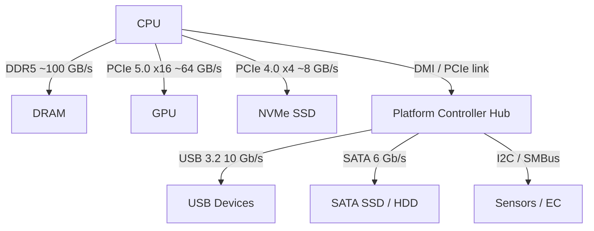

## In simple terms

A **bus** is the highway that connects the parts of a computer. The CPU uses one bus to talk to memory, another to talk to storage, another to talk to peripherals. Each bus has a width (how many bits move at once) and a speed (how many transfers per second). When a bus is too slow, fast components sit idle waiting for data — and the bus becomes the performance bottleneck, not the processor.

## The Visual Map



## More detail

Classical computer architecture talked about three logical buses:

- **Data bus** — the actual values.
- **Address bus** — where to read/write.
- **Control bus** — read/write signals, clocks, interrupts.

Modern computers don't expose these as shared multi-drop buses; they use **point-to-point serial links** that look the same from the outside:

- **PCIe (PCI Express)** connects CPUs to GPUs, NVMe SSDs, and many add-in cards. PCIe 5.0 carries ~32 GB/s per direction per 16-lane slot; PCIe 6.0 doubles this again.
- **DDR / LPDDR** — wide parallel links from CPU to RAM (the source of "memory bus" jargon). DDR5 dual-channel delivers ~100 GB/s.
- **NVLink, Infinity Fabric** — high-bandwidth links inside GPU clusters or between CCDs in a chiplet CPU. NVLink 4 carries 900 GB/s total.
- **USB, Thunderbolt** — external peripherals.
- **I²C, SPI, CAN, SMBus** — slow internal buses for sensors, microcontrollers, and automotive electronics.

The bus is often the bottleneck. A CPU may have terabytes-per-second of L1 cache bandwidth but only ~100 GB/s to main memory and a few GB/s to disk. Performance problems that look like CPU problems are frequently bus-bandwidth or bus-latency problems.

## Under the Hood

On Linux, each PCI/PCIe device exposes its configuration space as a 256-byte file under `/sys/bus/pci/devices/`. The first 16 bytes follow the standard PCI config header:

```python
import struct

# Simulates reading /sys/bus/pci/devices/0000:00:02.0/config (Intel UHD Graphics)
config = bytes([
    0x86, 0x80,        # Vendor ID: 0x8086 = Intel (little-endian)
    0x9B, 0x3E,        # Device ID: 0x3E9B
    0x07, 0x04,        # Command: Memory Space + Bus Master enabled
    0x90, 0x00,        # Status
    0x02,              # Revision ID
    0x00, 0x00, 0x03,  # Class code: 0x030000 = VGA controller
] + [0x00] * 244)

vid, did = struct.unpack_from('<HH', config, 0)
cls = struct.unpack_from('>I', config, 8)[0] >> 8

print(f"Vendor  : 0x{vid:04X}  {'(Intel)' if vid == 0x8086 else ''}")
print(f"Device  : 0x{did:04X}")
print(f"Class   : 0x{cls:06X}  {'(VGA controller)' if cls == 0x030000 else ''}")

# Real usage (Linux only):
# with open('/sys/bus/pci/devices/0000:00:02.0/config', 'rb') as f:
#     config = f.read(16)
```

## Engineering Trade-offs

**Shared bus vs. point-to-point switched:**
- A shared bus (the original ISA/PCI model) is simple: one set of wires, many devices, arbitration protocol. But all devices share bandwidth, and one slow device stalls everyone.
- Point-to-point (PCIe, DDR) gives each device dedicated lanes and full bandwidth. More wires on the PCB, but no contention.

**Bandwidth vs. latency:**
- A wide high-bandwidth bus (DDR5: 64-bit × 2 channels) amortises overhead per transaction — good for streaming.
- High-latency buses (SATA: ~200 µs) are hidden by buffering for large sequential reads, but catastrophic for random I/O (why NVMe replaced SATA for SSDs: PCIe latency ~10 µs).

**Serial vs. parallel:**
- Older parallel buses (PCI, IDE) moved many bits simultaneously on many wires — fast in theory, but timing skew between lanes caused synchronisation problems at high speeds.
- Modern serial buses (PCIe, USB, SATA) run fewer wires at much higher frequencies; differential signalling cancels noise. PCIe 5.0 runs 32 GT/s per lane on a single pair of wires.

## Real-world examples

- Connecting an Nvidia GPU via PCIe 4.0 x16 vs NVLink: NVLink 4.0 delivers ~900 GB/s (GPU-to-GPU) vs ~64 GB/s for PCIe — essential for multi-GPU training.
- An NVMe SSD plugged into a slower PCIe 3.0 x2 slot delivers ~3.5 GB/s; in PCIe 4.0 x4 it hits ~7 GB/s — same drive, different bus.
- USB 2.0 (480 Mb/s) vs USB 3.2 Gen 2 (10 Gb/s) for external SSDs: a 21× bandwidth difference from swapping only the bus.

## Common misconceptions

- **"Buses are shared wires."** Modern interconnects (PCIe, DDR, USB 3+) are almost all point-to-point with switching, not shared multi-drop buses.
- **"Wider bus is always faster."** Only if traffic can use the width. Random-access workloads are typically latency-bound; a narrower, lower-latency bus often outperforms a wide, high-latency one.

## Try it yourself

Compare bandwidth numbers across common bus types to see why NVMe replaced SATA and why GPU memory bandwidth matters:

```bash
python3 - <<'EOF'
buses = [
    # (name, bandwidth_GB_s, latency_us)
    ("I2C 400 kHz",             0.00005,  10_000),
    ("USB 2.0 Hi-Speed",        0.060,       500),
    ("SATA 6 Gb/s",             0.600,       200),
    ("USB 3.2 Gen 2x2",         2.5,          10),
    ("PCIe 4.0 x4 (NVMe)",     8.0,           7),
    ("PCIe 5.0 x16 (GPU slot)", 64.0,         100),
    ("DDR5-6400 dual-channel", 102.4,           0.07),
    ("HBM3 (GPU on-die)",      819.0,           0.05),
]

print(f"{'Bus':<30} {'BW (GB/s)':>12} {'Latency (us)':>14}")
print("-" * 60)
for name, bw, lat in buses:
    print(f"{name:<30} {bw:>12.3f} {lat:>14,.2f}")
EOF
```

## Learn next

- [DMA](/t/dma) — Direct Memory Access lets peripherals transfer data over the bus without burdening the CPU on every byte; understanding DMA explains why bus design matters for I/O performance
- [Peripheral](/t/peripheral) — the devices that connect via external buses (USB, Thunderbolt, PCIe add-in cards)
- [Motherboard](/t/motherboard) — the PCB that physically routes the buses between CPU, RAM, and expansion slots
