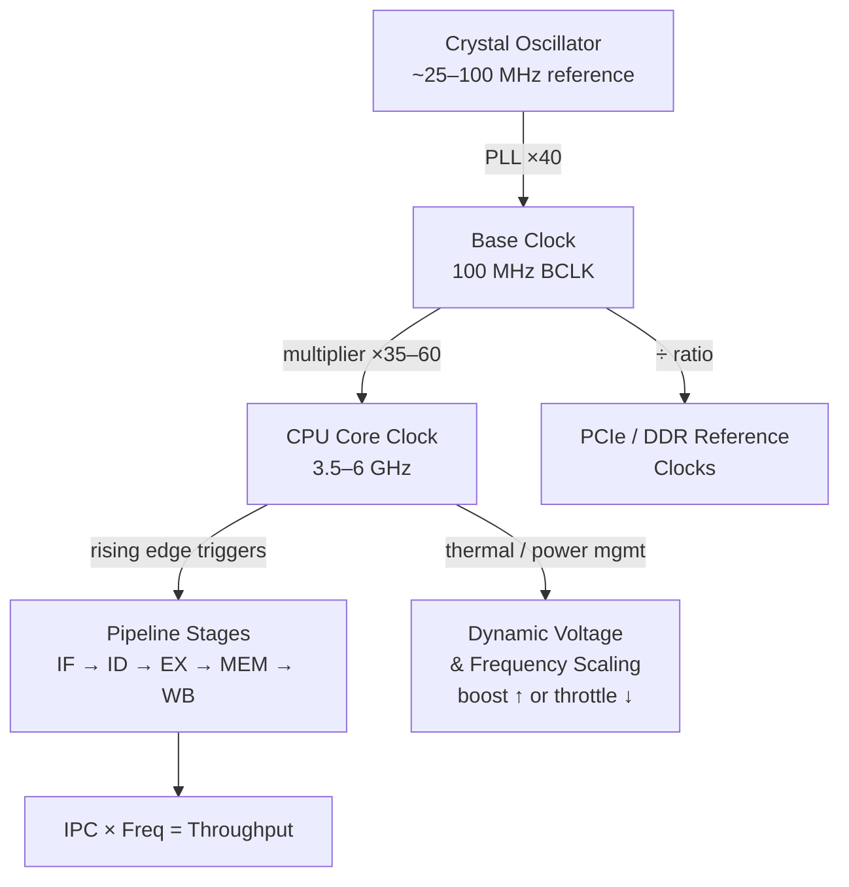

## In simple terms

A computer's **clock** is a metronome — a signal that pulses on and off billions of times a second to keep everything in step. On each tick, the [CPU](/t/cpu) advances one small step: fetch a bit of an instruction, do a calculation, move data. The **clock speed** (like "3.5 GHz") tells you how many ticks happen per second — 3.5 billion in that case. Without a clock, the millions of tiny operations inside a chip would have no shared sense of *when* to act, and the results would be chaos.

## The Visual Map



## More detail

Digital circuits are mostly **synchronous**: components only update their state on a clock edge (the moment the signal transitions from 0→1 or 1→0). This shared heartbeat ensures that signals have settled and everyone reads consistent values at the same instant.

- **Frequency** is measured in hertz: 1 GHz = one billion cycles per second. Modern CPUs run roughly 2–6 GHz.
- A clock cycle isn't the same as an instruction — thanks to [pipelining](/t/cpu-pipeline), a CPU can complete multiple instructions per cycle (IPC > 1), or a single instruction may take many cycles (memory loads, divisions).
- The base clock (BCLK) is generated by a tiny **crystal oscillator** (typically 25–100 MHz) and multiplied up by a Phase-Locked Loop (PLL) — the CPU's multiplier (e.g., ×40) sets the final core frequency. Overclocking usually means raising BCLK or the multiplier.

**Why not raise the clock forever?** Two hard limits:

- **Heat and power** — dynamic power scales as `P ∝ C × V² × f`. Doubling frequency requires raising voltage (to maintain timing margin), increasing power by more than 2×. This is a big reason chipmakers stopped chasing GHz around 2005 (see Dennard scaling) and pivoted to adding **cores** instead.
- **Physics** — signals must propagate across a pipeline stage within one clock cycle; the speed of light and transistor switching times set a ceiling. At 5 GHz, one cycle is 200 ps — signal travel time across a multi-millimetre chip becomes significant.

**Dynamic frequency scaling:** modern chips run at different speeds in different contexts:
- **Boost clocks:** briefly exceed the rated base clock when thermal headroom exists (Intel Turbo Boost, AMD Precision Boost).
- **Thermal throttling:** reduce frequency and voltage when temperature approaches the limit.
- **Power gating:** completely shut down idle cores.

## Under the Hood

The CPU exposes a hardware timestamp counter that counts clock cycles since boot. In Python, `time.perf_counter_ns()` wraps this counter on most platforms:

```python
import time

def count_cycles(func, n: int = 1_000_000, ghz: float = 3.5) -> tuple[float, float]:
    t0 = time.perf_counter_ns()
    for _ in range(n):
        func()
    t1 = time.perf_counter_ns()
    ns_per_call = (t1 - t0) / n
    cycles = ns_per_call * ghz       # approximate: 1 GHz → 1 cycle/ns
    return ns_per_call, cycles

ops = [
    ("integer add",    lambda: 1 + 1),
    ("float multiply", lambda: 3.14 * 2.71),
    ("list index",     lambda: [1, 2, 3][1]),
    ("dict lookup",    lambda: {1: "a"}[1]),
]

print(f"{'Operation':<18} {'ns/op':>8} {'~cycles at 3.5 GHz':>20}")
print("-" * 50)
for name, fn in ops:
    ns, cyc = count_cycles(fn)
    print(f"{name:<18} {ns:>8.2f} {cyc:>20.1f}")
```

At the silicon level, a 3.5 GHz clock means the PLL generates a 100 MHz reference, multiplies it by 35, and distributes it across the die via a **clock tree** — a hierarchy of buffers that keeps the clock edge arrival time within a few picoseconds everywhere on the chip.

## Engineering Trade-offs

**Clock speed vs. power:**
- Dynamic power scales as `P ∝ V² × f`. A 20% frequency increase requires ~6–10% higher voltage → ~30–45% more power for 20% more speed. This is why the "GHz race" of the 1990s–2000s ended: thermal dissipation, not transistor count, became the binding constraint.
- The shift to multi-core traded single-thread speed for parallel throughput: 4 cores at 3 GHz do more aggregate work at the same power envelope as 1 core at 6 GHz (which isn't thermally achievable anyway).

**Synchronous vs. asynchronous design:**
- Almost all chips are synchronous: a global clock coordinates all state changes. Simpler to design and verify; tooling (EDA) is mature.
- Asynchronous (clockless) circuits fire when inputs settle, potentially faster and more power-efficient — but design and verification are far harder. Used in niche applications (ARM's asynchronous ARM processor, research chips).

**Timing closure:** as frequencies increase, achieving "timing closure" — ensuring every signal reaches its destination within one clock period — becomes the hardest part of chip design. Place-and-route tools spend most of their runtime meeting timing constraints.

## Real-world examples

- Apple M4: base clock 4.4 GHz, boosting to 4.4 GHz on efficiency cores and 4.45 GHz on performance cores — the boost headroom is tiny because the chip is thermally limited.
- A laptop throttling from 4.0 GHz to 2.0 GHz when sustained under load: visible as the machine feeling slower after 10–15 minutes of video encoding.
- Enthusiasts overclocking an Intel Core i9 from 5.5 GHz to 6.0 GHz with liquid nitrogen — a 9% speed gain at the cost of extreme cooling and power.

## Common misconceptions

- **"Higher clock speed always means a faster computer."** Only when comparing similar architectures. A newer 3 GHz CPU can easily outperform an older 4 GHz one by doing more work per cycle (higher IPC). Architecture, core count, and cache size matter equally.
- **"One clock cycle equals one instruction."** Modern CPUs overlap instructions via pipelining and out-of-order execution, retiring several per cycle; cache misses and branches can stall for dozens of cycles.

## Try it yourself

Simulate the power/frequency trade-off that ended the GHz race:

```bash
python3 - <<'EOF'
# P ∝ C × V^2 × f;  Vdd ≈ f^0.3 in practice (simplified)
def core_power(freq_ghz: float, base_ghz: float = 3.0, base_W: float = 15.0) -> float:
    r = freq_ghz / base_ghz
    return base_W * r * (r ** 0.3) ** 2   # P ∝ f × V^2; V ∝ f^0.3

print(f"{'Freq (GHz)':>12} {'Power (W)':>12} {'Perf/W':>10}  {'vs 3 GHz':>10}")
print("-" * 50)
base_pw = 3.0 / core_power(3.0)
for f in [2.0, 2.5, 3.0, 3.5, 4.0, 4.5, 5.0]:
    p = core_power(f)
    pw = f / p
    print(f"{f:>12.1f} {p:>12.1f} {pw:>10.4f}  {pw/base_pw:>9.2f}x")
EOF
```

## Learn next

- [CPU pipeline](/t/cpu-pipeline) — the technique that lets a CPU do more than one instruction's work per clock cycle; understanding IPC explains why GHz alone doesn't predict performance
- [Dennard scaling](/t/dennard-scaling) — the physical law that made faster clocks free for decades, and why its breakdown in 2005 ended the GHz race permanently
- [Motherboard](/t/motherboard) — the PCB that houses the crystal oscillator, PLL circuits, and clock distribution network connecting CPU, RAM, and expansion slots
