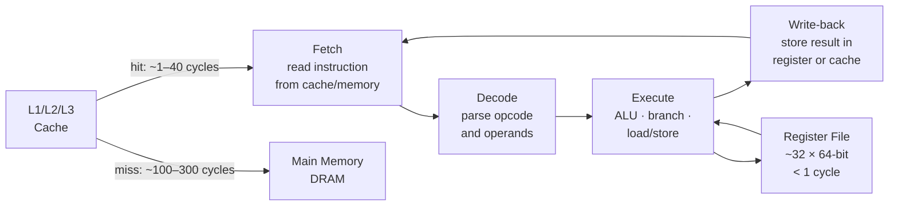

## In simple terms

The CPU (central processing unit) is the part of a computer that **does the work**. It reads instructions out of memory one after another and carries them out: add these numbers, copy this byte, jump to that address. Everything a program does — every pixel drawn, every packet sent, every neural-network multiply — eventually becomes a stream of CPU instructions.

## The Visual Map



## More detail

A CPU is built from a few cooperating pieces:

- **Registers** — a tiny pile of very fast storage cells, the CPU's "hands." x86-64 has 16 general-purpose 64-bit registers (RAX, RBX, … R15) plus floating-point and SIMD registers.
- **ALU (Arithmetic Logic Unit)** — does maths and boolean operations: add, subtract, AND, OR, shift.
- **Control unit** — decodes instructions and orchestrates the data path.
- **Caches** — small, fast SRAM memories close to the CPU to hide the slowness of main memory: L1 (~64 KB, ~1 ns), L2 (~512 KB, ~4 ns), L3 (~30 MB, ~10 ns), DRAM (~16 GB, ~70 ns).
- **Clock** — a metronome that ticks billions of times per second; one or more cycles per instruction step.

The cycle every CPU runs is the **fetch–decode–execute** loop:
1. Fetch the next instruction from memory (or cache).
2. Decode what it means.
3. Execute it (ALU operation, memory access, or branch).
4. Write the result back to a register or memory.
5. Repeat forever.

Modern CPUs have several cores (independent CPUs on one chip), **pipelines** (overlapping the fetch-decode-execute stages so multiple instructions are in-flight simultaneously), **out-of-order execution** (doing instructions in a smarter order while preserving the result), and **branch prediction** (guessing where conditional jumps go before they resolve).

## Under the Hood

A minimal Python CPU simulator — fetch-decode-execute over a tiny instruction set:

```python
REGS = [0] * 8   # R0–R7

INSTR = {
    "LOAD": lambda d, v, _:    REGS.__setitem__(d, v),
    "ADD":  lambda d, a, b:    REGS.__setitem__(d, REGS[a] + REGS[b]),
    "SUB":  lambda d, a, b:    REGS.__setitem__(d, REGS[a] - REGS[b]),
    "MUL":  lambda d, a, b:    REGS.__setitem__(d, REGS[a] * REGS[b]),
}

# A tiny program
program = [
    ("LOAD", 1, 10, 0),    # R1 = 10
    ("LOAD", 2, 32, 0),    # R2 = 32
    ("ADD",  0, 1,  2),    # R0 = R1 + R2
    ("LOAD", 3,  5, 0),    # R3 = 5
    ("SUB",  4,  0, 3),    # R4 = R0 - R3  (= 37)
    ("MUL",  5,  4, 3),    # R5 = R4 * R3  (= 185)
]

print(f"{'PC':>3}  {'Instr':<20}  R0   R1   R2   R3   R4   R5")
print("-" * 55)
for pc, (op, d, a, b) in enumerate(program):
    INSTR[op](d, a, b)
    print(f"{pc:>3}  {op+f' R{d},{a},{b}':<20} " +
          "  ".join(f"{REGS[i]:>3}" for i in range(6)))
```

## Engineering Trade-offs

**Cores vs. clock speed:**
- A CPU at 6 GHz has a higher single-thread ceiling than one at 3 GHz, but consumes exponentially more power (see Dennard scaling). The industry settled on 3–5 GHz with many cores.
- Adding cores helps only parallel workloads. Sequential code (most everyday tasks) is limited by single-thread speed (Amdahl's Law: 95% parallel code still has a 20× ceiling at infinite cores).

**Out-of-order execution vs. in-order:**
- OOO CPUs find independent instructions and execute them ahead of dependent ones, hiding latency. More hardware (reorder buffer, reservation stations, rename registers), more power — but 2–5× better throughput for typical code.
- In-order CPUs (many embedded ARM cores, Atom, early RISC) are simpler, cheaper, and more power-efficient — appropriate where power matters more than peak throughput.

**Large cache vs. more cores:**
- Cache reduces DRAM access latency; every MB of L3 costs area (transistors). AMD EPYC with 3D V-Cache stacks 192 MB to hide memory latency for database workloads.
- The cache vs. core trade-off determines what CPU is best for a given workload (cache-sensitive databases vs. highly parallel batch compute).

## Real-world examples

- Apple M4 (TSMC 3nm): 4 performance cores (4.45 GHz) + 6 efficiency cores (2.6 GHz) — heterogeneous design so light tasks use 10% of the power.
- AMD EPYC Genoa (Zen 4): 96 cores, 384 MB L3 cache — optimised for cloud server throughput, not single-thread speed.
- Raspberry Pi 5: quad-core ARM Cortex-A76 at 2.4 GHz, ~$80 — a real Linux computer on a credit-card PCB.

## Common misconceptions

- **"GHz tells you how fast a CPU is."** Clock speed matters, but so does IPC (instructions per clock). A modern 3 GHz CPU far outperforms a 2004 4 GHz Pentium 4 because IPC roughly tripled.
- **"A CPU and a GPU are interchangeable."** A CPU is a generalist optimised for sequential, latency-sensitive work with branch-heavy code. A GPU is specialised for doing the same operation on thousands of data elements in parallel.

## Try it yourself

Measure your CPU's single-thread throughput for compute-heavy work:

```bash
python3 - <<'EOF'
import time, math

def cpu_bound(n: int) -> float:
    total = 0.0
    for i in range(1, n + 1):
        total += math.sqrt(i) * math.log(i + 1)
    return total

N = 2_000_000
t0 = time.perf_counter_ns()
result = cpu_bound(N)
t1 = time.perf_counter_ns()

ms = (t1 - t0) / 1_000_000
print(f"Iterations  : {N:,}")
print(f"Elapsed     : {ms:.1f} ms")
print(f"Throughput  : {N/(ms/1000):>12,.0f} ops/s")
print(f"Result check: {result:.2f}")
EOF
```

## Learn next

- [Memory](/t/memory) — the CPU is almost useless without memory to read instructions from and store results to; cache hierarchy design is inseparable from CPU design
- [Clock](/t/clock) — the metronome that synchronises every pipeline stage; understanding clock speed and its limits explains why GHz stopped growing in 2005
- [Operating system](/t/operating-system) — the software that multiplexes the CPU across hundreds of processes, schedules threads, and provides the context-switch mechanism
