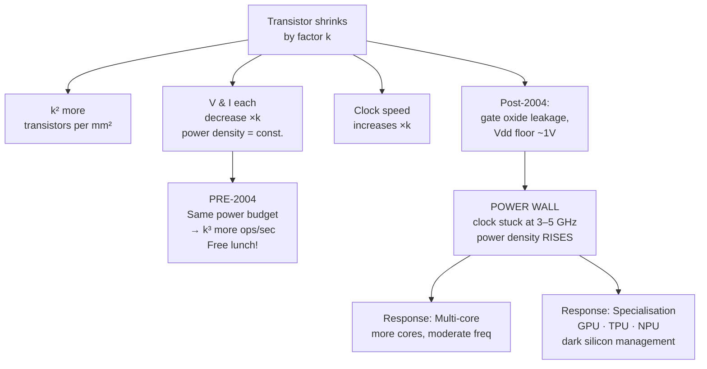

## In simple terms

Through the 1980s and 1990s, CPU clock speeds roughly doubled every 18 months — from 1 MHz in 1975 to 3 GHz in 2004. This happened because of Dennard scaling: as transistors shrank, they got faster and used less power per switching operation. You could fit twice as many transistors and run them twice as fast using the same power. Then, around 2004, it stopped. Modern transistors leak current even when "off." You cannot run all transistors at full speed without melting the chip. Clock speeds have been stuck at 3–5 GHz ever since.

## The Visual Map



## More detail

**Dennard scaling (1974):** Robert Dennard's paper showed that as transistors scale by factor `k` (getting `k` times smaller):
- Linear dimensions shrink by `k`.
- Supply voltage decreases by `k`.
- Current decreases by `k`.
- Result: **power per unit area stays constant** — but you get `k²` more transistors, each switching `k` times faster.
- Net effect: **same power, `k³` more operations per second** as transistors shrink.

This is why a 1990 CPU at 33 MHz and a 2000 CPU at 1 GHz used similar power (~10–20W) but the 2000 CPU was 30× faster — you got the speed for free via scaling.

**Why Dennard scaling broke:**
- **Gate oxide leakage:** as the gate dielectric approached ~1nm thickness, electrons tunnel through it even when the transistor is "off." Leakage current is proportional to dielectric area, and scaling makes it worse.
- **Threshold voltage floor:** transistors switch at threshold voltage `V_th`. Reducing supply voltage `Vdd` saves power, but `Vdd − V_th` (the noise margin) shrinks. Going below ~0.7V causes unreliable switching. The industry has been stuck at ~1V supply for 20 years.
- **Short-channel effects:** as gate length shortens, the gate loses electrostatic control of the channel — causing sub-threshold leakage and DIBL (Drain-Induced Barrier Lowering).

**Consequence — the power wall:** around 2004, Intel cancelled Tejas (a 10 GHz Prescott successor) because the chip would have exceeded 150W — thermally unmanageable in air cooling. Clock speeds have been roughly flat since.

**Dark silicon:** even with transistor density continuing to grow (Moore's Law), at advanced nodes you cannot power all transistors simultaneously without exceeding thermal design power (TDP). Estimated 50%+ of transistors must stay powered off ("dark") at peak load on leading-edge chips. The solution: specialisation. Power the GPU while the CPU is off; power the NPU while both are off. Apple's M-series chip exploits this aggressively.

**Responses to the end of Dennard scaling:**
- **Multi-core (2005–2015):** use multiple slower cores instead of one fast core. Same power budget, more parallelism.
- **Specialised accelerators (2010–present):** GPUs, TPUs, NPUs, video encoders — each doing one thing efficiently rather than a general-purpose core doing everything slowly.
- **Advanced packaging:** chiplets (AMD EPYC), 3D stacking (Intel Foveros), HBM memory — improve bandwidth and integration without relying solely on process scaling.

Understanding the end of Dennard scaling explains why CPU clock speeds stopped increasing, why modern chips have 8–32 cores, why GPUs and NPUs exist, and why "just buy faster hardware" is no longer a reliable performance strategy. For software engineers, performance now requires parallelism, cache-awareness, and algorithmic efficiency — the free lunch ended in 2004.

## Under the Hood

This models both the ideal Dennard world and the post-2004 reality — showing why clock speed increases became thermally impossible:

```python
def dennard_ideal(k: float) -> tuple[float, float]:
    """Ideal: ops/s scales as k^3, power density stays constant."""
    ops_per_s = k ** 3       # k^2 transistors × k speed
    power = 1.0              # constant — the promise of Dennard
    return ops_per_s, power

def dennard_actual(k: float, leakage: float = 0.4) -> tuple[float, float]:
    """Post-2004: leakage current breaks the constant-power promise."""
    freq = min(k, 1.3)            # clock speed plateaued around 2004
    transistors = k ** 2          # density still grows (Moore's Law)
    usable = transistors / (1 + leakage * k)   # leakage steals headroom
    ops_per_s = usable * freq
    power = k ** 1.5              # power density RISES
    return ops_per_s, power

print(f"{'Gen (k)':>8}  {'Ideal ops/s':>12}  {'Actual ops/s':>13}  {'Power×':>8}")
print("-" * 50)
for k in [1, 2, 4, 8, 16, 32]:
    ideal_ops, _ = dennard_ideal(k)
    actual_ops, power = dennard_actual(k)
    print(f"{k:>8}  {ideal_ops:>12,.0f}  {actual_ops:>13,.1f}  {power:>8.1f}×")
```

## Engineering Trade-offs

**What Dennard scaling gave us (pre-2004):**
- Free performance: each process node provided faster clocks, lower power, and lower cost simultaneously — software developers needed only to wait for the next Intel generation.
- Single-core dominance: single-threaded sequential code ran faster on every new chip with no software changes required.

**What the power wall changed:**
- Performance no longer comes from clock speed. It comes from parallelism (multi-core, SIMD), specialisation (GPU, NPU), and cache hierarchy design.
- Software must be explicitly parallel to benefit from new silicon — Amdahl's Law caps the benefit for sequential code.
- Power efficiency (performance per watt) replaced raw GHz as the key hardware metric — critical for mobile, cloud economics, and data centre TCO.

**Dark silicon trade-off:**
- You can power a small fraction of transistors at high frequency OR power all transistors at low frequency. "Turbo Boost" is the former: one hot core at 5 GHz while the others are gated off.
- Heterogeneous chip designs (Apple M, ARM big.LITTLE) formalise this: large powerful cores for peak work, tiny efficient cores for background tasks.

## Real-world examples

- Intel Pentium 4 "Prescott" (90nm, 2004): 3.8 GHz, 115W — the wall. Intel cancelled 5+ GHz successors.
- Intel Core 2 Duo (65nm, 2006): two cores at 2.4 GHz, 65W — multi-core as the response.
- Apple M4 (2024): 4 performance cores (3.9 GHz) + 6 efficiency cores (2.6 GHz) + 38-core GPU + Neural Engine — radical heterogeneity because no single core type can do everything efficiently within the power envelope.

## Common misconceptions

- **"Multi-core makes programs 8× faster."** Multi-core helps only parallel workloads. Sequential code runs on one core at roughly the same speed as 2004. Amdahl's Law limits the speedup for any code with a sequential fraction.
- **"New chips are faster because of higher clock speeds."** Modern performance gains come from IPC improvements, wider superscalar engines, larger caches, and specialised accelerators — not MHz/GHz increases.

## Try it yourself

Model the power wall — see why running a CPU above ~5 GHz requires impractical cooling:

```bash
python3 - <<'EOF'
# P ∝ C × V^2 × f;  V empirically scales ~f^0.3 post-2004
def tdp(freq_ghz: float, base_ghz: float = 3.0, base_W: float = 65.0) -> float:
    r = freq_ghz / base_ghz
    return base_W * r * (r ** 0.3) ** 2   # V ∝ f^0.3, P ∝ f × V^2

print(f"{'Freq (GHz)':>12} {'TDP (W)':>10} {'Perf/W':>10}  Note")
print("-" * 55)
for f in [2.0, 2.5, 3.0, 3.5, 4.0, 4.5, 5.0, 5.5, 6.0]:
    p = tdp(f)
    note = " << impossible to air-cool" if p > 200 else (" << needs liquid" if p > 125 else "")
    print(f"{f:>12.1f} {p:>10.1f} {f/p:>10.4f}  {note}")
EOF
```

## Learn next

- [Superscalar](/t/superscalar) — the primary CPU response to the power wall: extracting more instructions per clock cycle (IPC) from the same frequency budget
- [ASIC](/t/asic) — application-specific chips exploit dark silicon aggressively: power only the logic needed for one task, achieving orders-of-magnitude better efficiency than general-purpose cores
- [GPU](/t/gpu) — many simple cores at moderate frequency, designed to run all together on parallel workloads where a hot single CPU core is wasteful
