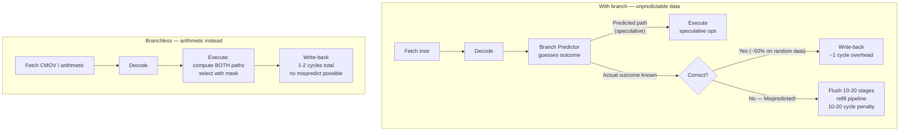

## In simple terms

A modern CPU starts executing the *next* instruction before it knows whether a branch was taken — a technique called speculative execution. When it guesses wrong, it throws away the speculative work and starts over: a **branch misprediction** penalty of 10–20 cycles. Branchless programming removes the branch entirely, replacing it with arithmetic that computes the same answer regardless of condition, so there is nothing to mispredict.

## The Visual Map



## More detail

The [CPU pipeline](/t/cpu-pipeline) is always running ahead. The branch predictor keeps a table of outcomes for recent branches and guesses "taken" or "not taken". Predictable patterns — a loop that almost always runs the body, a function that almost always follows the same path — cost nearly nothing. Unpredictable patterns — a comparison whose outcome alternates randomly, a bounds check that fails occasionally — break the pipeline's stride.

Techniques to remove branches:

**Conditional moves.** `(a < b) ? a : b` can compile to a `cmov` (conditional move) instruction, which reads both values and selects one without branching. Compilers sometimes generate this automatically with `-O2`.

**Boolean arithmetic.** A comparison produces 0 or 1. Multiplying by 0 or 1 selects between two values without a branch:
```c
int clamp(int v, int lo, int hi) {
    int above = (v > hi);
    int below = (v < lo);
    return v * (!above & !below) + hi * above + lo * below;
}
```

**Bit masking.** `-(condition)` produces all-zero or all-ones bits, masking an expression in or out with a bitwise AND — no branch, just integers.

**Predicated SIMD.** [SIMD](/t/simd) blend/select instructions pick between two vector lanes based on a mask — effectively branchless selection across 4–16 elements at once.

The discipline is not "never branch" but "don't branch unpredictably on hot paths". Static branches (loop bounds, type dispatch resolved at compile time) cost nothing. It's data-dependent branches over random data that mispredicts and slow the pipeline.

On a modern CPU doing 3–4 GHz and running multiple instructions per clock, a 15-cycle misprediction stall is a visible fraction of a tight loop's total cost. In a comparison function called millions of times per second — sorting, binary search, order-matching — removing a single unpredictable branch can cut runtime in half.

## Under the Hood

Boolean arithmetic implements branchless `clamp` and `sign` — no if/else anywhere:

```python
def clamp_branchy(v: int, lo: int, hi: int) -> int:
    if v < lo: return lo
    if v > hi: return hi
    return v

def clamp_branchless(v: int, lo: int, hi: int) -> int:
    above = int(v > hi)     # 0 or 1 — no branch, boolean arithmetic
    below = int(v < lo)
    stay  = 1 - above - below
    return v * stay + hi * above + lo * below

def sign_branchless(x: int) -> int:
    return int(x > 0) - int(x < 0)   # -1, 0, or +1 without if/else

vals = [-100, -1, 0, 1, 42, 99, 200]
print("clamp(v, 0, 100) — branchy vs branchless:")
print(f"  {'v':>5}  {'branchy':>8}  {'branchless':>12}  match?")
print("  " + "-" * 38)
for v in vals:
    b  = clamp_branchy(v, 0, 100)
    bl = clamp_branchless(v, 0, 100)
    print(f"  {v:>5}  {b:>8}  {bl:>12}  {'OK' if b == bl else 'BUG'}")

print()
print("sign(x) branchless:")
for x in [-42, 0, 99]:
    print(f"  sign({x:>4}) = {sign_branchless(x):>2}")
```

In C, the compiler maps `int(v > hi)` directly to a `setg` instruction that writes 0 or 1 to a register — no branch. At `-O2`, `(a < b) ? a : b` may emit a single `cmovl` instruction.

## Engineering Trade-offs

**When branchless wins:** unpredictable data-dependent branches on hot paths. Random input comparison functions, sort partitions, hash-table probes, parser character-class dispatch, order matching. A 50/50 unpredictable branch has an effective cost of ~10 cycles; branchless replaces it with ~2 cycles of arithmetic.

**When branchless loses:** highly predictable branches — the CPU predicts them correctly ~99% of the time. The "true" branch of an always-taken loop iteration, a null check that almost never fires, an error path rarely reached. The branchless version computes extra work even when the condition is known — slower than a correctly-predicted branch that executes one path.

**Compilers do this too:** GCC/Clang generate `cmov` for `(a < b) ? a : b` when they detect the branch might mispredict. The `-fprofile-use` optimisation (PGO) feeds runtime branch statistics back to the compiler so it can make this decision automatically. Manual branchless code is the fallback when PGO isn't available or the compiler misses the pattern.

**Code readability:** branchless code is harder to read than `if/else`. Reserve it for the handful of hot-path functions where profiling shows branch misprediction overhead.

## Real-world examples

- High-frequency trading comparison functions for order matching are hand-tuned to `cmov` sequences to avoid unpredictable sort-direction branches.
- `std::sort` implementations use branchless partition kernels for the inner loop where mispredictions would dominate.
- Image-processing loops use SIMD blend instructions to clamp pixel values without per-pixel conditional jumps.
- Hash-table probe sequences avoid a "found/not-found" branch by using a branchless comparison and mask.

## Common misconceptions

- **"Branchless code is always faster."** Not if the branch was highly predictable — a predictable branch has near-zero cost. Branchless is only faster when the branch was *unpredictable*.
- **"The compiler always figures this out."** Compilers generate `cmov` when it's clearly safe; data-dependent bit tricks require human insight into the specific access pattern.

## Try it yourself

Demonstrate branchless boolean arithmetic — `clamp()` and `sign()` without any `if/else`:

```bash
python3 - <<'EOF'
def clamp_branchy(v, lo, hi):
    if v < lo: return lo
    if v > hi: return hi
    return v

def clamp_branchless(v, lo, hi):
    above = int(v > hi)
    below = int(v < lo)
    return v * (1 - above - below) + hi * above + lo * below

def sign_branchless(x):
    return int(x > 0) - int(x < 0)

vals = [-200, -1, 0, 1, 50, 99, 100, 201]
print("clamp(v, 0, 100):")
for v in vals:
    b = clamp_branchy(v, 0, 100)
    bl = clamp_branchless(v, 0, 100)
    tag = "OK" if b == bl else "BUG"
    print(f"  clamp({v:>5}, 0, 100) = {bl:>3}  {tag}")

print()
print("sign(x) with no if/else:")
for x in [-99, 0, 42]:
    print(f"  sign({x:>4}) = {sign_branchless(x):>2}")
EOF
```

## Learn next

- [SIMD](/t/simd) — extends branchless ideas to whole vector registers: blend/select operations compute both branches across 8–16 lanes simultaneously, amplifying the speedup
- [Cache-line alignment](/t/cache-line-alignment) — the data layout prerequisite: branchless code on scattered data still stalls on cache misses; contiguous layout lets the CPU prefetch ahead
- [SIMD intrinsics](/t/simd-intrinsics) — the C-level interface to vectorised branchless operations: `_mm256_blendv_ps` selects between two vectors based on a mask, eliminating branches across whole AVX2 registers
