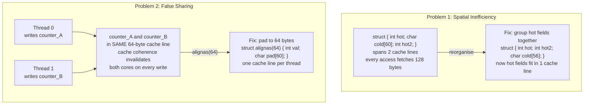

## In simple terms

A CPU never reads a single byte from memory — it pulls in a whole **cache line**, typically 64 bytes, at once. Cache-line alignment is the craft of arranging your data so that the bytes you use together land in the same line, and the bytes used by *different* threads land in *different* lines. Get it right and the processor does less work; get it wrong and it quietly burns cycles shuttling memory it didn't need.

## The Visual Map



## More detail

Two distinct problems hide here:

**Spatial locality / packing.** If a struct's frequently-touched fields span two cache lines, every access risks two fetches instead of one. Grouping hot fields together (and pushing cold fields elsewhere) keeps a working set in fewer lines, which means fewer cache misses and better use of the memory hierarchy.

**False sharing.** When two threads write to two *different* variables that happen to sit in the *same* cache line, the [cache-coherence](/t/cache-coherence) protocol treats it as a conflict. Each write invalidates the other core's copy, so the line ping-pongs between cores even though the threads never actually share data. The fix is to pad or align hot per-thread data to its own line (e.g. `alignas(64)`), trading a little memory for a large drop in coherence traffic.

Alignment also matters for [SIMD](/t/simd): vector loads often require operands aligned to 16-, 32-, or 64-byte boundaries to hit the fast path. The general technique is to think about the *physical* layout of bytes, not just the logical structure of objects — `struct` field order, padding, and array-of-structs vs struct-of-arrays all change how many lines a loop touches.

In hot loops, memory layout often dominates algorithmic cleverness. A counter that suffers false sharing can make a multithreaded program *slower* than its single-threaded version. A struct reorganised to fit one cache line instead of two can halve memory traffic in a tight loop.

## Under the Hood

Simulating false sharing — the cache-line ping-pong effect between threads:

```python
import threading, time

ITERATIONS = 2_000_000

class FalseShared:
    def __init__(self):
        self.a = 0   # counter A and B in the same Python object
        self.b = 0   # (same dict, likely same cache line in CPython)

class PadShared:
    def __init__(self):
        self.a   = 0
        self._pad = [0] * 16   # push b far away (not real padding, conceptual)
        self.b   = 0

def increment_a(obj, n):
    for _ in range(n):
        obj.a += 1

def increment_b(obj, n):
    for _ in range(n):
        obj.b += 1

for label, obj in [("Same object (false-share-like)", FalseShared())]:
    t0 = time.perf_counter_ns()
    ta = threading.Thread(target=increment_a, args=(obj, ITERATIONS))
    tb = threading.Thread(target=increment_b, args=(obj, ITERATIONS))
    ta.start(); tb.start()
    ta.join(); tb.join()
    ms = (time.perf_counter_ns() - t0) / 1e6
    print(f"{label}: {ms:.0f} ms  a={obj.a} b={obj.b}")
print()
print("In C/C++ with real threads and alignas(64):")
print("  False sharing penalty: 3-10x slower on write-heavy counters")
print("  Fix: __attribute__((aligned(64))) or alignas(64) on each counter")
```

## Engineering Trade-offs

**Struct layout order matters:** C/C++ compilers respect declared field order and add alignment padding between fields to satisfy alignment requirements, but they don't reorder fields for access pattern. A struct with `char` → `int` → `char` wastes 6 bytes to padding; `char` → `char` → `int` wastes nothing. Run `pahole` (Linux) to see actual struct layouts and padding.

**False sharing vs. true sharing:** false sharing is an invisible contention — no lock, no shared data semantically, but the hardware-level coherence protocol still forces serialisation. Even read-only data can suffer: if two threads read a variable on the same line that a third thread writes, the reads keep getting invalidated. True sharing (threads reading and writing the *same* data) is solved by synchronisation; false sharing is solved by layout.

**Cache line size assumption:** 64 bytes on all modern x86-64 and ARM64 CPUs. `std::hardware_destructive_interference_size` (C++17) returns this at compile time without hardcoding. Relying on 64 is safe for current hardware, but ARM's SVE CPUs can have larger cache lines.

**Over-padding trade-off:** padding every per-thread counter to 64 bytes wastes memory proportional to the number of threads. On a 256-core server with 256 padded counters × 64 bytes = 16 KB — trivial. Padding large arrays per-element is different and should be done selectively.

## Real-world examples

- High-performance queues pad their head and tail indices to separate cache lines so producer and consumer threads never false-share.
- Game engines store entity components as struct-of-arrays so a system iterating one field streams contiguous cache lines.
- Per-CPU counters in the Linux kernel are cache-line aligned to avoid coherence ping-pong under load.
- The Go runtime's `sync.Mutex` is padded to avoid false sharing with adjacent struct fields in the standard library.

## Common misconceptions

- **"Two threads touching different variables can't interfere."** They can, if those variables share a cache line — false sharing is a real, measurable slowdown that doesn't show up in the application logic.
- **"The compiler lays out my data optimally."** It respects alignment rules and your declared field order, but it won't reorganise a struct for your access pattern; that's on you.

## Try it yourself

Show how struct field order affects cache-line utilisation:

```bash
python3 - <<'EOF'
import struct

# Simulate C struct layout with padding
def sizeof_with_padding(fields):
    """Compute size of a C struct with natural alignment padding."""
    offset = 0
    max_align = 1
    for size, _ in fields:
        align = size
        if offset % align: offset += align - (offset % align)
        offset += size
        max_align = max(max_align, align)
    if offset % max_align: offset += max_align - (offset % max_align)
    return offset

# AoS (array of structs) - typical OOP layout
aos_fields = [(4, "x"), (4, "y"), (4, "z"), (4, "health"), (1, "active"), (1, "dead")]
aos_size = sizeof_with_padding(aos_fields)

# Compact hot-field struct (just position + health)
hot_fields = [(4, "x"), (4, "y"), (4, "z"), (4, "health")]
hot_size = sizeof_with_padding(hot_fields)

print(f"Full struct (AoS)    : {aos_size} bytes per entity")
print(f"Hot-fields only      : {hot_size} bytes per entity")
print()
n = 10_000
print(f"For {n:,} entities:")
print(f"  AoS (full struct)  : {n * aos_size:>9,} bytes  -> {n*aos_size//64:>6,} cache lines")
print(f"  Hot fields (SoA)   : {n * hot_size:>9,} bytes  -> {n*hot_size//64:>6,} cache lines")
ratio = (n * aos_size) / (n * hot_size)
print(f"  SoA uses {1/ratio:.1%} of the cache lines for the same loop")
EOF
```

## Learn next

- [Cache coherence](/t/cache-coherence) — the hardware protocol that causes false sharing: MESI states, invalidation broadcasts, and why a write on one core forces all other cores to reload the line
- [Memory pool](/t/memory-pool) — contiguous pool allocation complements alignment: pool objects are tightly packed and properly aligned, while `malloc` may place objects with gaps that cause unnecessary cache-line splits
- [Lock-free programming](/t/lock-free-programming) — atomic operations on shared data still generate coherence traffic; aligning each shared variable to its own cache line removes the false-sharing component from lock-free contention
