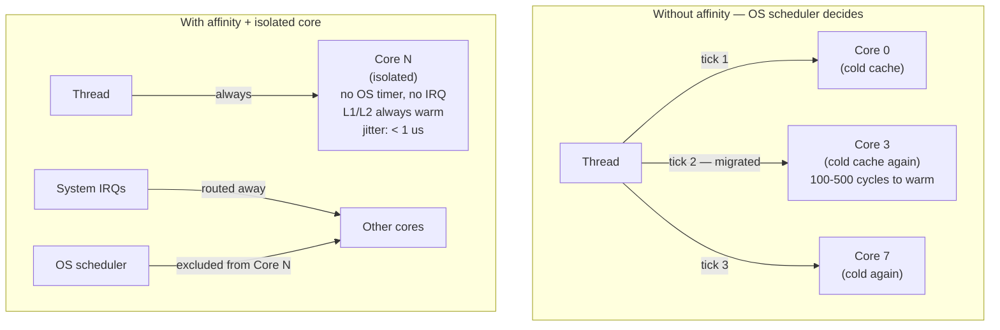

## In simple terms

Normally the OS [scheduler](/t/scheduler) can move a thread from core 3 to core 7 whenever it likes — it balances load across cores without consulting the application. Core affinity says "no: this thread *always* runs on core 3, full stop." The thread pays no latency for migration, its data stays warm in core 3's private L1/L2 caches, and the core can be isolated entirely from the OS scheduler, making timing rock-steady.

## The Visual Map



## More detail

Modern CPUs have a hierarchy of caches. L1 and L2 are **per-core private**; L3 is typically shared. When the OS migrates a thread, it may move to a core whose L1/L2 holds nothing relevant — a cold-start cost of hundreds of cycles for each cache line that needs reloading. Pinning eliminates that.

The techniques that build on affinity:

- **`pthread_setaffinity_np` / `sched_setaffinity`** (Linux), **`SetThreadAffinityMask`** (Windows) — API calls that bind a thread to a cpu-set.
- **Isolated cores (`isolcpus`)** — boot the Linux kernel with certain core numbers excluded from the general scheduler. Those cores receive no OS timers, no work-stealing, no interrupts (beyond the strict minimum). A pinned thread on an isolated core runs with microsecond-scale jitter instead of millisecond-scale.
- **IRQ routing** — move network and disk interrupt handling away from the application's core(s) so interrupts don't preempt the hot path.
- **NUMA affinity** — on multi-socket servers, pin threads *and* their memory allocations to the same NUMA node; crossing a socket boundary for memory doubles latency (see [NUMA awareness](/t/numa-awareness)).

Jitter is latency's hidden enemy. A trading engine that processes a market event in 5 µs *on average* but sometimes stalls 500 µs when the OS rescheduled it onto a cold core fails its SLAs. Pinning + isolated cores compresses the *distribution* of response times, not just the mean.

The risk is that pinned threads can't be load-balanced — if one core's workload surges, the others sit idle. So affinity is applied surgically: to the handful of threads where predictable latency is non-negotiable, leaving the rest freely schedulable.

## Under the Hood

Simulating the cache warm-up penalty when a thread is migrated to a new core:

```python
import random, time

CACHE_LINES = 1024   # number of 64-byte lines in a simplified L2

class SimulatedCore:
    def __init__(self, core_id: int):
        self.id    = core_id
        self.cache = set()   # set of "line addresses" currently cached

    def run(self, working_set: list) -> int:
        """Return cache miss count for this working set."""
        misses = sum(1 for addr in working_set if addr not in self.cache)
        self.cache = set(working_set)   # load working set into cache
        return misses

def simulate_migration(n_ticks: int, ws_size: int = 64):
    cores = [SimulatedCore(i) for i in range(8)]
    ws = list(range(ws_size))   # thread's working set: 64 cache lines

    print(f"Thread working set: {ws_size} cache lines")
    print(f"{'Tick':>5} {'Core':>5} {'Cold misses':>12}  {'Type'}")
    print("-" * 40)

    for tick in range(n_ticks):
        if tick < 4:   # pinned: always core 0
            core = cores[0]
        else:          # migrated: random core
            core = random.choice(cores[1:])
        misses = core.run(ws)
        typed = "COLD" if misses > ws_size * 0.5 else "warm"
        print(f"{tick:>5} {core.id:>5} {misses:>12}  {typed}")

random.seed(42)
simulate_migration(8)
```

## Engineering Trade-offs

**Pinning vs. load balancing:** the OS scheduler is good at spreading work evenly. Pinning breaks load balancing — if core N's thread is lightly loaded while other cores are maxed out, those cores can't help. Pin only the handful of latency-critical threads (typically 1–4); leave the rest freely schedulable.

**Isolated cores overhead:** isolating a core removes it from the scheduler's pool, which can cause OS-level imbalance. On a 32-core server, isolating 4 for latency-critical work leaves 28 for the OS — usually fine. Isolating half the cores may create OS scheduling issues under high load.

**Interrupt affinity:** Linux assigns interrupts to cores via `/proc/irq/N/smp_affinity_list`. Routing all NIC, disk, and timer interrupts away from pinned cores requires explicit configuration. Tools: `set_irq_affinity.sh` (in the Linux kernel tools), `irqbalance` daemon (counterproductive for pinned cores — disable it on latency-critical systems).

**Context-switch cost baseline:** a normal [context switch](/t/context-switch) costs ~1–10 µs, dominated by TLB flush and cache reload. An isolated, pinned core has essentially zero context switch cost — no other thread preempts it.

## Real-world examples

- High-frequency trading firms pin the order-submission thread to an isolated core and route all network interrupts away from it.
- DPDK (Data Plane Development Kit) dedicates entire cores to packet I/O loops; those cores are isolated and polled, never interrupted.
- Real-time audio servers (JACK, PulseAudio in RT mode) pin the audio callback thread and elevate its priority to prevent dropout.
- CERN's CMS detector reads data in real time from thousands of sensors; each processing thread is pinned and isolated to guarantee deterministic readout timing.

## Common misconceptions

- **"More cores is always better."** An isolated, pinned thread on one core beats a freely-migrated thread that bounces across eight because cache warm-up overhead dominates for short tasks.
- **"Pinning is only for exotic embedded systems."** It is routine in any user-space application with hard latency requirements — trading, telecom, gaming servers, real-time control.

## Try it yourself

Model the cache warm-up cost of thread migration vs. pinned execution:

```bash
python3 - <<'EOF'
import random

CACHE_SIZE = 128   # simplified: 128 cache lines per private cache
WS         = 64    # thread needs 64 cache lines

def run_tick(core_cache: set, ws: list) -> int:
    misses = sum(1 for a in ws if a not in core_cache)
    core_cache.clear()
    core_cache.update(ws)
    return misses

random.seed(7)
ws = list(range(WS))
cores = [set() for _ in range(8)]

print("Pinned to core 0 (first 5 ticks), then migrated (next 5 ticks):")
print(f"{'Tick':>5} {'Core':>5} {'Misses':>8}  {'Status'}")
print("-" * 35)
for tick in range(10):
    if tick < 5:
        core_id = 0
    else:
        core_id = random.randint(1, 7)
    misses = run_tick(cores[core_id], ws)
    status = "warm" if misses < WS * 0.1 else f"COLD ({misses} misses)"
    print(f"{tick:>5} {core_id:>5} {misses:>8}  {status}")
EOF
```

## Learn next

- [Context switch](/t/context-switch) — what the OS does when it moves a thread to a different core: saving/restoring registers, flushing TLB entries, reloading cache lines — the overhead that pinning eliminates
- [Memory pool](/t/memory-pool) — contiguous pool allocation complements pinning: if the thread's data is pooled and NUMA-local, the warm cache retains it across ticks
- [NUMA awareness](/t/numa-awareness) — the memory-topology complement to core affinity: pin thread to socket 0 cores *and* allocate its memory on NUMA node 0 to keep data access local
