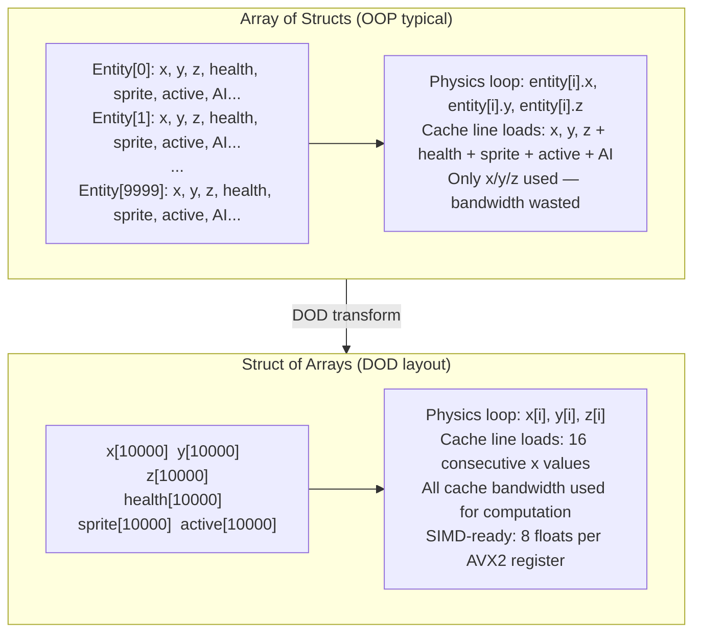

## In simple terms

Object-oriented design asks "what *things* does this system model?" Data-oriented design asks "what *data* does this system transform, and how should it sit in memory for the CPU to do that fast?" The insight is that the CPU is not slow — it is almost always waiting for memory. Arranging data contiguously by access pattern, not by conceptual grouping, lets the cache pre-fetch useful data instead of fetching scattered garbage.

## The Visual Map



## More detail

The canonical comparison is **array-of-structs (AoS)** vs **struct-of-arrays (SoA)**:

```
// AoS — typical OOP layout
struct Entity { float x, y, z; float health; bool active; };
Entity entities[10000];

// SoA — data-oriented layout
float x[10000], y[10000], z[10000];
float health[10000];
bool  active[10000];
```

If a loop only updates positions (`x`, `y`, `z`), the AoS layout loads `health` and `active` on every cache-line fetch even though they're irrelevant. The SoA layout packs only the needed floats into each cache line — perfect for iteration, and friendly to [SIMD](/t/simd) because four floats from `x[]` fill a 128-bit register naturally.

The principles generalise:

- **Hot/cold splitting** — separate frequently-read fields (hot) from rarely-read ones (cold) so tight loops don't drag cold data into the cache.
- **Flat arrays over pointer forests** — linked structures scatter nodes across the heap; arrays keep them contiguous.
- **Batch processing** — process *all entities of type X* together, not "do everything for entity 1, then entity 2". This is why Entity-Component-System (ECS) architectures power many game engines: components are flat arrays, systems iterate a single component type at a time.
- **Minimise branching** — unpredictable branches stall the pipeline; sort work by type before processing, so branches are coherent or eliminated.

Modern CPUs can execute several floating-point operations per clock cycle, but a main-memory fetch stalls for 200+ cycles. In a game running at 120 fps with 100,000 entities, a loop that averages even one extra cache miss per entity can burn its entire frame budget waiting for RAM. DOD turns cache misses from an ambient tax into a design variable, and the wins — 5× to 50× for tight loops — are among the largest available at any level of the stack.

## Under the Hood

Concrete AoS vs. SoA performance comparison in Python:

```python
import time, random

N = 50_000
random.seed(0)

# AoS: list of dicts (each dict = one entity, fields mixed together)
aos = [{"x": random.random(), "y": random.random(), "z": random.random(),
        "health": random.randint(1, 100), "active": True,
        "sprite": random.randint(0, 255)}
       for _ in range(N)]

# SoA: separate arrays for each field
soa_x      = [e["x"]      for e in aos]
soa_y      = [e["y"]      for e in aos]
soa_z      = [e["z"]      for e in aos]

def update_aos(entities):
    """Physics: only need x, y, z — but each AoS element drags along all fields."""
    for e in entities:
        e["x"] += 0.01
        e["y"] += 0.01
        e["z"] += 0.01

def update_soa(xs, ys, zs):
    """Physics: access only the arrays we need — no wasted bandwidth."""
    for i in range(len(xs)):
        xs[i] += 0.01
        ys[i] += 0.01
        zs[i] += 0.01

t0 = time.perf_counter_ns()
for _ in range(3): update_aos(aos)
aos_ms = (time.perf_counter_ns() - t0) / 1e6

t0 = time.perf_counter_ns()
for _ in range(3): update_soa(soa_x, soa_y, soa_z)
soa_ms = (time.perf_counter_ns() - t0) / 1e6

print(f"{N:,} entity position update (3 passes):")
print(f"  AoS (mixed fields)   : {aos_ms:.1f} ms")
print(f"  SoA (separate arrays): {soa_ms:.1f} ms")
print(f"  Speedup: {aos_ms/soa_ms:.1f}x  (much larger in C/C++ with SIMD)")
```

## Engineering Trade-offs

**OOP API vs. DOD internals:** you can expose a clean OOP interface externally while storing data internally in SoA layout. A `World::get_entity(id)` function returns a view object wrapping into the component arrays. The two layers address different concerns — semantics (OOP) vs. performance (DOD).

**When DOD matters most:** tight loops over large numbers of entities where only a subset of fields are accessed each iteration. Rule of thumb: if the loop body accesses fewer than half the struct's fields and runs on >1,000 objects, SoA is likely faster.

**When AoS is fine:** small collections (< ~100 entities), access patterns that need *all* fields together (serialisation, per-entity logic), or codebases where cache misses aren't the bottleneck. DOD is applied where measured profiling shows cache misses as the top cost.

**SIMD readiness:** SoA data is naturally SIMD-ready. Eight `float` values from `x[]` load into a single 256-bit AVX2 register; eight AoS elements require gather instructions that are 4–8× slower. This is why DOD and [SIMD intrinsics](/t/simd-intrinsics) are almost always paired.

**Changing layout late is expensive:** unlike micro-optimisations that can be added later, switching from AoS to SoA requires touching every access site. Apply DOD during initial design for performance-critical paths.

## Real-world examples

- The Unity and Godot game engines provide ECS / DOTS architectures built on SoA layouts for performance-critical paths.
- High-frequency trading systems lay out order-book data in column arrays to enable vectorised scanning.
- Game physics engines separate position, velocity, and mass into separate arrays so the integrator streams each with zero wasted bandwidth.
- Database engines (ClickHouse, DuckDB) store data in columnar format — SoA at the database level — for the same reason: scans read only the columns referenced by the query.

## Common misconceptions

- **"This is just premature optimisation."** DOD is a design philosophy applied where the data is large and performance-critical, not a micro-optimisation pass. Changing layout late is extremely expensive — it needs to be designed in.
- **"OOP and DOD are mutually exclusive."** You can have a clean OOP API externally while internally storing data in DOD layouts; the two address different concerns (semantics vs. memory access patterns).

## Try it yourself

Compare AoS vs. SoA cache utilisation by counting conceptual cache-line fetches:

```bash
python3 - <<'EOF'
CACHE_LINE = 64   # bytes
FLOAT_SIZE = 4
INT_SIZE   = 4

N = 10_000   # entities

# AoS entity: x(4) + y(4) + z(4) + health(4) + active(1) + pad(3) = 20 bytes
aos_stride = FLOAT_SIZE * 3 + INT_SIZE + 1 + 3   # 20 bytes per entity

# SoA: separate arrays — position loop only touches x, y, z arrays
soa_stride = FLOAT_SIZE   # 4 bytes per element per array, 3 arrays

def cache_lines_for_loop(stride, n, fields_used, total_fields):
    """Estimate cache lines loaded by iterating n entities with stride bytes each."""
    bytes_per_entity  = stride
    useful_bytes      = FLOAT_SIZE * fields_used   # only position fields
    wasted_per_entity = bytes_per_entity - useful_bytes
    total_bytes_fetched = n * bytes_per_entity
    useful_bytes_fetched = n * useful_bytes
    lines = (total_bytes_fetched + CACHE_LINE - 1) // CACHE_LINE
    efficiency = useful_bytes_fetched / total_bytes_fetched
    return lines, efficiency

aos_lines, aos_eff = cache_lines_for_loop(aos_stride, N, 3, 5)
soa_x_lines, soa_eff = cache_lines_for_loop(soa_stride, N, 1, 1)
soa_total = soa_x_lines * 3   # x + y + z arrays

print(f"Position update loop over {N:,} entities (x, y, z update only):")
print(f"  AoS: {aos_lines:>6,} cache lines  ({aos_eff*100:.0f}% useful bytes)")
print(f"  SoA: {soa_total:>6,} cache lines  ({soa_eff*100:.0f}% useful bytes)")
print(f"  AoS fetches {aos_lines/soa_total:.1f}x more cache lines for same work")
EOF
```

## Learn next

- [SIMD](/t/simd) — SoA-layout data is directly SIMD-ready: contiguous floats load into vector registers for 4–8× arithmetic throughput per instruction
- [Memory pool](/t/memory-pool) — DOD arrays are most effective when allocated from a contiguous pool, avoiding fragmentation that would scatter SoA arrays across pages
- [SIMD intrinsics](/t/simd-intrinsics) — the C-level API for hand-tuned vector operations on DOD data: `_mm256_load_ps(&x[i])` loads 8 floats from the SoA `x[]` array into a single AVX2 register
