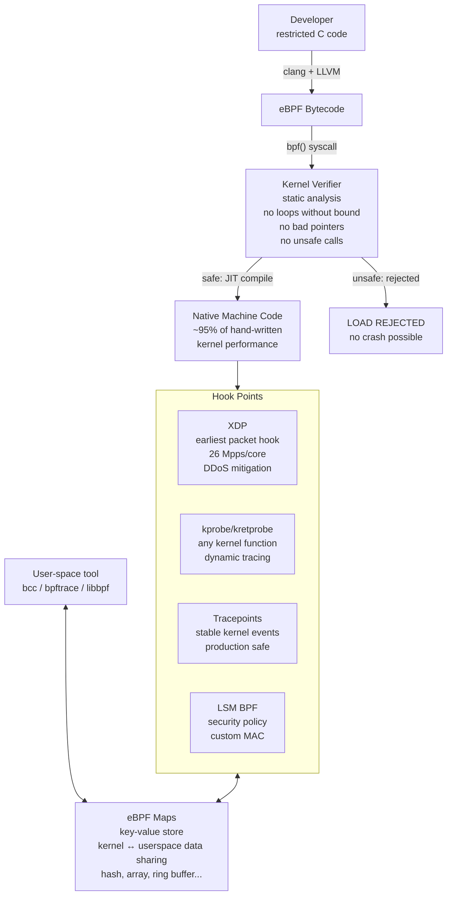

## In simple terms

Traditionally, if you wanted to add custom behaviour to the Linux kernel — a new packet filter, a performance tracer, a security policy — you had two options: write a kernel module (dangerous: bugs crash the kernel, requires root, requires recompilation) or accept the performance cost of doing it in userspace (expensive system calls per event). eBPF is a third option: write a small, safe program in a restricted C-like language; a verifier checks it for safety; and the kernel JIT-compiles it and runs it at hook points inside the kernel at near-native speed. No kernel module, no reboot, no crash risk.

## The Visual Map



## More detail

**Origins:** BPF (Berkeley Packet Filter) was introduced in BSD in 1992 for efficient packet filtering (tcpdump). eBPF (extended BPF) in Linux 3.18 (2014) dramatically extended it with a richer instruction set, maps (persistent data storage), and hook points throughout the kernel.

**The eBPF execution flow:**
1. **Write:** eBPF programs are written in restricted C (bounded loops only, no arbitrary memory access) and compiled with clang/LLVM to eBPF bytecode.
2. **Verify:** the kernel's eBPF verifier performs static analysis — all branches terminate, no out-of-bounds memory access, no unsafe pointer dereferences, no calling non-approved functions.
3. **JIT compile:** bytecode is JIT-compiled to native x86-64/ARM instructions. Performance is ~95% of hand-written kernel code.
4. **Attach:** the program is attached to a kernel hook point.
5. **Run:** every time the hook fires, the program executes in kernel context.

**Key hook points:**
- **XDP (eXpress Data Path):** earliest hook — just after the driver receives a packet, before any kernel processing. Can drop, redirect, or modify packets at line rate (100 Gbit/s). Used for DDoS mitigation, load balancing.
- **TC (Traffic Control):** ingress and egress traffic control layer.
- **kprobes / kretprobes:** dynamic probes on any kernel function entry or return.
- **tracepoints:** stable, production-safe probe points in the kernel.
- **LSM BPF:** hooks into Linux Security Module framework for custom security policies.

**eBPF maps:** persistent key-value stores shared between kernel programs and userspace. Types: hash map, array, LRU hash, ring buffer, per-CPU hash (lock-free), stack trace maps. Maps pass data from kernel programs to userspace for aggregation and display.

**eBPF has transformed Linux:** what previously required kernel modules (years of development, kernel stability risk) can now be done in eBPF in hours with zero kernel modification. Cloudflare uses eBPF/XDP for DDoS mitigation at 100 Gbit/s. Every major observability platform (Datadog, Dynatrace, New Relic) has an eBPF-based agent.

## Under the Hood

Simulating an eBPF-style packet counter using maps — the pattern every eBPF networking tool follows:

```python
from collections import defaultdict

# Simulated eBPF "map" — in real eBPF this lives in kernel space
# shared between the XDP program and the userspace reader
pkt_count_map = defaultdict(int)   # key: (src_ip, dst_port), value: count

def xdp_pkt_counter(packet: dict) -> str:
    """
    Simulated XDP hook: called for every ingress packet.
    In real eBPF: runs in kernel, maps to BPF_MAP_TYPE_HASH.
    Returns: XDP_PASS, XDP_DROP, or XDP_TX
    """
    key = (packet["src_ip"], packet["dst_port"])
    pkt_count_map[key] += 1

    # DDoS: drop if any source sends >100 pps
    if pkt_count_map[key] > 100:
        return "XDP_DROP"
    return "XDP_PASS"

# Simulate a burst from a single source (DDoS pattern)
packets = [{"src_ip": "1.2.3.4", "dst_port": 80} for _ in range(150)]
packets += [{"src_ip": "10.0.0.1", "dst_port": 443} for _ in range(20)]

results = [xdp_pkt_counter(p) for p in packets]
dropped = results.count("XDP_DROP")
passed  = results.count("XDP_PASS")
print(f"Processed {len(packets)} packets:")
print(f"  Passed : {passed}")
print(f"  Dropped: {dropped}  (DDoS source 1.2.3.4 suppressed after 100 pkts)")
print()
print("Top senders (eBPF map contents):")
for (src, port), count in sorted(pkt_count_map.items(), key=lambda x: -x[1]):
    print(f"  {src}:{port}  -> {count} packets")
```

## Engineering Trade-offs

**eBPF vs. kernel modules:**
- Kernel modules run in kernel space with full access — one bug = kernel panic. eBPF programs are verified safe before loading. The security and stability trade-off is the defining advantage of eBPF.
- Modules can call any kernel function; eBPF programs can only call a fixed list of approved helpers (~100 functions). This limits what eBPF can do compared to a full module.
- eBPF programs require no kernel version match; they ship with the application and work across kernel versions (via CO-RE).

**eBPF vs. kernel bypass (DPDK):** DPDK bypasses the kernel entirely for maximum throughput (140 Mpps theoretical). XDP runs inside the kernel at the earliest possible hook — faster than the full kernel network stack (~26 Mpps) but not as fast as full bypass. XDP has the advantage that normal kernel networking still works for other traffic; DPDK requires dedicated NICs.

**Verifier limits:** the verifier's complexity-checking (bounded loops, instruction count limits) means some programs cannot be expressed in eBPF. Programs that need large, complex state machines or unbounded iteration must still be userspace or kernel modules. The verifier's instruction limit has been increased over kernel versions (4.96M instructions as of Linux 5.2+).

## Real-world examples

- Cloudflare: eBPF/XDP drops malicious packets at line rate (~100 Gbit/s) before the kernel network stack processes them; DDoS mitigation runs at ~26 Mpps per core.
- Google GKE Dataplane V2: uses Cilium with eBPF instead of kube-proxy (iptables) for service routing; O(1) instead of O(n) rule lookup.
- Meta Katran: eBPF-based L4 load balancer on every Facebook server; replaced custom IPVS.
- Datadog: eBPF network performance monitoring traces all TCP connections and DNS queries with under 1% CPU overhead.

## Common misconceptions

- **"eBPF is only for networking."** eBPF is a general kernel programmability mechanism — used for networking, observability (tracing), security (LSM BPF), and performance profiling. The "Berkeley Packet Filter" name is historical.
- **"eBPF programs can crash the kernel."** The verifier prevents unsafe programs from loading. A verified eBPF program cannot crash the kernel, leak memory, or access arbitrary memory — that's the defining safety property.

## Try it yourself

Simulate an eBPF ring-buffer drain pattern — how user-space reads events from a kernel program:

```bash
python3 - <<'EOF'
import collections, time

# Simulated eBPF ring buffer (BPF_MAP_TYPE_RINGBUF in real eBPF)
ring_buffer = collections.deque(maxlen=256)

def bpf_ringbuf_output(event: dict):
    """Kernel-side: eBPF program produces an event into the ring buffer."""
    ring_buffer.append(event)

def userspace_drain():
    """User-side: reads and clears all events from the ring buffer."""
    events = list(ring_buffer)
    ring_buffer.clear()
    return events

# Simulate kernel events (syscall trace: bpftrace equivalent)
syscalls = [("read", 1001), ("write", 1002), ("read", 1001),
            ("openat", 1003), ("write", 1001), ("close", 1003)]

for name, pid in syscalls:
    bpf_ringbuf_output({"syscall": name, "pid": pid, "ts_ns": id(name)})

print(f"eBPF ring buffer: {len(ring_buffer)} events produced")
events = userspace_drain()
print(f"User-space drained {len(events)} events:")
for e in events:
    print(f"  pid={e['pid']}  syscall={e['syscall']}")
EOF
```

## Learn next

- [Kernel bypass](/t/kernel-bypass) — the extreme alternative to eBPF: DPDK removes the kernel entirely from the network path for maximum throughput at the cost of losing kernel networking
- [Observability](/t/observability) — eBPF is the dominant technology for production observability on Linux; bpftrace and BCC tools implement the tracing patterns described in observability pipelines
- [Sandbox](/t/sandbox) — the eBPF verifier implements a sandbox model: programs are accepted only if they can be proven safe, similar to WebAssembly's structured control-flow safety guarantees
