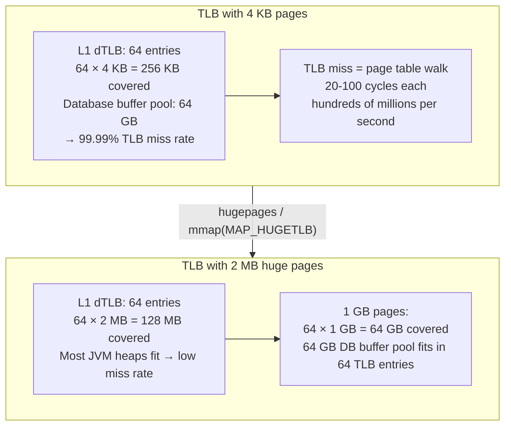

## In simple terms

The CPU's TLB caches virtual-to-physical address translations. With 4 KB pages and a 64-entry TLB, only 256 KB of address space can be covered without a TLB miss. A database with a 64 GB buffer pool will miss the TLB constantly — each miss adds 20–100 cycles to memory access. Huge pages solve this: a 2 MB page gives each TLB entry 512× more coverage; a 1 GB page gives 262,144× more. A 64 GB buffer pool needs 16,777,216 entries with 4 KB pages but only 64 entries with 1 GB pages — easily fitting in the TLB. The result: 10–30% performance improvement for memory-intensive workloads.

## The Visual Map



## More detail

**Page sizes on x86-64:**
- **4 KB (default):** standard page size. Fine for most applications with small working sets.
- **2 MB:** "large pages" or "huge pages". Supported by all modern CPUs. Require 2 MB-aligned, contiguous physical memory.
- **1 GB:** "gigantic pages". Requires CPU support (`pdpe1gb` CPUID bit, available since Intel Nehalem/2009). Reserves the full gigabyte as a contiguous physical region — allocated only at boot or with `hugetlbfs`.

**Why TLB coverage matters:** with a 64-entry L1 dTLB and 4 KB pages, only 256 KB of address space is covered. A database or JVM heap is gigabytes — almost every heap access misses the L1 TLB and pays 6–15 cycles for the L2 TLB, or 100–200 cycles for a full page table walk on an L2 miss.

**Linux huge pages configuration:**

Static huge pages (preallocated, no compaction jitter):
```bash
echo 1024 > /proc/sys/vm/nr_hugepages   # allocate 1024 × 2 MB = 2 GB
grep -i huge /proc/meminfo               # verify allocation
```
Processes access them via `mmap(MAP_HUGETLB)` or `shmget(SHM_HUGETLB)`. PostgreSQL uses `huge_pages = on` to mmap its shared buffer pool.

*Transparent Huge Pages (THP):* Linux automatically promotes 4 KB pages to 2 MB when a 2 MB-aligned contiguous allocation is found. Zero application changes required. However:
- **THP compaction:** the kernel must occasionally compact memory to create contiguous 2 MB ranges — this causes latency spikes (20–100ms pauses). For latency-sensitive applications (Redis, MongoDB, HFT), THP is often *disabled*.

Best practice for latency-sensitive apps: disable THP and use static huge pages for specific allocations:
```bash
echo never > /sys/kernel/mm/transparent_hugepage/enabled
```

For the JVM: `-XX:+UseLargePages` flag — JVM uses huge pages for the heap and code cache. Databases (PostgreSQL: `huge_pages = on`, Oracle: `use_large_pages = TRUE`) pre-register the buffer pool as huge pages.

Huge pages are one of the highest-leverage kernel parameters for database and JVM workloads. For PostgreSQL with large shared buffer pools, enabling huge pages typically yields 5–30% throughput improvement with near-zero code changes.

## Under the Hood

Simulating TLB coverage — showing why huge pages reduce miss rates for large working sets:

```python
def tlb_miss_rate(working_set_mb: float, page_kb: float, tlb_entries: int) -> float:
    """
    Estimate TLB hit rate: fraction of accesses covered by the TLB.
    Assumes uniform random access over the working set.
    """
    covered_mb = (tlb_entries * page_kb) / 1024
    if working_set_mb <= covered_mb:
        return 0.0   # entire working set fits in TLB
    # fraction of working set covered by TLB
    hit_rate = covered_mb / working_set_mb
    return 1.0 - hit_rate

configs = [
    ("4 KB pages",  4, 64),
    ("2 MB pages", 2048, 32),    # TLBs have fewer 2MB entries
    ("1 GB pages", 1024*1024, 4),
]

workloads_mb = [1, 64, 256, 1024, 4096, 16384, 65536]

print("TLB miss rates by page size and working set size:")
print(f"{'Working set':>14}  " + "  ".join(f"{n:>15}" for n, _, _ in configs))
print("-" * 70)
for ws in workloads_mb:
    row = f"{ws/1024 if ws >= 1024 else ws:>10}"
    row += "GB" if ws >= 1024 else "MB"
    row += "  "
    for name, page_kb, entries in configs:
        mr = tlb_miss_rate(ws, page_kb, entries)
        row += f"  {mr*100:>13.1f}%"
    print(row)
```

## Engineering Trade-offs

**Static huge pages vs. THP:**
- Static pages: no compaction jitter, must be preallocated at boot (or via sysctl). The application or a library (jemalloc, tcmalloc, PostgreSQL) must explicitly request huge pages via `mmap(MAP_HUGETLB)`.
- THP: zero code changes, but compaction can cause latency spikes of 20–100ms. Production latency-sensitive workloads (Redis, MongoDB, HFT) always disable THP.

**Memory fragmentation:** huge pages require contiguous physical pages — 2 MB pages need 512 contiguous 4 KB pages. On a long-running, fragmented system, huge page allocation may fail even if enough total free memory exists. Allocate huge pages at boot before memory becomes fragmented.

**Internal fragmentation:** a process that allocates a 5 KB object with huge pages gets a 2 MB page — 2043 KB wasted per allocation. Huge pages are appropriate for large, stable allocations (database buffer pools, JVM heaps), not for many small allocations.

**NUMA interaction:** on multi-socket systems, huge pages should be allocated on the NUMA node that will use them:
```bash
numactl --membind=0 --cpubind=0 ./app
```
A huge page allocated on node 1 but accessed from node 0 crosses the inter-socket interconnect — eliminating the TLB win with a NUMA penalty.

## Real-world examples

- PostgreSQL tuning guides universally recommend `huge_pages = on` with pre-allocated huge pages for large servers (>16 GB shared_buffers).
- Redis explicitly recommends `echo never > /sys/kernel/mm/transparent_hugepage/enabled` in its documentation to avoid THP-induced latency spikes.
- Oracle: DBA best practices require 1 GB huge pages for SGA > 32 GB.
- HFT firms: 1 GB huge pages on order book servers; TLB misses in hot order-matching code reduced from ~15% to under 0.1% of cycles.

## Common misconceptions

- **"Transparent Huge Pages are always better than default."** THP causes latency spikes from memory compaction — explicitly bad for Redis, MongoDB, and any latency-sensitive workload. Static huge pages are preferred for predictable latency.
- **"Huge pages waste memory."** Internal fragmentation wastes up to 2 MB per huge-page allocation for tiny allocations. For large contiguous allocations (database pools, JVM heaps), fragmentation is negligible.

## Try it yourself

Calculate TLB coverage and miss rate for different page sizes and working sets:

```bash
python3 - <<'EOF'
configs = [
    ("4 KB pages",  4,       64, 15),   # (name, page_kb, entries, miss_cycles)
    ("2 MB pages",  2048,    32, 15),
    ("1 GB pages",  1048576,  4, 15),
]

print("Coverage and miss penalty for a 32 GB database buffer pool:")
print(f"{'Config':<16} {'Covered':>10} {'Miss rate':>12} {'Penalty/access'}")
print("-" * 58)

WS_GB = 32
WS_MB = WS_GB * 1024

for name, page_kb, entries, miss_cycles in configs:
    covered_mb = entries * page_kb / 1024
    miss_rate  = max(0.0, 1 - covered_mb / WS_MB)
    penalty_ns = miss_rate * miss_cycles * 0.3   # ~0.3 ns per cycle at 3 GHz
    print(f"{name:<16} {covered_mb:>8,.0f} MB {miss_rate*100:>10.2f}%  {penalty_ns:>8.2f} ns avg")
EOF
```

## Learn next

- [Memory pool](/t/memory-pool) — huge pages eliminate TLB misses; memory pools eliminate allocator latency; together they remove the two main memory-related latency sources for low-latency applications
- [NUMA awareness](/t/numa-awareness) — huge pages should be NUMA-local: allocate them on the socket that will access them, otherwise the inter-socket penalty negates the TLB benefit
- [Cache-line alignment](/t/cache-line-alignment) — the cache-level complement to huge-page-level TLB optimisation: after eliminating TLB misses, align data within huge pages to cache lines to eliminate cache miss overhead
