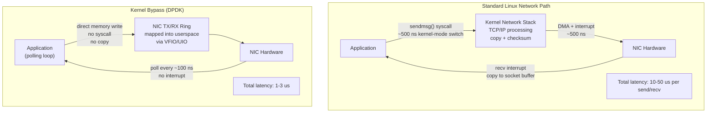

## In simple terms

Every time your application sends a network packet via a normal `sendmsg()` call, the packet goes through the Linux kernel: a system call switches from user mode to kernel mode (~1 µs), the kernel copies the data, runs the network stack (TCP/IP processing), and triggers an interrupt to the NIC. Each step adds latency. Kernel bypass removes the kernel from this path entirely: the application maps the NIC's memory directly into userspace and writes packets directly to hardware registers — no system calls, no copies, no interrupts. Latency drops from ~10–50 µs to ~1–3 µs.

## The Visual Map



## More detail

**The latency cost of the standard network path:**
1. `sendmsg()` → syscall → kernel mode switch (~500 ns).
2. Socket buffer allocation and copy (~500 ns – 1 µs).
3. TCP/IP stack processing: checksums, segmentation (~500 ns).
4. Driver queue and NIC DMA (~500 ns).
5. TX descriptor ring update; NIC interrupt acknowledgement.
Total: ~5–50 µs depending on CPU load and interrupt coalescing.

**DPDK (Data Plane Development Kit):** Intel's open-source framework for high-performance packet processing. DPDK maps NIC hardware queues directly into userspace via VFIO (Virtual Function I/O) and uses poll-mode drivers (PMDs) — the application spins polling a ring buffer rather than waiting for interrupts. Key techniques:
- **Huge pages** for packet buffers (no TLB misses; pinned memory for DMA).
- **CPU core pinning** with no other processes — dedicated cores, no context switches.
- **NUMA-aware memory allocation** — packet buffers on the same NUMA node as the NIC.
- **Lockless ring buffers** (rte_ring) for inter-core packet passing.
- **Zero-copy** — packets never copied; only pointers passed between stages.

DPDK achieves 100 Gbit/s line-rate packet processing on a single core for small-packet workloads. Used in telco NFV: vRouters, firewalls, load balancers.

**SPDK (Storage Performance Development Kit):** same philosophy for NVMe storage. Applications access NVMe SSDs directly via userspace PCIe drivers, bypassing the Linux block layer. Target: sub-10 µs end-to-end storage latency. Used in cloud storage systems (Ceph's BlueStore, VMware vSAN).

**io_uring (partial bypass, Linux 5.1+):** reduces syscall overhead without full bypass. Applications submit and complete I/O operations via shared ring buffers in userspace without entering kernel mode per operation. ~30% better throughput than epoll for high-connection workloads. Zero-copy send in Linux 6.0+.

**Solarflare/OpenOnload:** kernel bypass for standard TCP/UDP sockets. Applications use standard POSIX socket API; OpenOnload intercepts calls and routes them to a userspace NIC driver. No application code changes; latency ~1–2 µs for TCP. Used in HFT firms.

## Under the Hood

Simulating a DPDK-style poll-mode packet processing loop:

```python
import time, collections

# Simulated NIC RX ring (DPDK's rte_ring equivalent)
class PollModeRing:
    def __init__(self, size: int = 256):
        self.ring = collections.deque(maxlen=size)

    def enqueue(self, pkt: dict):
        self.ring.append(pkt)

    def dequeue_burst(self, n: int = 32) -> list:
        """DPDK: rx_burst() — drain up to n packets per poll cycle."""
        pkts = []
        for _ in range(min(n, len(self.ring))):
            pkts.append(self.ring.popleft())
        return pkts

def process_packet(pkt: dict) -> dict:
    """Simple L2 filter: drop if dst_mac == broadcast."""
    if pkt.get("dst_mac") == "ff:ff:ff:ff:ff:ff":
        return None
    return {**pkt, "forwarded": True}

# Simulate NIC producing packets and DPDK app consuming them
rx_ring = PollModeRing(size=512)

# "NIC" produces 120 packets (simulated hardware interrupt-free delivery)
for i in range(120):
    pkt = {"id": i, "src_mac": f"aa:bb:cc:{i:02x}:00:00",
           "dst_mac": "ff:ff:ff:ff:ff:ff" if i % 10 == 0 else "00:11:22:33:44:55",
           "len": 64}
    rx_ring.enqueue(pkt)

# Poll loop: drain bursts of 32 (no interrupts, no syscalls in real DPDK)
forwarded = 0
dropped   = 0
polls     = 0
while True:
    burst = rx_ring.dequeue_burst(32)
    polls += 1
    if not burst: break
    for pkt in burst:
        result = process_packet(pkt)
        if result: forwarded += 1
        else:       dropped += 1

print(f"Poll-mode processing: {polls} polls, no syscalls")
print(f"  Forwarded: {forwarded}  Dropped (broadcast): {dropped}")
```

## Engineering Trade-offs

**CPU dedication:** DPDK's polling loop burns 100% of a dedicated core even when no packets arrive — the poll loop spins to minimise latency. At high packet rates (10 Gbit/s+) this is justified. At low rates, the wasted CPU power is hard to justify; consider io_uring or interrupt-driven networking for moderate throughput.

**Loss of kernel tools:** tcpdump, netstat, iptables, and conntrack don't see DPDK bypass traffic. Debugging requires DPDK-native tools (`dpdk-pdump`, Wireshark with DPDK capture plugin). Monitoring requires building custom statistics into the DPDK application.

**Security bypass:** userspace access to DMA memory via VFIO bypasses kernel memory isolation. A bug in the DPDK application could corrupt host memory. IOMMU must be enabled (`intel_iommu=on`) to restrict the NIC's DMA to authorised memory regions.

**NIC specificity:** DPDK requires poll-mode drivers for specific NIC families (Intel ixgbe/i40e, Mellanox mlx5, virtio for VMs). Not all NICs support bypass. Check `dpdk.org/doc/guides/nics/` for driver support.

## Real-world examples

- High-frequency trading: firms like Virtu and Jane Street use OpenOnload (Solarflare) for sub-microsecond market data and order execution paths.
- Nokia, Ericsson, Intel: 5G User Plane Function (UPF) implemented with DPDK for 100G+ throughput.
- Cloudflare's DDoS mitigation pipeline uses DPDK + XDP (eBPF just above full bypass) for line-rate packet filtering.
- SPDK: used in Pure Storage, NetApp, and Samsung enterprise SSD controllers for sub-10 µs NVMe latency.

## Common misconceptions

- **"io_uring is kernel bypass."** io_uring reduces system call overhead but still uses the kernel's I/O path. It's a significant improvement but not full bypass — the kernel still owns the data path.
- **"Kernel bypass is only for networking."** SPDK bypasses the storage stack; GPU DMA bypasses the CPU for data transfers; RDMA bypasses both CPUs for inter-server memory access.

## Try it yourself

Model standard vs. bypass latency distribution for packet processing:

```bash
python3 - <<'EOF'
import random

random.seed(42)
N = 1000   # packets

def standard_latency_us():
    """Standard Linux path: syscall + copy + interrupt variability."""
    syscall = random.uniform(0.3, 0.8)
    copy    = random.uniform(0.2, 0.5)
    stack   = random.uniform(0.4, 1.2)
    irq     = random.uniform(0.5, 5.0)  # interrupt coalescing jitter
    return syscall + copy + stack + irq

def bypass_latency_us():
    """Kernel bypass (DPDK): poll ring buffer, no kernel, no copy."""
    poll    = random.uniform(0.08, 0.15)   # ring buffer poll
    process = random.uniform(0.1, 0.3)    # application processing
    return poll + process

std = [standard_latency_us() for _ in range(N)]
byp = [bypass_latency_us()   for _ in range(N)]

def stats(data, name):
    data.sort()
    print(f"  {name:<20}: avg={sum(data)/len(data):.2f} us  "
          f"p50={data[N//2]:.2f}  p99={data[int(N*0.99)]:.2f}  "
          f"max={max(data):.2f} us")

print(f"Per-packet latency ({N} samples):")
stats(std, "Standard Linux")
stats(byp, "Kernel Bypass")
EOF
```

## Learn next

- [RDMA](/t/rdma) — the inter-server variant of kernel bypass: the NIC reaches into another machine's memory over the network, bypassing both CPUs simultaneously for ~1 µs cross-server memory access
- [Huge pages](/t/huge-pages) — DPDK requires huge-page memory for its packet buffer pools; understanding huge pages explains how kernel bypass eliminates TLB misses in the packet path
- [eBPF](/t/ebpf) — a middle ground between kernel bypass and full kernel processing: eBPF/XDP runs at the earliest kernel hook point (~26 Mpps) without fully removing the kernel, and allows kernel tools to still work
