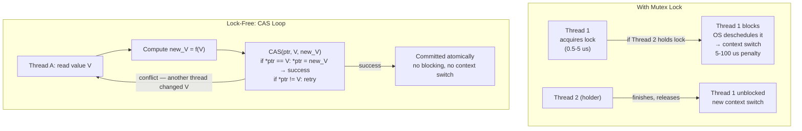

## In simple terms

Normally, when two threads share data, one takes a **lock** and the other waits. Lock-free programming removes the lock: threads cooperate using tiny *atomic* instructions the CPU guarantees happen all-or-nothing. No thread ever has to wait for another to finish — if two collide, one simply retries. The reward is that a thread can't be stalled by a lock another thread is holding; the price is that the code is genuinely hard to get right.

## The Visual Map



## More detail

The foundation is the **atomic read-modify-write**, above all **compare-and-swap (CAS)**: "if this memory still holds the value I last saw, replace it with this new value, atomically; otherwise tell me it changed." Algorithms loop on CAS — read the current state, compute the next state, try to swap it in, and retry if someone beat you to it.

Key concepts:

- **Progress guarantees.** *Lock-free* means at least one thread always makes progress system-wide (no deadlock). *Wait-free*, stronger still, bounds every individual thread's steps. Plain locks offer neither — a descheduled lock-holder blocks everyone.
- **Memory ordering.** Modern CPUs and compilers reorder memory operations. Lock-free code must specify **memory barriers** / ordering (acquire, release, sequentially-consistent) so other threads observe writes in a sane order. This is the subtlest part.
- **The ABA problem.** A value can change from A to B and back to A between your read and your CAS, fooling the check. Solutions add version tags or use hazard pointers / epoch-based reclamation to free memory safely.

Because threads still touch shared cache lines, lock-free code is intensely sensitive to [cache coherence](/t/cache-coherence) — a contended atomic still bounces a line between cores, so reducing contention matters as much as removing the lock. It avoids [deadlock](/t/deadlock) by construction (there's no lock to hold), but livelock under heavy contention is still possible.

Locks cause the worst kind of latency: unpredictable. A thread holding a mutex can be preempted, paging out, or simply slow, and every waiter inherits that stall — disastrous for the tail latency that low-latency systems care about. Lock-free structures keep the system moving regardless of any single thread's fate, which is why they sit at the heart of schedulers, allocators, and high-throughput queues.

## Under the Hood

Implementing a lock-free counter and a single-producer/single-consumer ring buffer using Python threading primitives:

```python
import threading

class LockFreeCounter:
    """
    Simulated lock-free counter using Python's GIL-protected integer.
    In C/C++: std::atomic<int64_t> counter; counter.fetch_add(1);
    """
    def __init__(self):
        self._value = 0
        self._lock  = threading.Lock()   # Python needs explicit atomics

    def increment(self):
        with self._lock:   # In C++: atomic fetch_add — no lock needed
            self._value += 1

    def get(self):
        return self._value

class LockFreeRing:
    """
    Single-producer / single-consumer ring buffer.
    SPSC requires only atomic load/store, not CAS — no lock needed.
    """
    def __init__(self, capacity: int):
        self._buf  = [None] * capacity
        self._cap  = capacity
        self._head = 0   # producer writes here
        self._tail = 0   # consumer reads from here

    def push(self, item) -> bool:
        next_head = (self._head + 1) % self._cap
        if next_head == self._tail:
            return False   # full
        self._buf[self._head] = item
        self._head = next_head
        return True

    def pop(self):
        if self._head == self._tail:
            return None   # empty
        item = self._buf[self._tail]
        self._tail = (self._tail + 1) % self._cap
        return item

ring = LockFreeRing(8)
for i in range(6):  ring.push(f"msg_{i}")
print("SPSC ring buffer:")
while True:
    item = ring.pop()
    if item is None: break
    print(f"  consumed: {item}")
```

## Engineering Trade-offs

**Contended atomic vs. uncontended mutex:** an uncontended mutex lock/unlock takes ~10–30 ns (compare-exchange plus a memory fence). A contended atomic on a hot cache line involves cache-coherence invalidations that bounce the line across cores at ~20–100 cycles each. Under high contention, a lock-free structure can be *slower* than a mutex because CAS retries dominate. The benefit appears when the workload is bursty and lock-holding latency is unpredictable.

**ABA hazard:** the classic bug in lock-free stacks. Thread A reads the head pointer (points to Node X). Thread B pops X, then pops Y, then pushes X back. Thread A's CAS succeeds (head still points to X), but X's `next` pointer now points to freed memory. Solutions: tagged pointers (encode a version number in the low bits), hazard pointers, epoch-based reclamation (jemalloc, crossbeam in Rust).

**SPSC vs. MPMC:** single-producer/single-consumer (SPSC) queues need only atomic load/store — no CAS. Multi-producer/multi-consumer (MPMC) queues need CAS on both ends. SPSC is dramatically simpler and faster (Disruptor, LMAX). MPMC rings (Folly's MPMC queue, boost::lockfree) use two-phase commit with sequence numbers to avoid CAS on head and tail simultaneously.

**Memory ordering:** `std::memory_order_relaxed` (no fence), `acquire`/`release` (one-directional fence), `seq_cst` (full fence, ~2-5ns overhead on x86, ~10-15ns on ARM). Choosing the weakest correct ordering is the key performance lever in C++ lock-free code.

## Real-world examples

- Single-producer/single-consumer ring buffers move messages between threads with only atomic index updates — no locks on the hot path.
- Concurrent counters and statistics use atomic fetch-and-add instead of a guarded mutex.
- Garbage collectors and memory reclamation schemes use lock-free hazard pointers to free nodes safely while readers are active.
- Operating-system run queues use lock-free or lightly-locked structures so scheduling never stalls globally.
- The LMAX Disruptor (used by financial exchanges) achieves 25 million events/second between threads using a lock-free ring buffer.

## Common misconceptions

- **"Lock-free means faster, always."** Only under contention and when done correctly; an uncontended mutex is cheap, and a badly-written CAS loop can spin and thrash worse than a lock.
- **"Lock-free means no waiting at all."** That's *wait-free*. Lock-free only guarantees *someone* progresses; an unlucky thread may retry many times under heavy contention.
- **"If it compiles and passes tests, it's correct."** Memory-ordering and ABA bugs are timing-dependent and can hide for months. These need careful reasoning, not just testing.

## Try it yourself

Simulate CAS-loop contention — showing why high contention hurts lock-free performance:

```bash
python3 - <<'EOF'
import random

def simulate_cas_retries(n_threads: int, n_ops: int) -> float:
    """
    Simulate CAS contention: each op has (n_threads-1)/n_threads probability
    of another thread winning the CAS first, causing a retry.
    Returns average retries per operation.
    """
    p_conflict = (n_threads - 1) / n_threads if n_threads > 1 else 0
    total_retries = 0
    for _ in range(n_ops):
        retries = 0
        while random.random() < p_conflict:
            retries += 1
            if retries > 50: break   # livelock guard
        total_retries += retries
    return total_retries / n_ops

print(f"Average CAS retries per operation (1000 ops):")
print(f"{'Threads':>9} {'Avg retries':>12}  {'Relative cost'}")
print("-" * 38)
random.seed(42)
base = None
for n in [1, 2, 4, 8, 16, 32]:
    avg = simulate_cas_retries(n, 1000)
    if base is None: base = max(avg, 0.001)
    print(f"{n:>9} {avg:>12.2f}  {avg/base:>8.1f}x")
EOF
```

## Learn next

- [Cache coherence](/t/cache-coherence) — the hardware protocol that makes atomics work but also imposes the coherence overhead that causes CAS contention; understanding MESI explains why a hot atomic can bounce between cores
- [Cache-line alignment](/t/cache-line-alignment) — false sharing from adjacent lock-free variables causes the same coherence storm as true contention; separate per-thread state with padding to eliminate it
- [Memory pool](/t/memory-pool) — lock-free allocators (jemalloc, tcmalloc) use pool strategies internally to make `malloc` itself lock-free; pool allocation and lock-free structures are natural pairs
