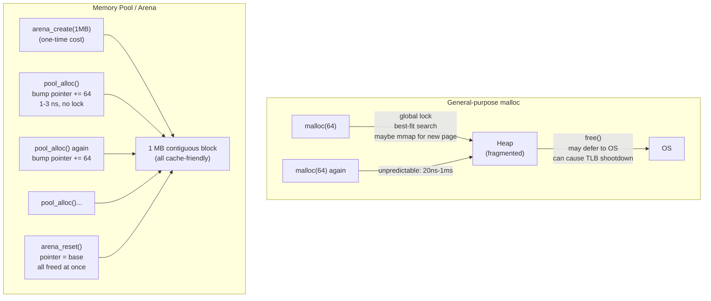

## In simple terms

Calling the general-purpose allocator (`malloc`/`new`) for every object is like going to the warehouse every time you need a screw. A **memory pool** instead grabs one big crate up front and hands out screws from it instantly. You allocate a large block once, then carve fixed-size pieces out of it with almost no work — and often hand them all back at once when you're done.

## The Visual Map



## More detail

A pool (sometimes called an **arena** or **slab**, depending on the flavour) reserves a contiguous region of memory and manages it itself:

- **Fixed-size pools** keep a free list of identical chunks. Allocation pops the head of the list; deallocation pushes it back. Both are O(1) with no searching and no fragmentation, because every chunk is interchangeable.
- **Arena/bump allocators** just advance a pointer through the block on each allocation and free *everything at once* by resetting the pointer. Individual frees are free — you don't do them. Perfect for data with a shared lifetime, like everything produced during one request or one frame.

The payoffs over a general allocator:
- **Speed:** no global locks, no best-fit search. A bump allocator is `ptr += size; return old_ptr` — 1–3 ns instead of 20–100 ns for `malloc`.
- **Predictability:** no unbounded pauses — critical for real-time work. `malloc` can mmap new pages (thousands of ns) or trigger GC in managed runtimes.
- **Locality:** objects sit contiguously, so they share cache lines and play well with [cache-line alignment](/t/cache-line-alignment).
- **No external fragmentation:** pools don't fragment like a general heap; the slab is used compactly.

The costs: flexibility and discipline — pools assume a known size class or lifetime, can waste memory if oversized, and require you to reason about ownership yourself rather than leaning on a general allocator or [garbage collection](/t/garbage-collection).

In low-latency systems the general allocator is a frequent culprit for *tail latency*: it takes a global lock, may fault in new pages, and can stall unpredictably. A pool replaces that with a bounded, branch-light operation, so worst-case timing becomes knowable.

## Under the Hood

A fully-functional arena allocator and fixed-size pool in Python:

```python
class Arena:
    """Bump-pointer arena: O(1) alloc, O(1) reset, no individual free."""
    def __init__(self, capacity: int):
        self._buf  = bytearray(capacity)
        self._cap  = capacity
        self._pos  = 0
        self._allocs = 0

    def alloc(self, size: int, align: int = 8):
        # align up
        if self._pos % align:
            self._pos += align - (self._pos % align)
        if self._pos + size > self._cap:
            raise MemoryError("arena full")
        start = self._pos
        self._pos += size
        self._allocs += 1
        return memoryview(self._buf)[start:start+size]

    def reset(self):
        """Free all allocations at once: O(1)."""
        self._pos = 0
        self._allocs = 0

class FixedPool:
    """Fixed-size pool: O(1) alloc/free via free-list."""
    def __init__(self, chunk_size: int, count: int):
        self._chunk = chunk_size
        self._free  = list(range(count))   # free slot indices
        self._used  = {}

    def alloc(self) -> int:
        if not self._free:
            raise MemoryError("pool exhausted")
        slot = self._free.pop()
        self._used[slot] = True
        return slot

    def free(self, slot: int):
        del self._used[slot]
        self._free.append(slot)

arena = Arena(4096)
pool  = FixedPool(chunk_size=64, count=32)

# Allocate objects using arena
v1 = arena.alloc(64)
v2 = arena.alloc(64)
print(f"Arena: allocated {arena._allocs} objects, used {arena._pos} / {arena._cap} bytes")

# Use pool for fixed-size objects
slots = [pool.alloc() for _ in range(5)]
print(f"Pool: 5 slots allocated: {slots}")
pool.free(slots[2])
reclaimed = pool.alloc()
print(f"Pool: freed slot {slots[2]}, reallocated as slot {reclaimed}")

# Reset arena (free everything in O(1))
arena.reset()
print(f"Arena after reset: {arena._pos} bytes used (O(1) free)")
```

## Engineering Trade-offs

**Arena vs. fixed-size pool:**
- Arena/bump: fastest allocation (1–3 cycles), no fragmentation, but no individual free — everything freed together. Use for per-frame or per-request temporary data.
- Fixed-size pool: O(1) alloc and free via free list; good for objects with individual lifetimes but the same size (packets, connections, messages). Can't handle variable sizes without multiple pools.

**malloc vs. pool under profiling:** in a tight loop making thousands of `malloc`/`free` calls per second, the allocator lock and fragmentation management can consume 5–25% of CPU time. A pool eliminates this entirely, dropping allocation to 1–2 cycles.

**Avoiding false sharing:** pool objects are contiguous in memory, which can cause false sharing if different threads write to adjacent objects. Pad pool objects to 64 bytes (cache line size) or maintain per-thread pools to avoid coherence traffic.

**Memory wastage:** a fixed-size pool pre-allocates all capacity up front. If the maximum concurrent objects is overestimated by 10×, 90% of the pool sits idle. Size pools to realistic peak usage, not theoretical maximum.

**Interaction with virtual memory:** pools bypass the OS allocator, but still use virtual address space. Pre-fault the pool on startup (touch every page) to avoid page-fault stalls during production use.

## Real-world examples

- Game engines reset a per-frame arena every frame instead of freeing thousands of temporary objects individually.
- High-throughput network servers pool fixed-size packet/connection buffers to avoid allocating on the hot path.
- Embedded and real-time systems forbid general `malloc` entirely and use pools so timing is deterministic.
- Database engines manage their page cache as a pool of fixed-size buffers — PostgreSQL's shared_buffers is a static pool of 8 KB pages.

## Common misconceptions

- **"Pools are just a micro-optimisation."** Their bigger value is *predictability* — bounded, lock-free allocation matters more than raw speed in real-time code. The latency reduction is often 10–100×, not 10%.
- **"A pool means you never think about memory again."** The opposite: you take on ownership and sizing decisions the general allocator used to make for you. Oversizing wastes memory; undersizing causes exhaustion at runtime.

## Try it yourself

Benchmark bump-allocator vs. Python list-append (proxy for general allocation):

```bash
python3 - <<'EOF'
import time

N = 500_000

# Simulate general allocation: append to a list (new allocation per item)
t0 = time.perf_counter_ns()
general = []
for i in range(N):
    general.append({"id": i, "value": i * 2})   # new dict per iteration
t1 = time.perf_counter_ns()

# Simulate pool: pre-allocate slots, reuse them
pool = [{"id": 0, "value": 0}] * N
t2 = time.perf_counter_ns()
for i in range(N):
    pool[i]["id"]    = i
    pool[i]["value"] = i * 2
t3 = time.perf_counter_ns()

gen_ms  = (t1 - t0) / 1e6
pool_ms = (t3 - t2) / 1e6
print(f"{N:,} object allocations:")
print(f"  General (new dict each): {gen_ms:.1f} ms  ({N/(gen_ms/1000):>10,.0f} allocs/s)")
print(f"  Pool (pre-allocated)   : {pool_ms:.1f} ms  ({N/(pool_ms/1000):>10,.0f} allocs/s)")
print(f"  Pool speedup: {gen_ms/pool_ms:.1f}x  (larger in C/C++ without Python overhead)")
EOF
```

## Learn next

- [Garbage collection](/t/garbage-collection) — the managed-language approach to memory reclamation: automatic but unpredictable pauses; memory pools are the manual alternative when GC pause times are unacceptable
- [Cache-line alignment](/t/cache-line-alignment) — pool objects are contiguous in memory; aligning each object to a cache line boundary prevents false sharing between threads accessing adjacent pool slots
- [Lock-free programming](/t/lock-free-programming) — high-performance lock-free allocators (jemalloc, tcmalloc, mimalloc) use per-thread pool strategies internally to make allocation itself lock-free
