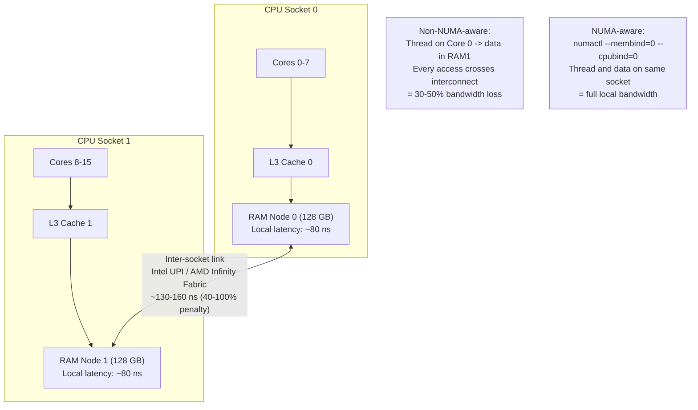

## In simple terms

A typical server has two sockets, each with its own CPU and its own bank of RAM. A thread on socket 0 can access socket 1's RAM — but it's 40–100% slower, because the request crosses an inter-socket interconnect (Intel QPI/UPI, AMD Infinity Fabric). **NUMA awareness** means making sure a thread's data lives in the RAM physically attached to its socket, so every memory access is local and fast.

## The Visual Map



## More detail

**NUMA** (Non-Uniform Memory Access) is the term for any architecture where memory access latency depends on *which* memory is accessed. In a two-socket server the memory hierarchy looks like:

```
Socket 0                    Socket 1
  Core 0, 1, ... n             Core 0, 1, ... n
    L1/L2 (per-core)            L1/L2 (per-core)
    L3 (shared on socket)       L3 (shared on socket)
  Local DRAM (~80 ns)        Local DRAM (~80 ns)
          \                   /
           Inter-socket link (~130-160 ns for remote access)
```

Accessing remote memory is 1.5–2× slower. Under heavy load, it also saturates the inter-socket interconnect, creating contention.

Strategies for NUMA-aware code:

- **`numactl --localalloc`** — run a process and instruct the kernel to allocate pages from the local node by default.
- **`mbind` / `numa_alloc_onnode`** — allocate a specific buffer on a specific NUMA node from code.
- **Thread–memory co-location** — combine [core affinity](/t/core-affinity) (pin thread to socket 0 cores) with NUMA-local allocation (allocate on node 0) so thread and data are always on the same socket.
- **Per-NUMA-node data structures** — maintain separate queues, caches, or counters per node; threads always touch their node's copy.
- **First-touch policy** — Linux allocates a page on the NUMA node of the thread that *first writes* it. Initialise data from the thread that will use it, not from a setup thread on a different socket.

The interaction with cache coherence matters too: a cache line modified on socket 0 and then read on socket 1 must be transferred across the inter-socket link, compounding the latency.

## Under the Hood

Simulating NUMA latency and showing how thread-to-memory assignment affects effective bandwidth:

```python
import random

LOCAL_NS  = 80
REMOTE_NS = 150   # ~88% overhead

class NUMASystem:
    def __init__(self, sockets=2, cores_per_socket=8):
        self.sockets = sockets
        self.cores   = cores_per_socket

    def core_socket(self, core_id):
        return core_id // self.cores

    def access_latency(self, core_id, mem_node):
        return LOCAL_NS if self.core_socket(core_id) == mem_node else REMOTE_NS

    def run(self, n, numa_aware):
        total = 0
        local = 0
        random.seed(42)
        total_cores = self.sockets * self.cores
        for _ in range(n):
            core = random.randint(0, total_cores - 1)
            mem  = self.core_socket(core) if numa_aware else random.randint(0, self.sockets - 1)
            lat  = self.access_latency(core, mem)
            total += lat
            if lat == LOCAL_NS:
                local += 1
        return total / n, 100 * local / n

sys = NUMASystem(sockets=2, cores_per_socket=8)
N   = 100_000

ua_lat, ua_local = sys.run(N, numa_aware=False)
a_lat,  a_local  = sys.run(N, numa_aware=True)

print(f"Non-NUMA-aware: avg {ua_lat:.0f} ns  (local {ua_local:.0f}%, remote {100-ua_local:.0f}%)")
print(f"NUMA-aware:     avg {a_lat:.0f} ns  (local {a_local:.0f}%, remote {100-a_local:.0f}%)")
print(f"Latency reduction: {(ua_lat - a_lat) / ua_lat * 100:.0f}%")
```

## Engineering Trade-offs

**Binding vs. interleaving:** binding all threads and memory to one socket is optimal for single-application workloads; `numactl --interleave=all` distributes pages round-robin across nodes, equalising latency for workloads where all threads share data equally (HPC, large JVM heaps). For mixed workloads (web server + database), partition by NUMA node.

**autonuma / numa_balancing:** Linux 3.8+ can automatically migrate pages toward the CPU that accesses them most. Too slow and coarse-grained for latency-sensitive applications — disable for predictable timing.

**First-touch initialisation:** if a main/setup thread initialises all memory before worker threads start, all pages land on the setup thread's NUMA node. Workers that later run on the other socket pay the remote penalty. Solution: initialise data in worker threads themselves, or use `numa_alloc_onnode` explicitly.

**Cloud vs. bare-metal:** many cloud VMs are backed by a single socket; NUMA is invisible. NUMA awareness matters most on bare-metal or cloud instances large enough to span two physical sockets (typically 32+ vCPUs on AWS, 48+ on GCP).

## Real-world examples

- The Linux kernel's slab allocator is NUMA-aware, maintaining per-node caches so kernel allocations prefer local memory.
- DPDK allows pinning packet-processing threads and their memory pools to the same NUMA node as the NIC's DMA engine.
- Databases (PostgreSQL, Oracle) ship configuration options for NUMA policy and recommend `numactl --interleave` or `--localalloc` depending on the workload.
- JVM GC tuning for large heap deployments includes NUMA-aware allocation flags (`-XX:+UseNUMA`).

## Common misconceptions

- **"NUMA is only relevant for HPC clusters."** Any server with two or more physical CPU sockets has NUMA topology, including standard cloud VMs with enough vCPUs to span sockets.
- **"Interleaving memory across nodes is always the safe choice."** It equalises access times at the cost of making *nothing* fast — local access drops from ~80 ns to the interleaved average (~115 ns), a ~40% slowdown even with no contention.

## Try it yourself

Model average memory access latency for NUMA-aware vs. unaware placement:

```bash
python3 - <<'EOF'
LOCAL  = 80   # ns
REMOTE = 150  # ns

print("NUMA access latency model (2 sockets):")
print(f"{'Local %':>10}  {'Remote %':>10}  {'Avg latency':>14}  {'vs. fully local'}")
print("-" * 58)
for local_pct in [100, 90, 75, 50, 25, 0]:
    remote_pct = 100 - local_pct
    avg = local_pct/100 * LOCAL + remote_pct/100 * REMOTE
    overhead_pct = (avg - LOCAL) / LOCAL * 100
    bar = "#" * (remote_pct // 5)
    print(f"{local_pct:>9}%  {remote_pct:>9}%  {avg:>11.0f} ns  +{overhead_pct:>5.0f}%  {bar}")
EOF
```

## Learn next

- [Core affinity](/t/core-affinity) — pinning threads to specific CPU cores is the first half of NUMA awareness; the second half is ensuring the thread's memory is on the same socket's NUMA node
- [Memory pool](/t/memory-pool) — NUMA-aware allocation requires per-socket memory pools; pre-allocate pool memory on the target NUMA node so every pool alloc is local
- [Cache-line alignment](/t/cache-line-alignment) — after eliminating inter-socket latency with NUMA binding, the next bottleneck is often false sharing between adjacent cache lines; alignment is the cache-level complement to NUMA-level placement
