## In simple terms

Normally, when server A sends data to server B, both CPUs are involved: A's CPU copies data to a socket buffer, the OS sends it over the network, B's OS receives it, B's CPU copies it from the socket buffer to the application. Four copies, two OS calls, two CPUs. **RDMA** lets A's NIC reach directly into B's memory and read or write it — no CPU involvement on either side. Latency drops from ~50 µs (TCP) to ~1 µs. This is why ML training clusters and HPC use RDMA: moving gigabytes between GPUs across thousands of nodes would otherwise saturate CPUs with memory copies.

## The Visual Map

```mermaid
graph TD
    subgraph TCP ["Standard TCP Transfer (A -> B)"]
        AppA["App on Server A"] -->|"copy to socket buffer\n(1)"| KernelA["Linux Kernel A"]
        KernelA -->|"send syscall\n+ TCP/IP stack\n(2)"| NetworkA["NIC A"]
        NetworkA -->|"Ethernet / IP packet"| NetworkB["NIC B"]
        NetworkB -->|"interrupt -> copy to recv buf\n(3)"| KernelB["Linux Kernel B"]
        KernelB -->|"recv syscall\n+ copy to app buffer\n(4)"| AppB["App on Server B"]
        TCPLAT["Total: ~20-50 us, 4 copies, 2 CPUs"]
    end

    subgraph RDMAG ["RDMA Transfer (A -> B)"]
        AppA2["App on Server A"] -->|"post RDMA Write\n(1 ring-buffer entry)"| NICA["RDMA NIC A (HCA)"]
        NICA -->|"DMA from A's memory\nover InfiniBand / RoCE"| NICB["RDMA NIC B (HCA)"]
        NICB -->|"DMA directly into\nB's registered memory"| MemB["App memory on B\n(CPU B not involved)"]
        RDMALAT["Total: ~0.6-2 us, 0 copies on CPU, 0 interrupts"]
    end
```



## More detail

**RDMA verbs (operations):**
- **RDMA Write:** the initiating NIC writes data directly to the target machine's memory. The target CPU is not involved; it is notified only optionally. Zero CPU overhead on the responder.
- **RDMA Read:** initiating NIC fetches data from the remote machine's memory. Same zero-CPU property.
- **Send/Receive (two-sided):** like UDP; the responder's NIC places incoming data in a pre-posted receive buffer. Both sides' NICs involved; both CPUs set up the operation but are not in the data path.

**Memory registration:** before RDMA can access a region of memory, it must be **registered** with the NIC: the OS pins the pages (prevents swapping) and maps virtual → physical addresses for the NIC's DMA engine. Registration is expensive (milliseconds); registered memory cannot be paged. Applications pre-register large memory regions at startup.

**Queue pairs:** RDMA operations are posted to hardware queues called Queue Pairs (QPs). A send QP and a receive QP per connection. The NIC polls or interrupt-signals completion queues when operations finish. Multiple QPs allow concurrency.

**Transport protocols:**

*InfiniBand (IB):* the original RDMA fabric — a dedicated network (separate from Ethernet) with its own switches, cables, and NIC (HCA). Ultra-low latency (~0.6 µs RTT), high bandwidth (NDR 400 Gbit/s per link). Dominant in HPC (roughly half the Top500 list). NVIDIA (owns Mellanox) is the primary vendor.

*RoCE (RDMA over Converged Ethernet):* RDMA protocol encapsulated in Ethernet frames (RoCEv2 uses UDP/IP). Runs on standard enhanced Ethernet infrastructure. Latency ~1–2 µs RTT. Requires PFC (Priority Flow Control) to prevent packet drops that would force RDMA retransmits. Used in cloud data centres (Azure, Alibaba, Baidu) at scale.

*iWARP:* RDMA over TCP/IP. No PFC required; works on any network. Higher latency (~10 µs) due to TCP overhead. Less popular.

**Performance:**
- InfiniBand HDR (200 Gbit/s): ~0.6 µs RTT
- RoCEv2 at 100 Gbit/s: ~1–2 µs RTT
- TCP over 100G Ethernet: ~20–50 µs RTT

**ML training:** NCCL (NVIDIA Collective Communications Library) uses RDMA for all-reduce operations during distributed training. GPT-3/4 training used InfiniBand across thousands of A100 GPUs; the collective bandwidth of the RDMA fabric (400 Gbit/s × 8 links per node) is the limiting factor, not GPU compute, in some configurations.

**Distributed storage:** NVMe-oF (NVMe over Fabrics) with RDMA transports allows remote NVMe SSDs to appear with near-local latency. Azure's storage infrastructure uses RoCE for its backend network.

## Under the Hood

Simulating the RDMA send model — queue pairs, completion queues, and zero-CPU data path:

```python
import collections, time

# Simplified RDMA model: queue pairs and completion queues
class CompletionQueue:
    def __init__(self):
        self._entries = collections.deque()

    def post_completion(self, work_id, bytes_transferred):
        self._entries.append({"wr_id": work_id, "bytes": bytes_transferred})

    def poll(self, n=16):
        results = []
        for _ in range(min(n, len(self._entries))):
            results.append(self._entries.popleft())
        return results

class RDMAQueuePair:
    """Simulate an RDMA Queue Pair: post sends, NIC handles the transfer."""
    def __init__(self, send_cq, recv_cq, latency_us=1.5):
        self._send_cq   = send_cq
        self._recv_cq   = recv_cq
        self._lat       = latency_us
        self._posted    = 0
        self._completed = 0

    def post_send(self, wr_id: int, size_bytes: int, operation="RDMA_WRITE"):
        """Post a work request to the send queue."""
        self._posted += 1
        # Simulate NIC completing the transfer (no CPU on receiver side)
        self._send_cq.post_completion(wr_id, size_bytes)
        return True

    def poll_completions(self):
        completions = self._send_cq.poll(32)
        self._completed += len(completions)
        return completions

cq    = CompletionQueue()
qp    = RDMAQueuePair(send_cq=cq, recv_cq=CompletionQueue(), latency_us=1.5)

# Post 8 RDMA Write operations (e.g. gradient shards in AllReduce)
for i in range(8):
    size_mb = 256
    qp.post_send(wr_id=i, size_bytes=size_mb * 1024 * 1024, operation="RDMA_WRITE")

completions = qp.poll_completions()
total_gb = sum(c["bytes"] for c in completions) / (1024**3)
print(f"RDMA: posted {qp._posted} operations, completed {len(completions)}")
print(f"Total data transferred: {total_gb:.1f} GB")
print(f"(CPU involvement: post_send only; data path is NIC -> NIC -> remote memory)")
```

## Engineering Trade-offs

**InfiniBand vs. RoCE:** InfiniBand is lower latency and simpler to operate (no PFC configuration) but requires separate switches and cables — expensive capital cost. RoCE reuses Ethernet infrastructure but needs careful PFC/DCQCN configuration to prevent packet drops that trigger slow RDMA retransmissions.

**Memory registration cost:** pinning memory for RDMA is expensive (milliseconds, involves the OS). Pre-register all buffers at startup and reuse them rather than registering per-transfer. This is why RDMA applications maintain buffer pools — the same registered region is reused for thousands of transfers.

**NUMA interaction:** RDMA performance depends on where the registered memory is. A buffer on NUMA node 1 transferred via a NIC on NUMA node 0 crosses the inter-socket interconnect — adding 40 ns to every transfer. Keep NIC, registered memory, and the CPU thread posting sends on the same NUMA node.

**Huge pages:** registered RDMA memory benefits from huge pages: fewer TLB entries for the same buffer size, less TLB churn during DMA. All production RDMA stacks (DPDK, NCCL, MVAPICH) use huge-page memory pools for registered memory.

**Congestion:** RoCEv2 networks require lossless fabric (PFC) and active congestion control (DCQCN, TIMELY) to prevent head-of-line blocking. A single congested flow can stall all RDMA traffic on the same priority class. InfiniBand handles this at the fabric level.

## Real-world examples

- NVIDIA DGX A100/H100 systems: 8 GPUs per node, 8 × 200 Gbit/s InfiniBand HDR ports per node. All collective operations (AllReduce) go via RDMA.
- Microsoft Azure: entire backend storage network uses RoCE with DCQCN congestion control (described in SIGCOMM 2016 "RoCEv2 in Azure").
- Alibaba, Baidu: large-scale RDMA deployments for distributed ML training clusters.
- Top500 supercomputers (Frontier, Aurora): use InfiniBand for all MPI communication.

## Common misconceptions

- **"RDMA replaces TCP for everything."** RDMA requires special hardware and fabric management; it's not suitable for general internet traffic. TCP over standard Ethernet remains dominant for web services.
- **"RDMA bypasses the NIC too."** RDMA bypasses the CPU but not the NIC. The NIC performs the DMA operations and manages the RDMA protocol — it is actually more complex and capable than a standard NIC.

## Try it yourself

Model TCP vs. RDMA latency for large data transfers:

```bash
python3 - <<'EOF'
# Compare effective throughput: TCP vs RDMA for gradient sync in distributed training
RDMA_LATENCY_US  = 1.5
TCP_LATENCY_US   = 30.0
RDMA_BW_GBPS     = 200.0
TCP_BW_GBPS      = 25.0   # effective TCP on 100G after overhead

def transfer_time_ms(size_mb, latency_us, bandwidth_gbps):
    """Time (ms) = latency + transfer time."""
    transfer_ns = (size_mb * 8) / bandwidth_gbps * 1_000   # ns
    return (latency_us * 1_000 + transfer_ns) / 1_000_000  # ms

print(f"Transfer comparison: TCP vs RDMA (InfiniBand HDR 200G)")
print(f"{'Size':>8}  {'TCP (ms)':>10}  {'RDMA (ms)':>11}  {'Speedup':>9}")
print("-" * 45)
for size_mb in [1, 10, 100, 256, 1024, 4096]:
    tcp  = transfer_time_ms(size_mb, TCP_LATENCY_US,  TCP_BW_GBPS)
    rdma = transfer_time_ms(size_mb, RDMA_LATENCY_US, RDMA_BW_GBPS)
    label = f"{size_mb} MB" if size_mb < 1024 else f"{size_mb//1024} GB"
    print(f"{label:>8}  {tcp:>10.3f}  {rdma:>11.3f}  {tcp/rdma:>8.1f}x")
EOF
```

## Learn next

- [MPI basics](/t/mpi-basics) — MPI's RDMA transport (OpenMPI with UCX, MVAPICH2) uses one-sided RDMA Put/Get operations for collective communication; understanding RDMA explains why InfiniBand-connected MPI clusters outperform TCP-connected ones by 10–50x
- [NUMA awareness](/t/numa-awareness) — RDMA performance depends critically on memory placement: buffers and the posting CPU must be on the same NUMA node as the NIC to avoid inter-socket latency in the hot path
- [Huge pages](/t/huge-pages) — production RDMA stacks pre-register huge-page memory pools; huge pages reduce TLB pressure during NIC DMA and simplify the physical memory mapping that RDMA registration requires
