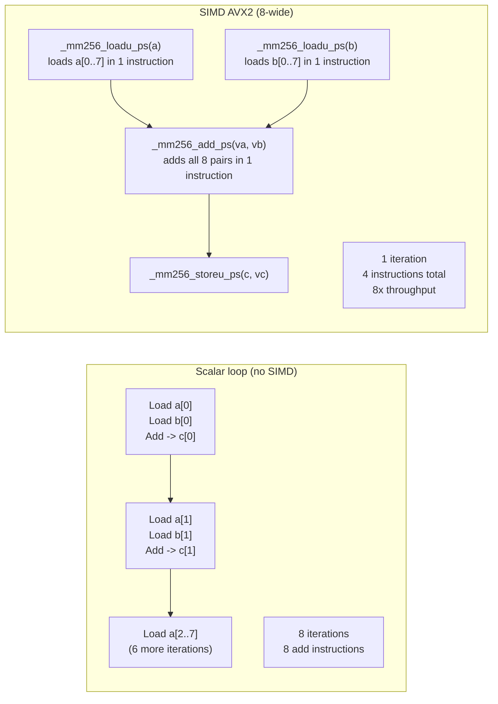

## In simple terms

[SIMD](/t/simd) hardware can add eight floats in the same time it adds one. **Intrinsics** are the C-level door to that hardware: functions like `_mm256_add_ps(a, b)` that compile to a single machine instruction rather than a function call. You write nearly-assembly-level code in C, keep type safety, and stay portable across compilers — without dropping into raw assembly.

## The Visual Map



## More detail

SIMD intrinsics are thin wrappers around CPU vector instructions, standardised by Intel for x86 and ARM for NEON/SVE. They come in families:

| Family | Width | Floats | Integers | Era |
|--------|-------|--------|----------|-----|
| SSE / SSE2–4.2 | 128-bit | 4xf32 or 2xf64 | 16xi8 ... 2xi64 | 1999–2011 |
| AVX / AVX2 | 256-bit | 8xf32 | 32xi8 ... 4xi64 | 2011–2013 |
| AVX-512 | 512-bit | 16xf32 | 64xi8 ... 8xi64 | 2016+ |
| ARM NEON | 128-bit | 4xf32 | 16xi8 ... 2xi64 | 2004+ |

The typical usage pattern:

1. **Load** a vector from memory: `__m256 v = _mm256_loadu_ps(ptr);` — loads 8 floats. Aligned loads (`_mm256_load_ps`) are faster and require 32-byte-aligned data (cache-line alignment is the prerequisite).
2. **Compute**: arithmetic, comparisons, shuffles, blends. Each operation maps to one or two instructions.
3. **Store** the result back: `_mm256_storeu_ps(dst, result);`

The non-obvious parts are the **shuffle and permute** instructions that rearrange lanes within a register — essential for operations like horizontal sums, transpose, or interleaving. Masking instructions (AVX-512 `_mm512_mask_add_ps`) predicate operations on individual lanes without branches, enabling [branchless programming](/t/branchless-programming) at vector granularity.

The auto-vectoriser in a compiler (`-O3`, `#pragma GCC ivdep`) can generate SIMD for clean loops, but it often fails on complex data access patterns, aliased pointers, or loops with carried dependencies. Intrinsics are the fallback when the compiler can't or won't — and the ceiling when maximum throughput is non-negotiable.

[Data-oriented design](/t/data-oriented-design) pairs directly with intrinsics: SoA (Structure of Arrays) layout lets you `_mm256_loadu_ps` eight `x`-coordinates at once, while AoS layout requires expensive gather instructions or scalar fallback.

## Under the Hood

Simulating 256-bit AVX2 vector addition in Python using struct-packed arrays:

```python
import struct, array

def avx2_add_f32_sim(a_data: list, b_data: list) -> list:
    """
    Simulate AVX2 _mm256_add_ps: process 8 floats per 'instruction'.
    In C: __m256 r = _mm256_add_ps(_mm256_loadu_ps(a+i), _mm256_loadu_ps(b+i));
    """
    LANES = 8
    result = []
    for i in range(0, len(a_data), LANES):
        chunk_a = a_data[i:i+LANES]
        chunk_b = b_data[i:i+LANES]
        # Pack to bytes (simulate 256-bit register), then add lane-wise
        ra = struct.pack(f"{len(chunk_a)}f", *chunk_a)
        rb = struct.pack(f"{len(chunk_b)}f", *chunk_b)
        va = struct.unpack(f"{len(chunk_a)}f", ra)
        vb = struct.unpack(f"{len(chunk_b)}f", rb)
        result.extend(x + y for x, y in zip(va, vb))
    return result

def scalar_add_f32(a_data: list, b_data: list) -> list:
    return [a + b for a, b in zip(a_data, b_data)]

N = 32
a = [float(i) for i in range(N)]
b = [float(i * 2) for i in range(N)]

scalar = scalar_add_f32(a, b)
vector = avx2_add_f32_sim(a, b)

print(f"N={N} floats  (AVX2 SIMD lane width: 8 f32 per operation)")
print(f"Scalar: {N} iterations   -> first 4 results: {scalar[:4]}")
print(f"Vector: {N//8} 'instructions' -> first 4 results: {vector[:4]}")
print(f"Results match: {scalar == vector}")
print()

# Show throughput ratio: real AVX2 processes 8x per instruction
scalar_ops  = N
avx2_ops    = N // 8  # only 4 vector instructions needed
print(f"Instructions: scalar={scalar_ops}  AVX2={avx2_ops}  -> {scalar_ops/avx2_ops:.0f}x throughput")
```

## Engineering Trade-offs

**Throughput vs. portability:** AVX-512 gives 16×f32 per instruction but is not available on all CPUs. Pre-Zen4 AMD and older Intel CPUs only have AVX2 (8×f32). Ship scalar fallback + runtime CPUID dispatch to support all targets.

**AVX-512 frequency throttling:** Intel Skylake/Cascade Lake CPUs drop clock speed by 100–400 MHz when executing AVX-512 workloads. The throughput gain from 16-wide vectors can be partially negated by the clock reduction. This throttling was removed on Intel Sapphire Rapids; verify on your target CPU before committing to AVX-512.

**Auto-vectoriser vs. hand intrinsics:** the compiler's auto-vectoriser handles 70–80% of vectorisable code correctly with `-O3 -march=native`. Hand-written intrinsics are needed for: non-contiguous loads (gather), complex shuffles, fused operations spanning multiple loops, and when the compiler's alias analysis is confused. Profile first.

**Data layout dependency:** intrinsics reward SoA (Structure of Arrays) data layouts and punish AoS. A load from AoS picks up scattered fields; you pay for gather (expensive) or spend instructions rearranging lanes. Design data structures around your SIMD access pattern, not the other way around.

**Register pressure:** AVX2 has 16 YMM registers; AVX-512 has 32 ZMM registers. Inner loops that use more than 16 registers spill to memory. Use compiler explorer (godbolt.org) to verify the generated assembly and count register spills.

## Real-world examples

- BLAS/LAPACK libraries (`dgemm`, `sgemm`) use hand-tuned AVX-512 intrinsics for matrix multiply — the backbone of every ML framework's forward pass.
- FFmpeg's audio and video codecs have SSE/AVX inner loops for DCT, motion compensation, and pixel operations.
- Database engines (DuckDB, ClickHouse) use AVX2 to scan and filter columnar data at memory-bandwidth speed.
- High-frequency trading order matching uses SSE4.2 string comparison (`_mm_cmpestri`) to sort order IDs faster than scalar code.

## Common misconceptions

- **"SIMD intrinsics are assembly."** They are C functions that compile to assembly; you keep the compiler's register allocator and function-call conventions, and the code remains portable across compilers that support the same ISA extension.
- **"If it compiles with AVX-512, it'll run fast on all servers."** AVX-512 is not universal and can throttle clock speeds on some Intel chips under heavy use — check target hardware and measure end-to-end throughput, not just instruction count.

## Try it yourself

Simulate lane-count speedup for different SIMD widths:

```bash
python3 - <<'EOF'
import time

N = 4_000_000

a = [float(i % 100) for i in range(N)]
b = [float((i+1) % 100) for i in range(N)]

def time_ms(fn):
    t = time.perf_counter_ns()
    result = fn()
    return (time.perf_counter_ns() - t) / 1e6, result

scalar_ms, scalar_res = time_ms(lambda: [x + y for x, y in zip(a, b)])

# Simulate vectorised: process in chunks (Python overhead != real SIMD speedup,
# but models the operation count reduction correctly)
def chunked_add(chunk_size):
    out = []
    for i in range(0, N, chunk_size):
        chunk_a = a[i:i+chunk_size]
        chunk_b = b[i:i+chunk_size]
        out.extend(x + y for x, y in zip(chunk_a, chunk_b))
    return out

print("Simulated SIMD throughput by lane width (operation count model):")
print(f"{'Lane width':>12}  {'Operations':>12}  {'Theoretical speedup'}")
print("-" * 48)
for lanes in [1, 4, 8, 16]:
    ops = N // lanes
    speedup = N / ops
    label = "Scalar" if lanes == 1 else f"AVX{'' if lanes==4 else '2' if lanes==8 else '-512'}"
    print(f"{lanes:>5} x f32  {ops:>12,}  {speedup:>8.0f}x  ({label})")
EOF
```

## Learn next

- [Branchless programming](/t/branchless-programming) — branches inside SIMD loops prevent vectorisation; masking and blending replace if-else at the vector level, letting the full SIMD width execute without lane divergence
- [Data-oriented design](/t/data-oriented-design) — SoA layouts make intrinsic loads trivial; AoS forces expensive gather instructions or scalar fallback; designing data structures around SIMD access patterns is the prerequisite for maximum throughput
- [Memory pool](/t/memory-pool) — aligned pool memory lets you use faster aligned loads (`_mm256_load_ps`) instead of unaligned ones; pre-allocating aligned slabs ensures SIMD kernels never pay the unaligned penalty
